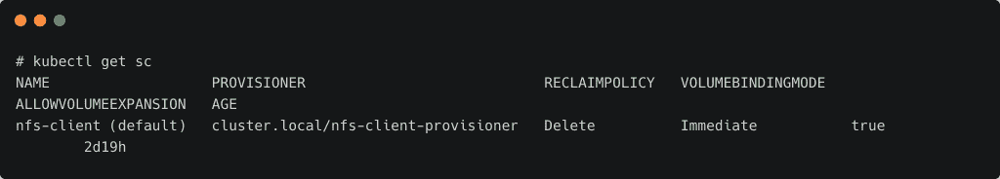
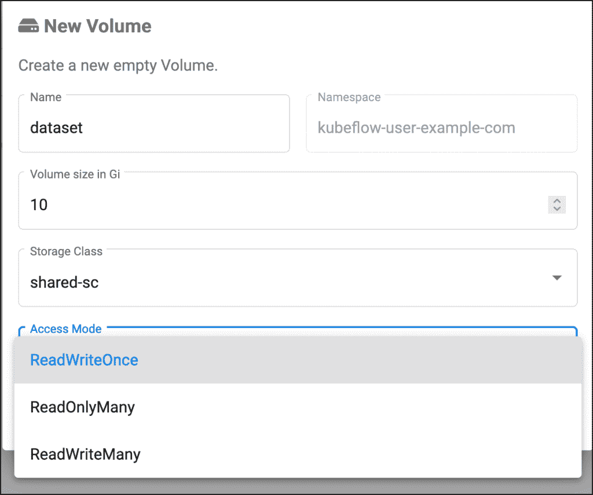
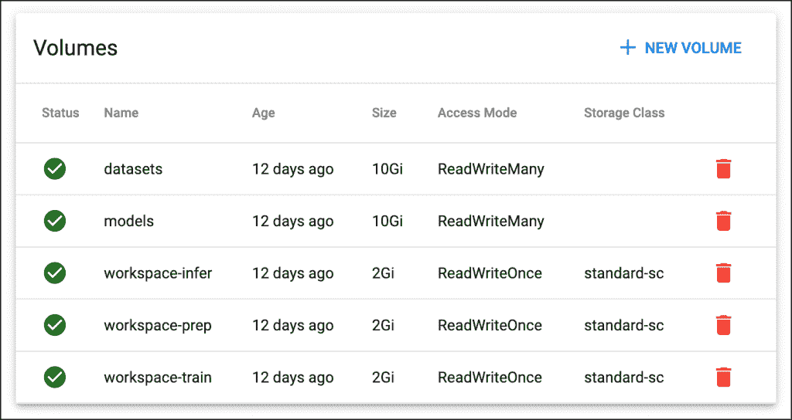

# 为 Kubeflow 笔记本电脑服务器配置存储卷

> 原文：<https://thenewstack.io/tutorial-configure-storage-volumes-for-kubeflow-notebook-servers/>

本教程是

[explanatory series on Kubeflow](https://thenewstack.io/5-new-kubeflow-1-3-features-that-machine-learning-engineers-will-love/)

，谷歌流行的开源机器学习平台 Kubernetes。请每周五回来查看未来的分期付款。

在本系列的最后一部分中，我们已经创建了定制的 Docker 映像，用于供应 Jupyter 笔记本服务器，目标是一个[机器学习](https://thenewstack.io/category/machine-learning/)项目的数据准备、训练和推理阶段。

在我们为数据科学家和 ML 开发人员推出完全定制的环境之前，我们需要确保存储配置能够促进团队之间的协作。

本教程的重点是为运行在 Kubeflow Kubernetes 机器学习操作(MLops)平台上的 Jupyter 笔记本服务器提供存储后端。

为 Kubeflow 配置存储有两个先决条件:

1.  1.  支持动态配置的存储类别
    2.  支持共享卷的存储后端

虽然 Kubernetes 的大多数覆盖存储选择满足了第一个先决条件，但只有少数支持第二个。

如前所述，Kubeflow 对共享卷和专用卷有独特的要求，以运行 MLOps 管道。共享卷使多个 pod 同时读写成为可能。专用卷是安装在单个 pod 中的传统 Kubernetes 持久卷声明(PVC)。

本教程将展示如何使用 Portworx 和 NFS provisioner 来配置存储卷。有关部署和配置 Kubeflow 存储的详细说明，请参考针对 [NFS](https://thenewstack.io/tutorial-install-kubernetes-and-kubeflow-on-a-gpu-host-with-nvidia-deepops/) 和 [Portworx](https://thenewstack.io/tutorial-configure-nvidia-deepops-to-use-portworx-as-storage-for-kubeflow/) 的 DeepOps 指南。您可以使用这些存储提供商之一作为笔记本服务器的首选覆盖存储后端。

## 为 Kubeflow 配置基于 NFS 的共享卷

当您通过 NVIDIA DeepOps 安装 NFS 客户端供应器时，您会获得一个名为`nfs-client`的存储类，它支持共享卷。



让我们创建两个共享的 PVC 来共享数据集和模型。

```
apiVersion:  v1
kind:  PersistentVolumeClaim
metadata:
  name:  datasets
  namespace:  kubeflow-user-example-com
spec:
  accessModes:
  -  ReadWriteMany
  storageClassName:  nfs-client
  resources:
    requests:
      storage:  10Gi

```

该 PVC 将用于执行 ETL 操作和数据预处理。

我们创建的下一个将用于存储模型工件。

```
apiVersion:  v1
kind:  PersistentVolumeClaim
metadata:
  name:  models
  namespace:  kubeflow-user-example-com
spec:
  accessModes:
  -  ReadWriteMany
  storageClassName:  nfs-client
  resources:
    requests:
      storage:  10Gi

```

## 为 Kubeflow 配置基于 Portworx 的 PVC

[Portworx](https://portworx.com/?utm_content=inline-mention) 通过 SharedV4 存储类支持共享卷。让我们从创建存储类开始。

```
kind:  StorageClass
apiVersion:  storage.k8s.io/v1
metadata:
  name:  shared-sc
provisioner:  kubernetes.io/portworx-volume
parameters:
  repl:  "2"
  allow_all_ips:  "true"
  sharedv4:  "true"

```

现在，我们可以根据上面的存储类来定义 PVC。

```
kind:  PersistentVolumeClaim
apiVersion:  v1
metadata:
 name:  datasets
 namespace:  kubeflow-user-example-com
 annotations:
 volume.beta.kubernetes.io/storage-class:  shared-sc
spec:
 accessModes:
 -  ReadWriteMany
 resources:
 requests:
 storage:  10Gi

```

下面的 YAML 规范创建了用于存储模型工件的 PVC:

```
kind:  PersistentVolumeClaim
apiVersion:  v1
metadata:
 name:  models
 namespace:  kubeflow-user-example-com
 annotations:
 volume.beta.kubernetes.io/storage-class:  shared-sc
spec:
 accessModes:
 -  ReadWriteMany
 resources:
 requests:
 storage:  10Gi

```

## 使用 Kubeflow 1.3 Volumes UI 来配置 PVC

如果已经创建了存储类，我们还可以通过 Kubeflow 1.3 中引入的新卷 UI 来配置 PVC。



请注意下拉列表是如何选择存储类别并为我们提供访问模式选择的。

除了共享存储卷，我们还需要一个专用卷(RWO ),它将作为笔记本服务器的主目录安装。当笔记本服务器启动时，卷仪表板显示所有绑定的 PVC。



定制 Docker 容器映像和存储卷准备就绪后，我们就可以启动笔记本服务器进行数据准备、培训和推理了。

在本系列的下一部分中，我们将配置执行 ETL 和数据预处理工作的第一台笔记本服务器。敬请期待！

<svg xmlns:xlink="http://www.w3.org/1999/xlink" viewBox="0 0 68 31" version="1.1"><title>Group</title> <desc>Created with Sketch.</desc></svg>