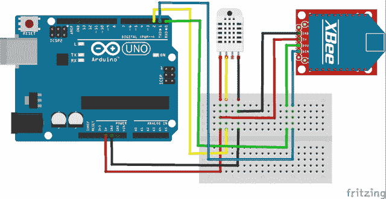
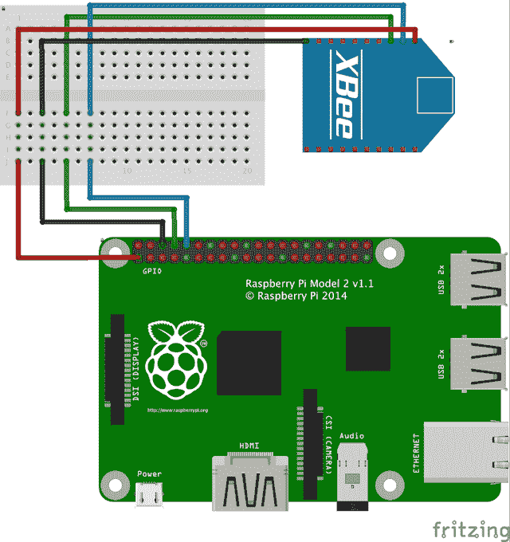
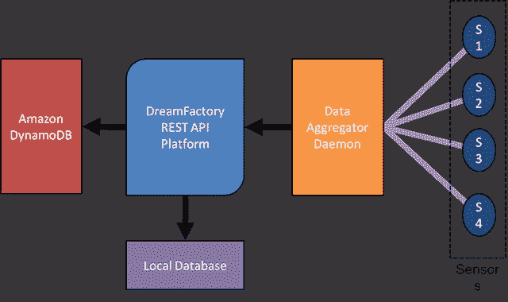
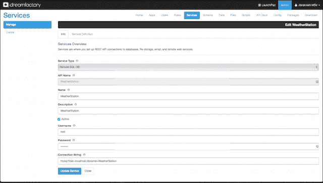
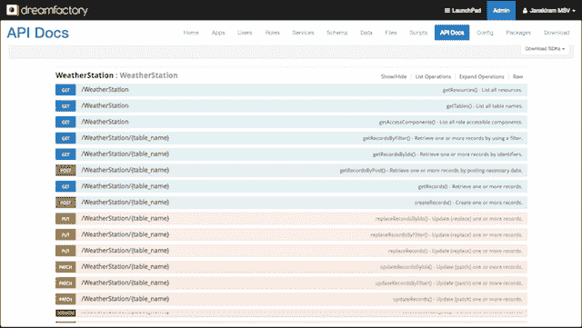
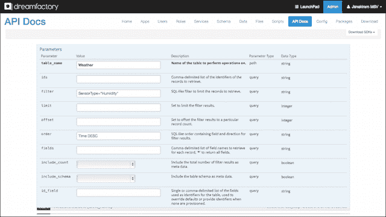
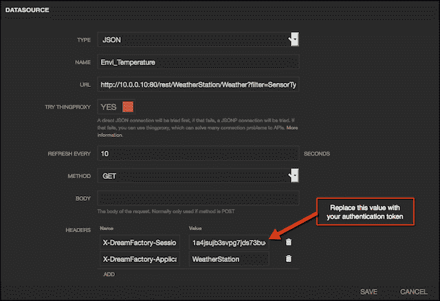
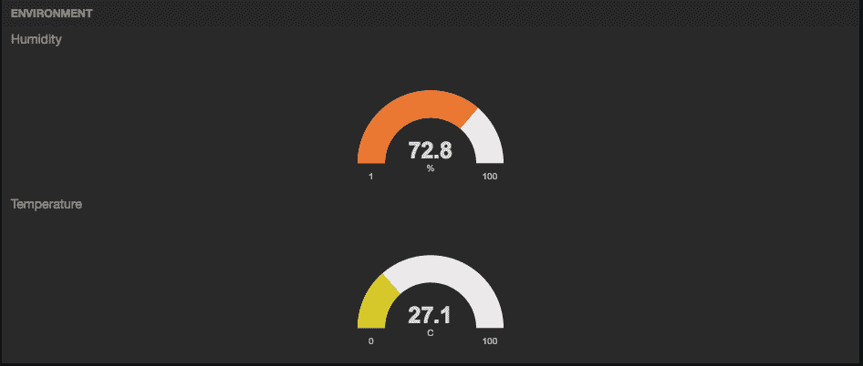

# 教程:配置传感器节点和物联网网关以收集和可视化数据—第 2 部分

> 原文：<https://thenewstack.io/tutorial-configuring-a-sensor-node-and-iot-gateway-to-collect-and-visualize-data-part-2/>

在…里

[part one](https://thenewstack.io/tutorial-prototyping-a-sensor-node-and-iot-gateway-with-arduino-and-raspberry-pi-part-1/)

，我们讨论了传感器节点和物联网网关的场景和用例。第二部分将介绍传感器、开发板和无线电的配置。

## 配置 Arduino

Arduino Uno R3 连接到 DHT 22，DHT 22 是一个湿度和温度传感器。它使用 XBee series 2 通过 ZigBee 协议将传感器数据发送到物联网网关。当由外部 LiPo 或太阳能电池供电时，这将成为一个可部署的传感器节点，它具有独立的电源和通信无线电，能够向集中式物联网网关发送数据。参考以下原理图，将传感器和无线电连接到 Arduino Uno R3。

[](https://thenewstack.io/wp-content/uploads/2015/07/Arduino_DHT22_XBee_bb.png)

下图用于从传感器获取湿度和温度。请注意，我们没有使用特殊的库来与网关通信。写入串行端口的数据可供网关使用。XBee radio 是串行端口通信的替代产品。传感器节点和网关都没有意识到它们在 ZigBee 无线链路上是分离的。将草图上传到 Arduino。

```
#include 
#define dht_dpin 2
dht DHT;
void setup(){
  Serial.begin(9600);
}
void loop(){
  DHT.read11(dht_dpin);
  Serial.print(DHT.humidity);
    Serial.print(",");
    Serial.print(DHT.temperature);  
    Serial.print("\n");
  delay(800);
}

```

## 配置 Raspberry Pi 2

构建传感器节点后，让我们连接网关。我们将 XBee 系列 2 连接到 Raspberry Pi 2，如下图所示。安装一个终端客户端，比如 Minicom，确保 Arduino 和 Raspberry Pi 通过串口连接。如果您的 XBee 配置是正确的，您应该在终端客户端中看到 Arduino 发出的 CSV 字符串。参考这个[教程](http://michael.bouvy.net/blog/en/2013/04/02/raspberry-pi-xbee-uart-serial-howto/)用树莓 Pi 配置 XBee。

[](https://thenewstack.io/wp-content/uploads/2015/07/RPi_XBee_bb.png)

在上面的配置中，很明显树莓 Pi 2 使用 ZigBee 进行入站通信，使用 Wi-Fi 进行出站通信。它接收 CSV 格式的数据，并将其转换成 JSON 格式，存储在文档存储数据库中。作为典型的现场网关，它执行协议转换和数据转换。

现在我们已经完成了硬件和网络配置，让我们安装所需的软件。我们将设置和配置一个名为 DreamFactory 的开源 RESTful API 后端，用于接收和存储数据。为了实时可视化数据流，我们将配置 Freeboard，这是一个开源的仪表板框架。

## DreamFactory 服务平台概述

[DreamFactory](http://www.dreamfactory.com) 是一个开源的 REST API 后端。它充当通用数据访问层，用于连接各种数据源，包括关系数据库、NoSQL 数据库、对象存储和文件系统。使用 DreamFactory 的关键优势在于，它为任何数据源公开了一致、简单的 REST 端点。处理不同数据源的开发者——比如亚马逊 S3、MySQL、MongoDB 和本地文件系统——可以使用统一的 API。对于不支持开箱即用的数据源，DreamFactory 允许开发人员注册自定义的 REST 端点。这使得将数据访问 API 与 DreamFactory 整合在一起成为可能。我们将使用该软件与本地数据存储以及云数据库进行交互。

由于 Raspberry Pi 2 不是最适合长期存储数据的设备，我们会定期将数据上传到 Amazon DynamoDB。该数据可以是 Amazon RedShift 或 Elastic MapReduce 的输入，用于进一步的处理和分析。下图解释了 DreamFactory 在聚合和接收数据流中的作用。

【T2

GitHub 上有 DreamFactory 的源代码。由于这是一个典型的 LAMP 应用程序，该软件可以安装在任何能够运行 Apache、PHP 和 MySQL 的 Linux 发行版上。Raspberry Pi 运行的是 Debian 的定制版，可以运行大部分主流 Linux 包。有很多关于在 Raspberry Pi 上设置 Apache 和 PHP 来运行本地 web 服务器的教程。除此之外，还可以运行最新版本的 MySQL，从而完善 LAMP 堆栈。

开发人员可以克隆 dsp 核心的 GitHub repo，并按照说明配置堆栈。

对于数据库的初始配置，强烈建议安装 phpMyAdmin。创建一个名为 WeatherStation 的数据库，并运行以下 SQL 脚本在本地 MySQL 中创建一个表。

```
CREATE TABLE IF NOT EXISTS  `Weather`  (
  `ID`  int(11)  NOT NULL AUTO_INCREMENT,
  `RoomID`  int(11)  NOT NULL,
  `DeviceID`  int(11)  NOT NULL,
  `SensorID`  int(11)  NOT NULL,
  `SensorType`  varchar(20)  DEFAULT NULL,
  `SensorValue`  float NOT NULL,
  `SensorUnit`  varchar(11)  NOT NULL,
  `Date`  date DEFAULT NULL,
  `Time`  time DEFAULT NULL,
  PRIMARY KEY  (`ID`)
)  

```

在 PC 或 Mac 上打开浏览器，访问安装在 Raspberry Pi 中的 DreamFactory 堆栈。向本地 DreamFactory 堆栈注册，单击 DreamFactory 中的 Services 选项卡，使用 MySQL 凭据登录，为数据源创建 REST API。我们可以为 MySQL 和 Amazon DynamoDB 创建 REST API 端点。下面的屏幕截图显示了本地 MySQL 的服务端点。

[](https://thenewstack.io/wp-content/uploads/2015/07/DSP_Services.png)

[流行的 REST API 工具 Swagger](https://swagger.io/) 与 DreamFactory 紧密集成，使得在从客户端调用之前测试 API 变得容易。你可以点击 API 文档进入 Swagger 游乐场。单击我们在上一节中创建的服务，向我们展示 REST API 公开的所有方法。下面的屏幕截图确认了 DreamFactory 能够访问数据源。

[](https://thenewstack.io/wp-content/uploads/2015/07/DSP_Swagger.png)

## 摄取传感器数据

现在，数据层和 API 层已经就绪，让我们继续用传感器数据填充本地数据库。如前所述，XBee 被视为使用标准 UART 客户端发送和接收数据的串行端口。这意味着我们可以使用任何能够处理串行端口的库来与 XBee 对话。

因为我们将使用 Python 代码进行接收和存储，所以继续安装 PySerial 库。以下代码片段获取传感器数据并存储在本地数据存储中。它使用 DreamFactory 的 REST API 作为数据访问层。

代码是不言自明的。它首先从 DreamFactory 获取一个身份验证令牌，该令牌将在后续操作中使用。然后，它打开串行端口，将 CSV 分成温度和湿度值。对于每个数据点，代码调用 REST API 端点来执行 POST 操作，从而存储数据。

```
import json
import unirest
import binascii
import os
import serial
import time
data=""
# Get authenticated and grab the session id
response  =  unirest.post("http://DreamFactory_URL/rest/user/session",  headers  =  {"X-DreamFactory-Application-Name":  "WeatherStation"},  params=json.dumps({  "email":  "janakiramm@gmail.com",  "password":  "Password@123"}))
session_id=json.loads(response.raw_body)["session_id"]

print  "Successfully authenticated with DreamFactory:"  +  session_id

while  1:
  try:    
    ser  =  serial.Serial('/dev/ttyAMA0',  9600)  # Replace the port number to match your Raspberry Pi
    if ser.inWaiting():
      data=ser.readline().split(',')
  except Exception,  e:
    print  "Error ",  e
    continue
  if len(data)==4  and len(data[0])  &gt;=  5  and len(data[1])  &gt;=  5:  # Skip missing entries from serial port
 for sensorid in range(2):
          Rec={}
          Rec["RoomID"]  =  "1"
          Rec["DeviceID"]  =  "1"
          Rec["SensorID"]  =  sensorid
          Rec["SensorValue"]  =  data[sensorid].rstrip()

          if  (sensorid==0):
 Rec["SensorType"]  =  "Humidity"
 Rec["SensorUnit"]  =  "Percentage"
          if  (sensorid==1):
 Rec["SensorType"]  =  "Temperature"
 Rec["SensorUnit"]  =  "Celsius"

          Rec["Date"]  =  time.strftime("%d/%m/%Y")
          Rec["Time"]  =  time.strftime("%H:%M:%S")

          print Rec["SensorID"]
          print Rec["SensorType"]
          print Rec["SensorValue"]

          Weather={}
          Weather["record"]=Rec
          # Ingest data from sensor
          response  =  unirest.post("http://DreamFactory_URL/rest/WeatherStation/Weather",  headers  =  {"X-DreamFactory-Application-Name":  "WeatherStation",  "X-DreamFactory-Session-Token":  session_id},  params=json.dumps(Weather),  auth  =  (),  callback  =  None)
          print  "Added sensor data as of "  +  time.strftime("%H:%M:%S")

```

## 用干舷可视化数据流

[Freeboard](https://freeboard.io/) 是一个开源的可视化和仪表盘工具。虽然有一个商业托管版，但源代码可以在 [GitHub](https://github.com/Freeboard/freeboard) 上找到。关于 freeboard 最好的事情是它可以完全在本地硬盘上运行。关于干舷的一个警告是它是完全无状态的。该工具中没有可用的数据库或持久性。这是留给开发人员去实现的。但是它支持导入和导出仪表板，为我们提供了保存配置的选项。您可以像在 Apache 上安装任何其他 web 应用程序一样安装它。

Freeboard 可以与任何发出有效 JSON 输出的 REST 端点集成。这非常符合 DreamFactory 的 API 实现模型。回到 Swagger，查询天气表中的温度，同时根据时间戳进行排序，并将记录数限制为一条。这为我们提供了 Arduino 传输的最新温度值。

[](https://thenewstack.io/wp-content/uploads/2015/07/DSP_Swagger_Query.png)

只需从 Swagger 控制台获取 URL，并将其粘贴到 Freeboard 中数据源部分的 URL 字段中。

```
http://DreamFactory_URL/rest/WeatherStation/Weather?filter=SensorType%3D%22Humidity%22&amp;limit=1&amp;order=Time%20DESC

```

为了让 Freeboard 与 DreamFactory 无缝协作，您需要添加两个名为“X-DreamFactory-Session-Token”和“X-dream factory-Application-Name”的头下面的 Python 代码片段为我们提供了一个 DreamFactory 的身份验证令牌。

将此用于 X-DreamFactory-Session-Token，并将 DreamFactory 服务名称用作应用程序名称。datasources 部分应该更新时间戳，表明 DreamFactory REST API 调用成功。

```
import json
import unirest
response  =  unirest.post("http://DreamFactory_URL/rest/user/session",  headers  =  {"X-DreamFactory-Application-Name":  "WeatherStation"},  params=json.dumps({  "email":  "user@example.com",  "password":  "bitnami"}))
session_id=json.loads(response.raw_body)["session_id"]
print  "X-DreamFactory-Application-Name : WeatherStation"  
print  "X-DreamFactory-Session-Token : "  +  session_id

```

[](https://thenewstack.io/wp-content/uploads/2015/07/DSP_Freeboard_Auth.png)

现在，您可以添加单独的面板来显示温度和湿度。您的仪表板应该类似于下面的屏幕截图。

[](https://thenewstack.io/wp-content/uploads/2015/07/DSP_Freeboard.png)

为了便于您实现仪表板，我导出了一个工作的 freeboard 配置，您可以下载并导入。只需替换 URL 和 HTTP 头，为您的 DreamFactory 实现进行配置。

## 摘要

本教程的目的是介绍配置传感器节点、网关、数据接收、数据聚合和可视化的端到端场景。虽然范围仅限于查询本地数据库，但是您可以轻松地将其扩展到支持像 Amazon DynamoDB 这样的云数据库。

<svg xmlns:xlink="http://www.w3.org/1999/xlink" viewBox="0 0 68 31" version="1.1"><title>Group</title> <desc>Created with Sketch.</desc></svg>