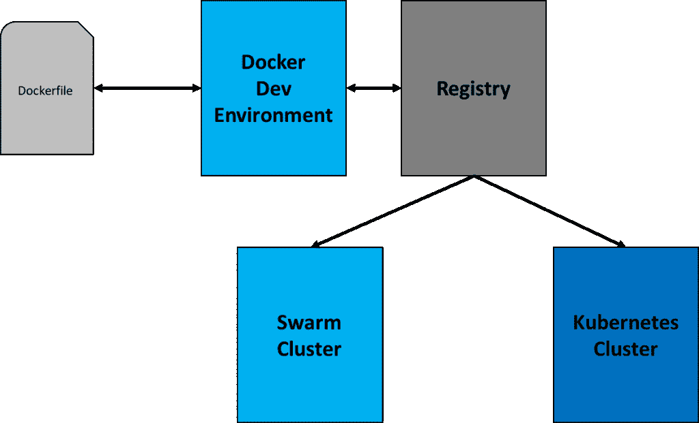

# 为 Kubernetes 配置终极开发环境

> 原文：<https://thenewstack.io/tutorial-configuring-ultimate-development-environment-kubernetes/>

人们普遍认为 Kubernetes 只适合拥有高级基础设施管理技能的专业人士。虽然这有点道理，但有多种方法可以配置 Kubernetes 而不会被淹没。

随着每个主要版本的发布， [Kubernetes](/category/kubernetes/) 离开发者社区越来越近。以其目前的形式，将您现有的 Mac 或 Windows 机器转变成一个强大的 Kubernetes 开发环境是极其简单的。我正在与 Kubernetes 一起玩新的 [12 英寸金色 MacBook](http://www.apple.com/macbook/specs/) ，它配有 8GB 内存和 256GB 存储空间，采用 1.1GHz 英特尔酷睿 M3 处理器。这绝不意味着是一个开发者工作站，但是有了 [Minikube](https://github.com/kubernetes/minikube) ，我可以随身携带一个成熟的 Kubernetes 环境。

本教程旨在使 Docker 开发者能够容易地开始使用 Kubernetes。它将带您了解部署第一个由 Kubernetes 支持的微服务应用程序的所有先决条件和基本概念。虽然这是基于 Mac 的，但只需稍加修改，它就可以与微软 Windows 10 兼容。

## 我们需要什么？

首先，让我们列出我们需要的工具清单。

1.  **VirtualBox:** 这是我们配置环境的核心基础。下载最新版本的 [VirtualBox](https://www.virtualbox.org) 。
2.  **Docker 工具箱:**这是我们工具链的重要组成部分。我们将广泛使用 Docker 机器进行配置。下载 [Docker 工具箱](https://www.docker.com/products/docker-toolbox)的稳定版。
3.  **DVM:** 在同一个环境中处理不同的 Docker 版本可能会令人沮丧。像节点版本管理器和 Ruby 版本管理器一样，这个漂亮的工具使得在 Docker CLI 的多个版本之间切换变得超级简单。我们将在教程的后面部分探索这个工具。按照 GitHub 上的这些[说明在您的机器上安装 DVM。](https://github.com/getcarina/dvm)
4.  **Minikube:** 生活中所有美好的事物都是小包装而来，Kubernetes 也不例外。Minikube 是一个很小的 VM，它与单节点 Kubernetes 集群捆绑在一起。最棒的是，它可以在任何能够启动 VirtualBox 虚拟机的机器上运行。从 GitHub 获得最新的二进制文件。
5.  **Kubectl:** Kubectl 是与 Kubernetes 集群交互的命令行工具。按照[指示](https://coreos.com/kubernetes/docs/latest/configure-kubectl.html)下载并安装。
6.  **适用于 Windows 或 Mac 的 Docker【可选】:**由于我们正在使用 Docker 机器来创建 Swarm 集群，因此我们并不真正需要 Windows 和 Mac 的本地安装程序。但是如果您愿意，也可以让它并行运行。确保您正在获取最新的安装程序。

## 我们得到了什么？

大多数开发人员都有一个针对 Docker 和 Kubernetes 的独立开发和测试环境。这使得从源代码快速构建和部署变得令人沮丧。面向核心引擎的 docker 文件总是不同于 Kubernetes 环境。这迫使我们将图像推送到 Docker Hub 或公共注册中心，并将它们拉进 Kubernetes 节点，即使它们运行在相同的环境中。虽然这为生产设置提供了很好的隔离，但在开发和测试过程中，这可能会非常烦人。

在我们的环境中，我们将创建一个 Docker 和 Kubernetes 共享的中央注册中心。我们构建的每个映像都将立即可供 Kubernetes 集群使用。这带来了 Docker 和 Kubernetes 环境之间的对等性。

这种设置使得在 Swarm 和 Kubernetes 中部署并行运行的应用程序变得容易。每次一个图像被推送到注册中心，它就会立即对 Swarm 集群和 Kubernetes 可用。

本教程提供了一些提示和技巧，可以帮助您掌握如何管理不同的 Docker 环境。

下图解释了设置和配置。

[](https://thenewstack.io/wp-content/uploads/2016/08/Docker-Kubernetes-Env.png)

## 安装ˌ使成形

让我们从创建一个中央注册中心开始，我们将在开发和测试期间访问它。然后我们将配置 Docker 和 Kubernetes 来使用注册表。

### 步骤 1: Docker 私有注册

创建一个新的 Docker 机器作为注册表:

```
docker-machine create  -d  virtualbox registry

```

创建保存图像的目录:

```
docker-machine ssh registry  "mkdir ~/data"

```

将 Docker CLI 指向机器:

```
eval  $(docker-machine env registry)

```

拉取并运行注册表映像:

```
docker run  -d  -p  80:5000  --restart=always  --name registry    -v  /home/docker/data:/var/lib/registry registry:2

```

最后，记下运行注册表的 Docker 机器的 IP 地址:

```
REG_IP=`docker-machine ip registry`

```

### 步骤 2: Docker 开发机器

创建一个新的 Docker 机器，作为我们的默认开发环境:

```
docker-machine create  -d  virtualbox dev

```

配置 Docker 引擎指向私有的不安全注册表:

在编辑器中打开/var/lib/boot2docker/profile，添加下面一行。确保您包含了托管注册中心的 Docker 机器的 IP 地址:

```
EXTRA_ARGS="--insecure-registry &lt;REG_IP&gt;:80"

```

您也可以运行下面的单行命令来做同样的事情:

```
docker-machine ssh dev  'sudo sh -c "echo \"EXTRA_ARGS=\\\"--insecure-registry '$REG_IP':80\\\"\" &gt;&gt; /var/lib/boot2docker/profile"'

```

退出虚拟机，重启机器:

```
docker-machine restart dev

```

将 Docker CLI 指向开发机器:

```
eval  $(docker-machine env dev)

```

提取一个图像，标记它，并将其推送到私有注册表:

```
docker pull hello-world

docker tag hello-world  $REG_IP:80/hello-world

docker push  $REG_IP:80/hello-world

```

这一步成功地将 Docker 引擎配置为使用我们在上一步中创建的不安全私有注册中心。

### 步骤 3: Kubernetes 单节点集群

有了 Docker 私有注册和开发机器，让我们继续配置 Kubernetes。该步骤假设您遵循了 Minikube [安装指南](https://github.com/kubernetes/minikube/releases)中提到的步骤。

启动 Minikube 虚拟机:

```
minikube start  --vm-driver="virtualbox"  --insecure-registry="$REG_IP":80

```

关于私有注册表配置的一个快速注意事项:在创建 VM 期间，Minikube 可能被指向不安全的注册表。这与配置 Docker Machine 以使用私有注册中心的步骤完全相同。其实 Docker Machine 也是通过 **— engine-opt** 开关支持这种配置的。更多细节请参考[文件](https://docs.docker.com/machine/reference/create/)。

检查 Minikube 的状态:

检查 kubectl 配置是否正确:

### 步骤 4:测试工作流

有了测试平台，现在让我们尝试整个往返过程:在 Docker 开发机器上构建一个映像，并将其部署在 Kubernetes 中。

我们将从 Docker Hub 推送标准的 Apache 映像，在开发机器上修改它，提交新的映像并将其推送到本地注册表。

相同的图像将被部署在 Kubernetes 上。

#### 基于 Docker 构建

将 CLI 设置为 Docker 开发机:

```
eval  $(docker-machine env dev)

```

拖动、标记和推送图像:

```
docker run  -d  --name myweb  --hostname myweb  -p  80:80   httpd

docker exec myweb bash  -c  "echo Kubernetes Rocks' &gt; '/usr/local/apache2/htdocs/index.html'"

docker commit myweb  $REG_IP:80/myweb

docker push  $REG_IP:80/myweb

```

#### 在 Kubernetes 中部署和运行

将 Docker CLI 指向 minikube:

```
eval  $(minikube docker-env)

```

当你尝试访问 minikube 上的 Docker 引擎时，你会得到一个关于客户端和服务器版本不匹配的错误:

```
Error response from daemon:  client is newer than server  (client API version:  1.24,  server API version:  1.23)

```

这就是我们将借助 Docker 版本管理器的地方。首先，我们来看看 Minikube 上的 Docker 版本:

```
minikube ssh docker version

```

我们可以将服务器版本捕获到一个变量中，该变量将被传递给 DVM:

```
DOCKER_VER=`minikube ssh  "docker version --format '{{.Server.Version}}'"`

```

运行以下命令切换到 Docker CLI 的正确版本:

现在，您可以使用同一个客户端来定位 Docker Dev 机器和 Kubernetes 机器。

让我们把上传到私有注册表的图片拿出来:

```
docker pull  $REG_IP:80/myweb

```

最后，让我们创建一个 Kubernetes 部署并公开容器:

```
kubectl run my-web  --image=$REG_IP:80/myweb  --port=80

kubectl expose deployment my-web  --target-port=80  --type=NodePort

```

抓取节点端口并访问服务端点:

```
PORT=$(kubectl get svc my-web   -o  go-template='{{(index .spec.ports 0).nodePort}}')

IP=$(minikube ip)

curl  $IP:$PORT

```

上面的命令应该打印“Kubernetes Rocks”

让我们通过删除部署和服务来清理:

```
kubectl delete service my-web

kubectl delete deployment my-web

```

你可以从 GitHub 下载所有步骤的脚本[。](https://github.com/janakiramm/Kubernetes-dev-env)

这种设置有一些注意事项:

*   它不使用安全的注册表访问，但可以很容易地配置
*   图像不会保存在 Mac 或 Windows 主机上。如果托管注册表的 Docker 机器崩溃，您将会丢失图像。这可以通过从主机挂载本地卷并将注册表卷指向它来避免。
*   您可以使用 Docker for Mac 并配置不安全的注册表选项来从本地注册表中提取图像。

<svg xmlns:xlink="http://www.w3.org/1999/xlink" viewBox="0 0 68 31" version="1.1"><title>Group</title> <desc>Created with Sketch.</desc></svg>