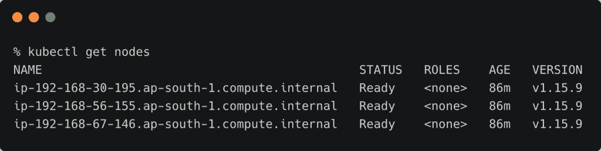

# 教程:用 Google Anthos 连接亚马逊 EKS 和 Azure AKS 集群

> 原文：<https://thenewstack.io/tutorial-connect-amazon-eks-and-azure-aks-clusters-with-google-anthos/>

本周，分析师

[Janakiram MSV ](https://thenewstack.io/author/janakiram/)

启动

[exclusive series](https://thenewstack.io/google-anthos-from-the-eyes-of-a-kubernetes-developer/)

新栈上，关于谷歌云平台的 Kubernetes 服务，Anthos。本系列的每一部分都集中在 Anthos 的一个特定方面。该系列涵盖了集群注册、Anthos 配置管理以及从 GCP 市场启动“点击部署”应用程序。

在本系列的第二部分，我们将注册部署在 [Google Kubernetes 引擎](https://cloud.google.com/kubernetes-engine)、[亚马逊 Web 服务的](https://aws.amazon.com)、[弹性 Kubernetes 服务](https://aws.amazon.com/eks/)和 Azure Kubernetes 服务中的三个 Kubernetes 集群，它们都使用 [Google Anthos](https://cloud.google.com/anthos) 。

本教程从启动集群开始，以枚举它们作为 Anthos 集群结束。

## 先决条件

## 在 GCP、AWS 和 Azure 发布 Kubernetes 集群

假设您拥有云平台的活动帐户，并且配置了 CLI，那么从在每个云中启动三节点集群开始。

```
mkdir  ~/anthos  &amp;&amp;  cd  ~/anthos

```

由于启动时间最长，我们先从 EKS 星团开始。

```
export KUBECONFIG=eks-config
eksctl create cluster  \
  --name tns-demo-eks  \
  --version  1.16  \
  --nodegroup-name ng-workers  \
  --node-type t3.medium  \
  --nodes  3  \
  --nodes-min  3  \
  --nodes-max  6  \
  --node-ami auto  \
  --node-ami-family Ubuntu1804  \
  --set-kubeconfig-context=true

```

T12

第二个集群是 Azure AKS 集群。

```
export KUBECONFIG=aks-config
az group create  --name tns  --location southindia
az aks create  \
  --resource-group tns  \
  --name tns-demo-aks  \
  --node-count  3  

az aks get-credentials  \
  --resource-group tns  \
  --name tns-demo-aks  \
  --file aks-config

```


最后，我们将推出 GKE 集群。

```
export KUBECONFIG=gke-config
gcloud container clusters create tns-demo-gke  \
    --zone asia-south1-a  \
    --disk-type=pd-ssd  \
    --disk-size=50GB  \
    --machine-type=n1-standard-1  \
    --num-nodes=3  \
    --image-type ubuntu

```

```
kubectl create clusterrolebinding cluster-admin-binding  \
  --clusterrole cluster-admin  \
  --user  $(gcloud config get-value account)

```


因为我们必须经常从一个集群到另一个集群更改上下文，所以我们将所有的上下文合并到一个配置中，并对它们进行重命名。

kubectx CLI 在管理上下文时非常方便。

```
cp *-config  ~/.kube
KUBECONFIG=$HOME/.kube/eks-config:$HOME/.kube/aks-config:$HOME/.kube/gke-config
kubectl config view  --merge  --flatten  &gt;  $HOME/.kube/config
export KUBECONFIG=

kubectx gke_janakiramm-sandbox_asia-south1-a_tns-demo-gke
kubectx gke=.

kubectx jani@tns-demo-eks.ap-south-1.eksctl.io
kubectx eks=.

kubectx tns-demo-aks
kubectx aks=.

```

现在，我们有三个上下文——aks、eks 和 gke——代表三个集群。您可以使用 kubectx 轻松地在它们之间切换。


## 为 Anthos 准备和配置 GCP 帐户

在使用 Anthos 之前，我们需要通过运行下面的命令来启用一组 API:

```
gcloud services enable  \
  cloudresourcemanager.googleapis.com  \
  anthos.googleapis.com  \
  container.googleapis.com  \
  gkeconnect.googleapis.com  \
  gkehub.googleapis.com  \
  iamcredentials.googleapis.com  \
  meshca.googleapis.com  \
  meshconfig.googleapis.com  \
  meshtelemetry.googleapis.com  \
  monitoring.googleapis.com  \
  runtimeconfig.googleapis.com

```

接下来，我们需要为外部集群创建一个服务帐户和一个 JSON 令牌来连接 Anthos。

设置项目环境变量后运行以下命令:

```
PROJECT=""

gcloud iam service-accounts create anthos-hub  \
  --project=${PROJECT}

gcloud iam service-accounts list  \
  --project=${PROJECT}

gcloud projects add-iam-policy-binding jani-sandbox  \
  --member="serviceAccount:anthos-hub@${PROJECT}.iam.gserviceaccount.com"  \
  --role="roles/gkehub.connect"

gcloud iam service-accounts keys create  ./anthos-hub-svc.json  \
  --iam-account="anthos-hub@${PROJECT}.iam.gserviceaccount.com"  \
  --project=${PROJECT}

```

以上命令在当前目录下创建一个名为 *anthos-hub-svc.json* 的文件。我们将需要这个文件来向 Anthos 注册集群。

## 向 Anthos 注册集群

不要忘记设置项目环境变量。

让我们从 GKE 集群开始。

```
gcloud container hub memberships register tns-demo-gke  \
  --project=${PROJECT}  \
  --gke-cluster=asia-south1-a/tns-demo-gke  \
  --service-account-key-file=./anthos-hub-svc.json

```


接下来，轮到 AKS 集群了。

```
gcloud container hub memberships register tns-demo-aks  \
 --project=${PROJECT}  \
 --context=aks  \
 --kubeconfig=~/.kube/config  \
 --service-account-key-file=./anthos-hub-svc.json

```


最后，让我们向 Anthos 注册 EKS 集群

```
gcloud container hub memberships register tns-demo-eks  \
 --project=${PROJECT}  \
 --context=eks  \
 --kubeconfig=~/.kube/config  \
 --service-account-key-file=./anthos-hub-svc.json  

```


让我们检查这三个集群是否都注册了 Anthos。

```
gcloud container hub memberships list

```


如果您在 GCP 控制台中访问 Anthos 仪表板，您可以看到所有三个集群。


当我们向 Anthos 注册一个集群时，会创建一个名为 *gke-connect* 的新名称空间。它运行一个代理来维护集群和 Anthos 控制平面之间的连接。


## 通过 Anthos 访问集群信息

当您在 GCP 控制台中单击 GKE 集群时，您将看到配置细节，比如 Kubernetes 的版本、节点数量等等。


这不适用于其他两个集群。为了使 Anthos 能够访问集群信息，我们需要创建一个角色和角色绑定。与服务帐户相关联的秘密将被传递到 Anthos 以获得对集群的访问权。

运行以下命令创建服务帐户、角色和角色绑定。

创建一个名为 node-reader.yaml 的文件，并将其应用于 EKS 集群。

```
kind:  ClusterRole
apiVersion:  rbac.authorization.k8s.io/v1
metadata:
  name:  node-reader
rules:
-  apiGroups:  [""]
  resources:  ["nodes"]
  verbs:  ["get",  "list",  "watch"]

```

```
kubectl apply  -f  node-reader.yaml

```

下面的命令创建服务帐户、角色和角色绑定。

```
kubectl create serviceaccount anthos-user

```

```
kubectl create clusterrolebinding anthos-view-binding  \
  --clusterrole view  \
  --serviceaccount default:anthos-user

```

```
kubectl create clusterrolebinding anthos-node-reader-binding  \
  --clusterrole node-reader  \
  --serviceaccount default:anthos-user

```

```
kubectl create clusterrolebinding anthos-cluster-admin  \
  --clusterrole cluster-admin  \
  --serviceaccount default:anthos-user

```

现在，让我们检索与 *anthos-user* 服务帐户相关的秘密。

```
SECRET_NAME=$(kubectl get serviceaccount anthos-user  -o  jsonpath='{$.secrets[0].name}')
kubectl  get  secret  ${SECRET_NAME}  -o  jsonpath='{$.data.token}'  |  base64  -d

```

你会看到一个由 base64 编码的密码解码而成的长字符串。复制此字符串并妥善保管。

访问 Anthos 仪表板，单击 EKS 集群，然后单击登录按钮。


在令牌下，粘贴上一步中复制的字符串，然后单击 Login 按钮。


现在，您可以从 Anthos 访问 EKS 集群信息。


对 aks 上下文重复上述步骤，以启用对它的访问。

恭喜你！您已经成功地向 Anthos 注册了三个集群。

在教程的下一部分，我们将使用 Anthos 配置管理通过 GitOps 在所有集群上部署工作负载。敬请关注。

*贾纳基拉姆·MSV 的网络研讨会系列“机器智能和现代基础设施(MI2)”提供了涵盖前沿技术的信息丰富、见解深刻的会议。在 [http://mi2.live](http://mi2.live) 注册参加即将举行的 MI2 网络研讨会。*

<svg xmlns:xlink="http://www.w3.org/1999/xlink" viewBox="0 0 68 31" version="1.1"><title>Group</title> <desc>Created with Sketch.</desc></svg>