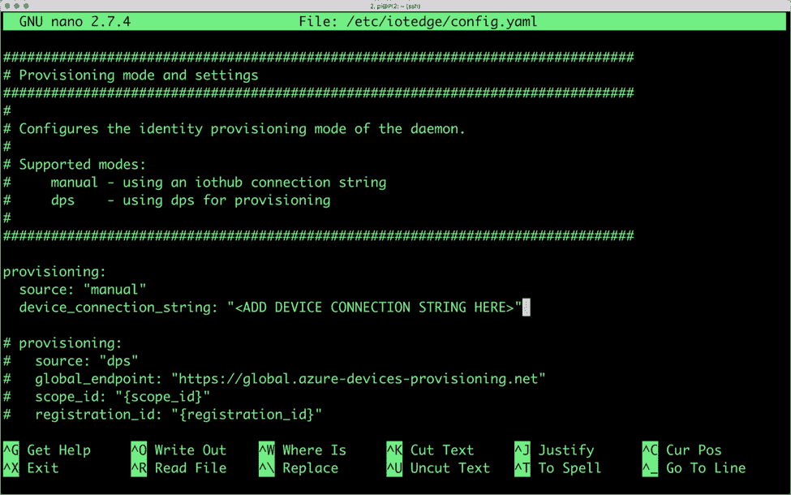
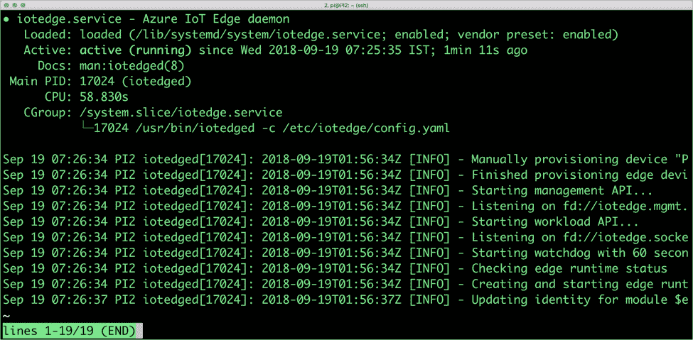
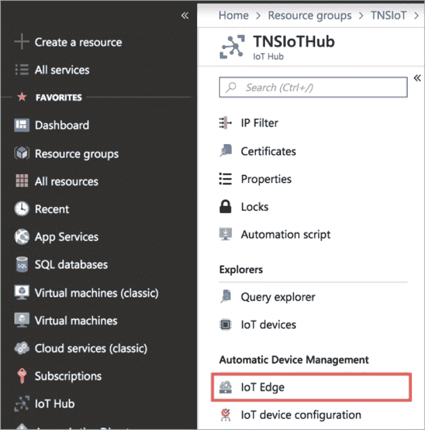
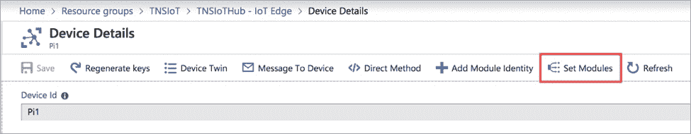
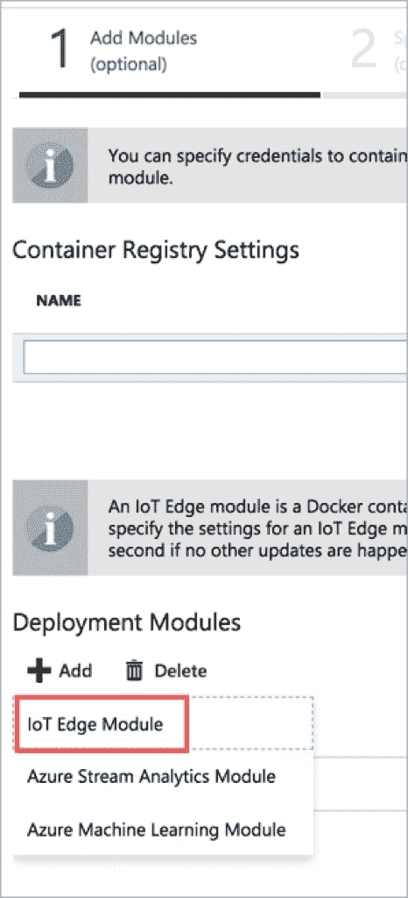
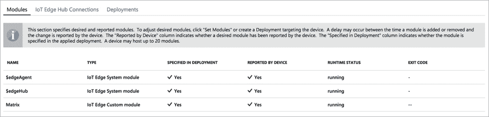
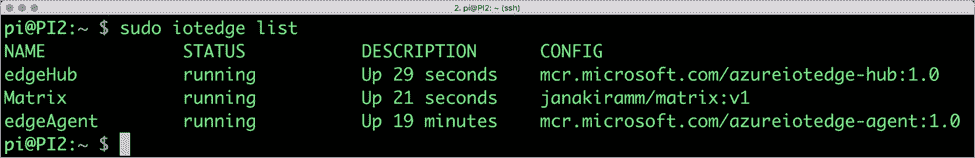
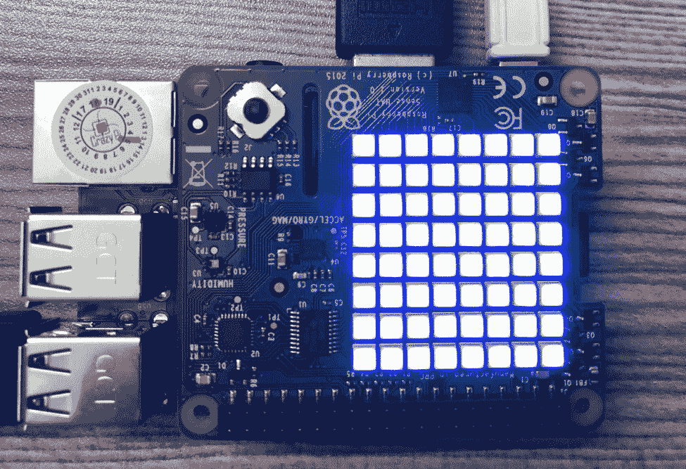
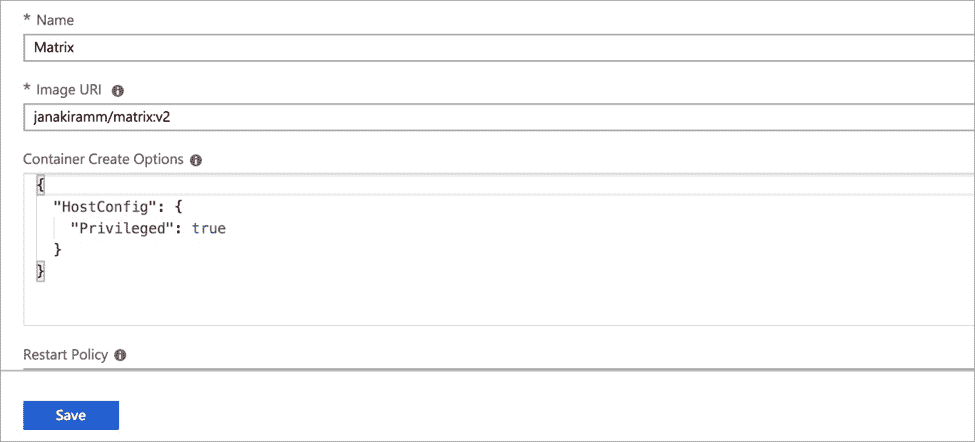
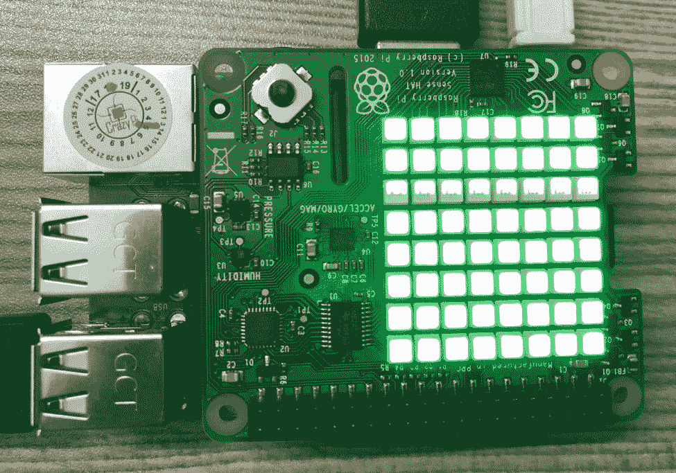

# 教程:将 Raspberry Pi 连接并配置为 Azure 物联网边缘设备

> 原文：<https://thenewstack.io/tutorial-connect-and-configure-raspberry-pi-as-an-azure-iot-edge-device/>

Azure IoT Edge 是微软的边缘计算平台。它是 [Azure IoT](https://thenewstack.io/azure-iot-edge-a-technology-primer/) 的扩展，可以离线模式在本地设备上运行。

在本系列的[最后一部分](https://thenewstack.io/azure-iot-edge-a-technology-primer/)中，我介绍了 Azure IoT Edge 的技术架构。在本教程中，我们将探讨如何将 Raspberry Pi 连接和配置为与 Azure IoT 对话的边缘设备。

我们将控制一个 LED 矩阵，它带有一个树莓派配件，被称为[感应帽](https://www.raspberrypi.org/products/sense-hat/)。这个想法是通过推送封装为 Docker 容器的不同版本的模块来远程改变 LED 矩阵的颜色。

本教程包含三个主要步骤:

1.  在 Azure IoT 中创建云资源
2.  将 Raspberry Pi 配置和连接到 Azure IoT
3.  将模块部署到边缘设备

我们将在教程的大部分时间使用 CLI，同时切换到 Azure Portal 来配置和部署模块。

我们开始吧！

## 先决条件

### 步骤 1–配置 Azure IoT

在您的开发机器(Mac 或 Windows)上，首先配置 Azure IoT CLI。这个工具使得使用 Azure IoT Hub 变得很容易。

```
$  az extension add  --name azure-cli-iot-ext

```

然后，我们将创建一个资源组，作为我们为此项目创建的所有资源的逻辑边界。

```
$  az group create  --name TNSIoT  --location westus

```

让我们创建一个物联网中心，它是 Azure 物联网的门户。该服务处理设备管理、安全和连接设备之间的通信。

```
$  az iot hub create  --resource-group TNSIoT  --name TNSIoTHub  --sku S1

```

一旦我们有了物联网中心，我们就可以开始连接设备。但在此之前，我们需要为设备创建一个身份，该身份将提供凭据以通过 IoT Hub 进行身份验证。

由于我们正在配置边缘设备，我们将继续添加*–边缘使能*标志。重要的是要明白，边缘设备与其他设备没有什么不同，只是它们拥有额外的功能。

下面的命令为 Raspberry Pi 创建一个标识，设备 id 为 Pi1。输出将包含我们需要保存的特定于设备的连接字符串。保持连接字符串安全可靠。这是下一步需要的。

```
$  az iot hub device-identity create  --hub-name TNSIoTHub  --device-id Pi1  --edge-enabled

```

我们已经完成了在云中创建逻辑设备标识的第一部分。我们现在将实际的 Raspberry Pi 设备与该身份相关联。

### 步骤 2–配置 Raspberry Pi

假设您有一个运行最新 Raspbian 操作系统的 Raspberry Pi，它与您的开发机器连接在同一个网络上。

由于 Azure 物联网边缘模块是作为容器运行的，我们需要让 Docker 安装边缘设备。在这种情况下，我们正在建立[莫比](https://mobyproject.org/)，一个支持 Docker 引擎的开源工具链。

```
$  curl  -L  https://aka.ms/moby-engine-armhf-latest -o moby_engine.deb &amp;&amp; sudo dpkg -i ./moby_engine.deb

$  curl  -L  https://aka.ms/moby-cli-armhf-latest -o moby_cli.deb &amp;&amp; sudo dpkg -i ./moby_cli.deb

$  sudo apt-get install  -f

```

在继续下一步之前，确保莫比和 CLI 安装正确。


我们需要在 Raspberry Pi 上安装的第二个组件是 Azure IoT Edge runtime，它作为后台守护程序运行。

运行以下命令来安装它。

```
$  curl  -L  https://aka.ms/libiothsm-std-linux-armhf-latest -o libiothsm-std.deb &amp;&amp; sudo dpkg -i ./libiothsm-std.deb 

$  curl  -L  https://aka.ms/iotedged-linux-armhf-latest -o iotedge.deb &amp;&amp; sudo dpkg -i ./iotedge.deb 

$sudo apt-get install  -f

```

运行时就绪后，我们就可以将设备连接到 Azure IoT Hub 了。这是通过将我们在步骤 1 中获得的设备连接字符串添加到配置文件中来完成的。

在您选择的编辑器中打开 */etc/iotedge/config.yaml* ，用实际的连接字符串替换“<在此处添加设备连接字符串>”。



由于配置已经更改，让我们重新启动运行时，并验证状态。

```
$  sudo systemctl restart iotedge

$  sudo systemctl status iotedge

```

输出应该类似于下面的截图:



您可能希望使用下面的命令进一步探索该服务。

```
$  sudo journalctl  -u  iotedge  --no-pager  --no-full

```

我们已经成功将 Raspberry Pi 连接到 Azure IoT，并将其配置为边缘设备。我们现在准备部署可以控制 LED 矩阵的模块。

### 步骤 3:部署模块

打开你最喜欢的浏览器，导航到 [Azure 门户](https://azure.microsoft.com/en-us/features/azure-portal/)。进入我们在第一步中创建的物联网中心，点击*自动化设备管理*部分下的*物联网边缘*。



在*物联网边缘设备*部分，您应该会看到 PI1 设备。点击以设置模块。



从列表中选择物联网边缘模块以部署自定义模块。



我们现在将使用门户将容器映像作为模块推送到边缘设备。你可以使用我已经推送到 Docker Hub 的预建图像。

图像，***janakiram/matrix:v1，*** 被构建为将 Sense Hat 的所有 led 变为蓝色，而***janakiram/matrix:v2***被配置为将矩阵变为绿色。

我们先推第一个版本把矩阵变成蓝色。

在“物联网边缘定制模块”部分，将模块名称命名为 *Matrix，并为图像 URI 命名为 janakiram/Matrix:v1*。因为我们在 Raspberry Pi 上访问本地 I2C 总线，所以我们需要在特权模式下运行容器。将以下 JSON 字符串粘贴到容器创建选项下。

```
{

   "HostConfig":  {

     "Privileged":  true

   }

}

```


单击保存按钮，接受默认值，完成所有步骤。

这将触发边缘设备上的自定义模块部署。过一会儿，模块部分应该看起来像下面的截图。



您还可以通过在 Raspberry Pi 上运行 *iotedge* CLI 来验证模块是否部署到设备上。

*$ sudo 边缘列表*



如果一切顺利，您应该会看到 Sense Hat LED 矩阵变成蓝色。



现在，让我们继续更新部署以运行模块的版本 2。单击矩阵模块以访问其属性。将图像 URI 改为 ***janakiramm/matrix:v2。***

单击保存按钮，接受默认值，完成所有步骤。



几秒钟后，LED 矩阵变为绿色，表示模块已更新至最新版本。



在设备上运行*io edge*CLI 将确认同样的情况。


虽然改变 led 的颜色并不需要实际推一个新的容器，但是本教程的目的是强调定制模块和管理部署的概念。

在本系列的最后一部分，我将带您了解配置 Kubernetes 以编排 Azure IoT Edge 模块的步骤。我们将通过 Kubernetes 的 CLI*kubectl*进行模块的蓝/绿色部署。

<svg xmlns:xlink="http://www.w3.org/1999/xlink" viewBox="0 0 68 31" version="1.1"><title>Group</title> <desc>Created with Sketch.</desc></svg>