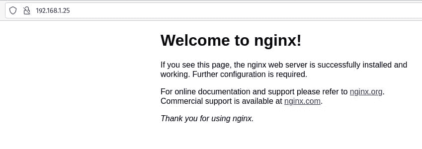

# 教程:从运行中的容器创建 Docker 映像

> 原文：<https://thenewstack.io/tutorial-create-a-docker-image-from-a-running-container/>

如果你刚刚开始你的集装箱之旅，很有可能会从码头工人 T4 开始。为什么？因为 Docker 实际上使学习和使用容器技术变得非常容易。如果你直接跳进 Kubernetes，你会很快迷路。

所以，大多数人应该认真考虑向 Docker 迈出第一步。今天，我将向您介绍一些您可能使用 Docker 容器首先要做的事情。我们要做的是为一个 [NGINX 服务器](https://www.nginx.com?utm_content=inline-mention)部署一个容器，修改它，然后从那个正在运行的容器中创建一个新的映像，您可以用它作为新容器的基础。

你为什么要这么做？比方说，您确实在大多数基于 web 的容器部署中使用 NGINX。您不必总是部署一个新的 NGINX 容器，然后修改它以满足您的基线需求，您可以创建一个已经包含该基线的单一映像，从而避免大量的重复工作。

都是打着效率的旗号。

说完这些，我们开始工作吧。

## 安装 Docker

万一你还没有安装 Docker，让我们这样做。我将在我的 go-to Ubuntu 服务器(版本 20.04)上进行演示。如果您为您的容器部署使用不同的 Linux 发行版，那么您只需要修改这个过程的安装步骤。

要在 Ubuntu 服务器上安装 Docker，请登录并发出以下命令:

`sudo apt-get install docker.io -y`

安装完成后，使用以下命令将您的用户添加到 docker 组:

`sudo usermod -aG docker $USER`

注销并重新登录，以使更改生效。

## 创建新容器

准备好 Docker 后，让我们创建新的容器。这将是一个非常基本的 web 服务器，使用 NGINX。该命令如下所示:

`docker create --name nginx-base -p 80:80 nginx:alpine`

对于那些从未使用过 Docker 的人来说，该命令会执行以下操作:

创建一个名为 **nginx-base** 的新容器，该容器运行在内部(来宾)端口 80 和外部(主机)端口 80 上，并使用 **nginx:alpine** 映像，它必须从 DockerHub 中下载该映像。

该命令将以容器 ID 作为响应，容器 ID 是一长串随机字符，表示部署成功。如果你打开一个网页浏览器，指向托管服务器的 IP 地址，你应该会看到 NGINX 欢迎页面(**图 A** )。



**图 A:**NGINX 欢迎页面，由我们的 Docker 容器生成。

## 修改现有容器

现在，是时候修改我们现有的容器了。我们将只做一个非常基本的修改(你可以稍后扩展到你的心的内容)。我们要做的是为 NGINX 创建一个新的 index.html 页面。

为此，让我们使用以下命令创建新页面:

`nano index.html`

在该文件中，粘贴以下内容(您可以随意修改):

```
&lt;html&gt;
&lt;head&gt;
&lt;title&gt;Hello,  New Stack!&lt;/title&gt;
&lt;/head&gt;
&lt;body&gt;
&lt;h1&gt;Hello,  New Stack!&lt;/1&gt;
&lt;/body&gt;

```

保存并关闭文件。

如您所见，新的欢迎页面将会显示“您好，新堆栈！任何创建了“Hello，World”应用程序的人都会立即意识到这一点。

好的，在我们的下一个技巧中，我们将把这个文件复制到正在运行的容器中。对于 NGINX 映像，文档根目录(存放网页的基本目录)是 */usr/share/nginx/html* 。而且因为 Docker 有一个内置的复制命令，所以将文件添加到正在运行的容器中非常简单。

记住，我们的容器叫做 nginx-base。将 index.html 复制到 nginx-base 上的文档根目录的命令是:

*docker CP index.html nginx-base:/usr/share/nginx/html/index . html*

如果您在 web 浏览器中刷新页面，您应该看到它现在显示了新的欢迎消息(**图 B** )。


**图 B** :我们正在运行的 Docker 容器中的新欢迎消息。

## 创建新图像—++++

好了，我们有了新修改的(正在运行的)容器。我们如何创建一个包含这些变化的新图像？其实很简单。

首先，我们用命令提交更改:

`docker commit nginx-base`

这将创建一个没有存储库或标签的新图像。使用命令列出当前图像:

`docker images`

您应该会看到这样的内容:

```
REPOSITORY     TAG          IMAGE ID             CREATED                    SIZE
&lt;none&gt;         &lt;none&gt;     7fb3d1656c23     About  a  minute ago    23.5MB
nginx          alpine     cc44224bfe20     7  days ago               23.5MB

```

底部的图片是我们用来创建新容器的图片。顶部的图像是我们刚刚创建的。请注意，它既没有存储库(第一列)，也没有标记(第二列)。为了使这个图像可用，我们必须对它进行标记。为了标记图像，我们必须使用图像 ID 作为标识符，所以像这样标记图像(我们将其命名为 docker-base-image ):

`docker tag IMAGE_ID nginx-base-container`

其中 IMAGE_ID 是新容器的实际 ID。

现在，如果你列出这些图片(使用 *docker images* 命令)，你会看到类似这样的东西:

```
REPOSITORY                      TAG          IMAGE ID             CREATED             SIZE
nginx-base-container    latest      7fb3d1656c23     6  minutes ago         23.5MB
nginx                           alpine      cc44224bfe20     7  days ago           23.5MB

```

好了，您已经从一个运行的容器中创建了一个新的 Docker 映像。让我们停下来，取出原来的容器。为此，使用以下命令找到原始文件的 ID:

`docker ps -a`

使用原始容器 ID 的前 4 个字符，用以下字符结束:

`docker stop ID`

其中 ID 是原始容器的前四位数字。

使用以下命令删除容器:

`docker rm ID`

其中 ID 是原始容器的前四位数字。

然后，您可以使用如下命令从新映像部署容器:

`docker create --name nginx-new -p 80:80 nginx-base-container:latest`

刷新您的网络浏览器，您应该再次看到新的 Hello，New Stack！欢迎页面。新图像包括我们对 index.html 页面的修改，因此从它创建的每个容器都将反映这一变化。

这就是从运行中的容器创建 Docker 映像有多容易。这项技能将会非常有用(尤其是当你在前进的过程中不断积累的时候)。

<svg xmlns:xlink="http://www.w3.org/1999/xlink" viewBox="0 0 68 31" version="1.1"><title>Group</title> <desc>Created with Sketch.</desc></svg>