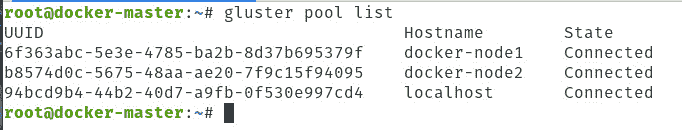
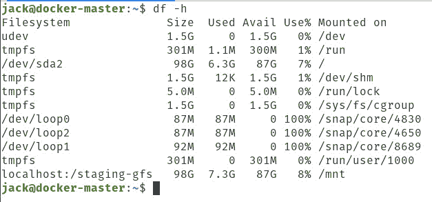

# 教程:使用 GlusterFS 创建一个具有持久存储的 Docker Swarm

> 原文：<https://thenewstack.io/tutorial-create-a-docker-swarm-with-persistent-storage-using-glusterfs/>

释放 Docker Swarm orchestrator 是部署容器集群的一种很好(也相对容易)的方式。是的，你可以使用 Kubernetes 来获得更多的管理特性，但是当你需要一个简单的容器集群的框架时， [Docker Swarm](https://docs.docker.com/engine/swarm/) 是一个不错的选择。

您可能会发现自己需要为集群提供持久存储。什么是持久存储？很高兴你问了。简而言之，持久性存储是任何类型的数据存储设备，即使在设备断电后，也能保留数据。对于容器来说，持久存储是指即使容器没有运行，仍然存在的存储。换句话说，持久存储位于托管服务器上，因此当容器关闭时，存储中的数据仍然可以访问。或者，如果容器是群的一部分，那么持久存储可以在节点之间共享。

对于任何容器开发人员来说，持久存储通常是必不可少的工具。使用一些容器技术，持久存储可以非常简单地完成。虽然使用 Docker 可以使用卷，但该特性的问题是它是一个仅限本地的系统。正因为如此，你需要使用第三方软件，比如 NFS[或者 GlusterFS](https://www.extrahop.com/resources/protocols/nfs/)。NFS 最大的弱点是它没有加密。所以对于许多企业和开发者来说，GlusterFS 是一条必由之路。

我想向您介绍使用 GlusterFS 在 Docker Swarm 中共享持久存储的过程。

## 你需要什么

我将在一个具有一个主节点和两个节点的小型集群上进行演示，每个节点都将运行在 Ubuntu Server 18.04 上。为此，你需要:

*   Ubuntu Server 18.04 的三个运行和更新实例。
*   拥有 **sudo** 权限的用户。

这就是你所需要的一切。

### 更新/升级

在开始之前，最好更新和升级您的服务器操作系统。要在 Ubuntu(或任何基于 Debian 的平台)上这样做，打开一个终端并发出命令:

`sudo apt-get update`

`sudo apt-get upgrade -y`

如果您的内核在此过程中升级，请确保重新启动服务器，以使更改生效。

### 添加您的主机

我们现在需要在 **/etc/hosts** 中映射我们的 IP 地址。在每台机器上都这样做。发出命令:

`sudo nano /etc/hosts`

在该文件中(在每台机器上)，您将在文件的底部添加如下内容:

```
192.168.1.67  docker-master
192.168.1.107  docker-node1
192.168.1.117  docker-node2

```

确保编辑以上内容，以匹配您的 IP 地址和主机名。

保存并关闭文件。

### 部署蜂群

如果您还没有这样做，您需要安装和部署 Docker Swarm。在每台机器上安装 Docker，命令如下:

`sudo apt-get install docker.io -y`

使用以下命令启动并启用 Docker:

`sudo systemctl start docker`

`sudo systemctl enable docker`

使用以下命令将您的用户添加到 docker 组(在所有计算机上):

`sudo usermod -aG docker $USER`

发出以下命令(在所有计算机上)以使更改生效:

`sudo newgrp docker`

接下来，我们需要初始化蜂群。在主机上发出命令:

`docker swarm init --advertise-addr MASTER_IP`

其中 MASTER_IP 是主服务器的 IP 地址。

一旦 swarm 被初始化，它将显示您需要在每个节点上运行的命令。该命令将类似于:

`docker swarm join --token SWMTKN-1-09c0p3304ookcnibhg3lp5ovkjnylmxwjac9j5puvsj2wjzhn1-2vw4t2474ww1mbq4xzqpg0cru 192.168.1.67:2377`

复制该命令并将其粘贴到节点的终端窗口中，以便将它们加入到主节点中。

这就是部署蜂群的全部内容。

### 安装 GlusterFS

您现在需要在集群中的每台服务器上安装 GlusterFS。首先，使用以下命令安装必要的依赖项:

`sudo apt-get install software-properties-common -y`

接下来，使用以下命令添加必要的存储库:

`sudo add-apt-repository ppa:gluster/glusterfs-3.12`

使用以下命令更新 apt:

`sudo apt-get update`

使用以下命令安装 GlusterFS 服务器:

`sudo apt install glusterfs-server -y`

最后，使用以下命令启动并启用 GlusterFS:

`sudo systemctl start glusterd`

 `sudo systemctl enable glusterd`

### 生成 SSH 密钥

如果您还没有这样做，那么您应该为每台机器生成一个 SSH 密钥。为此，发出以下命令:

`ssh-keygen -t rsa`

一旦你处理好了，就该继续了。

### 探测节点

现在我们要让格鲁斯特探测所有的节点。这将由主人来做。我将坚持我的两个节点的例子，它们是 docker-node1 和 docker-node2。在发出该命令之前，您需要使用以下命令切换到超级用户:

`sudo -s`

如果您不从 root 发出 Gluster probe 命令，您将得到一个错误，它不能写入日志。探测命令看起来像这样:

`gluster peer probe docker-node1; gluster peer probe docker-node2;`

确保编辑该命令以适应您的配置(对于主机名)。

命令完成后，您可以检查以确保您的节点与命令连接:

`gluster pool list`

您应该看到所有节点都被列为已连接(图 1 )。



**图 1:** 我们的节点是连接的。

用**退出**命令退出根用户。

### 创建 Gluster 卷

让我们为 Gluster 卷创建一个目录。该命令将在所有计算机上运行:

`sudo mkdir -p /gluster/volume1`

使用您想要的任何名称来代替 volume1。

现在，我们将使用以下命令跨集群创建卷(仅在主服务器上运行):

`sudo gluster volume create staging-gfs replica 3 docker-master:/gluster/volume1 docker-node1:/gluster/volume1 docker-node2:/gluster/volume1 force`

使用以下命令启动卷:

`sudo gluster volume start staging-gfs`

该卷现在已经启动并运行，但是我们需要确保该卷将在重新启动时(或其他情况下)装载。我们将把该卷挂载到/mnt 目录。为此，在所有计算机上发出以下命令:

`sudo -s`

`echo 'localhost:/staging-gfs /mnt glusterfs defaults,_netdev,backupvolfile-server=localhost 0 0' >> /etc/fstab`

`mount.glusterfs localhost:/staging-gfs /mnt`

`chown -R root:docker /mnt`

`exit`

要确保 Gluster 卷已挂载，请发出以下命令:

`df -h`

您应该看到它列在底部(**图 2** )。



**图 2:** 我们的 Gluster 卷安装正确。

您现在可以在 **/mnt** 目录中创建新文件，它们将出现在每台机器上的 **/gluster/volume1** 目录中。

## 通过 Docker 使用您的新 Gluster 宗卷

此时，您已经准备好将持久存储卷与 docker 集成了。比方说，你需要一个 MySQL 数据库的持久存储。在你的 docker YAML 文件中，你可以像这样添加一个部分:

```
<i> volumes:
</i><i>   -  type:  bind
</i><i>     source:  /mnt/staging_mysql
</i><i>     target:  /opt/mysql/data</i>

```

因为我们已经在 **/mnt** 中安装了持久存储，所以一个 docker 节点上保存的所有内容都将与所有其他节点同步。

这就是如何创建持久存储，然后在 Docker Swarm 集群中使用它。当然，这不是实现持久存储的唯一方法，但却是最简单(也是最便宜)的方法之一。尝试将 GlusterFS 作为你的持久存储选项，看看它是否适合你。

<svg xmlns:xlink="http://www.w3.org/1999/xlink" viewBox="0 0 68 31" version="1.1"><title>Group</title> <desc>Created with Sketch.</desc></svg>