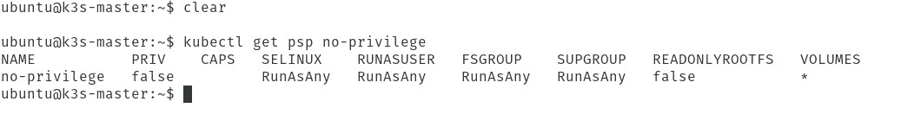

# 教程:创建 Kubernetes Pod 安全策略

> 原文：<https://thenewstack.io/tutorial-create-a-kubernetes-pod-security-policy/>

Kubernetes 是大多数企业级业务的首选容器管理工具。但是有太多的零碎信息需要考虑，安全性可能会成为一个问题。您不仅必须确保部署容器的系统具有完善的安全控制，还必须在部署这些容器和容器时严格关注安全性。否则，您将面临数据被盗和其他损失的风险。

为此，在部署到您的 Kubernetes 集群时，您必须非常小心。必须考虑的一件事是 pod 安全策略。我想带您了解创建 Kubernetes pod 安全策略的基础知识。从那里，您将有一个发射台，您可以在那里继续探索和学习如何打造可靠和安全的部署。

但是首先…

## 什么是 Kubernetes 豆荚？

在我们深入研究安全策略之前，您可能需要首先了解什么是 pod(如果不是，请随意跳过这一部分)。对于那些*需要这些信息的人来说，要知道 pod 最简单的形式就是组成容器的进程的集合。这些过程可以包括:*

*   存储资源。
*   唯一的网络 IP 地址。
*   指示容器应该如何运行的配置选项。

这些部分组合在一起(在一个集合或另一个集合中)作为一个单元进行部署。这个单元可以是单个容器的形式，也可以是多个容器协同工作的形式(比如 WordPress、NGINX 和 MySQL)。这些容器中的每一个都有自己的配置选项，但是它们作为一个有凝聚力的整体——Pod——一起工作。

这样做的问题是，如果没有管理整体安全的方法，你将不得不管理单个部分的安全。这导致 Kubernetes 开发者创建了…等等…

## Pod 安全策略

通过 pod 安全策略，Kubernetes 管理员可以控制 Pod 规范的安全性。但不仅仅如此。Pod 安全策略是定义特定安全条件的配置，pod 必须满足这些特定安全条件才能被群集接受。如果条件不满足，则表示 pod 将被拒绝。通过使用 PodSecurityPolicy 对象定义，可以控制类似以下内容:

*   pod 运行特权容器的能力。
*   pod 使用权限提升的能力。
*   pod 对卷类型的访问。
*   pod 对主机文件系统的访问。
*   pod 对主机网络对象和配置的使用。

但是 pod 安全策略是如何定义的呢？

让我们深入到…

## 创建 Kubernetes Pod 安全策略

pod 安全策略是在 YAML 文件中定义的。然后，在 kubectl 命令的帮助下，应用 YAML 文件来定义新策略。

让我们创建一个新的 pod 安全策略。该策略将执行以下操作(通过 RunAsAny 规则，该规则比 runAsUser 选项更宽松):

*   禁用 pod 运行特权容器的能力。
*   允许使用 SELinux。
*   允许使用 Linux 组。
*   允许用户使用不同的用户名运行容器入口点。
*   允许使用 fsGroup(支持所有权管理的卷)。

要创建必要的 YAML 文件，发出命令(您可以随意命名文件，只要它以。yaml 扩展):

`nano no-privilege.yaml`

在新文件中，粘贴以下内容:

```
apiVersion:  policy/v1beta1
kind:  PodSecurityPolicy
metadata:
  name:  no-privilege
spec:
  privileged:  false
  seLinux:
    rule:  RunAsAny
  supplementalGroups:
    rule:  RunAsAny
  runAsUser:
    rule:  RunAsAny
  fsGroup:
    rule:  RunAsAny
  volumes:
  -  '*'

```

记住，因为这是一个 YAML 文件，你的缩进必须一致(否则文件会失败)。

保存并关闭文件。

要应用新创建的策略，请发出以下命令:

`kubectl apply -f no-privelege.yaml`

上述命令将报告以下内容:

`podsecurity.policy/no-privilege created`

你的 pod 安全策略现在已经就绪。如果您决定需要更改该特定策略，可以编辑 YAML 文件并重新运行该命令来更新更改。您还可以根据需要创建任意多的策略(创建不同的 YAML 文件，并以与上面类似的方式应用它们)。

您可以使用以下命令验证您的策略是否到位:

`kubectl get psp no-privilege`

上面的命令将打印出 YAML 文件中定义的策略(**图 1** )。



**图 1:** 我们新的 pod 安全策略已经就绪。

现在您已经创建了 pod 安全策略，您需要知道…

## 如何分配 Pod 安全策略

借助基于角色的访问控制(RBAC)，您可以将 pod 安全策略分配给部署。假设我们想要创建一个集群范围的角色，名为 no-privilege，它将使用相同名称的策略。

为此，我们将创建一个新的 YAML 文件，该文件不仅会创建集群范围的角色(使用 ClusterRole 定义)，还会创建一个集群绑定，向每个经过身份验证的用户授予对无特权角色的访问权限。为此，使用以下命令创建新文件:

`nano rbac-noprivilege.yaml`

在该文件中，粘贴以下内容:

```
kind:  ClusterRole
apiVersion:  rbac.authorization.k8s.io/v1
metadata:
name:  no-privilege:no-privilege
rules:
-  apiGroups:
-  extensions
resources:
-  podsecuritypolicies
resourceNames:
-  psp
verbs:
-  use
---

kind:  ClusterRoleBinding
apiVersion:  rbac.authorization.k8s.io/v1
metadata:
name:  no-privilege:no-privilege
subjects:
-  kind:  Group
name:  system:authenticated
apiGroup:  rbac.authorization.k8s.io
roleRef:
kind:  ClusterRole
name:  no-privilege:no-privilege
apiGroup:  rbac.authorization.k8s.io

```

保存并关闭文件。使用命令应用角色:

`kubectl apply -f rbac-noprivilege.yaml`

上面的命令会打印出来:

```
clusterrole.rbac.authorization.k8s.io/no-privilege:no-privilege created
clusterrolebinding.rbac.authorization.k8s.io/no-privilege:no-privilege created

```

现在，您可以通过以下命令检查以确保您能够使用新策略:

`kubectl auth can-i use no-privilege/no-privilege`

输出应该报告“是”

让我们检查是否有任何用户可以使用以下命令来使用新策略:

`kubectl auth can-i use no-privilege/no-privilege --as-group=system:authenticated --as=any-user`

上述命令的输出应该报告“否”

就是这样。您已经创建并应用了您的第一个 Kubernetes pod 安全策略。借助这种技术，您可以大大增强 Kubernetes 部署的安全性。

<svg xmlns:xlink="http://www.w3.org/1999/xlink" viewBox="0 0 68 31" version="1.1"><title>Group</title> <desc>Created with Sketch.</desc></svg>