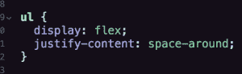
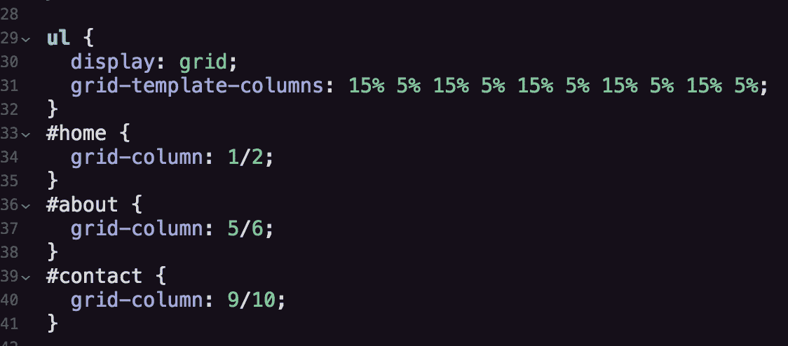
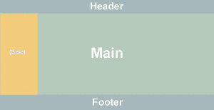
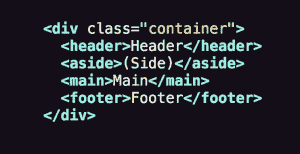
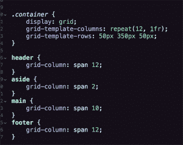
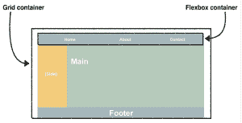

# 教程:CSS Flexbox vs .网格布局终极对决！！

> 原文：<https://thenewstack.io/tutorial-css-flexbox-vs-grid-layout-ultimate-showdown/>

今天，任何成为前端 web 开发人员的人都不知道我们过去为了简单地将内容放到网页上需要去的地方要经历什么。忘了让它根据屏幕大小和方向缩放吧，更不用说——当页眉、页脚和主要部分停留在顶部、底部和中间时，我们很高兴。

召集孩子们，听听我们是如何强迫 HTML 表格标记完成布局任务的(可怕！)然后，有了 CSS，我们开始与浮动和定位作斗争，并拼凑出类似 clearfix(恐怖的尖叫)的变通办法。在很长一段时间里，简单地在页面上放置元素非常困难:布局工具根本不存在，或者非常原始。最后，在第一个网络浏览器问世仅仅二十年后，我们终于有了 [CSS 灵活框布局](https://developer.mozilla.org/en-US/docs/Web/CSS/CSS_Flexible_Box_Layout)和 [CSS 网格布局](https://developer.mozilla.org/en-US/docs/Web/CSS/CSS_Grid_Layout)。

第一个被广泛称为 Flexbox 的产品在 2016 年年中变得可行，当时它终于在所有主流浏览器的所有当前版本中得到支持。它是一个非常强大、非常灵活的布局工具，可以改变元素的位置、尺寸和方向。从导航链接到图像，到表格，一切都可以很容易地排列——对于媒体查询，可以重新排列——不管原始大小如何，甚至(这有多酷？！)HTML 标记顺序。

紧随 Flexbox 而来的是 Grid，它即将完全支持浏览器。Grid 引入了更多的新特性，使开发人员能够智能地调整元素的大小，并将其放置在一个“网格容器”中，该容器可以自动适应可用的空间。这支持响应式设计，使创建适用于各种不同浏览器大小的布局变得更加容易，而无需使用那些烦人的媒体查询。

Flexbox 和 Grid 实际上共享了许多相同的功能，这对于渴望利用它们的开发人员来说是一个困惑的来源。在某些情况下，使用 Flexbox 是正确的，而在其他情况下，使用 Grid，有时两者的结合是最好的。但是怎么知道什么时候用什么呢？

### 多维痴呆

框定 Flex 与 Grid 困境的最简单方法是从维度的角度来考虑。

在最基本的层面上，Flexbox 旨在安排一维情况下的元素，即一行或一列中的单个项目。它更像是一个在父容器中放置多个相关项的微观工具:标题中的导航项、表单中的按钮。

另一方面，网格是为了更宏观的布局目的。主要是在页面上排列更大的容器元素:页眉、主页面和页脚。

我在这里说“有意”是因为 Flex 和 Grid 通常可以用来解决相同的问题，只是各有各的方式。事实上，在网格出现之前，开发人员很乐意使用 FlexBox 来创建页面布局。两者的核心区别在于，Flexbox 根植于内容，而 Grid 面向页面架构。让我们直接看代码，这样你就能明白我的意思了。

## Flexbox 优先

下面是一个非常基本的导航元素的标记:

在应用任何 Flexbox 属性之前，导航项目按标记顺序显示为块元素，即一个在下一个之上:

(注意:很明显，也有一些样式被应用，但是由于它们与 Flex 或 Grid 无关，我们将把它们排除在我们的讨论之外。)

一旦我们用“display:flex；属性/值对，但是列表项将自己排成一行，共享同一行:

看起来已经很棒了，只有一条 Flexbox 线！但是，如果我们希望它们在父容器中均匀分布，我们可以添加“justify-content:space-around；并且列表项目顺从地彼此相对地分布它们自己和可用空间:

 

Flexbox 的美妙之处在于，除了最低代码要求之外，无论屏幕宽度如何，项目之间总是保持相同的比例距离！说到有求必应。

## 进入状态

Flexbox 在调整元素在父容器中的位置方面表现出色——flex-parent 和 flex-child 属性的组合在适应任何情况方面都非常强大。尽管 Flexbox 是一个灵活的工具，但是，当应用于更广泛的页面架构时，它仍然是一个迟钝的工具，在这种架构中，稳定性和精确性是最重要的。

简而言之，网格最大的价值和它最大的麻烦是一样的:精确。

网格可用于在相同的精确方向上分布相同的导航项目。但是，因为它并不是真正用于这种更精确、更小规模(“微”)的内容放置，所以需要更多的代码来实现相同的效果。除了从四行 CSS 到十几行之外，我们还必须进入标记，通过在每个元素上放置一个 id 来调用单个列表项元素，然后将它们精确地放置在已建立的网格中:

【T2

## 

## 组合拳

Flex 和 Grid 在各自的优势领域使用得当(重要的是，使用适当的语义标记)时，它们本身都很强大……然而，当我们将它们结合在一起时，我们释放了各种迄今尚未开发的布局能力！

让我们把一个简单的网站布局放在一起，老实说，当所有华而不实的东西都被剥离时，许多网站都可以归结为一个确切的架构:页眉、页脚、主要内容区域，加上一个侧边区域，因为 wtf 不是:

标记少得离谱，使用 Grid 放置这些元素的 CSS 也少得可怜:

 

看那个！一个完整的网页的基本架构，用 6 行 HTML 和 17 行 CSS 勾勒出来，这都归功于 Grid…和语义 HTML5 的一些战术性使用。

现在，让我们使用上面的代码，添加一个 Flexbox 来充实导航:

我们只是将 header 元素(它本身是一个网格项)转化为 flex 父元素，这样我们就可以将 Flexbox 属性应用于其中的内容！

## 伊妮，米妮…

我们上面的练习有点勉强，但重点是展示 Flexbox 做得很好，Grid 也能做的事情——只是代码更多。反之亦然。因此，在某些特定的情况下需要 Flexbox，而在其他情况下更适合 Grid……而在适当的环境下，这两种情况结合在一起可能会是一首优雅的最小代码交响乐。

因此，在给定的情况下，如何选择何时使用 Flexbox 与网格的 tl: dr 是:

*   使用 Flexbox 对容器中的元素进行一维(即，在列或行中，而不是在网格中)排列。好处是更少的代码和对父容器中元素的响应性调整。
*   对于大型容器元素或 div 的更宽、更宏观的页面布局，使用 Grid。好处是位置极其精确，并且能够在需要时重叠元素。
*   对于复杂的布局，将两者结合使用:Grid 用于创建架构，Flexbox 用于在较大的语义元素中放置较小的内容。

通过 Pixabay 的特征图像。

<svg xmlns:xlink="http://www.w3.org/1999/xlink" viewBox="0 0 68 31" version="1.1"><title>Group</title> <desc>Created with Sketch.</desc></svg>