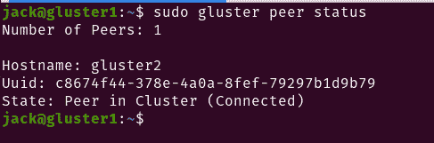

# 教程:部署高可用性 GlusterFS 存储集群

> 原文：<https://thenewstack.io/tutorial-deploy-a-highly-availability-glusterfs-storage-cluster/>

[GlusterFS](https://www.gluster.org/) 网络文件系统非常适合各种需要处理大量(想想 Pb 级)存储数据的用例。换句话说，这可能是您各种云或容器部署的理想存储系统。该文件系统具有分片、分层、AFR 统计、文件快照、分布式哈希表、非统一文件访问、OVirt 和 QEMU 集成、RDMA 连接管理器、重新平衡、服务器仲裁、分布式地理复制和块故障检测等功能，可能非常适合您的需求。Red Hat 目前管理这个开源网络文件系统。

当然，如何在您的云实现中使用 GlusterFS 将取决于您使用的云平台。但是，在将它部署到您的系统之前，您首先必须启动并运行这个可联网的存储。

我将带您完成在 Ubuntu Server 20.04 上部署三节点 GlusterFS 集群的过程。要做到这一点，你需要三个 Ubuntu 实例。出于我的目的，它们将具有以下主机名和 IP 地址:

`192.168.1.24 gluster1`

`192.168.1.25 gluster2`

`192.168.1.26 gluster3`

您需要更改 IP 地址以匹配您的网络拓扑。

## 第一步

启动 Ubuntu 实例后，首先要做的是更新和升级每个实例。您可以使用以下两个命令来实现这一点(在所有三个服务器上):

`sudo apt-get update` 

`sudo apt-get upgrade -y`

如果内核在任何情况下升级，您将需要确保重新启动服务器(以便应用更新)。

升级后，您需要为每个服务器设置主机名。这可以通过一个方便的命令来完成，如下所示:

`sudo hostnamectl set-hostname NAME`

其中，名称为 gluster1、gluster2 和 gluster3。

接下来，我们需要映射/etc/hosts 文件中的地址。使用以下命令打开该文件(在每台服务器上)进行编辑:

`sudo nano /etc/hosts`

通过在文件底部添加以下内容来映射这些地址:

```
192.168.1.24  gluster1
192.168.1.25  gluster2
192.168.1.26  gluster3

```

保存并关闭文件。

## 安装 GlusterFS

随着 Ubuntu Server 20.04 的发布，GlusterFS 现在可以在标准存储库中找到。因此，要安装软件，请返回终端窗口并发出以下命令:

`sudo apt-get install glusterfs-server -y`

确保在 gluster1 和 gluster2 上安装 GlusterFS。

安装完成后，使用以下两个命令在每台服务器上启动并启用 GlusterFS:

`sudo systemctl start glusterd`

`sudo systemctl enable glusterd`

## 配置 GlusterFS

现在您的服务器已经准备好了，GlusterFS 也安装好了，是时候配置 gluster 了。在 gluster1 上，使用以下命令创建受信任池:

`sudo gluster peer probe gluster2`

您应该看到 peer probe:成功返回。

使用以下命令验证两台对等机的状态:

`sudo gluster peer status`

您应该看到 gluster2 已连接(图 1)。



图 1:我们的 gluster1 和 gluster2 服务器连接在一起。

## 创建分布式卷

接下来，我们将创建一个分布式卷。我强烈建议您在不在系统目录中的分区上创建这个卷(也就是说，不在您的操作系统所在的驱动器上)。如果在操作系统所在的驱动器上创建该卷，可能会遇到同步错误。

让我们用以下命令为 GlusterFS 创建一个新目录(在 gluster1 和 gluster2 上):

`sudo mkdir -p /glusterfs/distributed`

创建目录后，我们现在可以创建卷(名为 v01 ),该卷将在 gluster1 和 gluster2 上复制。用于此目的的命令是:

`sudo gluster volume create v01 replica 2 transport tcp gluster1:/glusterfs/distributed gluster2:/glusterfs/distributed`

系统将提示您确认创建。键入“y”以允许创建新的分布式卷。成功后，使用以下命令启动该卷:

`sudo gluster volume start v01`

您可以使用以下命令验证创建:

`sudo gluster volume info v01`

## 安装 GlusterFS 客户端并连接到分布式卷

现在是安装 GlusterFS 客户端的时候了。我们将在 gluster3 上这样做。为此，发出以下命令:

`sudo apt install glusterfs-client -y`

使用以下命令在 gluster3 上为 GlusterFS 创建一个新的挂载点:

`sudo mkdir -p /mnt/glusterfs`

我们现在可以使用以下命令装载分布式文件系统:

`sudo mount -t glusterfs gluster1:/v01 /mnt/glusterfs/`

最后，您需要确保分布式文件系统是在引导时挂载的。为此，您需要使用以下命令编辑 fstab 文件:

`sudo nano /etc/fstab`

在该文件的底部，添加以下内容:

`gluster1:/v01 /mnt/glusterfs glusterfs defaults,_netdev 0 0`

## 测试文件系统

有了所有这些，我们现在可以测试 GlusterFS 分布式文件系统了。在 gluster1 上发出命令:

`sudo mount -t glusterfs gluster1:/v01 /mnt`

在 gluster2 上发出命令:

`sudo mount -t glusterfs gluster2:/v01 /mnt`

转到 gluster3，用下面的命令创建一个测试文件:

`sudo touch /mnt/glusterfs/thenewstack`

使用命令(在 gluster1 和 gluster2 上运行)检查以确保新文件出现在 gluster1 和 gluster2 上:

`ls /mnt`

您应该看到新堆栈出现在 gluster1 和 gluster2 上的两个目录中(图 2)。


图 2:测试文件出现在 gluster1 上。

现在，您已经有了一个启动并运行的 GlusterFS 分布式文件系统。现在，您应该能够将它集成到任何需要高容量文件系统的东西中，该文件系统提供了大量的特性，可以满足您的许多云和容器需求。

<svg xmlns:xlink="http://www.w3.org/1999/xlink" viewBox="0 0 68 31" version="1.1"><title>Group</title> <desc>Created with Sketch.</desc></svg>