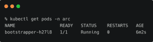
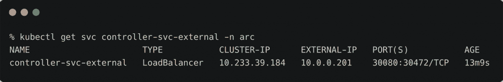
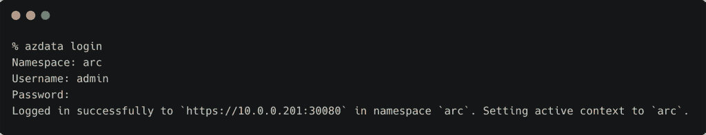
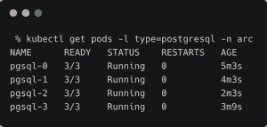
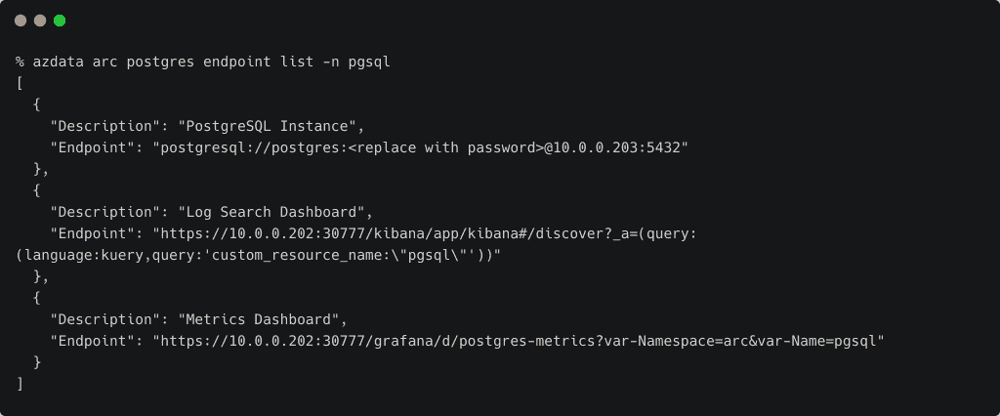

# 教程:在 Azure Arc 上部署 Kubernetes 驱动的 PostgreSQL-Hyperscale

> 原文：<https://thenewstack.io/tutorial-deploy-a-kubernetes-driven-postgresql-hyperscale-on-azure-arc/>

本文是 Azure Arc 系列的最后一部分，我们将在其中探索支持 Arc 的数据服务。看见

[Part 1](https://thenewstack.io/a-technical-introduction-to-microsoft-azure-arc/)

,

[Part 2](https://thenewstack.io/tutorial-register-and-manage-linux-servers-with-azure-arc/)

，以及

[Part 3](https://thenewstack.io/tutorial-register-and-configure-kubernetes-clusters-with-azure-arc/)

.

在 Azure Arc 系列的最后一部分，我们将部署数据控制器，然后部署 [PostgreSQL-Hyperscale](https://www.citusdata.com/product/hyperscale-citus/) 。

虽然有多种技术可用于部署 Azure Arc 支持的数据服务，但我们使用的是原生 Kubernetes 部署模型。

本文假设您有一个运行版本 1.17 或更高版本的 Kubernetes 集群，并配置了一个名为 local-storage 的存储类。我使用 [PX-Essentials、](https://portworx.com/products/features/)Pure Storage 提供的 [Portworx 免费存储选项作为存储层。您可以自由使用任何 Kubernetes 兼容的存储引擎。](https://portworx.com/)

Azure Arc 支持的数据服务依赖数据控制器进行生命周期管理。此服务的所有对象都被部署为自定义资源定义(CRD)。您需要 Kubernetes 集群管理权限来处理这个部署。

### 安装数据控制器

让我们从部署所需的 CRD 开始:

```
kubectl create  -f  https://raw.githubusercontent.com/microsoft/azure_arc/master/arc_data_services/deploy/yaml/custom-resource-definitions.yaml

```

支持 Azure Arc 的数据服务通常安装在一个名为`arc`的名称空间中。让我们创建这个:

```
kubectl create namespace arc

```

下一步是部署一个引导程序，处理创建、编辑和删除定制资源的请求:

```
kubectl create  --namespace arc  -f  https://raw.githubusercontent.com/microsoft/azure_arc/master/arc_data_services/deploy/yaml/bootstrapper.yaml

```

您现在应该已经在`arc`名称空间中启动并运行了引导程序。



我们必须创建一个保存数据控制器的用户名和密码的秘密。在 macOS 上，您可以运行以下命令来为用户名和密码生成 base64 编码的字符串:

```
#prints YWRtaW4=
echo  "admin"  |  tr  -d  \\n  |  base64  

```

```
#prints UGFzc3dvcmRAMTIz
echo  "Password@123"  |  tr  -d  \\n  |  base64  

```

从上面的命令中取值来创建一个秘密:

```
apiVersion:  v1
data:
  password:  UGFzc3dvcmRAMTIz
  username:  YWRtaW4=
kind:  Secret
metadata:
  name:  controller-login-secret

```

```
kubectl create  -f  controller-login-secret.yaml

```

下载数据控制器 YAML 文件并进行修改，以反映您的连接和存储选项:

```
apiVersion:  arcdata.microsoft.com/v1alpha1
kind:  datacontroller
metadata:
  generation:  1
  name:  arc
spec:
  credentials:
    controllerAdmin:  controller-login-secret
    serviceAccount:  sa-mssql-controller
  docker:
    imagePullPolicy:  Always
    imageTag:  public-preview-sep-2020
    registry:  mcr.microsoft.com
    repository:  arcdata
  security:
    allowDumps:  true
    allowNodeMetricsCollection:  true
    allowPodMetricsCollection:  true
    allowRunAsRoot:  false
  services:
  -  name:  controller
    port:  30080
    serviceType:  LoadBalancer
  -  name:  serviceProxy
    port:  30777
    serviceType:  LoadBalancer
  settings:
    ElasticSearch:
      vm.max_map_count:  "-1"
    azure:
      connectionMode:  Indirect
      location:  westeurope
      resourceGroup:  
      subscription:  
    controller:
      displayName:  arc
      enableBilling:  "True"
      logs.rotation.days:  "7"
      logs.rotation.size:  "5000"
  storage:
    data:
      accessMode:  ReadWriteOnce
      className:  local-storage
      size:  15Gi
    logs:
      accessMode:  ReadWriteOnce
      className:  local-storage
      size:  10Gi

```

使用适当的资源组、订阅 ID 和存储类名更新模板。应用数据控制器规范:

```
kubectl apply  -f  data-controller.yaml

```


控制器通过负载平衡器服务公开。找到服务的 IP 地址和端口:

```
kubectl get svc controller-svc-external  -n  arc

```



我们现在可以用`azdata`工具登录控制器。运行以下命令安装最新版本的 Azure Arc enabled 数据服务 CLI:

```
brew tap microsoft/azdata-cli-release
brew update
brew install azdata-cli

```

运行`azdata login`将提示我们详细信息:



既然控制器已经就绪，我们就可以部署 PostgreSQL 超大规模了。

### 正在安装 PostgreSQL 超大规模实例

首先从官方的微软 Git 库下载 YAML 模板文件。根据存储类的值对其进行修改。将密码值设置为 bas64 编码的字符串。

下面的规范有一个名为 Password@123 的秘密，存储类指向本地存储:

```
apiVersion:  v1
data:
  password:  UGFzc3dvcmRAMTIz
kind:  Secret
metadata:
  name:  pgsql-login-secret
type:  Opaque
---
apiVersion:  arcdata.microsoft.com/v1alpha1
kind:  postgresql-12
metadata:
  generation:  1
  name:  pgsql
spec:
  engine:
    extensions:
    -  name:  citus
  scale:
    shards:  3
  scheduling:
    default:
      resources:
        limits:
          cpu:  "4"
          memory:  4Gi
        requests:
          cpu:  "1"
          memory:  2Gi
  service:
    type:  LoadBalancer
  storage:
    backups:
      className:  local-storage
      size:  10Gi
    data:
      className:  local-storage
      size:  10Gi
    logs:
      className:  local-storage
      size:  5Gi

```

使用下面的 kubectl 命令应用规范:

```
kubectl apply  -n  arc  -f  pgsql.yaml

```

几分钟后，您将看到属于 PostgreSQL 超大规模的四个新 pod 被添加到`arc`名称空间:

```
kubectl get pods  -l  type=postgresql  -n  arc

```



部署通过可用于访问数据库的服务公开:

```
kubectl get svc pgsql-external-svc  -n  arc

```


我们还可以使用`azdata`来获得 PostgreSQL 端点:

```
azdata arc postgres endpoint list  -n  pgsql

```



我们现在可以使用任何客户端工具登录 PostgreSQL。下面的截图显示了`psql` CLI 访问数据库实例:

```
PGPASSWORD=Password@123  psql  -h  10.0.0.203  -U  postgres

```


本教程向您介绍了在 Kubernetes 上部署支持 Azure Arc 的数据库服务的步骤。

贾纳奇拉姆·MSV 的网络研讨会系列“机器智能和现代基础设施(MI2)”提供了涵盖前沿技术的信息丰富、见解深刻的会议。在 [http://mi2.live](http://mi2.live) 注册即将到来的 MI2 网络研讨会。

Portworx 是新堆栈的赞助商。

由[拍摄的特写图片由塞尔奎拉](https://unsplash.com/@shotbycerqueira?utm_source=unsplash&utm_medium=referral&utm_content=creditCopyText)在 [Unsplash](https://unsplash.com/s/photos/space?utm_source=unsplash&utm_medium=referral&utm_content=creditCopyText) 拍摄。

<svg xmlns:xlink="http://www.w3.org/1999/xlink" viewBox="0 0 68 31" version="1.1"><title>Group</title> <desc>Created with Sketch.</desc></svg>