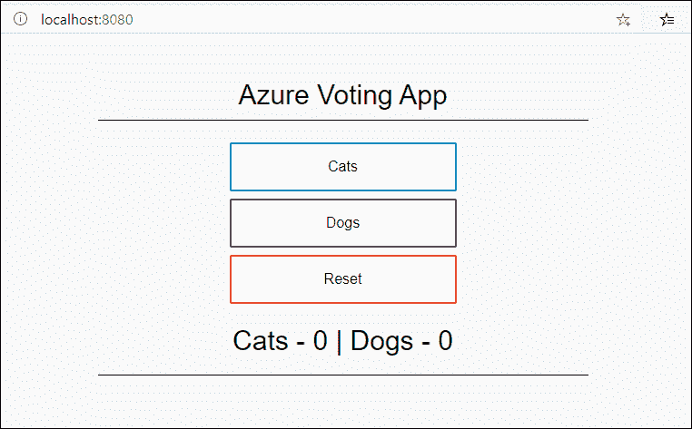
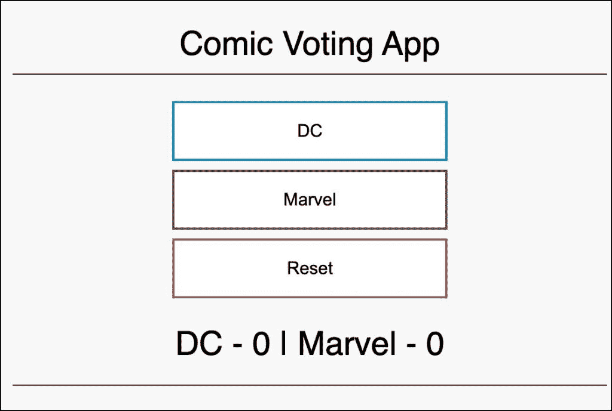

# 教程:在亚马逊 EKS 集群上部署 Acorn 应用

> 原文：<https://thenewstack.io/tutorial-deploy-acorn-apps-on-an-amazon-eks-cluster/>

[Acorn](https://acorn.io/) 是 Rancher 创始人推出的 Kubernetes [的新应用部署框架。它是开源的、简单的、轻量级的，并且是一个可移植的框架，用于在 Kubernetes 上部署和扩展微服务。](https://thenewstack.io/kubernetes-just-has-to-get-easier-for-developers/)

在 Acorn 系列的最后一部分，我们将探索如何将运行在本地开发环境中的应用程序迁移到运行在 [Amazon Web Services](https://aws.amazon.com/?utm_content=inline-mention) 云中的生产环境中。

## 步骤 1:在开发环境中交互式调试 Acorn 应用程序

假设您遵循了上一篇教程，那么您应该已经在 Minikube 中部署了 Azure vote Acorn 应用程序。



让我们在应用程序仍在运行时对其进行修改，而无需在 Kubernetes 部署中重新构建映像和更新标记。Acorn 可以轻松地迭代代码和配置更改，而不必遵循 Docker 和 Kubernetes 的传统工作流程。

首先，通过从`azure-vote `directory:``
运行下面的 Acornfile 将应用程序部署到 Minikube

```
containers:  {
"azure-vote-back":  {
image:  "mcr.microsoft.com/oss/bitnami/redis:6.0.8"
ports:  {
expose:  "azure-vote-back:6379/tcp"
}
env:  {
"ALLOW_EMPTY_PASSWORD":  "yes"
}
}
"azure-vote-front":  {
build:  "."
ports:  {
publish:  "80/http"
}
env:  {
"REDIS":  "azure-vote-back"
}

}
}

```

`-i`开关以迭代模式运行 Acorn，这在开发和测试期间很有帮助。

访问 Minikube IP，您应该会看到 Azure Vote 应用程序。

打开另一个终端窗口，修改文件`config_file.cfg`，把猫狗换成 DC 和漫威漫画。

```
# UI Configurations
TITLE  =  'Comic Voting App'
VOTE1VALUE  =  'DC'
VOTE2VALUE  =  'Marvel'
SHOWHOST  =  'false'

```

现在，触摸`Acornfile`以强制构建和部署工作流。

当您刷新浏览器时，可以看到更新后的投票。这是在没有重建容器映像和更新 Kubernetes 部署的情况下实现的。



## 步骤 2:在 AWS 中设置生产环境

为了将应用程序迁移到云中，我们需要 AWS 中的 EKS 集群和图像注册中心。图像注册表是在 Amazon 弹性容器注册表中配置的。

运行以下命令在孟买(ap-south1)地区启动一个三节点 EKS 集群。

```
eksctl create cluster  \
  --name acorn-demo-eks  \
  --region ap-south-1  \
  --version  1.22  \
  --nodegroup-name ng-workers  \
  --node-type t3.medium  \
  --nodes  3  \
  --nodes-min  3  \
  --nodes-max  6  \
  --node-ami-family Ubuntu2004  \
  --set-kubeconfig-context=true

```

安装基于 Nginx 的入口控制器，这是 Acorn 的先决条件。

```
kubectl apply  -f  https://raw.githubusercontent.com/kubernetes/ingress-nginx/controller-v1.3.0/deploy/static/provider/aws/deploy.yaml

```

让我们在 EKS 集群中安装 Acorn。

```
acorn install  \
--acorn-dns enabled  \
--ingress-class-name nginx

```

下一步是创建存储库来存储 Acorn 应用程序的容器映像。我们需要应用程序的后端和前端组件的两个存储库。

```
aws ecr create-repository  \
  --repository-name comic-frontend  \
  --region ap-south-1  \
  --no-cli-pager  \
  --image-scanning-configuration scanOnPush=true

```

```
aws ecr create-repository  \
  --repository-name comic-backend  \
  --region ap-south-1  \
  --no-cli-pager  \
  --image-scanning-configuration scanOnPush=true

```

## 步骤 3:推送图像并部署应用程序

基础架构就绪后，让我们继续将图像推送到 ECR。

让我们为定制前端 web 应用程序创建一个 Acornfile。

```
containers:  {
  "comic-frontend":  {
  build:  "."
  ports:  {
  publish:  "80/http"
  }

  }
}

```

在构建、标记和推送图像之前，让我们从 Acorn 登录到 ECR。

```
aws ecr get-login-password  --region ap-south-1  |  acorn login  --username AWS  --password-stdin ACCOUNTID.dkr.ecr.REGION.amazonaws.com

```

根据您的配置替换 AWS 帐户 id 和地区。Acorn 现在可以从 ECR 中推拉图像。

是时候构建、标记和推送图像到 Amazon ECR 了。

```
acorn build  \
-t  ACCOUNTID.dkr.ecr.REGION.amazonaws.com/comic-frontend:v1  \
--push  \
--file  ./Acornfile.comic-frontend  .

```

由于后端容器映像是预先构建的，我们只需要标记并推送它。

```
acorn pull mcr.microsoft.com/oss/bitnami/redis:6.0.8

```

```
acorn tag mcr.microsoft.com/oss/bitnami/redis:6.0.8  ACCOUNTID.dkr.ecr.REGION.amazonaws.com/comic-backend:v1

```

```
acorn push ACCOUNTID.dkr.ecr.REGION.amazonaws.com/comic-backend:v1

```

验证两个图像都被正确推送。

最后，用下面的内容创建一个新的`Acornfile.eks`来运行生产中的应用:

```
containers:  {
  "comic-backend":  {
  image:  "ACCOUNTID.dkr.ecr.REGION.amazonaws.com/comic-backend:v1"
  ports:  {
  expose:  "comic-backend:6379/tcp"
  }
  env:  {
  "ALLOW_EMPTY_PASSWORD":  "yes"
  }
  }
  "comic-frontend":  {
  image:  "ACCOUNTID.dkr.ecr.REGION.amazonaws.com/comic-frontend:v1"
  ports:  {
  publish:  "80/http"
  }
  env:  {
  "REDIS":  "comic-backend"
  }
  dependsOn:  [
 "comic-backend"
 ]

  }
}

```

```
acorn run  -n  comic  -f  Acornfile.eks  .

```

 `$ acorn apps
NAME IMAGE HEALTHY UP-TO-DATE CREATED ENDPOINTS MESSAGE
comic d79f1a5a0e1b 2 2 25s ago http://PENDING_INGRESS => comic-frontend:80 OK` 

等待入口与应用程序连接并点击 URL。您应该会看到在 AWS 中运行的 comic vote 应用程序。

在本教程中，我们探索了将 Acorn 应用程序从开发环境转移到生产环境的工作流程。

<svg xmlns:xlink="http://www.w3.org/1999/xlink" viewBox="0 0 68 31" version="1.1"><title>Group</title> <desc>Created with Sketch.</desc></svg>