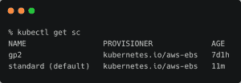
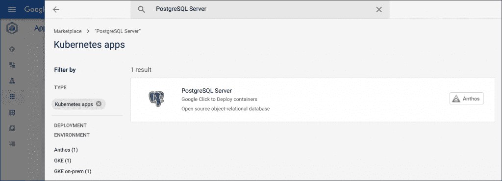
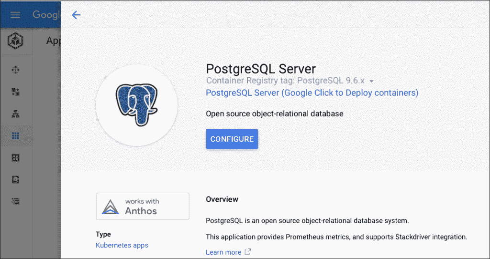
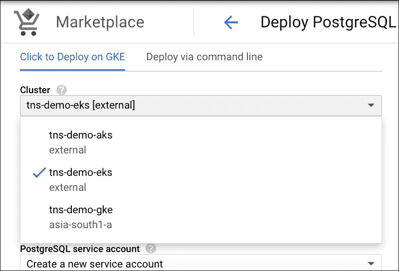
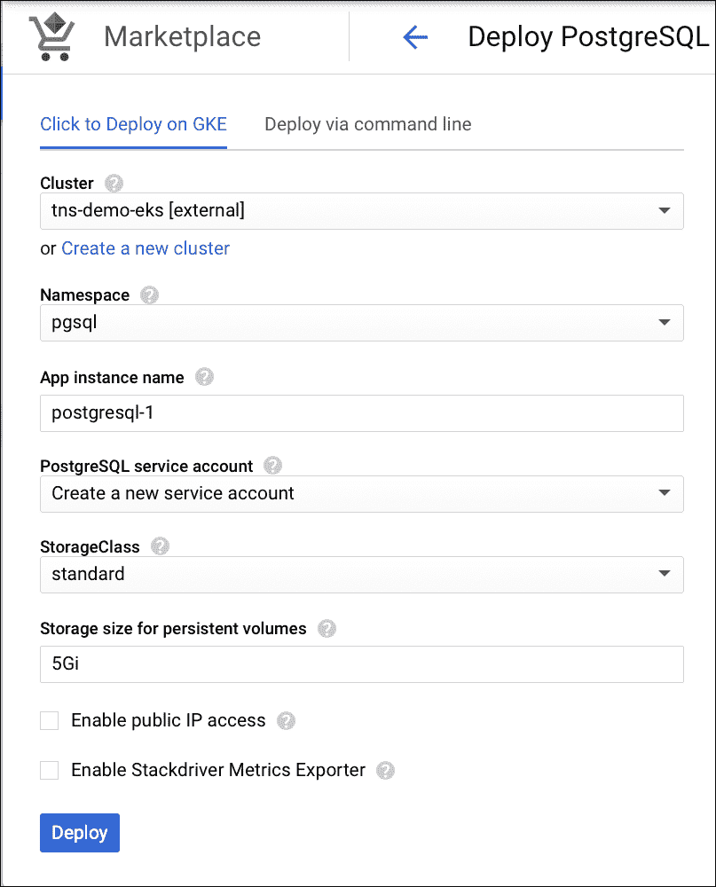
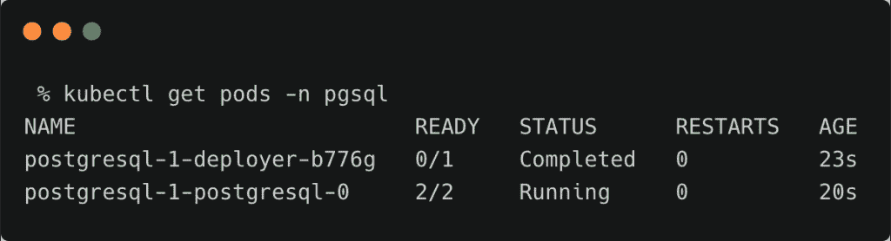
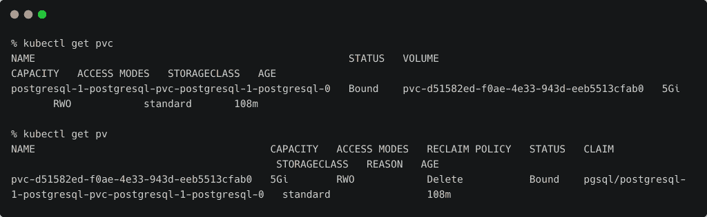
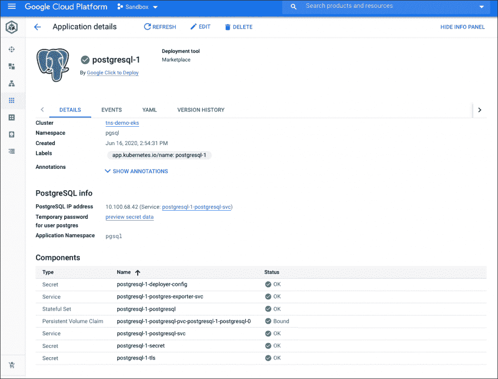
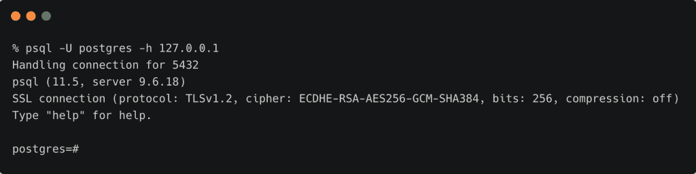

# 教程:将 Anthos 应用程序从 GCP 市场部署到亚马逊 EKS 集群

> 原文：<https://thenewstack.io/tutorial-deploy-anthos-apps-from-gcp-marketplace-into-amazon-eks-cluster/>

在 [Anthos 系列](https://thenewstack.io/tutorial-gitops-in-multicluster-environments-with-anthos-config-management/)的最后一部分，我们将配置一个[亚马逊 Web 服务的](https://aws.amazon.com/) [弹性 Kubernetes 服务](https://aws.amazon.com/eks/)集群，注册到 [Google 的](https://cloud.google.com/) s [Anthos](https://cloud.google.com/anthos) 来部署来自 [GCP 市场](https://cloud.google.com/marketplace)的 Kubernetes 应用。

让我们直接进入…

## 为 GCP 市场应用程序准备亚马逊 EKS

类似于 Anthos Hub 和 Anthos 配置管理使用的 ***gke-connect*** 和***Config-Management-system***名称空间，Anthos 期望一个名为***application-system***的名称空间，它将运行代理来安装来自 GCP 市场的应用程序。

我们需要创建至少两个名称空间，并使它们能够从与市场相关联的 Google 容器注册中心(GCR)中提取容器图像。

让我们创建第一个名称空间。切换到 EKS 上下文以确保 ***kubectl*** 指向正确的集群。

```
kubectl create ns application-system

```

使用 ***kubens*** 实用程序修改上下文以指向名称空间。

```
kubens application-system

```

为了从 GCR 获取图像，我们需要创建一个服务帐户并下载相关的 JSON 令牌。

运行以下命令，创建有权获取 GCR 映像和下载生成的 JSON 令牌的服务帐户。

确保将项目环境变量设置为您的 GCP 项目名称。

```
PROJECT=""

gcloud iam service-accounts create gcr-sa  \
  --project=${PROJECT}

gcloud iam service-accounts list  \
  --project=${PROJECT}

gcloud  projects  add-iam-policy-binding  ${PROJECT}  \
  --member="serviceAccount:gcr-sa@${PROJECT}.iam.gserviceaccount.com"  \
  --role="roles/storage.objectViewer"

gcloud iam service-accounts keys create  ./gcr-sa.json  \
  --iam-account="gcr-sa@${PROJECT}.iam.gserviceaccount.com"  \
  --project=${PROJECT}

```

有了 JSON 令牌，让我们用令牌的内容创建一个秘密。

```
kubectl create secret docker-registry gcr-json-key  \
--docker-server=https://marketplace.gcr.io \
--docker-username=_json_key  \
--docker-password="$(cat ./gcr-sa.json)"  \
--docker-email=user@email.com

```

我们需要给名称空间内的 ***默认*** 服务账号打补丁，使用 secret 从 GCR 而不是 Docker Hub 拉图片。

```
kubectl patch serviceaccount default  -p  '{"imagePullSecrets": [{"name": "gcr-json-key"}]}'

```

最后，让我们注释一下 ***应用系统*** 名称空间，以便能够部署来自 GCP 市场的 Kubernetes 应用程序。

```
kubectl annotate namespace application-system marketplace.cloud.google.com/imagePullSecret=gcr-json-key

```

这些步骤创建了一个新的名称空间，并将其用于 GCP 市场。

## 更改存储类别

GCP 市场希望默认存储类别为“按名称分类标准”。

让我们首先通过修补从 ***gp2*** 存储类中删除默认标志。

```
kubectl patch storageclass gp2  -p  '{"metadata": {"annotations":{"storageclass.kubernetes.io/is-default-class":"false"}}}'

```

我们现在将创建一个基于 Amazon EBS 的新存储类，并将其标记为默认存储类。

```
kind:  StorageClass
apiVersion:  storage.k8s.io/v1
metadata:
  name:  standard
  annotations:
    storageclass.kubernetes.io/is-default-class:  "true"
provisioner:  kubernetes.io/aws-ebs
parameters:
  type:  gp2
  fsType:  ext4  

```

```
kubectl create  -f  eks-sc.yaml

```

您可以看到，标准存储类现在是默认存储类。这将被 GCP 市场应用程序用来动态提供永久卷(PV)和永久卷声明(PVC)。



## 为 GCP 市场应用程序创建和配置命名空间

上述名称空间运行 marketplace 应用程序安装代理，而我们创建的新名称空间将由工作负载使用。

我们将遵循用于配置 ***应用系统*** 名称空间的相同步骤，但是在容器注册中心端点上稍有变化。

```
kubectl create secret docker-registry gcr-json-key  \
  --docker-server=https://gcr.io \
--docker-username=_json_key  \
--docker-password="$(cat ./gcr-sa.json)"  \
--docker-email=user@email.com

```

注意 docker-server 键指向 https://gcr.io，它保存了 GCP 市场应用程序的容器图像。

与其他名称空间类似，我们需要修补 ***pgsql*** 名称空间中的 ***默认*** 服务帐户，以使用 secret 从 GCR 而不是 Docker Hub 中提取图像。

```
kubectl patch serviceaccount default  -p  '{"imagePullSecrets": [{"name": "gcr-json-key"}]}'

```

最后，让我们注释一下 ***pgsql*** 名称空间，以便能够部署来自 GCP 市场的 Kubernetes 应用程序。

```
kubectl annotate namespace pgsql marketplace.cloud.google.com/imagePullSecret=gcr-json-key

```

## 从 GCP 市场部署应用程序

访问 GCP 市场并搜索 PostgreSQL Server。

[](https://thenewstack.io/tutorial-deploy-anthos-apps-from-gcp-marketplace-into-amazon-eks-cluster/gcpm-1/)

单击“配置”按钮开始部署过程。

[](https://thenewstack.io/tutorial-deploy-anthos-apps-from-gcp-marketplace-into-amazon-eks-cluster/gcpm-2/)

从群集下拉列表中选择亚马逊 EKS 群集。



选择 ***pgsql*** 名称空间和标准存储类。单击部署按钮。



几秒钟后，PostgreSQL pod 将在亚马逊 EKS 集群的 ***pgsql*** 名称空间中启动并运行。



因为它是一个有状态的集合，所以还会创建一个关联的 PV 和 PVC。



GCP 控制台显示部署组件。



您可以通过运行以下命令连接到 PgSQL 实例:

```
export NAMESPACE=pgsql
export APP_INSTANCE_NAME="postgresql-1"
export PGPASSWORD=$(kubectl get secret  "postgresql-1-secret"  \
  --output=jsonpath='{.data.password}'  |  base64  -d)

```

```
kubectl port-forward  \
  --namespace  "${NAMESPACE}"  \
  "${APP_INSTANCE_NAME}-postgresql-0"  5432  &amp;

```

```
psql  -U  postgres  -h  127.0.0.1

```



删除 Marketplace 中的应用程序将删除 ***x*** 名称空间中的所有对象。

概括地说，我们现在通过 Anthos 从 GCP 市场访问部署在亚马逊 EKS 的 pod 中运行的 PgSQL。

关于 Anthos 的 4 部分系列到此结束。您可以在此 [MI2 网络研讨会记录](https://youtu.be/odF482gmb7g)中观看本系列涵盖的所有演示。

*贾纳基拉姆·MSV 的网络研讨会系列“机器智能和现代基础设施(MI2)”提供了涵盖前沿技术的信息丰富、见解深刻的会议。请在 http://mi2.live 注册参加即将举行的 MI2 网络研讨会*

亚马逊网络服务是新堆栈的赞助商。

目前，新堆栈不允许直接在该网站上发表评论。我们邀请所有希望讨论某个故事的读者通过推特或脸书与我们联系。我们也欢迎您通过电子邮件发送新闻提示和反馈:[feedback @ thenewstack . io](mailto:feedback@thenewstack.io)。

<svg xmlns:xlink="http://www.w3.org/1999/xlink" viewBox="0 0 68 31" version="1.1"><title>Group</title> <desc>Created with Sketch.</desc></svg>