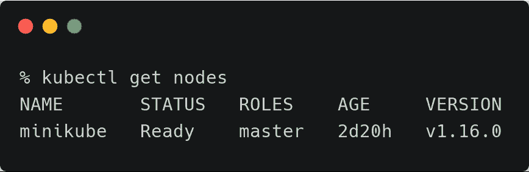
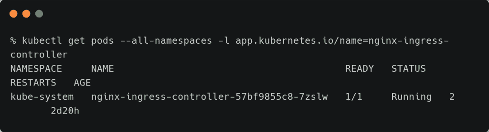
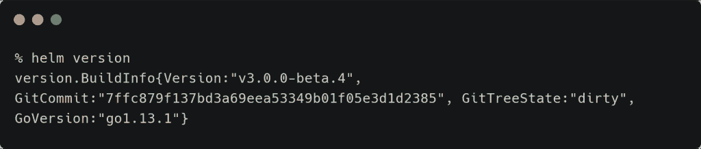
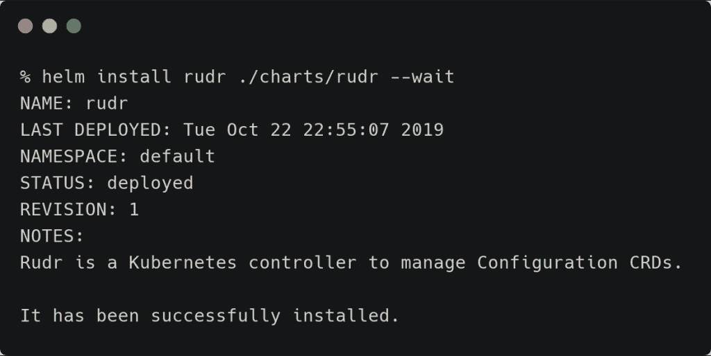
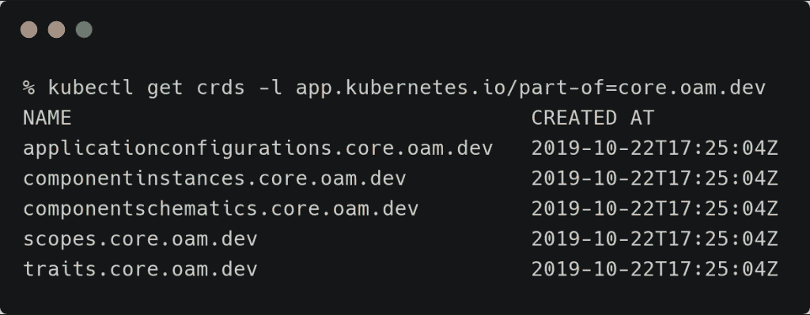
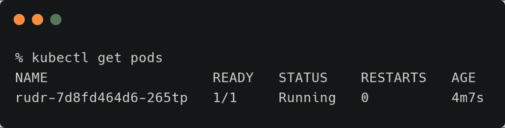
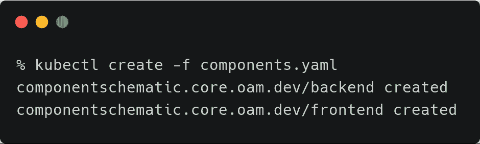
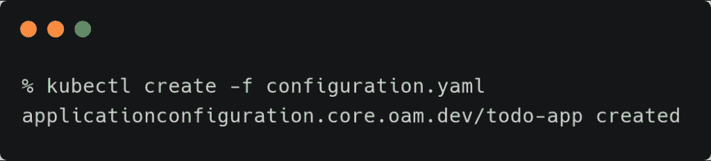
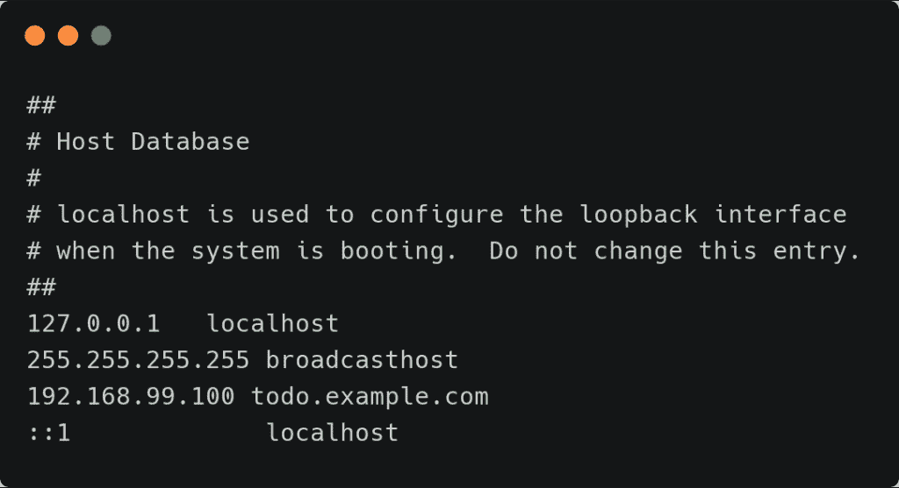
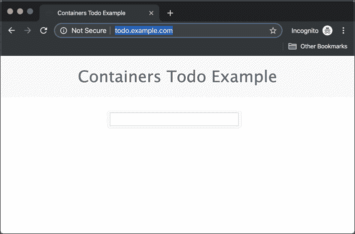

# 教程:通过 Rudr 在 Kubernetes 上部署微服务

> 原文：<https://thenewstack.io/tutorial-deploy-microservices-on-kubernetes-through-rudr/>

[开放应用模型](https://openappmodel.io/) (OAM)规范定义了如何将现代应用组合成[微服务](https://thenewstack.io/category/microservices/)。上周推出的 [Rudr](https://github.com/oam-dev/rudr/) 是微软[针对 Kubernetes](/what-does-the-open-application-model-oam-and-rudr-mean-for-kubernetes-developers/) 的 OAM 参考实现。

面向 Rudr 的应用程序有三个元素:组件、配置和特征:

*   **组件**定义一个或多个针对操作系统的容器映像及其硬件要求，如 CPU、RAM 和存储。
*   **配置**处理运行时参数，如环境变量。
*   **特征**声明运行时属性，如卷、入口和缩放。

在本教程中，我们将通过将现有的应用程序映射到 OAM 规范来探索 Rudr 的概念。我们将采用一个现有的容器化 web 应用程序，为 Rudr 建模，并将其部署在 Minikube 中运行的 Kubernetes 上。Rudr 是 Kubernetes CRDs 的集合，它将 OAM 工件映射到 Kubernetes 对象。确保您的机器上安装了 [kubectl](https://kubernetes.io/docs/tasks/tools/install-kubectl/) 。

您可以从这个 [GitHub 存储库](https://github.com/janakiramm/todo-app)上可用的源代码构建容器。但是你可以通过使用我已经推送到 Docker Hub 的公共图片来尝试这个教程。



基于 node.js 的 web 应用程序和 MongoDB 容器映像是我们部署的组件。作为环境变量发送的 MongoDB 连接字符串构成了简单的配置。最后，我们将把 ingress 配置为一个特性。

在继续之前，在 Minikube 上安装 Ingress 插件。

```
minikube addons enable ingress

```

```
kubectl get pods  --all-namespaces  -l  app.kubernetes.io/name=nginx-ingress-controller

```



### **安装方向舵**

我们将开始部署舵舵图表。下载 [Helm3](https://github.com/helm/helm/releases) 的最新测试版，添加到路径中。注意，Helm3 没有 Tiller 作为服务器运行。



克隆有舵图的舵报告并安装它。



```
helm install rudr  ./charts/rudr  --wait

```

您可以通过检查 CRDs 和 Pod 来验证安装。

```
kubectl get crds  -l  app.kubernetes.io/part-of=core.oam.dev

```



```
kubectl get deployment rudr

```

### 
**声明 Rudr App 工件**

我们现在将从 MongoDB 容器映像和 web 容器映像创建两个组件的定义。node.js 容器映像是一个基于 Express 框架的简单 todo 应用程序，它将任务存储在 MongoDB 中。

让我们称这些组件为后端和前端。

```
apiVersion:  core.oam.dev/v1alpha1
kind:  ComponentSchematic
metadata:
  name:  backend
  annotations:
    version:  "1.0.0"
    description:  Mongodb Database
spec:
  workloadType:  core.oam.dev/v1alpha1.SingletonServer
  containers:
    -  name:  backend
      ports:
        -  containerPort:  27017
          name:  mongo
      image:  mongo
---
apiVersion:  core.oam.dev/v1alpha1
kind:  ComponentSchematic
metadata:
  name:  frontend
  annotations:
    version:  "1.0.0"
    description:  Node.js Web Server
spec:
  workloadType:  core.oam.dev/v1alpha1.Server
  parameters:
    -  name:  database
      type:  string
      required:  false  
  containers:
    -  name:  frontend
      ports:
        -  containerPort:  3000
          name:  http
      image:  janakiramm/todo:v1
      env:
        -  name:  DB
          value:  db
          fromParam:  database

```

关于上述定义，第一个有趣的方面是工作负载类型。由于两者都是监听特定端口的长期运行的进程，所以它们被定义为**服务器**。但是 MongoDB 容器总是作为单个 Pod 运行，翻译过来就是 SingletonServer。

node.js web 应用程序检查环境变量 db，如果发现该变量为空，将使用字符串“DB”填充。web app 声明包含 parameters 部分，后跟检索数据库参数中定义的值的 **env** 部分。

两个组件都有声明中提到的端口。

这个工件应该由开发人员创建，作为构建过程的一部分。

一旦**组件示意图**就位，我们将定义配置和特征。

```
apiVersion:  core.oam.dev/v1alpha1
kind:  ApplicationConfiguration
metadata:
  name:  todo-app
spec:
  components:
    -  name:  backend
      instanceName:  mongo    
    -  name:  frontend
      instanceName:  fe
      parameterValues:
        -  name:  database
          value:  mongo
      traits:
        -  name:  ingress
          parameterValues:
            -  name:  hostname
              value:  todo.example.com
            -  name:  service_port
              value:  3000
            -  name:  path
              value:  /      

```

上面的配置做了两件重要的事情——为每个组件定义实例名，并设置 web 应用程序期望的环境变量。接下来，它定义了访问 web 应用程序的入口规则。

是时候部署组件、配置和特征了。

```
kubectl create  -f  components.yaml  

```


此操作不会导致 Kubernetes 豆荚的创建。只有当与组件相关联的 Rudr 配置被部署时，部署才会发生。

让我们将配置提交给 Kubernetes。

```
kubectl create  -f  configuration.yaml

```


吊舱现在将被展开。默认的名称空间有三个单元——rudr、前端和后端。


由于配置具有入口的定义，属于 web 应用的 pod 和服务与入口相关联。


要通过入口从浏览器访问 web 应用程序，请将 Minikube 的 IP 地址添加到/etc/hosts 文件中。



我们现在可以通过访问 todo.example.com 的网址来访问这个应用程序了。



*贾纳基拉姆·MSV 的网络研讨会系列“机器智能和现代基础设施(MI2)”提供了涵盖前沿技术的信息丰富、见解深刻的会议。在 [http://mi2.live](http://mi2.live/) 注册参加即将举行的 MI2 网络研讨会。*

<svg xmlns:xlink="http://www.w3.org/1999/xlink" viewBox="0 0 68 31" version="1.1"><title>Group</title> <desc>Created with Sketch.</desc></svg>