# 教程:在运行 OpenEBS 存储引擎的 Kubernetes 上部署 PostgreSQL

> 原文：<https://thenewstack.io/tutorial-deploy-postgresql-on-kubernetes-running-the-openebs-storage-engine/>

在[这个系列](/how-openebs-brings-container-attached-storage-to-kubernetes/)的[最后一部分](/tutorial-install-and-configure-openebs-on-amazon-elastic-kubernetes-service/)中，我讲述了在亚马逊弹性 Kubernetes 服务([亚马逊 EKS](https://aws.amazon.com/eks/) )上安装 [OpenEBS](https://openebs.io/) 的步骤。在本教程中，我们将部署一个高可用性的 PostgreSQL 实例。

## 为 PostgreSQL 创建存储类

我们将首先基于在上一个教程中配置的存储池声明创建一个存储类。

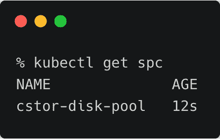

```
apiVersion:  storage.k8s.io/v1
kind:  StorageClass
metadata:
  name:  cstor-sc
  annotations:
    openebs.io/cas-type:  cstor
    cas.openebs.io/config:  |
      -  name:  StoragePoolClaim
        value:  "cstor-disk-pool"
      -  name:  ReplicaCount
        value:  "3"
provisioner:  openebs.io/provisioner-iscsi

```

replica count 键将确保数据跨三个节点写入，以增加冗余。

```
kubectl apply  -f  cstor-sc.yaml  

```

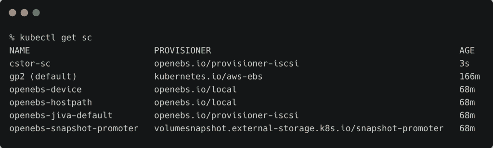

### 通过舵图部署 PostgreSQL

我们现在将部署由 OpenEBS 支持的 PostgreSQL。通过将**persistence . storage class**指向上一步中创建的 cStor 存储类，部署将动态创建一个持久卷(PV)和持久卷声明(PVC)

```
helm install demo stable/postgresql  \
--set persistence.storageClass=cstor-sc

```

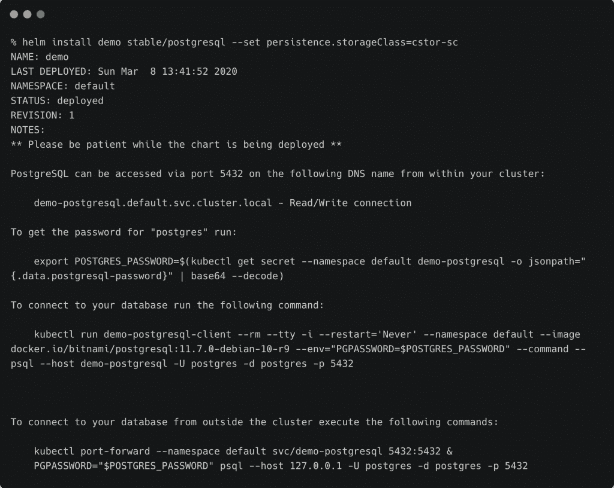

让我们验证与部署相关的 Pod、PVC 和 PV。

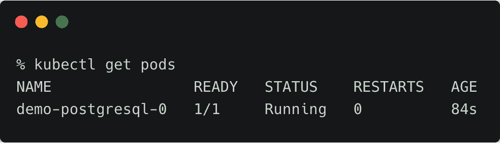

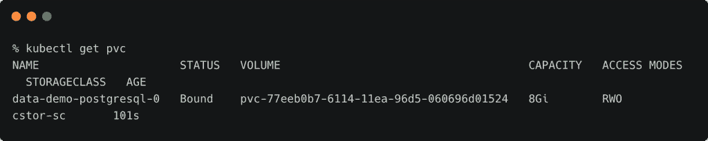

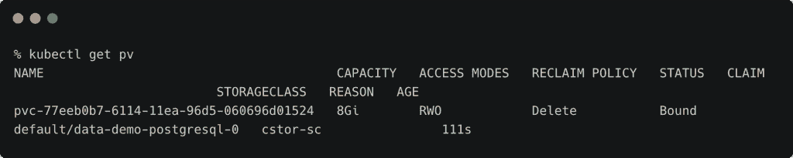

### 创建测试数据

访问 PgSQL 客户端，创建一个测试数据库，表，并添加一行。

首先，让我们从部署中检索密码。

```
export POSTGRES_PASSWORD=$(kubectl get secret  --namespace default demo-postgresql  -o  jsonpath="{.data.postgresql-password}"  |  base64  --decode)

```

```
kubectl run pgsql-postgresql-client  --rm  --tty  -i  --restart='Never'  --namespace default  --image docker.io/bitnami/postgresql:11.7.0-debian-10-r9  --env="PGPASSWORD=$POSTGRES_PASSWORD"  --command  --  psql testdb  --host demo-postgresql  -U  postgres  -d  postgres  -p  5432

```

【T2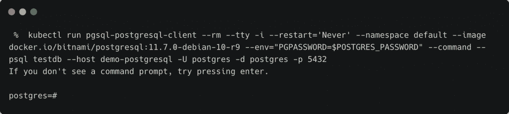

```
CREATE DATABASE inventory;

```

```
CREATE TABLE products  (
    product_no integer,
    name text,
    price numeric
);

```

插入产品值(1，'奶酪'，9.99)；

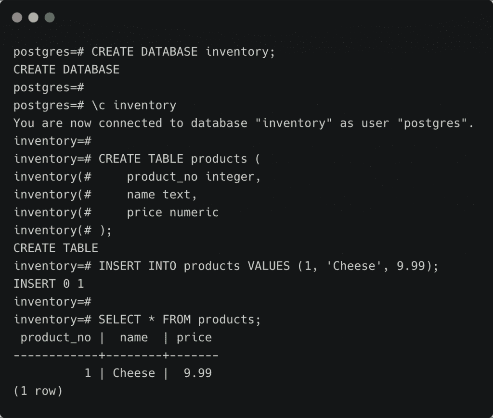

### 模拟节点故障

让我们找到运行 PostgreSQL 数据库 Pod 的节点并将其隔离，这将防止在其上安排新的 Pod。

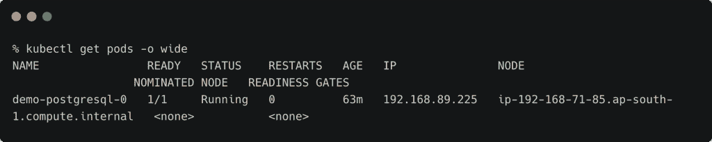

```
  kubectl cordon ip-192-168-71-85.ap-south-1.compute.internal

```

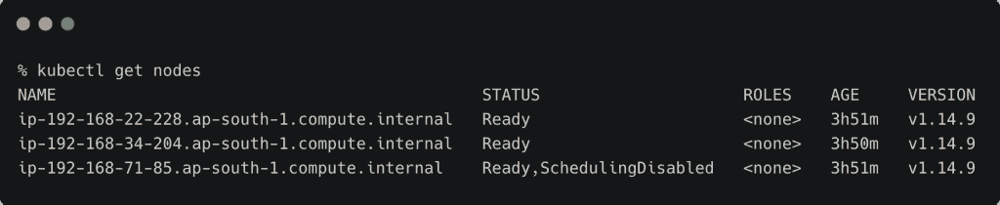
最后，我们将删除运行在警戒线节点上的 Pod。

```
kubectl delete pod demo-postgresql-0

```

### 验证新 Pod 中的数据

一旦 Pod 被删除，Kubernetes 控制器将创建一个新的 Pod，并将其安排在不同的节点中。它不能放在同一个节点上，因为在封锁它之后计划被禁用。

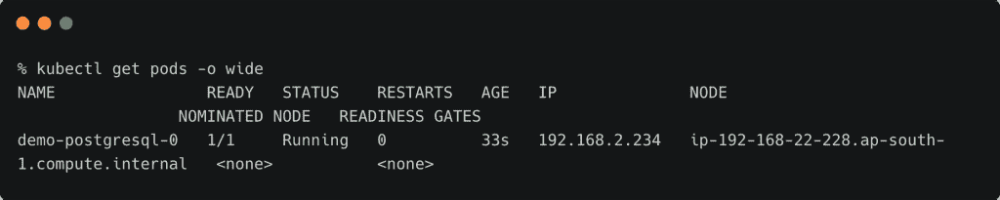

即使 PVC 的访问模式为 ReadWriteOnce，由特定节点装载以进行读写访问，Pod 也能够通过 cStor 存储池将同一 PVC 作为目标，cStor 存储池将底层 EBS 卷抽象为单个存储层。

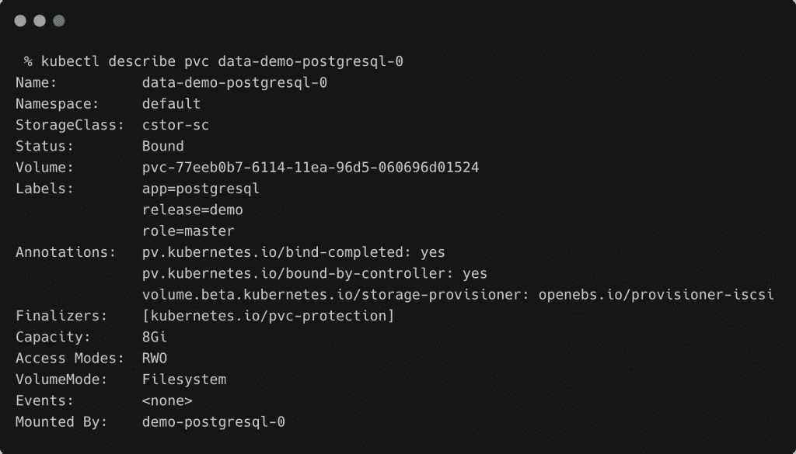

现在，让我们连接到新的 Pod 并检查数据是否完好无损。

```
kubectl run pgsql-postgresql-client  --rm  --tty  -i  --restart='Never'  --namespace default  --image docker.io/bitnami/postgresql:11.7.0-debian-10-r9  --env="PGPASSWORD=$POSTGRES_PASSWORD"  --command  --  psql testdb  --host demo-postgresql  -U  postgres  -d  postgres  -p  5432

```

```
\c  inventory
select *  from products;

```


即使在删除 Pod 并在不同的节点上重新计划之后，数据也是完整的。这证实了 OpenEBS 的复制因子工作正常。

在本系列的下一部分中，我们将了解如何拍摄卷快照和备份工作负载的状态。敬请期待！

贾纳奇拉姆·MSV 的网络研讨会系列“机器智能和现代基础设施(MI2)”提供了涵盖前沿技术的信息丰富、见解深刻的会议。在 http://mi2.live .上注册参加即将举行的 MI2 网络研讨会

<svg xmlns:xlink="http://www.w3.org/1999/xlink" viewBox="0 0 68 31" version="1.1"><title>Group</title> <desc>Created with Sketch.</desc></svg>