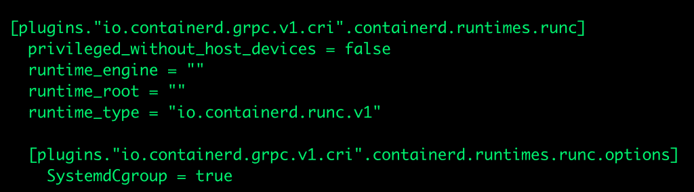
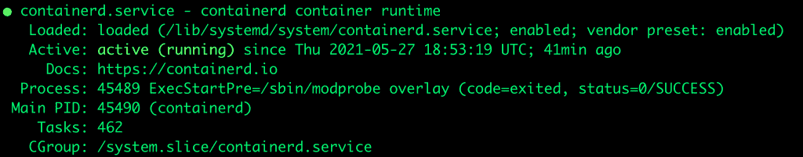
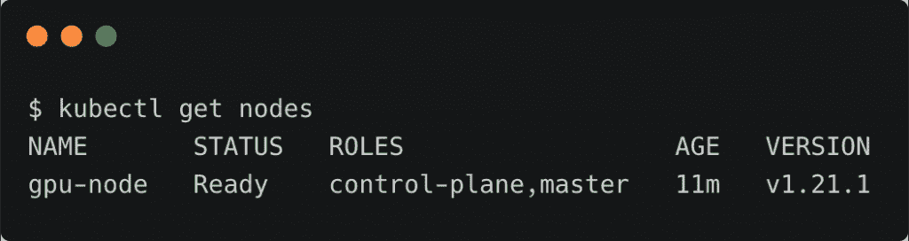
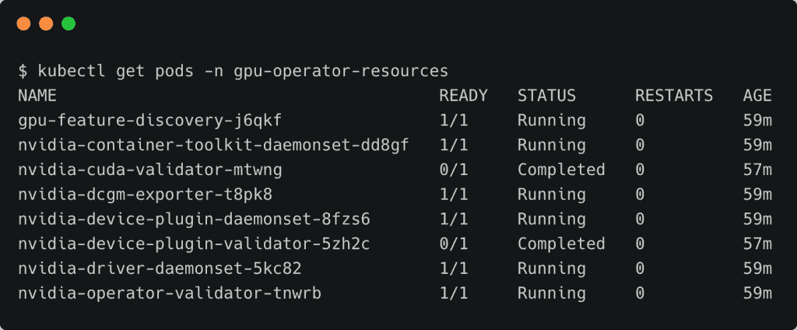

# 教程:基于 containerd 运行时在 Kubernetes 上部署 Nvidia GPU 操作符

> 原文：<https://thenewstack.io/tutorial-deploy-the-nvidia-gpu-operator-on-kubernetes-based-on-containerd-runtime/>

本教程将探索在 Kubernetes 集群上安装 [Nvidia GPU Operator](https://docs.nvidia.com/datacenter/cloud-native/gpu-operator/getting-started.html#) 的步骤，该集群具有基于 [containerd](https://containerd.io) 运行时而不是 Docker 引擎的 GPU 主机。

在典型的基于 GPU 的 Kubernetes 安装中，每个节点都需要配置正确版本的 Nvidia 图形驱动程序、CUDA 运行时和 cuDNN 库，然后是容器运行时，如 Docker Engine、containerd、podman 或 CRI-O。然后，部署 Nvidia 容器工具包，以提供对容器化应用程序的 GPU 访问。最后，安装 Kubernetes，它将与选择的容器运行时交互，以管理工作负载的生命周期。

Nvidia GPU Operator 极大地简化了这一过程，无需安装驱动程序、CUDA 运行时、cuDNN 库或容器工具包。它可以安装在任何满足特定硬件和软件需求的 Kubernetes 集群上。

下面是安装 containerd、Kubernetes 和 Nvidia GPU Operator 的步骤。在安装接近尾声时，我们将通过在 pod 中运行流行的`nvidia-smi`命令来测试 GPU 访问。

### 环境

操作系统: [Ubuntu 18.04 LTS 服务器](https://releases.ubuntu.com/18.04/)
GPU:Nvidia[GeForce RTX 3090](https://www.nvidia.com/en-in/geforce/graphics-cards/30-series/rtx-3090/)
CPU:AMD 锐龙 ThreadRipper 3990 x
RAM:128 GB
HDD:4TB NVMe SSD

## 步骤 1:安装 Containerd 运行时

加载所需的模块，并确保它们在重新启动期间保持不变。

```
sudo modprobe overlay
sudo modprobe br_netfilter
cat  &lt;

```

在不重启系统的情况下加载 sysctl 参数。

最后，安装 containerd 运行时。

```
sudo apt-get update
sudo apt-get install  -y  containerd

```

让我们创建默认的容器配置文件。

```
sudo mkdir  -p  /etc/containerd
sudo containerd config default  |  sudo tee  /etc/containerd/config.toml

```

将 runc 的 cgroup 驱动程序设置为 systemd，这是 kubelet 所必需的。

在`[plugins."io.containerd.grpc.v1.cri".containerd.runtimes.runc]`部分中，添加以下行:

```
[plugins."io.containerd.grpc.v1.cri".containerd.runtimes.runc.options]
            SystemdCgroup  =  true

```

你的`config.toml`应该是这样的:



用新的配置重新启动 containerd。

```
sudo systemctl restart containerd

```

检查 containerd 运行时的状态。

```
systemctl status containerd

```



## 步骤 2:安装 Kubernetes 1.21

从禁用交换内存开始。

```
sudo swapoff  -a
sudo sed  -i  '/ swap / s/^\(.*\)$/#\1/g'  /etc/fstab

```

安装所需工具。

```
sudo apt-get update
sudo apt-get install  -y  apt-transport-https
curl  -s  https://packages.cloud.google.com/apt/doc/apt-key.gpg | sudo apt-key add -
echo  "deb http://apt.kubernetes.io/ kubernetes-xenial main"  |  sudo tee  -a  /etc/apt/sources.list.d/kubernetes.list
sudo apt-get update sudo apt install  -y  kubeadm kubelet kubernetes-cni

```

让我们初始化控制平面。

```
sudo kubeadm init  --pod-network-cidr=10.244.0.0/16  --apiserver-advertise-address=10.0.0.54

```

确保将 IP 地址 10.0.0.54 替换为您主机的适当地址。

是时候配置`kubectl` CLI 了。

```
mkdir  $HOME/.kube
sudo cp  /etc/kubernetes/admin.conf  $HOME/.kube/
sudo chown  $(id  -u):$(id  -g)  $HOME/.kube/admin.conf
export KUBECONFIG=$HOME/.kube/admin.conf
echo  "export KUBECONFIG=$HOME/.kube/admin.conf"  |  tee  -a  ~/.bashrc

```

在我们访问集群之前，我们需要安装 CNI 插件。在本教程中，我们使用来自 Weave Works 的[编织网](https://www.weave.works/oss/net/)。

```
kubectl apply  -f  "https://cloud.weave.works/k8s/net?k8s-version=$(kubectl version | base64 | tr -d '\n')"

```

因为我们只有一个节点，所以让我们去掉污点来实现调度。

```
kubectl taint nodes  --all node-role.kubernetes.io/master-

```

最后，检查集群的状态。



### 步骤 3–安装 Nvidia GPU Operator

首先安装 Helm3 的二进制文件。

```
curl  -fsSL  -o  get_helm.sh https://raw.githubusercontent.com/helm/helm/master/scripts/get-helm-3 
chmod  700  get_helm.sh
./get_helm.sh

```

添加 Nvidia Helm 存储库。

```
helm repo add nvidia https://nvidia.github.io/gpu-operator
helm repo update

```

因为我们正在使用 containerd 运行时，所以让我们把它设置为缺省值。

```
helm install  --wait  --generate-name  \
 nvidia/gpu-operator  \
 --set operator.defaultRuntime=containerd

```

几分钟后，您应该会看到`gpu-operator-resources`名称空间中的 pod 正在运行。

```
kubectl get pods  -n  gpu-operator-resources

```



是时候从 pod 测试 GPU 访问了。运行以下命令启动测试盒。

```
kubectl run gpu-test  \
 --rm  -t  -i  \
 --restart=Never  \
 --image=nvcr.io/nvidia/cuda:10.1-base-ubuntu18.04  nvidia-smi

```


恭喜你！在不到 10 分钟的时间里，我们基于由 GPU 支持的 containerd 配置了一个 Kubernetes 集群。

<svg xmlns:xlink="http://www.w3.org/1999/xlink" viewBox="0 0 68 31" version="1.1"><title>Group</title> <desc>Created with Sketch.</desc></svg>