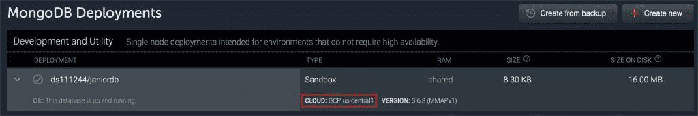
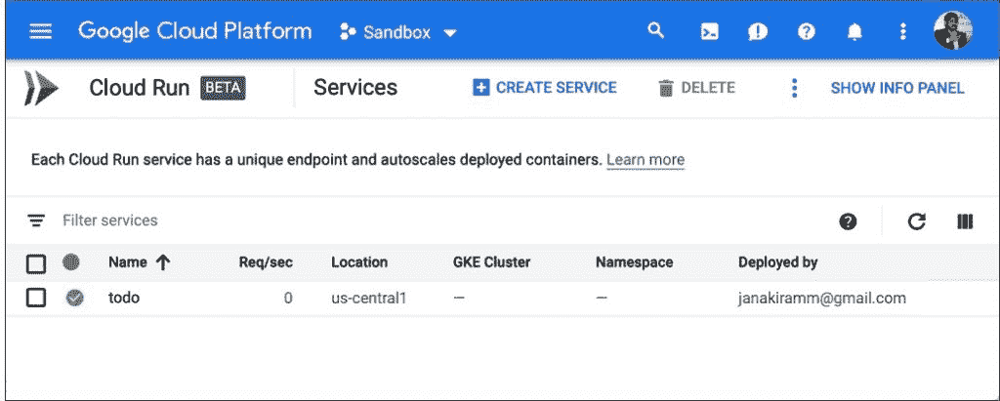
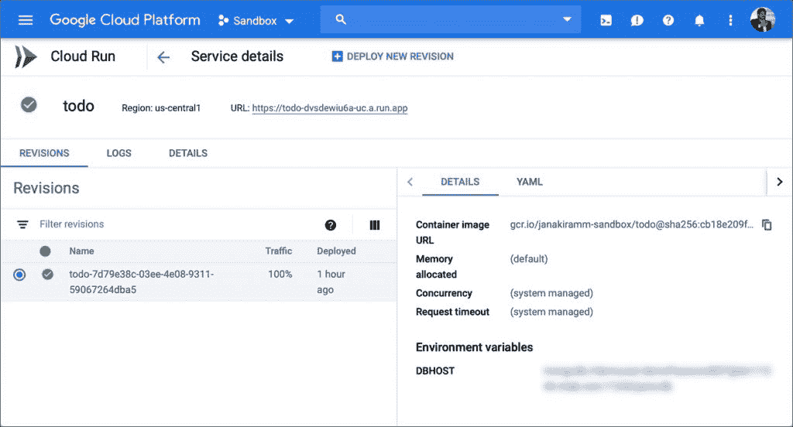
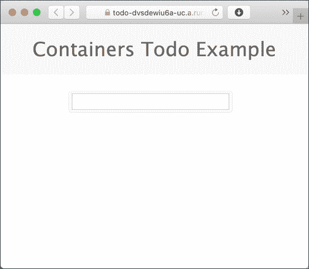

# 教程:在 Google Cloud Run 上部署 Web 应用程序

> 原文：<https://thenewstack.io/tutorial-deploying-a-web-application-on-google-cloud-run/>

[Google Cloud Run](https://thenewstack.io/comparison-aws-fargate-vs-google-cloud-run-vs-azure-container-instances/) 是一个运行容器的无服务器环境。关于这个最新的谷歌云平台(GCP)服务的背景和上下文，请参考我的[以前的文章](https://thenewstack.io/how-google-cloud-run-combines-serverless-with-containers/)。

在本教程中，我们将部署一个基于 Node.js 和 MongoDB 的 web 应用到云运行平台。由于云运行意味着托管和扩展无状态的 web 应用程序，我们将使用 [mLab 服务](http://mlab.com)来持久化数据。由于 mLab 和 Cloud Run 都是无服务器的，我们只需要关注代码和业务逻辑，而不用担心基础设施。

这个工作流包括两个步骤:提供一个 mLAB Mongo 数据库实例，并将代码部署到云运行。本教程假设您在 Google Cloud Platform 上拥有一个活动帐户，并且在开发机器上安装了 CLI 和 SDK。您还需要 Docker Desktop 在本地构建映像。

## 步骤 1:配置 mLab MongoDB 实例

mLab 提供托管的 MongoDB 数据库作为服务。它有一个名为 Sandbox 的免费计划，提供 500MB 的存储空间来运行数据库实例进行开发和测试。它是一个运行在共享虚拟机上的共享数据库服务器进程，对于我们的原型来说已经足够好了。

mLab 实例可以部署在包括 GCP 在内的多个云平台中。参考[文档](https://docs.mlab.com)中关于在 GCP 创建数据库的内容。确保在美国中部 1 (lowa)地区启动实例。这是我们将部署 web 应用程序的同一个区域。由于两种服务都在同一区域运行，因此延迟最小。

下面是我为本教程启动的 mLab 数据库服务的截图。确保您的实例看起来相似。准备好下一步需要的连接字符串。



## 步骤 2:构建和部署云运行服务

首先克隆拥有 sample MEAN web 应用程序的 Github repo 。然后，我们将建立一个 Docker 图像，并把它推到谷歌容器注册(GCR)。

导航到 repo 的根目录以找到 Dockerfile 文件。我们将使用它在本地构建映像。

运行以下命令来设置环境。这将初始化构建和部署服务所需的所有变量。确保用适当的值替换占位符。

```
PROJECT_ID='GCP project id'
REGION_ID='us-central1'
IMAGE='todo:v1'
CLOUD_RUN_SVC="todo"
DB_HOST='mLAB connection string'

gcloud components install beta
gcloud components update
gcloud config set run/region  $REGION_ID
gcloud auth configure-docker
gcloud components install docker-credential-gcr

```

上述命令安装云运行 CLI，然后使用 Google 容器注册凭证配置本地 Docker 环境。

是时候让我们建造集装箱并把它推到 GCR 了。

```
docker build  .  --tag gcr.io/$PROJECT_ID/$IMAGE
docker push gcr.io/$PROJECT_ID/$IMAGE

```

通过运行以下命令验证该映像在 GCR 可用:

```
gcloud container images list

```

准备好数据库和容器映像后，让我们继续部署 web 应用程序。

```
gcloud beta run deploy  $CLOUD_RUN_SVC  \
  --image gcr.io/$PROJECT_ID/$IMAGE  \
  --allow-unauthenticated  \
  --update-env-vars DBHOST=$DB_HOST

```

交换机*–allow-unauthenticated*，将让服务接受来自公共互联网的流量。注意，我们将由 mLab 生成的 MongoDB 连接字符串作为环境变量进行传递。代码需要 DBHOST 环境变量中的连接字符串。

您可以使用下面的命令检索正在运行的服务:

```
gcloud beta run services list

```

您还可以从 GCP 控制台浏览服务配置。





单击 URL 会将我们带到 web 应用程序。



云运行服务也可以部署在现有的 GKE 集群上。它们就像典型的 Kubernetes Pods，可以访问集群中的可用资源。在本教程的下一部分，我将演示如何从云运行服务访问运行在 GKE 集群中的有状态服务。敬请关注。

<svg xmlns:xlink="http://www.w3.org/1999/xlink" viewBox="0 0 68 31" version="1.1"><title>Group</title> <desc>Created with Sketch.</desc></svg>