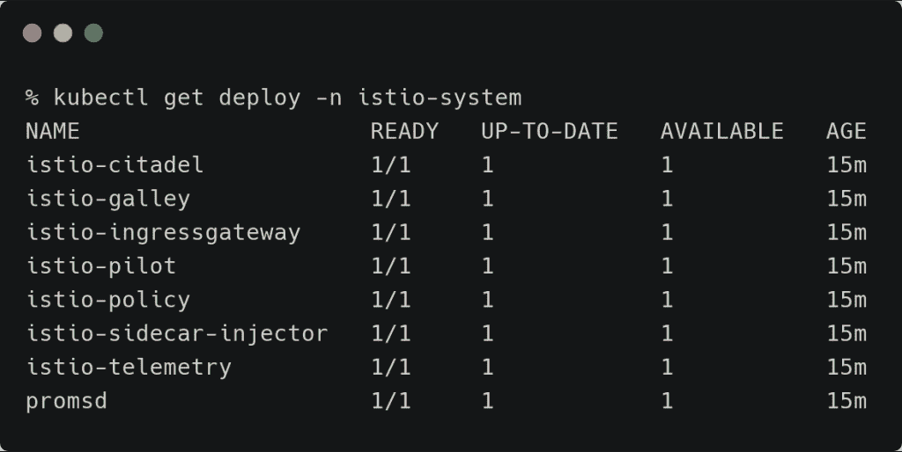

# 教程:将微服务部署到在 Google Kubernetes 引擎上运行的 Knative

> 原文：<https://thenewstack.io/tutorial-deploying-microservices-to-knative-running-on-google-kubernetes-engine/>

在[上一篇文章](https://thenewstack.io/knative-brings-event-driven-and-serverless-computing-to-kubernetes/)中，我介绍了 Knative 作为 Kubernetes 的平台层。在本系列的下一部分中，让我们进一步了解 Knative Serving，它为 Kubernetes 带来了类似 PaaS 的体验。

我们将部署两个服务:一个有状态的 MongoDB 服务和一个用 Node.js 编写的无状态 web 应用程序。当有状态数据库后端作为典型的 Kubernetes 部署运行时，无状态前端将被打包和部署为一个 Knative 服务，该服务享有诸如扩展到零之类的功能。

## 设置环境

我们将推出一个支持 Istio 插件的 Google Kubernetes 引擎(GKE)集群。这是 Knative 的先决条件。

```
export CLUSTER_NAME=mi2-knative
export CLUSTER_ZONE=asia-south1-a

```

```
gcloud services enable  \
 cloudapis.googleapis.com  \
 container.googleapis.com  \
 containerregistry.googleapis.com

```

以上命令将启用适当的谷歌云平台(GCP)API。

让我们启动一个 GKE 集群。

```
gcloud beta container clusters create  $CLUSTER_NAME  \
  --addons=HorizontalPodAutoscaling,HttpLoadBalancing,Istio  \
  --machine-type=n1-standard-4  \
  --cluster-version=latest  --zone=$CLUSTER_ZONE  \
  --enable-stackdriver-kubernetes  --enable-ip-alias  \
  --enable-autoscaling  --min-nodes=1  --max-nodes=10  \
  --enable-autorepair  \
  --scopes cloud-platform

```

```
kubectl create clusterrolebinding cluster-admin-binding  \
  --clusterrole=cluster-admin  \
  --user=$(gcloud config get-value core/account)

```

上述步骤会将当前用户添加到集群管理员角色中。

现在，您应该拥有一个预安装了 Istio 的三节点 GKE 集群。

[](https://thenewstack.io/tutorial-deploying-microservices-to-knative-running-on-google-kubernetes-engine/kns-0/)

[](https://thenewstack.io/tutorial-deploying-microservices-to-knative-running-on-google-kubernetes-engine/kns-1/)

## 在 GKE 上安装 Knative

Knative 是一组自定义资源定义(CRD)。我们将首先部署 CRD，然后部署其余的对象。

```
kubectl apply  --selector knative.dev/crd-install=true  \
--filename https://github.com/knative/serving/releases/download/v0.9.0/serving.yaml \
--filename https://github.com/knative/eventing/releases/download/v0.9.0/release.yaml \
--filename https://github.com/knative/serving/releases/download/v0.9.0/monitoring.yaml

```

```
kubectl apply  --filename https://github.com/knative/serving/releases/download/v0.9.0/serving.yaml \
--filename https://github.com/knative/eventing/releases/download/v0.9.0/release.yaml \
--filename https://github.com/knative/serving/releases/download/v0.9.0/monitoring.yaml 

```

几分钟后，开胃小菜就准备好了。等到看到 *knative-serving* 名称空间中的所有部署都准备好了。


## 在 GKE 部署 MongoDB

我们将启动 MongoDB 数据库的单个实例，其中卷被配置为 *emptyDir* 。在生产中，你可能想使用 [GCE 持久磁盘](https://cloud.google.com/kubernetes-engine/docs/concepts/persistent-volumes)或更强大的存储解决方案，如 [Portworx](http://www.portworx.com) 。

```
apiVersion:  v1
kind:  Pod
metadata:
  name:  db
  labels:
    name:  mongo
    app:  todoapp
spec:
      containers:
      -  image:  mongo
        name:  mongo
        ports:
        -  name:  mongo
          containerPort:  27017
          hostPort:  27017
        volumeMounts:
          -  name:  mongo-storage
            mountPath:  /data/db
      volumes:
          -  name:  mongo-storage
            emptyDir:  {}

```

让我们通过 ClusterIP 服务公开数据库 pod。

```
apiVersion:  v1
kind:  Service
metadata:
  name:  db
  labels:
    name:  mongo
    app:  todoapp
spec:
  selector:
    name:  mongo
  type:  ClusterIP
  ports:
    -  name:  db
      port:  27017
      targetPort:  27017

```

```
kubectl apply  -f  db-pod.yml  -f  db-service.yml

```


## 将 Web 应用程序部署为 Knative 服务

让我们将 Node.js 前端打包成一个 Knative 服务并部署它。

```
apiVersion:  serving.knative.dev/v1alpha1
kind:  Service
metadata:
  name:  todo-app 
  namespace:  default 
spec:
  template:
    spec:
      containers:
        -  image:  janakiramm/todo

```

如果你有兴趣看源代码，克隆 [Github repo](https://github.com/janakiramm/todo-app) 。

```
kubectl apply  -f  todo-service.yaml

```

这会导致通过 Istio 入口暴露一个无效服务。让我们进一步探讨这个问题。


一个 Knative 服务自动转换成 Kubernetes pod 和服务。


## 访问 Web 应用程序

Knative 服务通过与服务网格相关联的入口公开。因为我们使用 Istio，所以可以通过入口网关访问服务。

以下命令将帮助您获得入口网关的公共 IP 地址。

```
INGRESSGATEWAY=istio-ingressgateway
kubectl get svc  $INGRESSGATEWAY  --namespace istio-system

```

```
export IP_ADDRESS=$(kubectl get svc  $INGRESSGATEWAY  --namespace istio-system  --output  'jsonpath={.status.loadBalancer.ingress[0].ip}')

```

由于路由是通过 HTTP host 头发生的，我们可以通过在 */etc/hosts* 文件中添加一个条目来模拟它。IP 地址反映了 Istio 的入口网关。

```
34.93.238.29  todo-app.default.example.com

```

在浏览器中点击网址显示网络应用。


## 进一步探索服务

访问部署为 Knative 服务的应用程序与其他 Kubernetes 工作负载没有什么不同。

采用被动服务路线的主要优势在于无需额外配置即可获得自动扩展的优势。

一段时间不活动后，主动服务将自动终止释放集群资源的 pod。当服务被访问时，一个新的 pod 被自动安排。同样，当流量出现峰值时，额外的 pod 会自动启动。

你可以通过观察豆荚来了解这一点。大约一分钟后，破坏性服务将杀死一个不活跃的吊舱。刷新浏览器将会创建一个新的窗格。


Knative 花了三秒钟旋转一个新的 pod 来服务这个 pod。60 秒不活动后，同一个 pod 被终止。


## 摘要

Knative Serving 使开发人员能够部署和扩展容器映像，而无需处理底层原语，从而为 Kubernetes 带来了 PaaS 体验。

在本教程中，我们已经看到了如何将数据驱动的 web 应用程序部署为与有状态的 MongoDB pod 对话的 Knative 服务。

Knative Eventing 是 Knative 的两个构件之一。在下一篇教程中，我将带您了解将 Google Cloud Pub/Sub 与 Kubernetes 中运行的事件驱动应用程序集成的步骤。敬请关注。

*贾纳基拉姆·MSV 的网络研讨会系列“机器智能和现代基础设施(MI2)”提供了涵盖前沿技术的信息丰富、见解深刻的会议。请在 [http://mi2.live](http://mi2.live/) 注册参加即将举行的 MI2 网络研讨会。*

迈克尔·贾斯蒙德在 [Unsplash](https://unsplash.com/s/photos/pod?utm_source=unsplash&utm_medium=referral&utm_content=creditCopyText) 上的照片。

<svg xmlns:xlink="http://www.w3.org/1999/xlink" viewBox="0 0 68 31" version="1.1"><title>Group</title> <desc>Created with Sketch.</desc></svg>