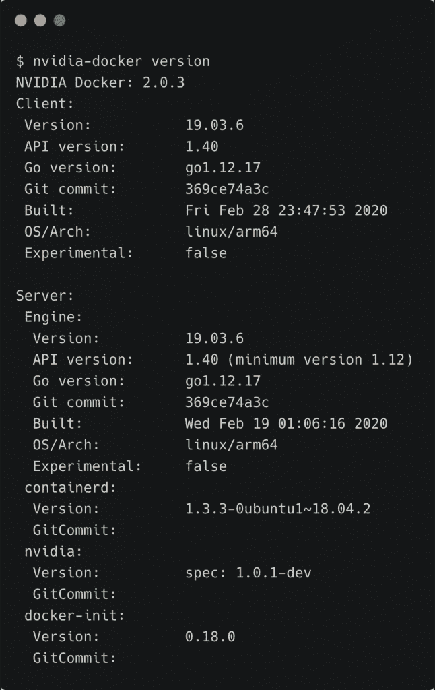
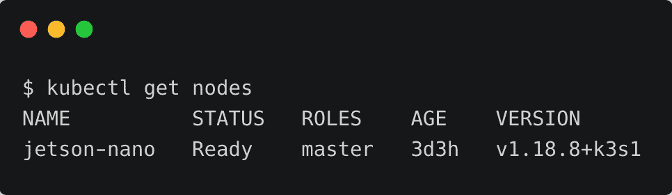
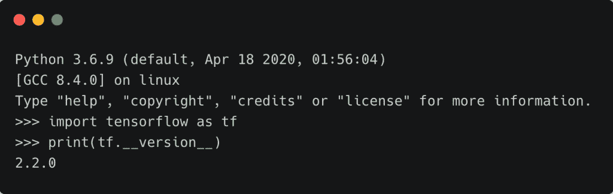
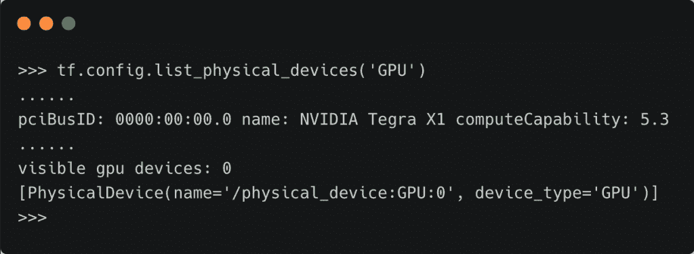
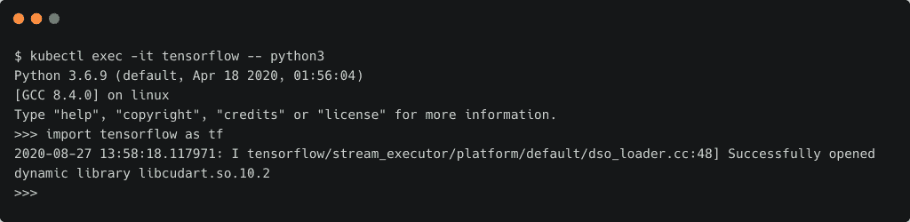
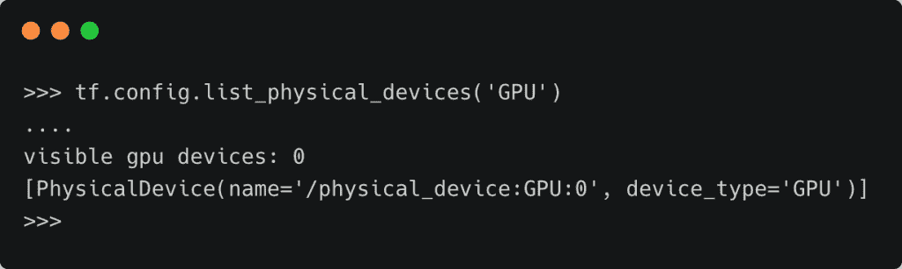

# 教程:使用 NVIDIA Jetson Nano 和 K3s 在边缘部署 TensorFlow 模型

> 原文：<https://thenewstack.io/tutorial-deploying-tensorflow-models-at-the-edge-with-nvidia-jetson-nano-and-k3s/>

在本教程中，我们将探索将 TensorFlow 模型作为边缘微服务运行的想法。[杰特森纳米](https://developer.nvidia.com/embedded/jetson-nano-developer-kit)，一个强大的边缘计算设备将运行牧场主实验室的 [K3s 发行版](https://k3s.io/)。它可以是单节点 K3s 集群，也可以作为代理加入现有的 K3s 集群。

关于背景，请参考我之前关于 [Jetson Nano](https://thenewstack.io/nvidia-brings-affordable-gpu-to-the-edge-with-jetson-nano/) 并将其配置为 [AI 测试床](https://thenewstack.io/tutorial-configure-nvidia-jetson-nano-as-an-ai-testbed/)的文章。

为了教程的完整性，我们将在 Jetson Nano 上运行单个节点 K3s。如果你想把它变成一个代理，遵循 K3s 系列的[以前的文章](https://thenewstack.io/tutorial-install-a-highly-available-k3s-cluster-at-the-edge/)中的步骤。

## 步骤 1:配置 Docker 运行时

NVIDIA 的 Jetson 平台运行一种叫做 L4T 的 Debian 版本，它基于 Ubuntu 18.04。该操作系统与 CUDA-X 驱动程序和 SDK 一起打包到 [JetPack](https://developer.nvidia.com/embedded/jetpack) 中，这是一个针对 Jetson Nano 和 Jetson Xavier 等 Jetson 系列产品的综合软件堆栈。

从 JetPack 4.2 开始，NVIDIA 引入了与 Docker 集成的容器运行时。这个定制运行时使 Docker 容器能够访问 Jetson 家族中可用的底层 GPU。

从下载最新版本的 [JetPack](https://developer.nvidia.com/embedded/jetpack) 开始，用它来刷新你的 Jetson Nano 设备。

用下面的命令检查 Docker 运行时的版本:

[](https://thenewstack.io/tutorial-deploying-tensorflow-models-at-the-edge-with-nvidia-jetson-nano-and-k3s/k3s-tf-0/)

由于 Docker 支持自定义运行时，我们可以使用带有`--runtime nvidia`开关的标准 Docker CLI 来使用 NVIDIA 的容器运行时。

我们可以通过修改`/etc/docker/daemon.json`文件来添加行`"default-runtime": "nvidia"`，而不是在每次调用时都使用开关。

```
{
    "runtimes":  {
        "nvidia":  {
            "path":  "nvidia-container-runtime",
            "runtimeArgs":  []
        }
    },

    "default-runtime":  "nvidia"
}

```

在继续之前，请确保重新启动 Docker 服务或重启系统。

## 第二步:在 Jetson Nano 上安装 K3s

K3s 中默认的容器运行时是 [containerd](https://containerd.io/) ，这是一个行业标准的容器运行时。这意味着 Docker CE 和 K3s 不会共享相同的配置和映像。

对于在 K3s 中运行的人工智能工作负载，我们需要访问只能通过`nvidia-docker`运行时获得的 GPU。在上一步中，我们已经配置了 Docker 来使用定制运行时。

幸运的是，K3s 可以选择使用现有的 Docker 运行时来代替 containerd。这可以通过在安装脚本中添加 `--docker`开关来实现。

让我们继续在 NVIDIA Jetson Nano 上安装 K3s，并将其指向 Docker 运行时。我们还将添加几个其他的开关，使 K3s 更容易使用`kubectl`命令行界面。

```
curl  -sfL https://get.k3s.io | sh -s - --docker --write-kubeconfig-mode 644 --write-kubeconfig $HOME/.kube/config

```

几分钟后，K3s 在我们的 Jetson Nano 上启动并运行。



### 步骤 3:在 Jetson Nano 上运行 TensorFlow 作为 Kubernetes Pod

有了 Kubernetes 基础设施，我们将尝试在 K3s 支持的单节点集群中运行 TensorFlow 2.x 作为 pod。

NVIDIA 发布了一组容器图像，这些图像针对 JetPack 进行了优化，可以在边缘运行。它们可以在 [NVIDIA GPU Cloud](https://ngc.nvidia.com) (NGC)容器注册表中获得。

让我们从 NGC 为 L4T 拉出 [TensorFlow 2.2 容器图像](https://ngc.nvidia.com/catalog/containers/nvidia:l4t-tensorflow)。

```
sudo docker pull nvcr.io/nvidia/l4t-tensorflow:r32.4.3-tf2.2-py3

```

让我们看看 TensorFlow 能否访问 Jetson Nano 上可用的 GPU。

```
sudo docker run  -it  --rm  --runtime nvidia  \  
--network host  \
nvcr.io/nvidia/l4t-tensorflow:r32.4.3-tf2.2-py3  \
python3

```

在 Python shell 中，运行下面的代码片段来检查版本和 GPU 访问:

```
import tensorflow as tf
print(tf.__version__)

```



```
tf.config.list_physical_devices('GPU')

```



我们可以看到，GPU 设备 0 对 TensorFlow 是可见的。

现在，是时候看看我们是否可以将它作为一个 Kubernetes pod 来运行，并且仍然可以访问 GPU 了。

创建一个简单的 pod 规范来保持 TensorFlow 2.2 容器的运行。

```
apiVersion:  v1
kind:  Pod
metadata:
  name:  tensorflow
spec:
  containers:
  -  name:  tf
    image:  nvcr.io/nvidia/l4t-tensorflow:r32.4.3-tf2.2-py3
    command:  [  "/bin/bash",  "-c",  "--"  ]
    args:  [  "while true; do sleep 30; done;"  ]

```

```
kubectl apply  -f  tf2.yaml

```


运行 TensorFlow pod 后，让我们访问 shell 并尝试相同的命令。

```
kubectl exec  -it tensorflow  --  python3

```



您应该会看到 TensorFlow 可以使用 GPU。



通过自定义 Docker 运行时从 K3s 集群访问 GPU 是在云原生环境的边缘运行 AI 的强大机制。通过在 Kubernetes 的边缘运行 TensorFlow，您可以将深度学习模型部署为微服务。

这使得许多有趣的用例能够将人工智能和物联网的最佳功能引入 Kubernetes 基础设施。在即将到来的一个教程中，我将介绍一个基于该平台的端到端人工智能推理用例。敬请关注。

*贾纳基拉姆·MSV 的网络研讨会系列“机器智能和现代基础设施(MI2)”提供了涵盖前沿技术的信息丰富、见解深刻的会议。在 [http://mi2.live](http://mi2.live) 注册参加即将举行的 MI2 网络研讨会。*

<svg xmlns:xlink="http://www.w3.org/1999/xlink" viewBox="0 0 68 31" version="1.1"><title>Group</title> <desc>Created with Sketch.</desc></svg>