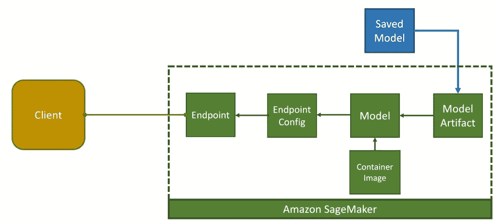
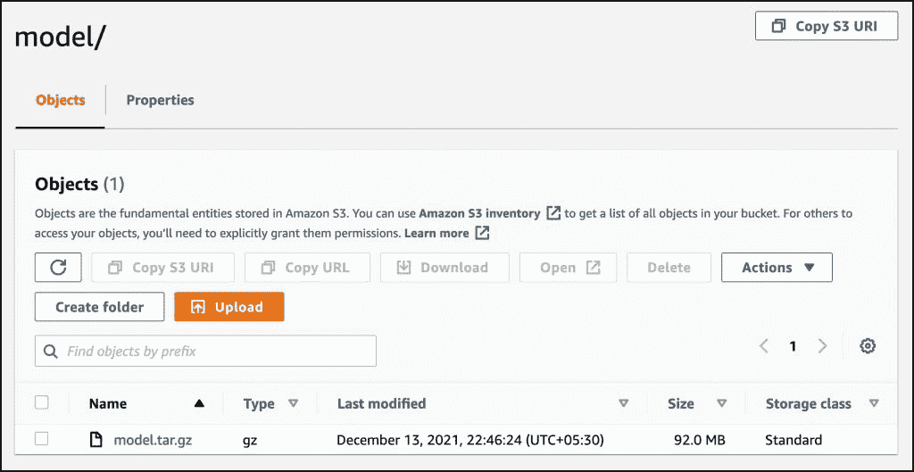
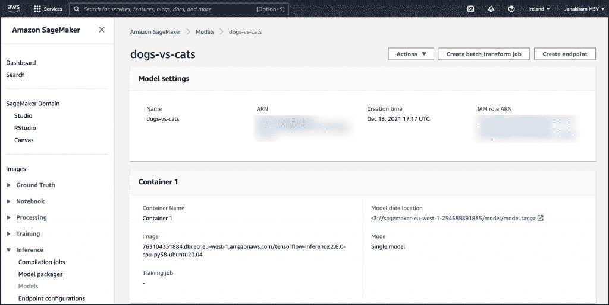
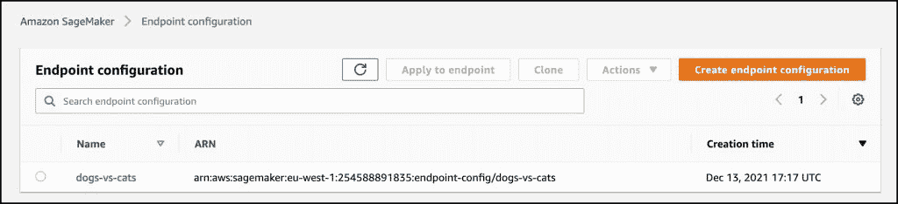
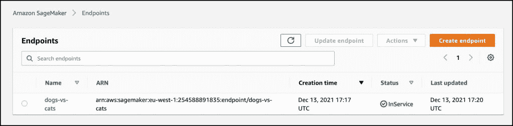
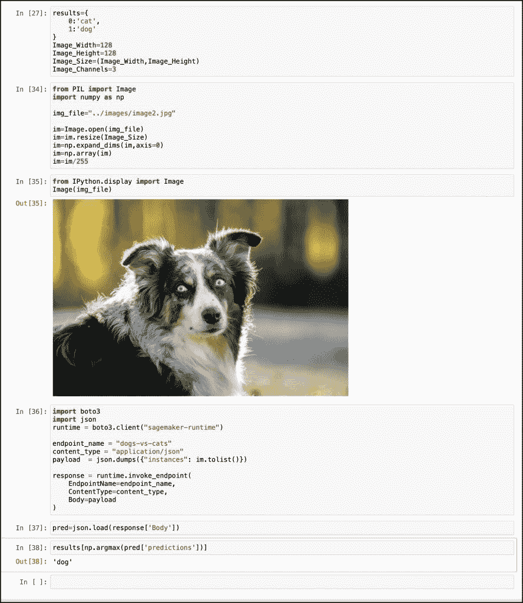

# 教程:使用 Amazon SageMaker 无服务器推理部署 TensorFlow 模型

> 原文：<https://thenewstack.io/tutorial-deploying-tensorflow-models-with-amazon-sagemaker-serverless-inference/>

本指南是亚马逊 SageMaker 工作室系列的最后一部分。

正如我们在之前的帖子中提到的，[亚马逊 SageMaker Studio Lab](https://aws.amazon.com/sagemaker/studio-lab/) 是一项独立的服务，允许用户尝试构建[机器学习](https://thenewstack.io/category/machine-learning/)模型。它不依赖于[亚马逊网络服务](https://aws.amazon.com/?utm_content=inline-mention)本身。该环境基于流行且熟悉的 [JupyterLab](https://jupyter.org/) 笔记本电脑。JupyterLab 是 Studio Lab 和 Studio 之间唯一可以从 AWS 控制台获得的通用性。任何有电子邮件账户的人都可以注册这项服务。

这项服务完全免费。亚马逊开放了一个 IDE 和环境，用于构建机器学习模型，没有任何附加条件。这可能是第一个存在于 IAM 领域之外的 AWS 服务，具有无限的免费层小时数。

除了品牌推广，服务几乎和 SageMaker 没有任何关系。

在之前的帖子中，我们探索了 [SageMaker Studio 实验室基础](https://thenewstack.io/amazon-sagemaker-studio-lab-from-the-eyes-of-an-mlops-engineer/)和 SageMaker 无服务器推理。本教程将进行下一步，并将展示如何为 TensorFlow 模型发布无服务器推断端点。

当您在 SageMaker Studio 实验室或任何其他环境中训练了一个模型时，您可以在 SageMaker Studio 环境中托管该模型以进行大规模推理。如果您已经按照步骤根据 cats vs. dogs 数据集训练了图像分类模型，那么您可以扩展场景，在 SageMaker 无服务器推理服务中部署相同的模型。



### 先决条件

您需要以下内容来完成本教程:

1.  AWS 帐户
2.  您的 AWS 帐户的访问密钥和秘密密钥
3.  SageMaker 执行角色

按照 [Amazon SageMaker 文档](https://docs.aws.amazon.com/sagemaker/latest/dg/sagemaker-roles.html#sagemaker-roles-createmodel-perms)中提到的步骤来创建 SageMaker IAM 角色，该角色具有部署模型所需的适当权限。

### 步骤 1:准备环境

Amazon SageMaker Studio Lab 附带了 AWS CLI，可用于配置环境。在本教程中，我们将使用 Jupyter 笔记本和 AWS SDK for Python (Boto3)来配置 SDK 所需的凭证。

在基于上一教程中创建的`tf2:python`内核的新笔记本中运行以下命令。

```
!mkdir  -p  ~/.aws/
#Replace with your keys
%%writefile  ~/.aws/credentials

[default]
aws_access_key_id  =  AWS_ACCESS_KEY
aws_secret_access_key  =  AWS_SECRET_KEY

```

不要忘记用您自己的密钥替换凭证。

```
%%writefile  ~/.aws/config

[default]
region=eu-west-1

```

这些命令配置 Boto3 期望的 AWS 环境。

让我们通过将模型归档到一个 tarball 中来准备它。这将在以后上传到亚马逊 S3 桶注册 SageMaker。

```
import tarfile
model_archive  =  '../model/model.tar.gz'
with tarfile.open(model_archive,  mode='w:gz')  as archive:
archive.add('../model/export',  recursive=True)

```

最后，设置用于配置推理端点的变量。

```
region='eu-west-1'
sagemaker_role  =  SAGEMAKER_ROLE_ARN
container  =  "763104351884.dkr.ecr.eu-west-1.amazonaws.com/tensorflow-inference:2.6.0-cpu-py38-ubuntu20.04"

```

不要忘记将`SAGEMAKER_ROLE_ARN`替换为作为先决条件的一部分而创建的 ARN。我们正在将 AWS 区域设置为都柏林。请随意将其替换为无服务器推理功能的任何支持区域。最后一行指向 SageMaker 在创建和注册模型时将使用的容器图像。TensorFlow 保存的模型将安装在这个容器中，该容器已经有了用于推理的代码。如果您选择了`eu-west-1`以外的其他地区，请适当更新图像。您可以在此访问可用图像列表[。](https://github.com/aws/deep-learning-containers/blob/master/available_images.md)

### 步骤 2:创建 Amazon SageMaker 模型

在这一步中，我们将把模型 tarball 上传到一个 S3 桶，并将其与深度学习容器映像相关联，以便进行推理。

```
import boto3
import sagemaker
from sagemaker import Session

region  =  boto3.Session().region_name
sess  =  Session()
bucket  =  sess.default_bucket()
client  =  boto3.client("sagemaker",  region_name=region)

model_url  =  sess.upload_data(path=model_archive,  key_prefix='model')
model_name  =  "dogs-vs-cats"
response  =  client.create_model(  ModelName  =  model_name,  ExecutionRoleArn  =  sagemaker_role,  Containers  =  [{  "Image":  container,  "Mode":  "SingleModel",  "ModelDataUrl":  model_url,  }]  )

```

最后一个代码片段包含了 SageMaker 创建名为`dogs-vs-cats`的模型所需的所有内容。

如果你访问亚马逊 SageMaker 使用的 S3 桶，你会发现 tarball 模型。



如果您在 AWS 控制台中导航到 SageMaker 的 models 部分，您将会看到向它注册的模型。



### 步骤 3:定义 SageMaker 无服务器推断端点配置

这是我们为无服务器推断配置端点的最关键的一步。

```
response  =  client.create_endpoint_config(
EndpointConfigName="dogs-vs-cats",
ProductionVariants=[
{
"ModelName":  "dogs-vs-cats",
"VariantName":  "AllTraffic",
"ServerlessConfig":  {
"MemorySizeInMB":  2048,
"MaxConcurrency":  20
}
}
]
)

```

`ServerlessConfig`属性是对 SageMaker 运行时的一个提示，用于提供基于参数自动缩放的无服务器计算资源——2GB RAM 和 20 个并发调用。

当您执行完这个命令后，您可以在 AWS 控制台中看到相同的内容。



### 步骤 4:创建无服务器推理端点

我们准备好根据上一步中定义的配置创建端点。

```
response  =  client.create_endpoint(
EndpointName="dogs-vs-cats",
EndpointConfigName="dogs-vs-cats"
)

```

这导致最终的推断端点准备好接受请求。



### 步骤 5:调用无服务器推理端点

让我们通过发送一只狗的图像来测试端点。

```
results={
0:'cat',
1:'dog'
}
Image_Width=128
Image_Height=128
Image_Size=(Image_Width,Image_Height)
Image_Channels=3

from PIL import Image 
import numpy as np img_file="../images/image2.jpg"  
im=Image.open(img_file)  im=im.resize(Image_Size)  
im=np.expand_dims(im,axis=0)  
im=np.array(im)  
im=im/255  

import boto3 
import json 
runtime  =  boto3.client("sagemaker-runtime")  
endpoint_name  =  "dogs-vs-cats"  
content_type  =  "application/json"  
payload  =  json.dumps({"instances":  im.tolist()})  

response  =  runtime.invoke_endpoint(  EndpointName=endpoint_name,  ContentType=content_type,  Body=payload  )  pred=json.load(response['Body'])
results[np.argmax(pred['predictions'])]

```

你应该看到端点正确分类图像。



关于发布 TensorFlow 模型的无服务器推理端点的教程到此结束。希望你觉得有用。

<svg xmlns:xlink="http://www.w3.org/1999/xlink" viewBox="0 0 68 31" version="1.1"><title>Group</title> <desc>Created with Sketch.</desc></svg>