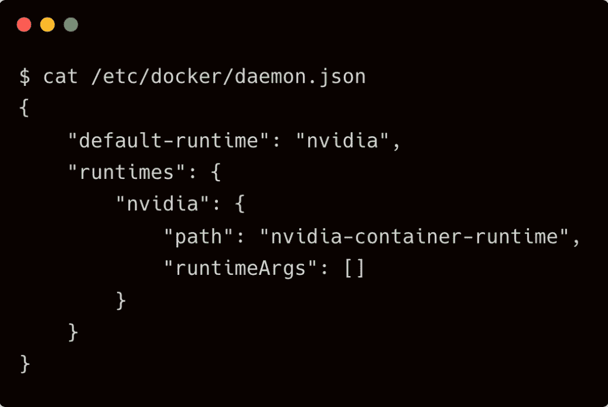
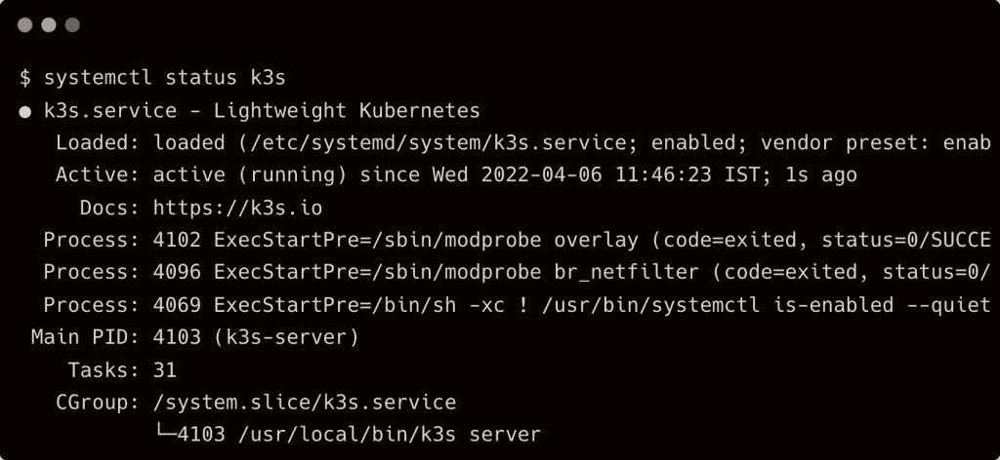
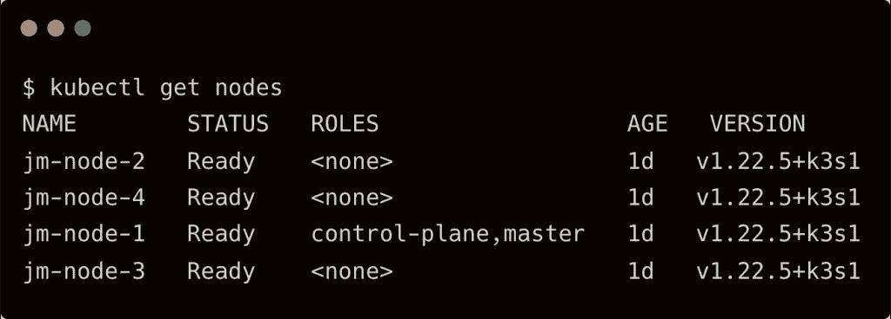
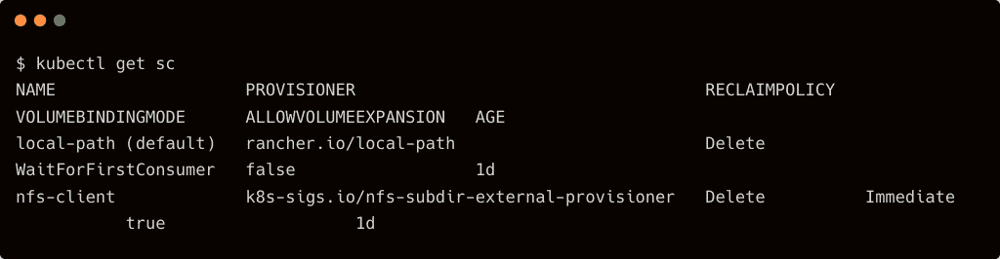
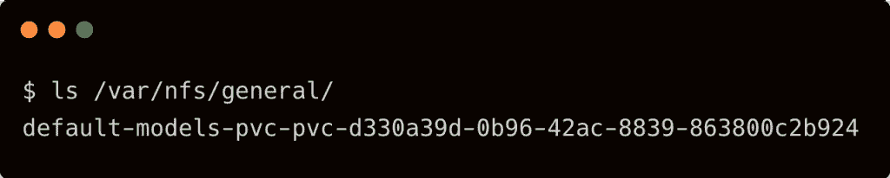
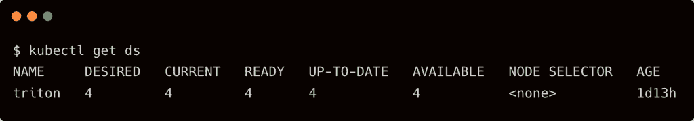
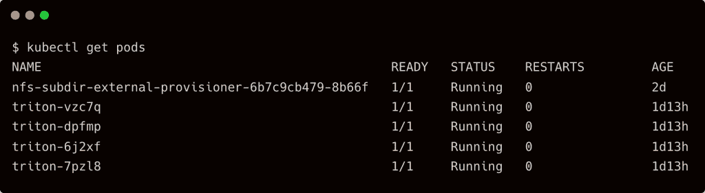
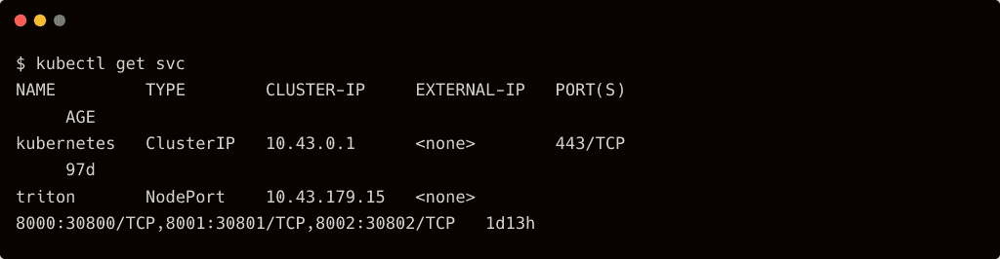
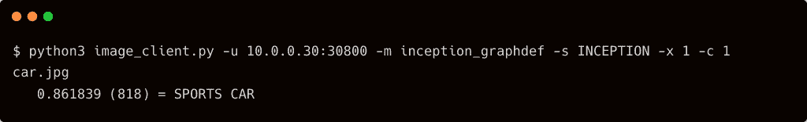

# 教程:带 Triton 推理服务器的 Edge AI，Kubernetes，Jetson Mate

> 原文：<https://thenewstack.io/tutorial-edge-ai-with-triton-inference-server-kubernetes-jetson-mate/>

在本教程中，我们将在 Jetson Mate 载板上配置和部署 [Nvidia Triton 推理服务器](https://developer.nvidia.com/nvidia-triton-inference-server)，以执行计算机视觉模型的推理。它建立在我们之前的帖子上，在那里我介绍了 Seeed Studio 的 Jetson Mate 在边缘运行 Kubernetes 集群。

虽然本教程关注的是 [Jetson Mate](https://www.seeedstudio.com/Jetson-Mate-Cooling-Kit-p-4784.html) ，但是您可以使用一个或多个连接到网络交换机的 Jetson Nano 开发工具包来运行 Kubernetes 集群。

### 步骤 1:在 Jetson Nano 模块上系统(SoMs)上安装 K3s

假设您已经在所有四个 Jetson Nano 4GB 模块上安装并配置了 [JetPack 4.6.x](https://developer.nvidia.com/embedded/jetpack) ，让我们从安装 K3s 开始。

第一步是把 Nvidia 容器工具包变成 Docker 的默认运行时。为此，将行`"default-runtime": "nvidia"`添加到文件中，在每个节点上添加`/etc/docker/daemon.json`。这很重要，因为我们希望 K3s 访问 Jetson Nano 上可用的 GPU。



SSH 进入插入主插槽的模块，并运行以下命令来安装 K3s 控制面板。

```
mkdir  -p  ~/.kube
curl  -sfL https://get.k3s.io | \
  K3S_TOKEN=jetsonmate  \
  K3S_KUBECONFIG_MODE="644"  \
  INSTALL_K3S_EXEC="--docker --disable servicelb --disable traefik"  \
  K3S_KUBECONFIG_OUTPUT="$HOME/.kube/config"  \
  sh  -

```

通过设置`--docker`开关，我们强制 K3s 使用 Nvidia 容器运行时，而不是默认的 containerd 运行时。我还禁用了集群上的 Servicelb 负载平衡器和 Traefik 服务网格，以避免出现与网络相关的问题。

安装控制面板后，验证 K3s 服务是否已启动并正在运行。



在其余三个节点上运行以下命令来配置集群:

```
curl  -sfL https://get.k3s.io | \
  K3S_TOKEN=jetsonmate  \
  K3S_URL="https://jm-node-1:6443"  \
  INSTALL_K3S_EXEC="--docker"  \
  sh  -

```

到这一步结束时，我们应该有一个基于 K3s 的四节点 Kubernetes 集群。



### 步骤 2:在群集中配置和装载 NFS 共享

我们使用 NFS 作为共享后端来存储 Triton 推理服务器访问的模型。NFS 客户 provisioner Helm 图表有助于我们向 Kubernetes 展示现有的 NFS 股票。

```
helm repo add nfs-subdir-external-provisioner https://kubernetes-sigs.github.io/nfs-subdir-external-provisioner

```

```
helm install nfs-subdir-external-provisioner nfs-subdir-external-provisioner/nfs-subdir-external-provisioner  \
    --set nfs.server=10.0.0.30  \
    --set nfs.path=/var/nfs/general  \
    --set storageClass.provisionerName=k8s-sigs.io/nfs-subdir-external-provisioner

```

用您的服务器替换 NFS 服务器的 IP 地址。

这个舵图创建了一个支持共享 PVC 的动态配置的存储类。



### 步骤 3:创建共享 PVC 并添加 TensorFlow 模型

准备好 NFS 共享后，让我们配置共享 PVC，我们可以向其中添加 Triton 推理服务器访问的模型。

```
kind:  PersistentVolumeClaim
apiVersion:  v1
metadata:
  name:  models-pvc
spec:
  storageClassName:  nfs-client
  accessModes:
    -  ReadWriteMany
  resources:
    requests:
      storage:  10Gi

```

注意规格中的`storageClassName`和`accessModes`值。它们帮助我们创建多个 Triton pods 可访问的共享 PVC。

```
kubectl create  -f  models-pvc.yaml

```


当您访问显示为 NFS 共享的目录时，您会看到一个与 PVC 名称匹配的目录。



让我们用 Triton 推理服务器期望的[初始模型](https://cloud.google.com/tpu/docs/inception-v3-advanced)、标签文件和配置文件来填充这个目录。

在 NFS 服务器上，运行以下命令下载模型并将其移动到 NFS 共享。

```
wget  -O  /tmp/inception_v3_2016_08_28_frozen.pb.tar.gz  \
 https://storage.googleapis.com/download.tensorflow.org/models/inception_v3_2016_08_28_frozen.pb.tar.gz

cd  /tmp
tar xzf inception_v3_2016_08_28_frozen.pb.tar.gz
mv inception_v3_2016_08_28_frozen.pb  /var/nfs/general/default-models-pvc-pvc-d330a39d-0b96-42ac-8839-863800c2b924/inception_graphdef/1/model.graphdef

```

在我的文件服务器上，目录`/var/nfs/general/`被导出为 NFS 共享。用你自己的道路来代替它。

接下来，让我们从 [Triton GitHub 库](https://github.com/triton-inference-server/server)下载标签和配置文件。

```
wget  -O  /var/nfs/general/default-models-pvc-pvc-d330a39d-0b96-42ac-8839-863800c2b924/inception_graphdef/config.pbtxt  https://raw.githubusercontent.com/triton-inference-server/server/main/docs/examples/model_repository/inception_graphdef/config.pbtxt

```

```
wget  -O  /var/nfs/general/default-models-pvc-pvc-d330a39d-0b96-42ac-8839-863800c2b924/inception_graphdef/inception_labels.txt  https://raw.githubusercontent.com/triton-inference-server/server/main/docs/examples/model_repository/inception_graphdef/inception_labels.txt

```


这种目录结构使 Triton 能够从共享的后端访问和加载模型。

### 步骤 4:构建 Triton 推理服务器 Docker 映像

截至 2022 年 4 月，Nvidia 没有针对 Jetson 设备的 Triton 官方容器映像。要在 Kubernetes 上部署它，我们必须构建自己的 Docker 映像。

```
FROM nvcr.io/nvidia/l4t-base:r32.6.1
RUN apt-get update  &amp;&amp;  \
    apt-get install  -y  --no-install-recommends  \
        software-properties-common  \
        autoconf  \
        automake  \
        build-essential  \
        cmake  \
        git  \
        libb64-dev  \
        libre2-dev  \
        libssl-dev  \
        libtool  \
        libboost-dev  \
        libcurl4-openssl-dev  \
        libopenblas-dev  \
        rapidjson-dev  \
        patchelf  \
        zlib1g-dev  &amp;&amp;  \
    apt-get autoclean  &amp;&amp;  \
    apt-get autoremove
RUN mkdir  -p  /opt/triton  &amp;&amp;  \
    wget https://github.com/triton-inference-server/server/releases/download/v2.17.0/tritonserver2.17.0-jetpack4.6.tgz &amp;&amp; \
    tar xf tritonserver2.17.0-jetpack4.6.tgz  -C  /opt/triton  &amp;&amp;  \
    rm tritonserver2.17.0-jetpack4.6.tgz
ENV PATH="/opt/triton/bin:$PATH"
ENV LD_LIBRARY_PATH="/opt/triton/lib:$LD_LIBRARY_PATH"
ENTRYPOINT  ["tritonserver",  "--backend-directory=/opt/triton/backends"]

```

这个`Dockerfile`从针对 JetPack 4.6 优化的`nvcr.io/nvidia/l4t-base:r32.6.1`基础映像构建映像。

构建、标记并推送此图像到您最喜欢的存储库。

### 步骤 5:在 K3s 上部署 Triton 推理服务器

Triton 推理服务器利用每个 Jetson Nano 模块上可用的 GPU。但是，一次只有一个 Triton 实例可以使用 GPU。为了确保我们只运行一个 Triton pod 实例，我们将把它配置为一个 daemonset。

```
apiVersion:  apps/v1
kind:  DaemonSet
metadata:
  name:  triton
  labels:
    app:  triton
spec:
  selector:
    matchLabels:
      app:  triton
  template:
    metadata:
      labels:
        app:  triton
    spec:
      containers:
      -  name:  triton-jetson
        image:  janakiramm/triton-jetson
        args:  ["--min-supported-compute-capability=5.3",  "--model-repository=/opt/triton/models",  "--backend-config=tensorflow,version=2"]
        volumeMounts:
        -  name:  varlog
          mountPath:  /var/log
        -  name:  varlibdockercontainers
          mountPath:  /var/lib/docker/containers
          readOnly:  true
        ports:
          -  containerPort:  8000
            name:  http
          -  containerPort:  8001
            name:  grpc
          -  containerPort:  8002
            name:  metrics
        volumeMounts:
        -  mountPath:  /dev/shm
          name:  dshm
        -  mountPath:  /opt/triton/models
          name:  models
      volumes:
      -  name:  dshm
        emptyDir:
          medium:  Memory
      -  name:  models
        persistentVolumeClaim:
          claimName:  models-pvc
---
apiVersion:  v1
kind:  Service
metadata:
  name:  triton
spec:
  type:  NodePort
  selector:
    app:  triton
  ports:
    -  protocol:  TCP
      name:  http
      port:  8000
      nodePort:  30800
      targetPort:  8000
    -  protocol:  TCP
      name:  grpc
      port:  8001
      nodePort:  30801
      targetPort:  8001
    -  protocol:  TCP
      name:  metrics
      nodePort:  30802
      port:  8002
      targetPort:  8002          

```

注意，共享的 PVC，`models-pvc`被安装在`/opt/triton/models`上，以便 Triton 访问工件。

部署 daemonset 并检查 pod 是否正在运行以及服务是否公开。







客户端使用 Triton pods 公开的端点进行推理。

### 步骤 6:从 Python 执行推理

从 [Triton GitHub 库](https://github.com/triton-inference-server/client)下载 [Python 图像客户端](https://github.com/triton-inference-server/client/blob/main/src/python/examples/image_client.py)示例代码。要安装所需的模块，创建一个包含以下内容的`requirements.txt`文件，并使用`pip3`进行安装。

```
pillow
numpy
attrdict
tritonclient
google-api-python-client
grpcio
geventhttpclient
boto3

```

下载一张汽车图片，通过将图片作为参数发送来运行图片客户端。


```
python3 image_client.py  -u  10.0.0.30:30800  -m  inception_graphdef  -s  INCEPTION  -x  1  -c  1  car.jpg

```

用集群的正确节点端口替换 IP 地址。您应该会看到下面的输出:



关于在运行 K3s 的 Jetson Nanocluster 上安装和配置 Triton 推理服务器的端到端教程到此结束。

<svg xmlns:xlink="http://www.w3.org/1999/xlink" viewBox="0 0 68 31" version="1.1"><title>Group</title> <desc>Created with Sketch.</desc></svg>