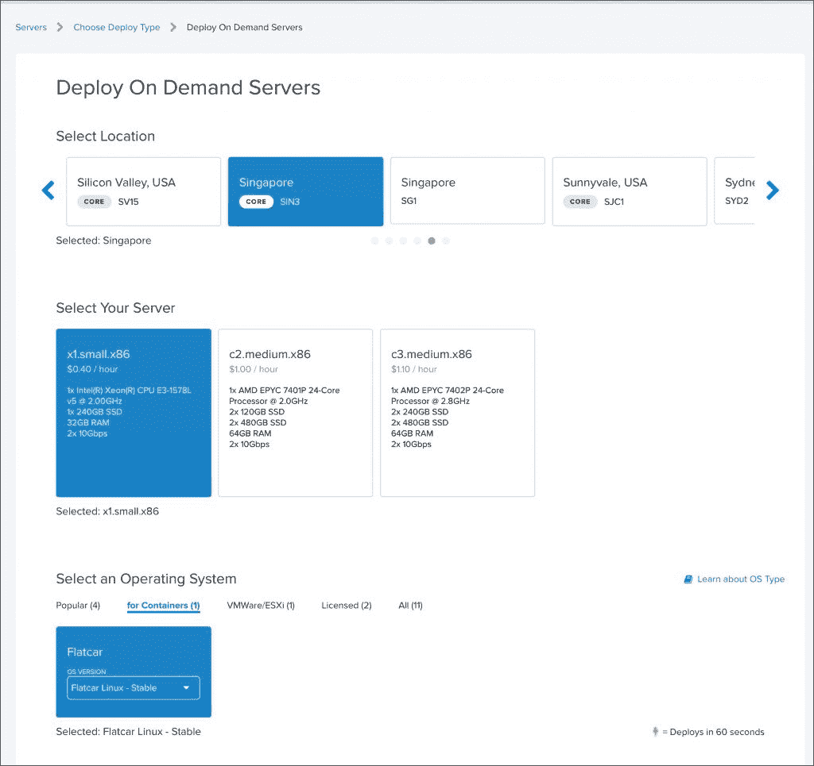
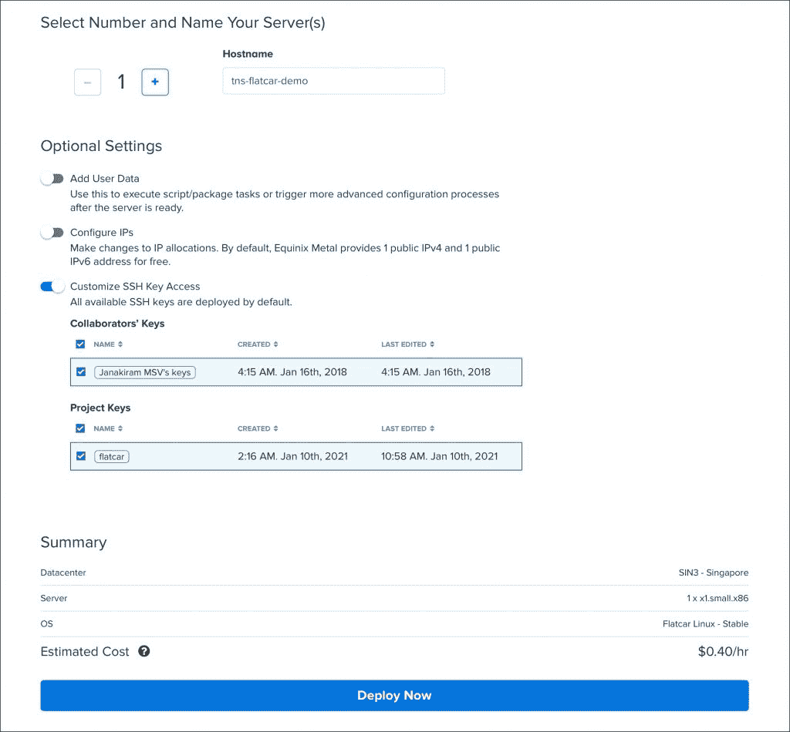
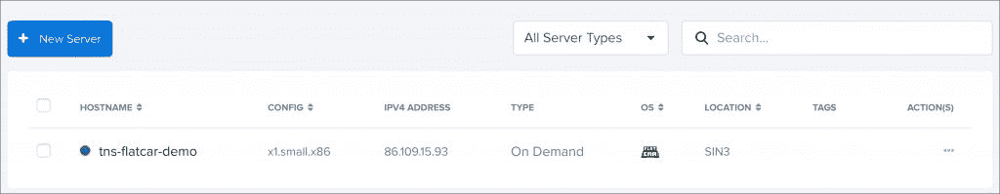
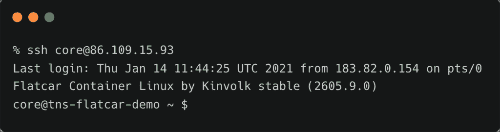
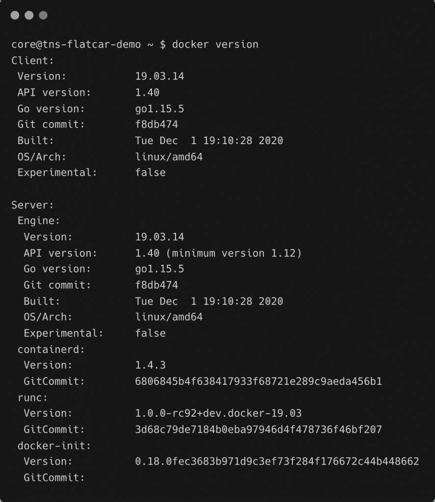
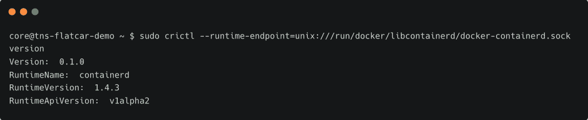
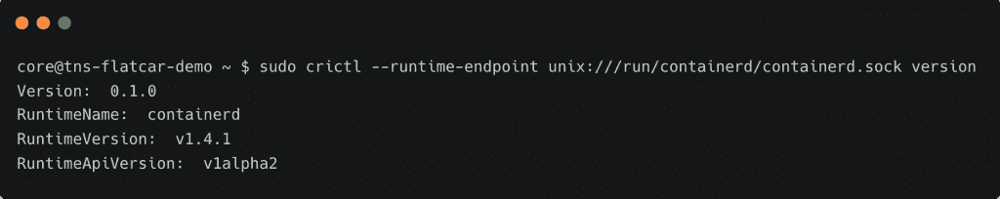

# 教程:使用 Flatcar Container Linux 探索容器运行时

> 原文：<https://thenewstack.io/tutorial-explore-container-runtimes-with-flatcar-container-linux/>

本教程是关于 Flatcar 容器 Linux 的[系列](https://thenewstack.io/flatcar-container-linux-the-ideal-os-for-running-kubernetes-at-the-edge/)的第二部分，在其中我们将熟悉容器运行时。它还引入了将自定义版本的 containerd 运行时作为 systemd 单元文件运行的概念。

Flatcar Linux 实例可以在主流云平台中启动，包括[亚马逊 Web 服务](https://aws.amazon.com/?utm_content=inline-mention)、[微软 Azure](https://azure.microsoft.com/en-us/) 、[谷歌云](https://cloud.google.com/)。我们将选择 [Equinix Metal](https://www.equinix.com/services/edge-services/equinix-metal/) ，这为我们在裸机环境中运行操作系统提供了灵活性。

与 Equinix Metal 签约后，我们将在最近的受支持地区推出一个新的按需服务器实例。



我选择了新加坡地区和`x1.small.x86`服务器配置。

接下来，为您的实例命名，关联一个注册的 SSH 密钥，然后单击 deploy now 按钮。



几分钟之内，服务器就准备好了。您可以在控制台的侧边栏中跟踪进度。

您可以通过添加 YAML 格式的云初始化数据来自定义实例。



一旦实例准备就绪，就将 SSH 的 IP 地址复制到其中。



## 探索 Docker 引擎

Flatcar 容器 Linux 支持所有流行的运行容器的方法。我们可以选择在底层与容器进行交互，或者使用更高级别的编排引擎，即 Kubernetes。

每个 Flatcar Container Linux 实例都带有 Docker CE 和 Docker CLI 的稳定版本。



一旦 Docker 套接字被激活，Docker 服务就会启动。你可以在`/run/systemd/system`目录下找到 systemd 单元文件，`docker.service`和`docker.socket`。

如果您想一直运行 Docker 服务，而不必等待套接字激活，请将以下内容添加到用户数据中。当您希望继续运行属性设置为`always`的容器时，这个配置会有所帮助。

```
systemd:
  units:
    -  name:  docker.socket
      enabled:  false
    -  name:  docker.service
      enabled:  true

```

## 探索 containerd 运行时

Flatcar Container Linux 附带了 containerd CRI 插件，默认情况下启用 Dockershim。让我们通过下载`crictl` CLI 工具来进一步探索这一点。

```
VERSION="v1.20.0"
wget https://github.com/kubernetes-sigs/cri-tools/releases/download/$VERSION/crictl-$VERSION-linux-amd64.tar.gz
sudo tar zxvf crictl-$VERSION-linux-amd64.tar.gz  -C  /opt/bin

```

我们将二进制文件复制到`/opt/bin`，因为`/usr/bin`是只读文件系统的一部分。

假设 Docker 服务启动并运行，我们可以通过使用`crictl`连接到 Dockershim 端点。

```
sudo crictl  --runtime-endpoint=unix:///run/docker/libcontainerd/docker-containerd.sock version

```



## 安装和配置自定义 containerd 运行时

可以用定制版本替换默认的 Docker 和 containerd 运行时。在本例中，我们将运行 containerd 1.4.1，而不是默认版本 1.4.3。

让我们下载 containerd 1.4.1 二进制文件，并将其移动到`/opt/bin`目录。

```
wget https://github.com/containerd/containerd/releases/download/v1.4.1/containerd-1.4.1-linux-amd64.tar.gz

```

```
tar xvf containerd-1.4.1-linux-amd64.tar.gz  &amp;&amp;  sudo mv bin/containerd  /opt/bin

```

我们将创建一个空文件，作为配置的占位符。

```
sudo mkdir  -p  /etc/containerd/
sudo touch  /etc/containerd/config.toml

```

用以下内容创建一个 systemd 单元文件。我们称之为`containerd141.service`是为了避免与当前运行时配置的冲突。

```
sudo bash  -c  'cat &lt;&lt; EOF &gt; /etc/systemd/system/containerd141.service
[Unit]
Description=containerd container runtime
After=network.target

[Service]
Environment=CONTAINERD_CONFIG=/etc/containerd/config.toml
Environment=PATH=/opt/bin:/usr/local/sbin:/usr/local/bin:/usr/sbin:/usr/bin
ExecStart=
ExecStart=/opt/bin/containerd --config /etc/containerd/config.toml
KillMode=process
Restart=always
LimitNOFILE=1048576
LimitNPROC=infinity
LimitCORE=infinity
TasksMax=infinity

[Install]
WantedBy=multi-user.target
EOF'

```

在激活之前，让我们停止 Docker 和 container 服务。

```
sudo systemctl stop docker
sudo systemctl stop containerd

```

让我们激活 containerd 1.4.1 服务。

```
sudo systemctl enable  /etc/systemd/system/containerd141.service
sudo systemctl start containerd141

```

我们现在可以用`crictl`工具测试运行时的版本。

```
sudo crictl  --runtime-endpoint unix:///run/containerd/containerd.sock version

```

注意，我们使用的是 containerd 的本地套接字，而不是 Dockershim。



为了在引导过程中初始化 containerd 的定制版本，我们可以将它嵌入到点火文件的配置中，这将在本系列的下一部分中探讨。敬请关注。

贾纳奇拉姆·MSV 的网络研讨会系列“机器智能和现代基础设施(MI2)”提供了涵盖前沿技术的信息丰富、见解深刻的会议。在 [http://mi2.live](http://mi2.live) 注册即将到来的 MI2 网络研讨会。

由[拉斯沃德](https://unsplash.com/@rssemfam?utm_source=unsplash&utm_medium=referral&utm_content=creditCopyText)在 [Unsplash](https://unsplash.com/s/photos/railroad-cars?utm_source=unsplash&utm_medium=referral&utm_content=creditCopyText) 拍摄的特写图片。

<svg xmlns:xlink="http://www.w3.org/1999/xlink" viewBox="0 0 68 31" version="1.1"><title>Group</title> <desc>Created with Sketch.</desc></svg>