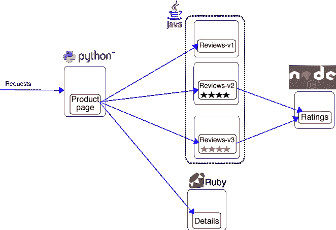
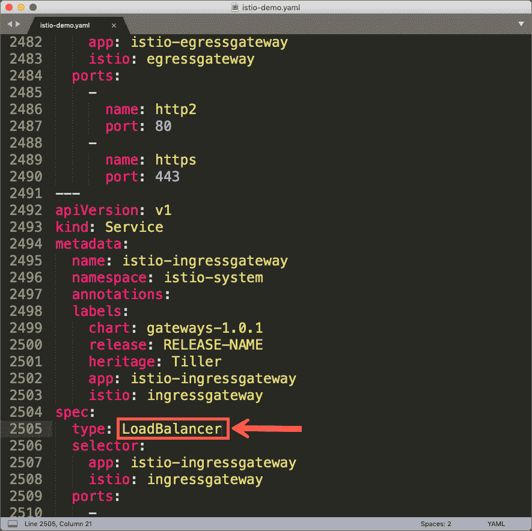
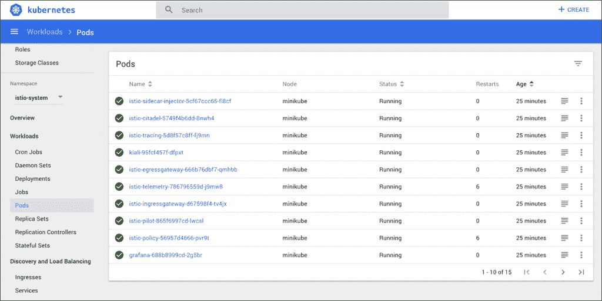
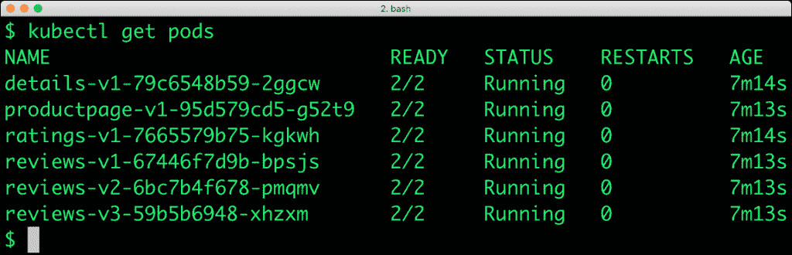
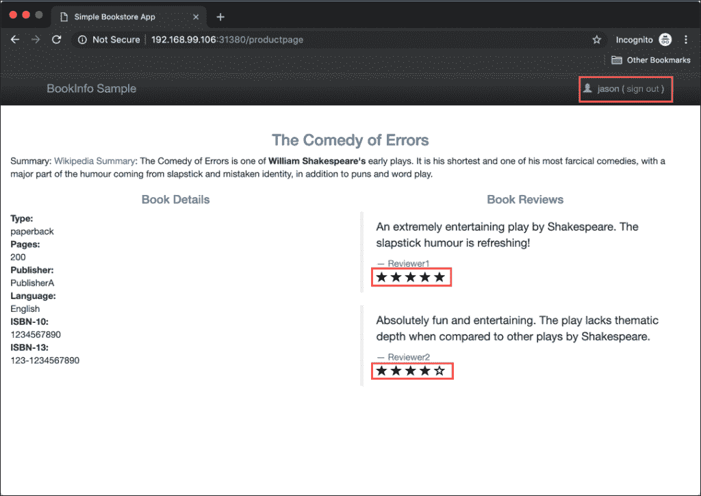
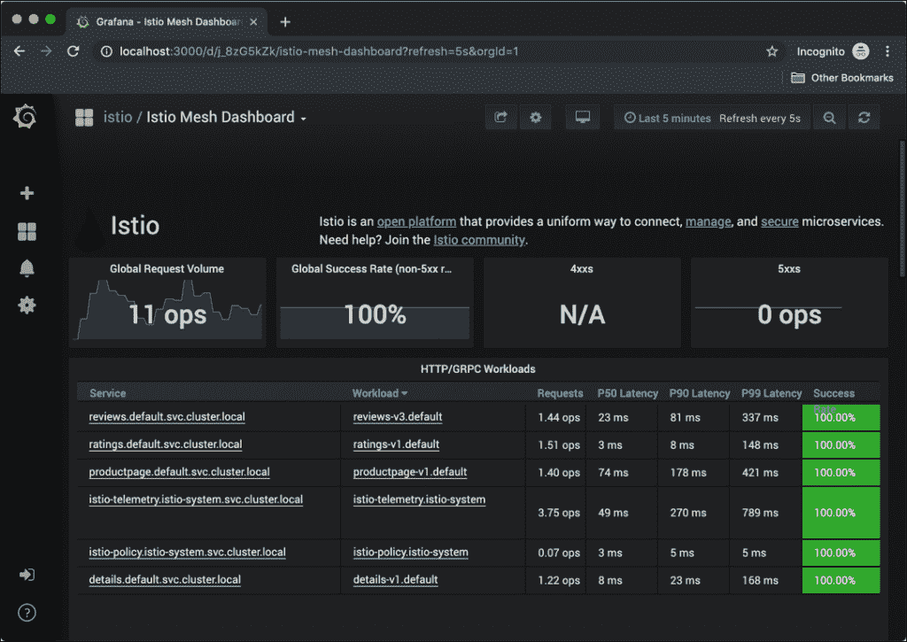
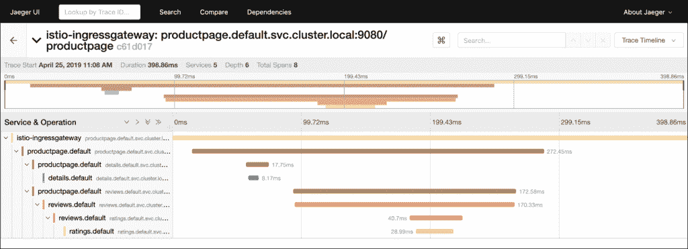
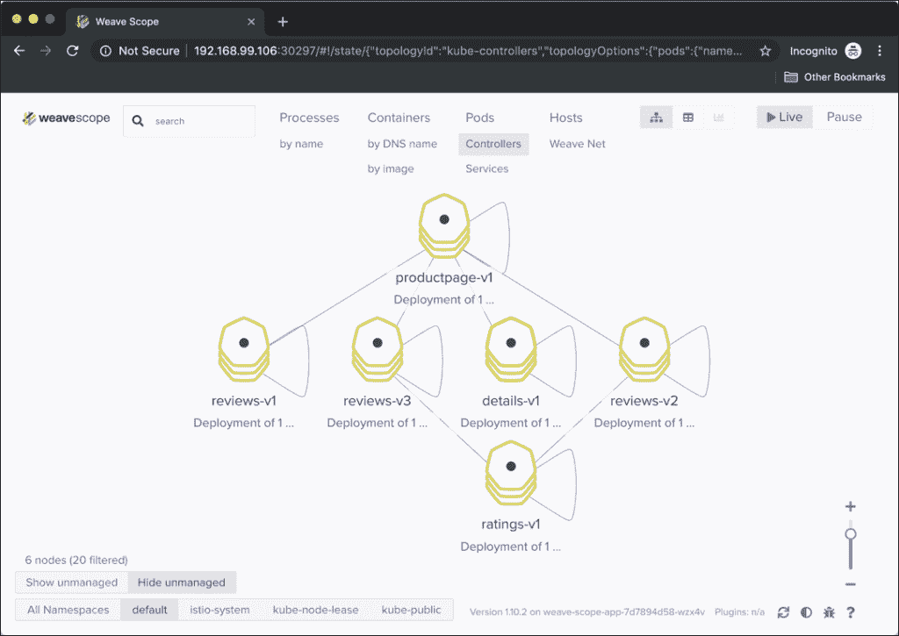

# 教程:探索 Istio 的交通规则和遥测能力

> 原文：<https://thenewstack.io/tutorial-explore-istios-traffic-rules-and-telemetry-capabilities/>

服务网格正成为微服务开发者不可或缺的技术。Istio 是最受欢迎的开源服务 mesh 之一，已经获得了社区的关注。

Istio 为开发人员提供了三种能力:

1.  交通路线
2.  遥感勘测
3.  安全策略

如果你是容器和微服务领域的初学者，使用服务网格的价值是很难理解的。

在本教程中，我将带您了解探索 Istio 的所有步骤。从建立基于 Minikube 的单节点 Kubernetes 集群到应用流量路由规则到可视化追踪信息，本指南将帮助您了解 Istio 的潜力。

我们将使用 Istio 附带的著名的 Bookinfo 示例。



### 为 Istio 设置 Minikube

由于 Istio 需要更多的 CPU 和 RAM，您需要在启动期间向 Minikube 传递额外的参数。以下命令启动具有 4 个 CPU 内核和 8GB 内存的 Minikube。

```
minikube start  \
  --memory=8192  \
  --cpus=4  \
  --vm-driver=virtualbox

```

在安装 Istio 之前，请等待 Kubernetes 集群启动。

### **安装 Istio**

Istio 可以很容易地与助手脚本一起安装，该脚本涉及部署一组自定义资源定义(CRD)。

运行以下命令在 Minikube 上部署 Istio。

```
curl  -L  https://git.io/getLatestIstio  |  sh  -

```

由于我们使用 Minikube 运行 Istio，因此在继续下一步之前，我们需要进行一项更改——将入口网关服务从类型 LoadBalancer 更改为 NodePort。

打开文件*/install/kubernetes/istio-demo . YAML*，搜索 LoadBalancer 并替换为 NodePort。



在运行以下命令之前，导航到 Istio 目录的根目录。

```
for  i  in install/kubernetes/helm/istio-init/files/crd*yaml;  do kubectl apply  -f  $i;  done

```

```
kubectl apply  -f  install/kubernetes/istio-demo.yaml

```

Istio 对象被部署到一个名为 **istio-system** 的名称空间中。



### 部署 Bookinfo 示例

Istio 可以自动将边车连接到每个 pod。要进行配置，我们需要向默认名称空间添加一个标签。

```
kubectl label namespace default istio-injection=enabled

```

让我们将示例应用程序部署到默认名称空间中。这个示例微服务应用程序有四个微服务——产品页面、评级、评论和详细信息。每个服务都有多个版本。产品页面从评级、评论和详细信息微服务的一个版本中检索数据。

我们将探讨如何根据特定条件动态配置到不同版本的路由。

```
kubectl apply  -f  ./samples/bookinfo/platform/kube/bookinfo.yaml

```

要访问 web 应用程序，我们需要配置网关。

```
kubectl apply  -f  ./samples/bookinfo/networking/bookinfo-gateway.yaml

```

注意每个 Pod 有两个容器。其中一个就是 Istio 注入的特使代理。



让我们创建一个规则，将流量从产品页面路由到所有 V1 服务。

```
kubectl apply  -f  ./samples/bookinfo/networking/destination-rule-all.yaml 
kubectl apply  -f  ./samples/bookinfo/networking/virtual-service-all-v1.yaml

```

我们现在可以通过入口网关访问网络应用。让我们从 Minkube 中检索 IP 地址和端口。

```
export INGRESS_HOST=$(minikube ip)
export INGRESS_PORT=$(kubectl  -n  istio-system get  service istio-ingressgateway  -o  jsonpath='{.spec.ports[?(@.name=="http2")].nodePort}')
open http://$INGRESS_HOST:$INGRESS_PORT/productpage

```


分级服务的版本 1 不显示星星，而 V2 和 V2 服务分别显示黑色和红色星星。下一步，我们将有选择地将流量路由到分级服务的一个版本。

## 执行交通规则

在保持主页运行的同时，我们现在将配置一个指向分级服务的 V2 的规则。

要全面了解如何使用 Istio 进行蓝/绿部署，请参考我在 New Stack 上发表的一篇文章。

该规则明确为用户 jason 启用 V2。只有当他登录后，他才能看到一个 5 星评级小部件。

让我们部署交通规则。以用户 jason 的身份登录，密码为 jason，然后刷新页面以查看评论下方的黑星。



请随意浏览位于*samples/book info/networking/virtual-service-reviews-test-v2 . YAML*的规则定义 YAML 文件。请注意规则是如何基于用户名定义的。

### 探索遥测数据

Istio 带有强大的遥测和可视化工具。我们将探索其中的几个工具，以深入了解微服务调用链的跟踪和可视化。

让我们为产品页面创造一些流量。

```
while true;  do curl  -s  http://$INGRESS_HOST:$INGRESS_PORT/productpage  >  /dev/null  && echo -n . && sleep 0.2;  done

```

通过端口转发打开 Grafana 仪表板。

```
kubectl  -n  istio-system port-forward  $(kubectl  -n  istio-system get  pod  -l  app=grafana  -o  jsonpath='{.items[0].metadata.name}')  3000:3000  &

```

访问 Istio mesh 仪表板，网址为 http://localhost:3000/dashboard/db/Istio-mesh-dashboard。



请随意探索特定于每个微服务的其他仪表盘。

现在，我们通过开源分布式寻人工具 Jaeger 来看寻人信息。

```
kubectl port-forward  -n  istio-system  $(kubectl get  pod  -n  istio-system  -l  app=jaeger  -o  jsonpath='{.items[0].metadata.name}')  16686:16686  &

```

```
open http://localhost:16686/

```


单击其中一个跨度，我们可以看到整个调用链的详细视图。



最后，让我们安装 Weave Scope，一个可视化分布式微服务的工具。

```
kubectl create  -f  'https://cloud.weave.works/launch/k8s/weavescope.yaml'

```

打开编织镜盒，进入仪表板。

```
pod=$(kubectl get  pod  -n  weave  --selector=name=weave-scope-app  -o  jsonpath={.items..metadata.name})  
kubectl expose pod  $pod  -n  weave  --type=NodePort  --port=4040  --target-port=4040
port=`kubectl get  svc  $pod  -n=weave  -o  json  |  jq  .spec.ports[].nodePort`

```

```
open http://$INGRESS_HOST:$port

```

点击默认名称空间，可视化与 BookInfo 示例相关的所有微服务。



本教程的目标是强调 Istio 的开箱即用功能。您可以轻松地为自己的基于微服务的应用程序实现其中的一些技术。

Pixabay 的 DavidRockDesign 的特征图像。

<svg xmlns:xlink="http://www.w3.org/1999/xlink" viewBox="0 0 68 31" version="1.1"><title>Group</title> <desc>Created with Sketch.</desc></svg>