# 教程:使用 Google Kubernetes 引擎探索项目 Calico 网络策略

> 原文：<https://thenewstack.io/tutorial-explore-project-calico-network-policies-with-google-kubernetes-engine/>

虚拟网络软件[项目 Calico](https://www.projectcalico.org/) 为 [Kubernetes](https://kubernetes.io/) 开源容器编排软件带来网络策略。虽然 Kubernetes 广泛支持基于角色的访问控制(RBAC ),但上游 Kubernetes 发行版中的默认网络堆栈不支持细粒度的网络策略。项目 Calico 通过允许和拒绝 Kubernetes 工作负载的流量来提供细粒度控制。

通过在 Kubernetes 上配置 Calico，我们可以配置允许或限制 Pods 流量的网络策略。与防火墙类似，可以为入口和出口流量规则配置 pod。

在本教程中，我们将通过在 [Google Kubernetes 引擎](https://cloud.google.com/kubernetes-engine/) (GKE)上部署一个应用程序来探索项目 Calico 的基础。与其他托管 Kubernetes 服务不同，GKE 提供了一个集成的 Calico 堆栈，可以在集群创建期间启用。也可以在现有的运行 GKE 集群上配置 Calico。

首先启动一个启用了网络策略的标准 GKE 集群。这可以通过单击**可用性、网络、安全性和附加功能**部分下的**启用网络策略**复选框来完成。

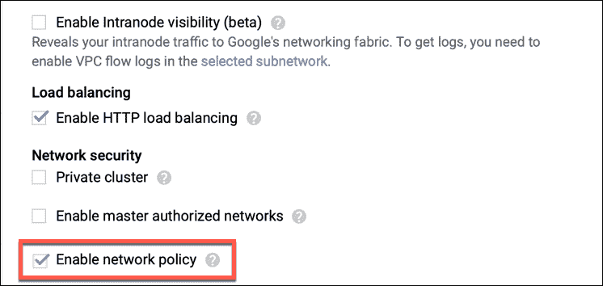

集群启动并运行后，我们可以检查作为 kube-system 名称空间中 Daemonset 的一部分部署的 Calico Pods。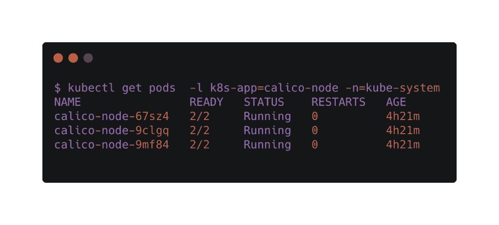让我们下载 Calico 的 CLI**calicoctl**，进一步探索环境。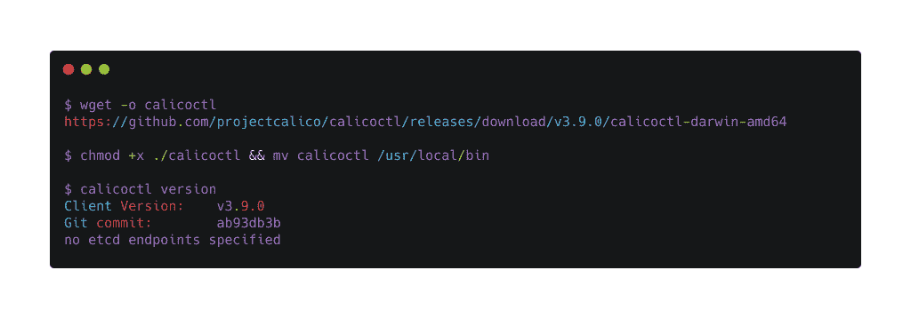我们需要将 **calicoctl** 指向 GKE 集群的 etcd 端点。这可以通过以下设置完成: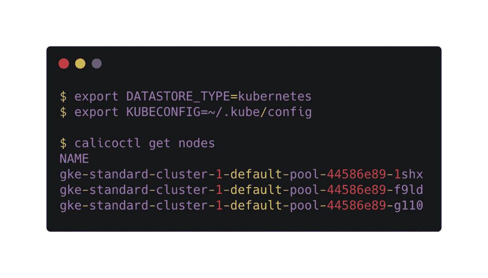

现在，让我们继续部署由 Project Calico 提供的一个示例。运行以下命令来部署应用程序。你可以从 Project Calico 的文档网站下载 YAML 文件。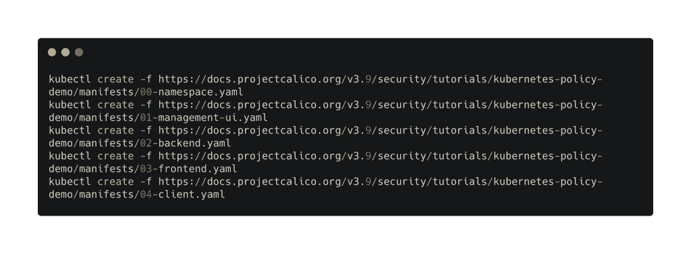这些 YAML 文件配置和部署了多个 Kubernetes 资源。让我们逐一探究。

首先，有三个名称空间——star、client 和 management-ui。stars 命名空间运行应用程序窗格的前端和后端，而 client 命名空间运行 client 窗格。management-ui 名称空间有一个显示部署的可视化表示的应用程序。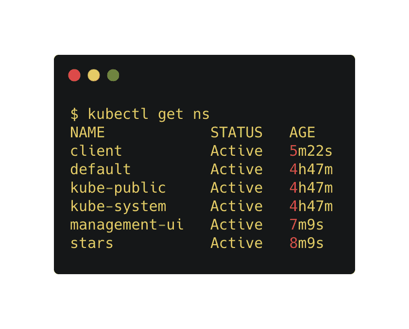stars 命名空间与应用程序的前端和后端相关联的两个 pod 和两个服务。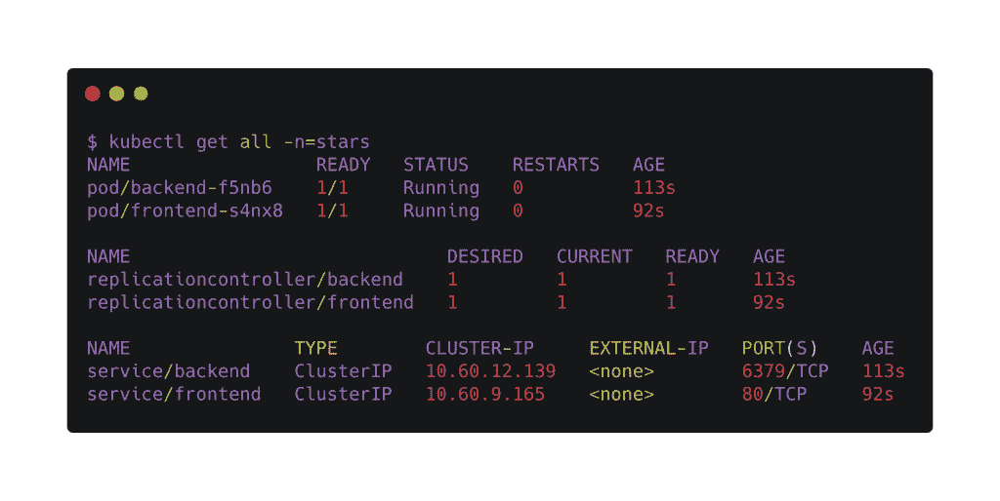客户机名称空间有客户机 Pod，它与运行在 stars 名称空间中的前端和后端 Pod 进行对话。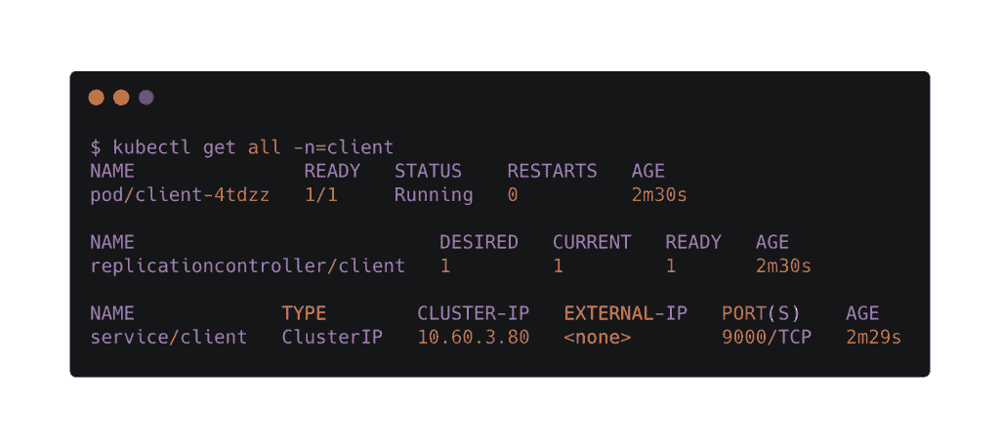management-ui 名称空间有一个 Pod 和一个服务，该服务运行用户界面以直观地显示部署。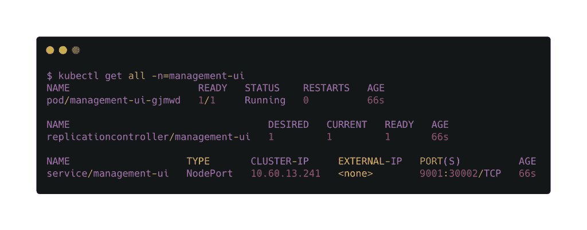

我们可以通过节点端口或代理访问 UI。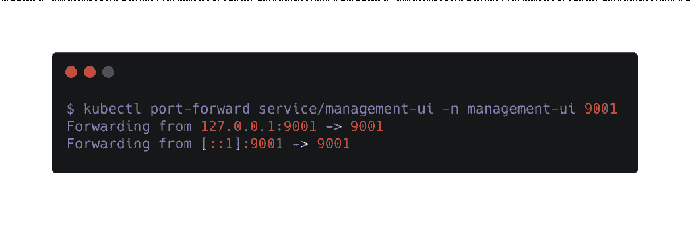

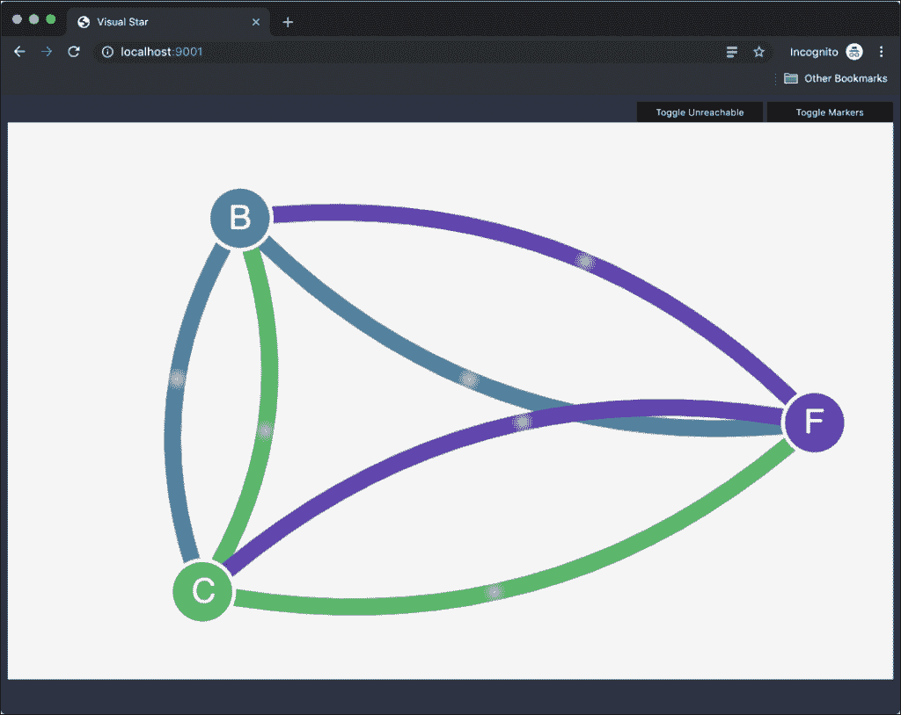

UI 中显示的每个点代表一个与前端(F)、后端(B)和客户端(C)相关联的微服务。我们可以看到流量正在流经所有的微服务。

我们现在将应用拒绝策略来阻止对所有 pod 的访问。运行以下命令会对 stars 和客户端命名空间实施该策略。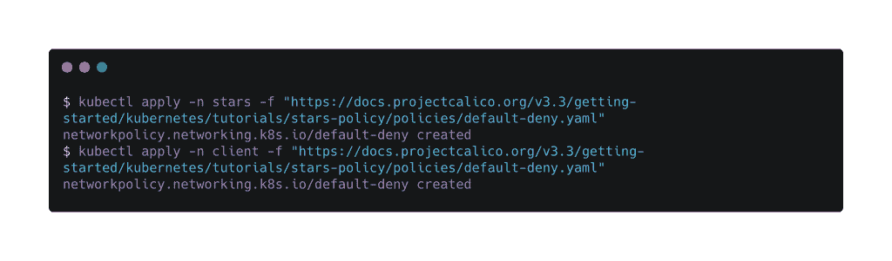刷新管理界面时，浏览器窗口为空白。这是因为我们没有明确允许服务访问运行在 stars 和 client 名称空间中的 pod。

我们将应用策略来允许 UI 访问窗格。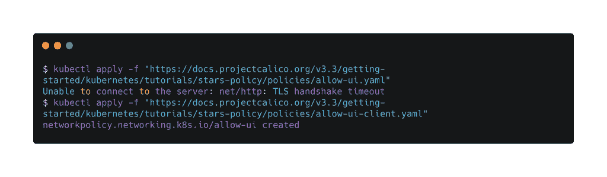刷新浏览器进入 UI。

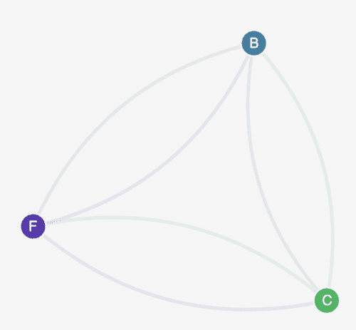

尽管 UI 能够访问 pod，但是它们仍然不能相互通信。让我们通过允许流量在前端、后端和客户端之间流动来改变这一点。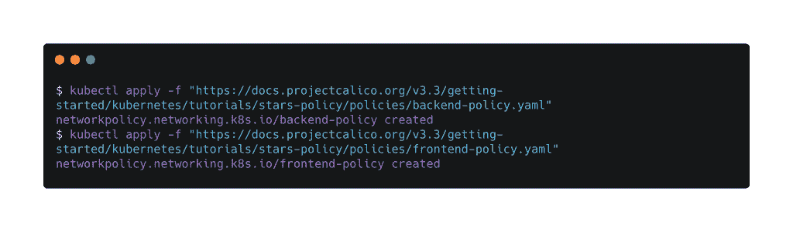刷新浏览器，检查流量是否畅通。

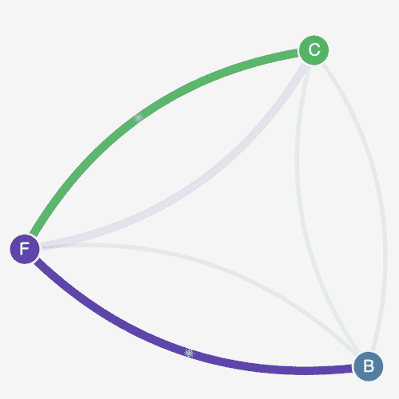

请注意，最新的策略将流量配置为仅通过前端从客户端流向后端。客户端不能直接与后端对话。

*贾纳基拉姆·MSV 的网络研讨会系列“机器智能和现代基础设施(MI2)”提供了涵盖前沿技术的信息丰富、见解深刻的会议。在 [http://mi2.live](http://mi2.live/) 注册参加即将到来的 MI2 网络研讨会。*

<svg xmlns:xlink="http://www.w3.org/1999/xlink" viewBox="0 0 68 31" version="1.1"><title>Group</title> <desc>Created with Sketch.</desc></svg>