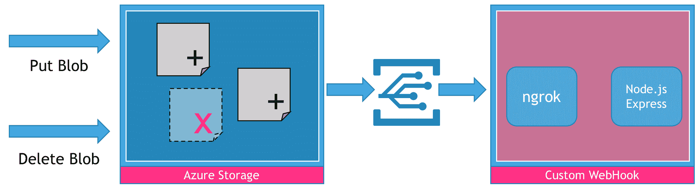
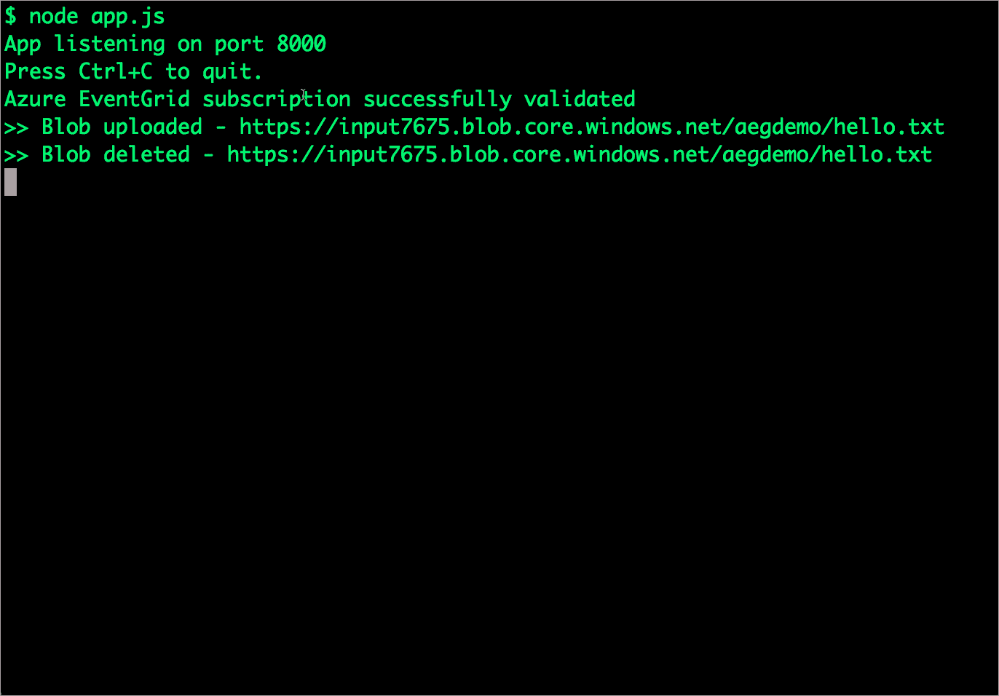

# 教程:使用自定义 Webhooks 探索 Azure 事件网格

> 原文：<https://thenewstack.io/tutorial-exploring-azure-event-grid-custom-webhooks/>

Azure Event Grid 是一个基于发布-订阅协议的托管事件路由服务。它使开发人员能够轻松地将事件发布者与消费者联系起来。2017 年 8 月，微软在 preview 中推出事件网格服务。上周，[它在 10 个 Azure 地区](https://thenewstack.io/microsoft-azure-event-grid-goes-live/)开始全面上市。

关于 Azure EventGrid 的概述，[请参考我 2017 年 10 月发表的文章](https://thenewstack.io/closer-look-azure-event-grid/)。自最初的预览版以来，微软已经添加了多个事件源和目的地，包括 Azure IoT Hub 和 Azure Event Hubs。该服务现在具有 99.99%的可用性，并有财政支持的 SLA。

除了使用 Azure 资源生成的事件，开发人员还可以使用事件网格作为通用的消息传递基础设施。这种能力使得无服务器应用和微服务能够无缝地相互通信。

事件网格消息的消费者之一是自定义 WebHook。通过这种集成，可以触发在各种环境中运行的事件，包括作为服务的功能(FaaS)或在防火墙后运行的自定义 REST 端点。

在本教程中，我们将探索一个场景，每次从 Azure 存储容器上传或删除文件时，本地 web 服务都会收到通知。我们将使用这个场景来理解 Azure 事件网格订阅的模式。尽管 REST 端点基于 Node.js Express 框架，但它可以很容易地扩展到无服务器环境，如 Azure Functions 或 Apache OpenWhisk。



在我们开始逐步指南之前，请确保您拥有有效的 Azure 订阅。你还需要在你的机器上安装最新版本的 [Azure CLI](https://docs.microsoft.com/en-us/cli/azure/install-azure-cli) 、 [ngrok](https://ngrok.com/) 和 [node.js](https://nodejs.org/) 。

让我们从设置环境开始。打开一个新的终端窗口，并在端口 8000 上启动 ngrok。这将打开一个到你本地机器的 HTTPS 隧道，使得从 Azure Event Grid 接收消息成为可能。


打开另一个终端窗口，运行以下命令来设置环境变量。不要忘记用实际的 ngrok URL 替换 END_POINT 变量。

```
$  LOC=westcentralus
$  RG=aegdemo
$  AZURE_STORAGE_ACCOUNT=input7675
$  END_POINT=https://e7fa39a5.ngrok.io

```

确保微软。EventGrid 已在您的帐户中注册，请运行以下命令。

```
$  az provider register  --namespace   Microsoft.EventGrid
$  az feature register  --name storageEventSubscriptions  --namespace Microsoft.EventGrid
$  az feature show  --name storageEventSubscriptions  --namespace Microsoft.EventGrid

```

您应该会看到类似如下的输出。这确认 Azure EventGrid 可用于您的订阅。

```
{
 "id":  "/subscriptions/&lt;subscription_id&gt;/providers/Microsoft.Features/providers/Microsoft.EventGrid/features/storageEventSubscriptions",
 "name":  "Microsoft.EventGrid/storageEventSubscriptions",
 "properties":  {
   "state":  "Registered"
 },
 "type":  "Microsoft.Features/providers/features"
}

```

让我们为将要创建的资源创建一个 Azure 资源组。

```
$  az  group  create  --name  $RG   --location  $LOC
{
 "id":  "/subscriptions/&lt;subscription_id&gt;/resourceGroups/aegdemo",
 "location":  "westcentralus",
 "managedBy":  null,
 "name":  "aegdemo",
 "properties":  {
   "provisioningState":  "Succeeded"
 },
 "tags":  null
}

```

接下来，我们将创建一个 Azure 存储帐户来存储 blobs。JSON 输出确认存储帐户已成功创建。

```
$  az storage account create  \
 --name  $AZURE_STORAGE_ACCOUNT  \
 --location  $LOC  \
 --resource-group  $RG  \
 --sku Standard_LRS  \
 --kind BlobStorage  \
 --access-tier Hot

```

在我们继续之前，是时候启动 Node.js 程序了，它将开始监听通过 ngrok 路由的请求。执行代码前还需要安装 [Express framework](https://expressjs.com/) 。

```
'use strict';
var express  =  require('express');
var bodyParser  =  require('body-parser');
var webhook_res=""
var app  =  express();

```

```
app.use(bodyParser.json());
app.post('/',function  (request,  response)  {
//  console.log(request.body);
 if('data'  in request.body[0]){
   if('validationCode'  in request.body[0].data)  {
     webhook_res  =  {'validationResponse':  request.body[0].data.validationCode}
     console.log('Azure EventGrid subscription successfully validated')
     response.send(webhook_res);
   }

```

```
     if(request.body[0].data.api=='PutBlob'){
       console.log('&gt;&gt; Blob uploaded - %s',  request.body[0].data.url)
     }
     if(request.body[0].data.api=='DeleteBlob'){
       console.log('&gt;&gt; Blob deleted - %s',  request.body[0].data.url)
     }
     response.send();
     response.end();
   }
});
var server  =  app.listen(process.env.PORT  ||  '8000',  function  ()  {
 console.log('App listening on port %s',  server.address().port);
 console.log('Press Ctrl+C to quit.');
});

```

在新的终端窗口中保存并运行上述代码:

```
$  node app.js
App listening on port  8000
Press Ctrl+C  to quit.

```

这个程序的关键在于 POST 处理程序，它处理到达端点的 WebHook 请求。

该应用程序将处理三种类型的请求—

1.  订阅验证
2.  斑点创建
3.  斑点删除

当我们向 Event Grid 注册我们自己的 WebHook 端点时，它会发送一个 POST 请求和一个简单的验证代码，以证明端点的所有权。应用程序需要通过回显验证码来做出响应。事件网格不会将事件传递给未通过验证的 WebHook 端点。

为了启用这种验证，我们检查主体中的 validationCode，并在响应中嵌入相同的代码。下面的代码片段负责这种验证。

```
   if('validationCode'  in request.body[0].data)  {
     webhook_res  =  {'validationResponse':  request.body[0].data.validationCode}
     console.log('Azure EventGrid subscription successfully validated')
     response.send(webhook_res);
   }

```

Azure 事件网格生成的后续请求将不包含验证代码。仅在订阅期间需要。订阅完成后，我们将在上传新 blob 或删除现有 blob 时收到请求。下面显示的代码片段处理这些事件。

```
     if(request.body[0].data.api=='PutBlob'){
       console.log('&gt;&gt; Blob uploaded - %s',  request.body[0].data.url)
     }
     if(request.body[0].data.api=='DeleteBlob'){
       console.log('&gt;&gt; Blob deleted - %s',  request.body[0].data.url)
     }

```

在我们的示例中，我们简单地打印了 blob 的 URL。这个场景可以很容易地扩展到强大的用例，比如将 blobs 备份到本地存储或其他云存储环境。

有了 WebHook，我们就可以创建一个事件网格订阅了。

```
$  az eventgrid resource event-subscription create  \
--endpoint  $END_POINT   \
--name aegdemosub  \
--provider-namespace Microsoft.Storage  \
--resource-type storageAccounts  \
--resource-group  $RG  \
--resource-name  $AZURE_STORAGE_ACCOUNT

```

请注意，我们正在指示事件网格处理由存储帐户引发的事件。

当您运行上面的命令时，我们的 Node.js 应用程序会响应显示以下输出。

```
$  node app.js
App listening on port  8000
Press Ctrl+C  to quit.
Azure EventGrid subscription successfully validated

```

您还将看到 Azure CLI 发出的 JSON 有效负载。这表明订阅已成功注册到 WebHook。

我们现在将在 Azure Storage 中创建一个容器来保存上传的文件。为了完成这一步，我们需要将访问密钥存储在 AZURE_STORAGE_ACCESS_KEY 环境变量中。以下命令处理这些步骤。

```
$  export AZURE_STORAGE_ACCOUNT=input7675
$  export AZURE_STORAGE_ACCESS_KEY="$(az storage account keys list --account-name $AZURE_STORAGE_ACCOUNT --resource-group $RG --query "[0].value" --output tsv)"
$  az  storage  container  create  --name  aegdemo
{
 "created":  true
}

```

存储容器就绪后，我们继续将文件上传到 Azure Storage。

```
$  echo  "Hello Azure Event Grid"  &gt;  hello.txt
$  az storage blob upload  --file hello.txt  --container-name aegdemo  --name hello.txt
Alive[################################################################]  100.000Finished[#############################################################]  100.0000%
{
 "etag":  "\"0x8D568A4964D19FD\"",
 "lastModified":  "2018-01-31T12:17:24+00:00"
}

```

现在，检查运行 Node.js 应用程序的终端窗口。它打印 blob 的 URL。

```
App listening on port  8000
Press Ctrl+C  to quit.
Azure EventGrid subscription successfully validated
&gt;&gt;  Blob uploaded  -  https://input7675.blob.core.windows.net/aegdemo/hello.txt

```

让我们继续删除斑点。

```
$  az storage blob delete  --container-name aegdemo  --name hello.txt
{
 "deleted":  null
}

```

不要忘记检查应用程序的输出。您将看到对所有三个请求的响应——订阅验证、blob 创建和 blob 删除。



通过运行以下命令执行清理。

```
# Delete the blob container
$  az storage container delete  -n  aegdemo
# Delete AEG subscription
$  az eventgrid resource event-subscription delete  \
--name aegdemosub  \
--provider-namespace Microsoft.Storage  \
--resource-type storageAccounts  \
--resource-group  $RG  \
--resource-name  $AZURE_STORAGE_ACCOUNT
# Delete Azure Storage account
$  az storage account delete  \
--name  $AZURE_STORAGE_ACCOUNT  \
--resource-group  $RG
# Delete Azure Resource Group
$  az group delete  -n  $RG

```

本教程的目标是向您介绍创建 Azure 事件网格订阅和通过自定义 WebHook 消费事件的所有步骤。我选择了 CLI 路径来突出显示此设置中涉及的工作流。

在即将到来的一个教程中，我将演示如何扩展这个场景来创建 Azure 存储帐户的无服务器、多云复制。敬请期待！

<svg xmlns:xlink="http://www.w3.org/1999/xlink" viewBox="0 0 68 31" version="1.1"><title>Group</title> <desc>Created with Sketch.</desc></svg>