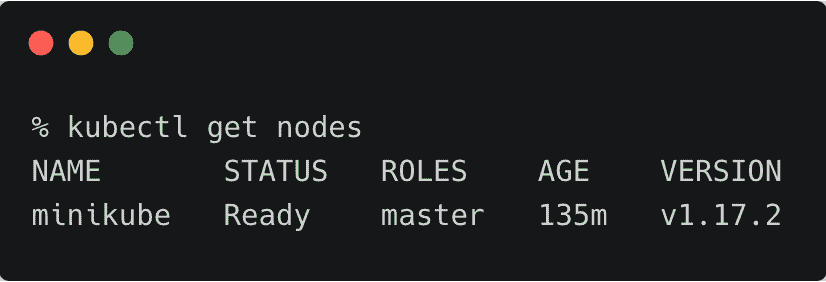
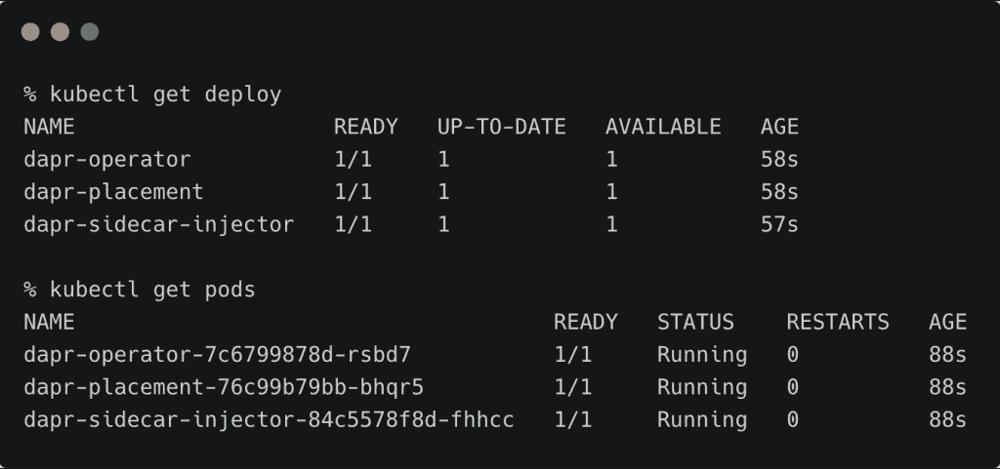
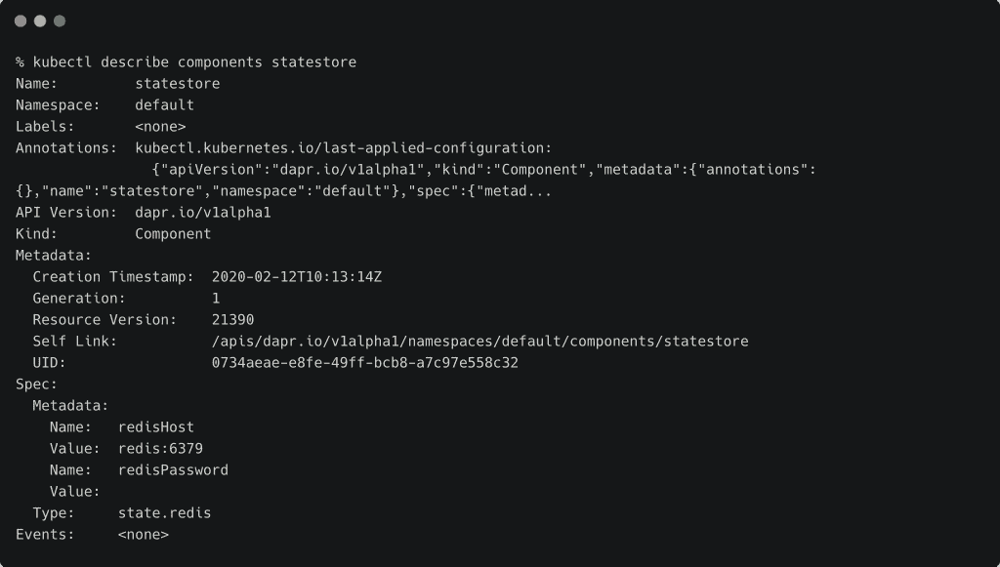
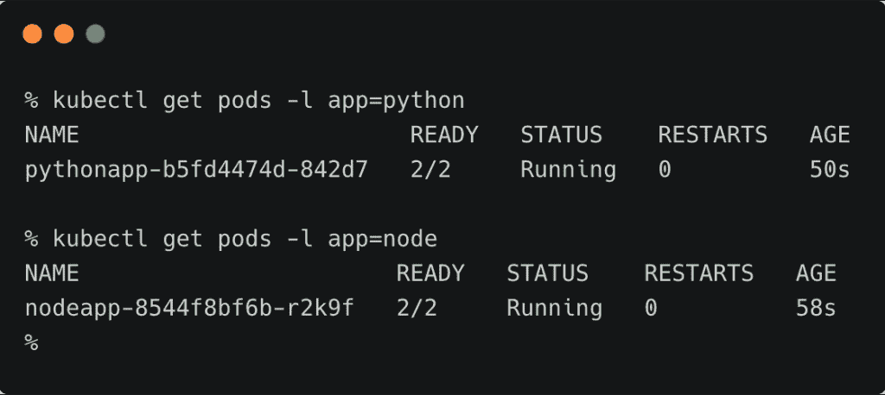
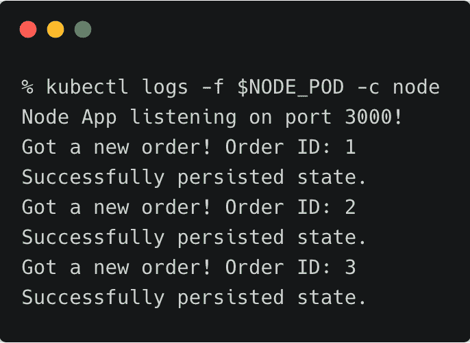
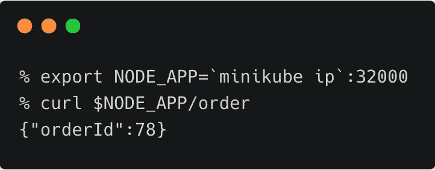
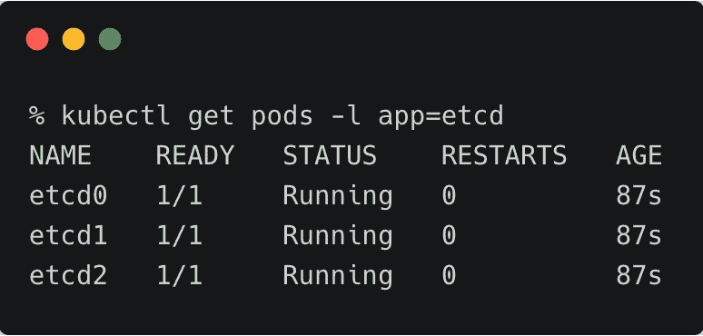
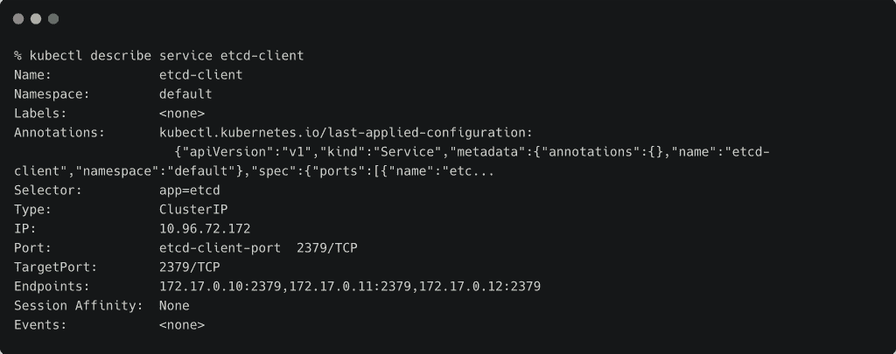
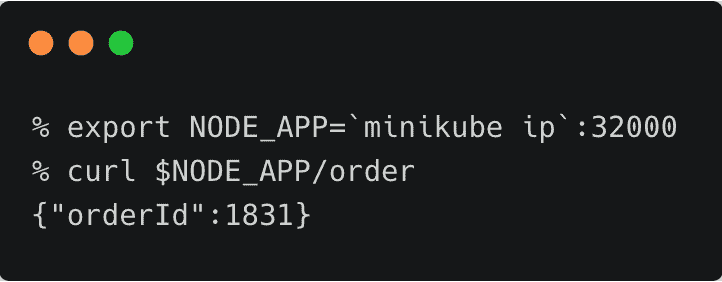
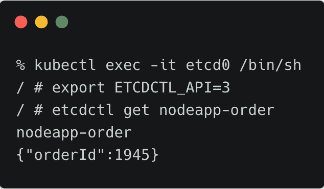

# 教程:首先看一下运行在 Kubernetes 中的微服务的 Dapr

> 原文：<https://thenewstack.io/tutorial-first-look-at-dapr-for-microservices-running-in-kubernetes/>

在之前的一篇文章中，我介绍了 Dapr 的架构和构建块，Dapr 是一个可移植的、事件驱动的分布式系统运行时，最初由微软开发。为了欣赏这个平台，让我们放大一下 Dapr 的状态管理构建块。本实践指南将带您了解在 Dapr 中处理状态管理的所有步骤。

## 背景

我们准备在 Kubernetes 中部署两个用 Node.js 和 Python 编写的微服务。服务将使用 Redis 作为持久层来存储状态。由于我们使用 Dapr，我们将使用 etcd 替换 Redis，同时继续运行微服务。

要完成本教程，您需要一个运行在 Minikube 中的 Kubernetes 集群或一个托管服务，如 [Azure Kubernetes 服务](https://azure.microsoft.com/en-us/services/kubernetes-service/) (AKS)。

我在我的开发机器上运行 Minikube。

[](https://thenewstack.io/tutorial-first-look-at-dapr-for-microservices-running-in-kubernetes/dapr-state-0/)

## 安装 Dapr

从 GitHub 存储库的[版本](https://github.com/dapr/dapr/releases)页面下载适用于您的操作系统的 Dapr CLI，重命名并将二进制文件添加到路径中。

运行下面的命令在您的 Kubernetes 环境中安装 Dapr。


安装程序在默认名称空间中部署了一些 pod，它们是 Dapr 控制平面的一部分。像服务网格一样，Dapr 有一个与 Kubernetes 集成的控制平面和一个在每个 Pod 内作为边车运行的数据平面。



**dapr-operator** Pod 监视带有 dapr 注释的 Pod。dapr-sidecar-injector Pod 负责将 sidecar 容器添加到每个标注为“【dapr.io/enabled:】true”的 Pod 中。最后， **dapr-placement** Pod 管理注入 Pod 的所有边车容器之间的通信。

## 将 Redis 配置为持久层

由于我们正在处理状态存储，下一步是部署 Redis 并将其配置为微服务的默认状态存储。

通过向 Kubernetes 提交下面的 YAML 文件来部署 Redis。这导致 Pod 和 ClusterIP 服务的创建。

```
apiVersion:  v1
kind:  Service
metadata:
  name:  redis
  labels:
    app:  redis
spec:
  ports:
  -  port:  6379
    name:  redis
    targetPort:  6379
  selector:
    app:  redis
---
apiVersion:  apps/v1
kind:  Deployment
metadata:
  name:  redis
spec:
  selector:
    matchLabels:
      app:  redis
  replicas:  1
  template:
    metadata:
      labels:
        app:  redis
    spec:
      containers:
      -  name:  redis-server
        image:  redis:3.2-alpine

```

```
kubectl apply  -f  redis.yaml

```


Redis Pod 启动并运行后，让我们将其配置为 Dapr 状态存储。用下面的规格创建一个 YAML 文件并应用它。

```
apiVersion:  dapr.io/v1alpha1
kind:  Component
metadata:
  name:  statestore
spec:
  type:  state.redis
  metadata:
  -  name:  redisHost
    value:  redis:6379
  -  name:  redisPassword
    value:  ""

```

```
kubectl apply  -f  redis-state.yaml

```

这为 Redis 创建了一个 [Rudr](https://github.com/oam-dev/rudr) 组件。Rudr 是微软和阿里巴巴联合创建的[开放应用模型(OAM)](https://github.com/oam-dev/spec) 规范的参考实现。关于 OAM 和 Rudr 的更多细节，请参考这篇[文章](/what-does-the-open-application-model-oam-and-rudr-mean-for-kubernetes-developers/)和[教程](https://janakiram.com/tns/tutorial-deploy-microservices-on-kubernetes-through-rudr/)。



## 部署使用 Dapr 状态存储的微服务

让我们从创建运行 Node.js 中编写的第一个微服务的 Pod 和服务规范开始。您可以在 Dapr [samples repo](https://github.com/dapr/samples) 中查看该微服务的代码。

```
kind:  Service
apiVersion:  v1
metadata:
  name:  nodeapp
  labels:
    app:  node
spec:
  selector:
    app:  node
  ports:
  -  protocol:  TCP
    port:  80
    targetPort:  3000
    nodePort:  32000
  type:  NodePort

---
apiVersion:  apps/v1
kind:  Deployment
metadata:
  name:  nodeapp
  labels:
    app:  node
spec:
  replicas:  1
  selector:
    matchLabels:
      app:  node
  template:
    metadata:
      labels:
        app:  node
      annotations:
        dapr.io/enabled:  "true"
        dapr.io/id:  "nodeapp"
        dapr.io/port:  "3000"
    spec:
      containers:
      -  name:  node
        image:  dapriosamples/hello-k8s-node
        ports:
        -  containerPort:  3000
        imagePullPolicy:  Always

```

注意，Pod 有 Dapr 的注释，作为注入边车容器的提示。

```
      annotations:
        dapr.io/enabled:  "true"
        dapr.io/id:  "nodeapp"
        dapr.io/port:  "3000"

```

```
kubectl apply  -f  node.yaml

```

如果你分析代码，你会发现微服务并不是直接指微服务中的持久存储。相反，它调用由 Dapr 运行时公开的 REST 端点。sidecar 容器负责启用微服务和 Dapr 运行时之间的通信。

```
const daprPort  =  process.env.DAPR_HTTP_PORT  ||  3500;
const stateStoreName  =  `statestore`;
const stateUrl  =  `http://localhost:${daprPort}/v1.0/state/${stateStoreName}`;

```

让我们部署用 Python 编写的第二个微服务，它不断调用上一步部署的第一个服务所公开的 API。

```
apiVersion:  apps/v1
kind:  Deployment
metadata:
  name:  pythonapp
  labels:
    app:  python
spec:
  replicas:  1
  selector:
    matchLabels:
      app:  python
  template:
    metadata:
      labels:
        app:  python
      annotations:
        dapr.io/enabled:  "true"
        dapr.io/id:  "pythonapp"
    spec:
      containers:
      -  name:  python
        image:  dapriosamples/hello-k8s-python

```

```
kubectl apply  -f  python.yaml

```

由于两个吊舱都标注了 Dapr，控制平面已将边车注入吊舱。



检查节点窗格的日志显示状态是持久的。

```
NODE_POD=$(kubectl get pods  -l  app=node  -o  jsonpath='{.items[0].metadata.name}')
kubectl logs  -f  $NODE_POD  -c  node

```



您也可以从 Minikube 的节点端口访问相同的内容。

```
export NODE_APP=`minikube ip`:32000
curl  $NODE_APP/order

```



您可以通过访问 Redis 窗格中的 CLI 来检查键/值对。

```
REDIS_POD=$(kubectl get pods  -l  app=redis  -o  jsonpath='{.items[0].metadata.name}')
kubectl exec  -it  $REDIS_POD  --  redis-cli HGETALL  "nodeapp-order"

```


## 用 etcd 替换 Redis 状态存储

Dapr 还支持 etcd 作为州存储构件服务的组件之一。现在让我们用 etcd
替换 Redis 状态存储。首先，创建一个 etcd 集群。您可以使用[舵图](https://bitnami.com/stack/etcd/helm)或以下 YAML 规格在 Kubernetes 中部署 3 节点 etcd 集群。

```
apiVersion:  v1
kind:  Service
metadata:
  name:  etcd-client
spec:
  ports:
  -  name:  etcd-client-port
    port:  2379
    protocol:  TCP
    targetPort:  2379
  selector:
    app:  etcd
---
apiVersion:  v1
kind:  Pod
metadata:
  labels:
    app:  etcd
    etcd_node:  etcd0
  name:  etcd0
spec:
  containers:
  -  command:
    -  /usr/local/bin/etcd
    -  --name
    -  etcd0
    -  --initial-advertise-peer-urls
    -  http://etcd0:2380
    -  --listen-peer-urls
    -  http://0.0.0.0:2380
    -  --listen-client-urls
    -  http://0.0.0.0:2379
    -  --advertise-client-urls
    -  http://etcd0:2379
    -  --initial-cluster
    -  etcd0=http://etcd0:2380,etcd1=http://etcd1:2380,etcd2=http://etcd2:2380
    -  --initial-cluster-state
    -  new
    image:  quay.io/coreos/etcd:latest
    name:  etcd0
    ports:
    -  containerPort:  2379
      name:  client
      protocol:  TCP
    -  containerPort:  2380
      name:  server
      protocol:  TCP
  restartPolicy:  Always
---
apiVersion:  v1
kind:  Service
metadata:
  labels:
    etcd_node:  etcd0
  name:  etcd0
spec:
  ports:
  -  name:  client
    port:  2379
    protocol:  TCP
    targetPort:  2379
  -  name:  server
    port:  2380
    protocol:  TCP
    targetPort:  2380
  selector:
    etcd_node:  etcd0
---
apiVersion:  v1
kind:  Pod
metadata:
  labels:
    app:  etcd
    etcd_node:  etcd1
  name:  etcd1
spec:
  containers:
  -  command:
    -  /usr/local/bin/etcd
    -  --name
    -  etcd1
    -  --initial-advertise-peer-urls
    -  http://etcd1:2380
    -  --listen-peer-urls
    -  http://0.0.0.0:2380
    -  --listen-client-urls
    -  http://0.0.0.0:2379
    -  --advertise-client-urls
    -  http://etcd1:2379
    -  --initial-cluster
    -  etcd0=http://etcd0:2380,etcd1=http://etcd1:2380,etcd2=http://etcd2:2380
    -  --initial-cluster-state
    -  new
    image:  quay.io/coreos/etcd:latest
    name:  etcd1
    ports:
    -  containerPort:  2379
      name:  client
      protocol:  TCP
    -  containerPort:  2380
      name:  server
      protocol:  TCP
  restartPolicy:  Always
---
apiVersion:  v1
kind:  Service
metadata:
  labels:
    etcd_node:  etcd1
  name:  etcd1
spec:
  ports:
  -  name:  client
    port:  2379
    protocol:  TCP
    targetPort:  2379
  -  name:  server
    port:  2380
    protocol:  TCP
    targetPort:  2380
  selector:
    etcd_node:  etcd1
---
apiVersion:  v1
kind:  Pod
metadata:
  labels:
    app:  etcd
    etcd_node:  etcd2
  name:  etcd2
spec:
  containers:
  -  command:
    -  /usr/local/bin/etcd
    -  --name
    -  etcd2
    -  --initial-advertise-peer-urls
    -  http://etcd2:2380
    -  --listen-peer-urls
    -  http://0.0.0.0:2380
    -  --listen-client-urls
    -  http://0.0.0.0:2379
    -  --advertise-client-urls
    -  http://etcd2:2379
    -  --initial-cluster
    -  etcd0=http://etcd0:2380,etcd1=http://etcd1:2380,etcd2=http://etcd2:2380
    -  --initial-cluster-state
    -  new
    image:  quay.io/coreos/etcd:latest
    name:  etcd2
    ports:
    -  containerPort:  2379
      name:  client
      protocol:  TCP
    -  containerPort:  2380
      name:  server
      protocol:  TCP
  restartPolicy:  Always
---
apiVersion:  v1
kind:  Service
metadata:
  labels:
    etcd_node:  etcd2
  name:  etcd2
spec:
  ports:
  -  name:  client
    port:  2379
    protocol:  TCP
    targetPort:  2379
  -  name:  server
    port:  2380
    protocol:  TCP
    targetPort:  2380
  selector:
    etcd_node:  etcd2

```

```
kubectl apply  -f  etcd.yaml

```



etcd 端点被公开为 ClusterIP 服务。



现在，我们可以删除现有的状态存储组件，并用指向 etcd 的指针重新创建它。

下面的规范创建了一个 etcd 状态存储:

```
apiVersion:  dapr.io/v1alpha1
kind:  Component
metadata:
  name:  statestore
spec:
  type:  state.etcd
  metadata:
  -  name:  endpoints
    value:  "etcd-client:2379"
  -  name:  dialTimeout
    value:  "5s"

```

```
kubectl delete  -f  redis-state.yaml
kubectl apply  -f  etcd-state.yaml

```

删除 Node.js Pod 以强制 Kubernetes 启动新的 Pod。

```
NODE_POD=$(kubectl get pods  -l  app=node  -o  jsonpath='{.items[0].metadata.name}')
kubectl delete pod/$NODE_POD

```

等待 Node.js Pod 准备就绪，然后通过调用第一个微服务的 NodePort 端点来检查一切是否完好无损。

```
export NODE_APP=`minikube ip`:32000
curl  $NODE_APP/order

```



您还可以从一个 etcd 窗格中使用 etcdctl 客户端来检查维护状态的键/值对。

```
kubectl exec  -it etcd0  /bin/sh
export ETCDCTL_API=3
etcdctl get nodeapp-order

```



本教程演示了如何在 Kubernetes 中使用 Dapr 状态服务。在未来的教程中，我们将探索 Dapr 的资源绑定构建块。

*贾纳基拉姆·MSV 的网络研讨会系列“机器智能和现代基础设施(MI2)”提供了涵盖前沿技术的信息丰富、见解深刻的会议。在 http://mi2.live .上注册参加即将举行的 MI2 网络研讨会*

<svg xmlns:xlink="http://www.w3.org/1999/xlink" viewBox="0 0 68 31" version="1.1"><title>Group</title> <desc>Created with Sketch.</desc></svg>