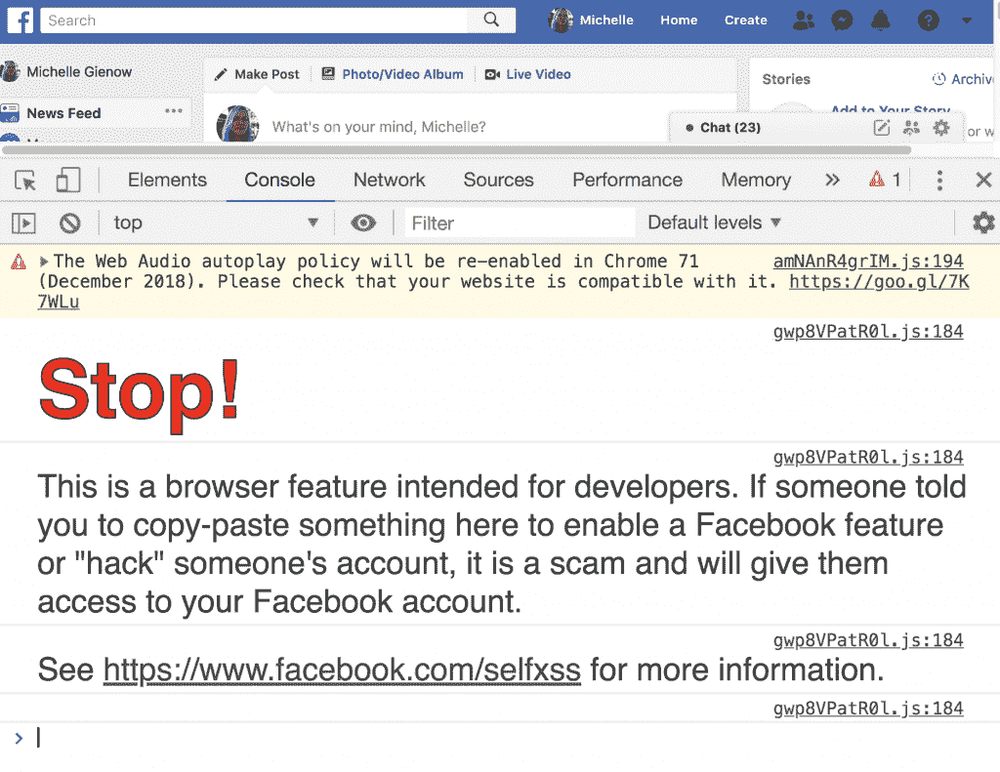
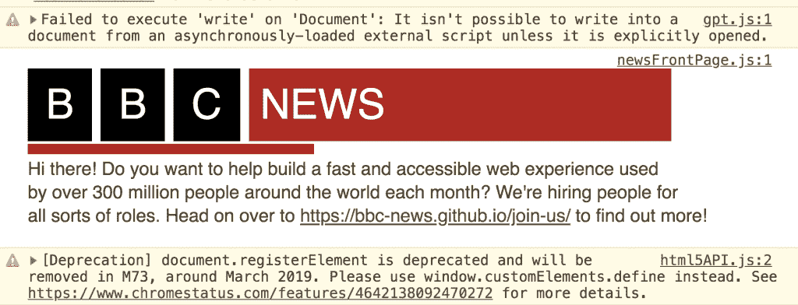
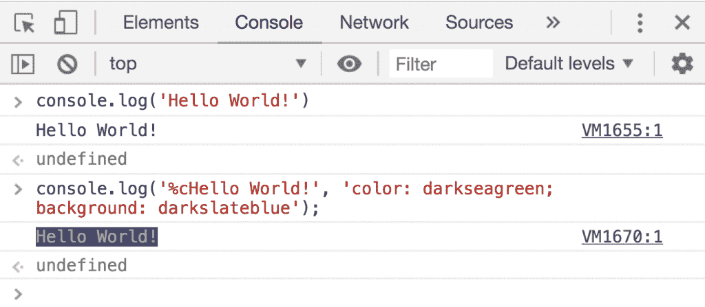
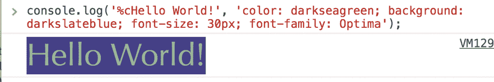
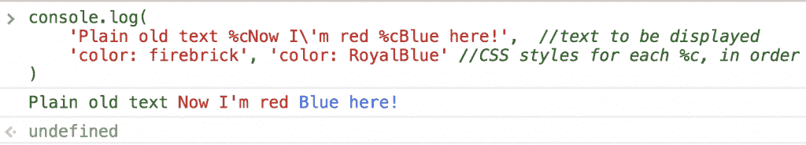
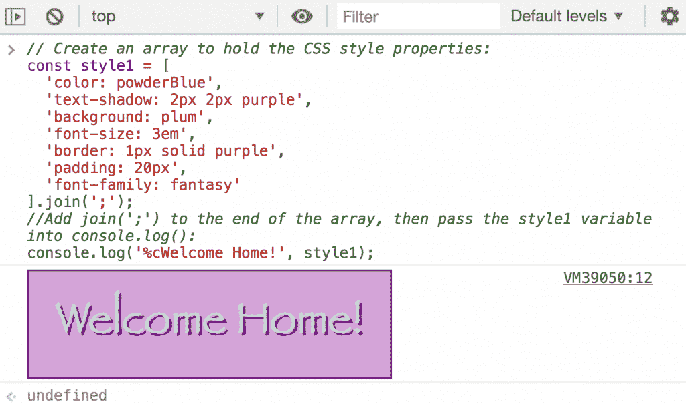
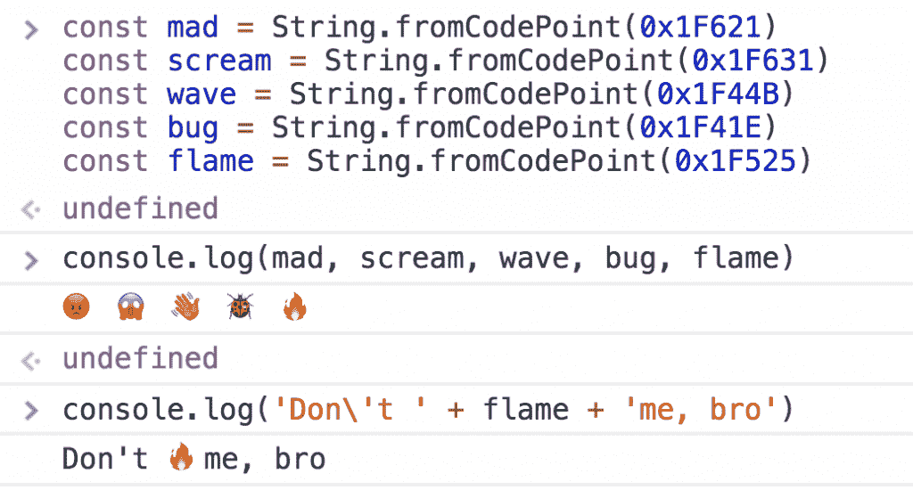
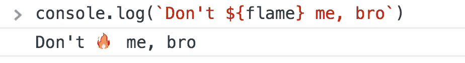
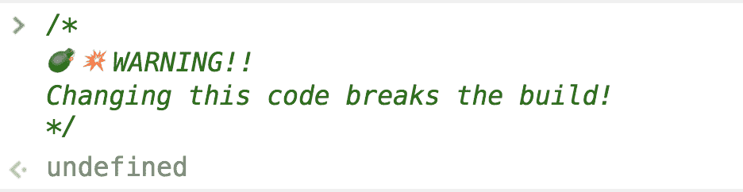

# 教程:使用控制台语句获得创造力

> 原文：<https://thenewstack.io/tutorial-getting-creative-with-console-statements/>

嘿，孩子们！你有没有在像脸书这样的网站上打开开发工具，出于无聊的好奇，只是检查里面有什么……然后发现控制台里有一条丰富多彩的消息在等着你？



几年前，为了应对一个大规模的网络钓鱼骗局，脸书制定了这个现在有点出名的控制台警告。不知情的用户被引导在浏览器中打开控制台，复制/粘贴一组暴露其用户信息的 JavaScript 命令。张贴一个严厉的“这里有龙”的警告是不够的，所以脸书决定更进一步，有效地禁用用户执行控制台命令的能力。许多其他网站——如网飞、不和谐网站和易贝网站——不久之后也开始做同样的事情。阻止控制台执行并不是我们今天要讨论的内容，但是如果你想自己看看禁用控制台的代码，这里是。

我们在这里讨论的是如何设计你的控制台信息。你说什么完全取决于你自己，但是这个教程将向你展示如何使用 CSS 属性给你的控制台带来一点闪光。

我们为什么要这么做？主要原因是它实在太酷了。一个有趣的方式让开发者向其他开发者呼喊，甚至，因为我们很可能是唯一一个在浏览器下寻找的人。一个典型的例子是:科技公司现在利用游戏机作为人才招聘/雇佣的工具。在 iCloud.com、BBC.com 和 Reddit 等网站上点击 command+option+j，你会发现一个开发人员友好的问候，并带有一个指向他们工作页面的点击链接。



如果你不得不向任何有权威的人解释或证明你的附庸风雅行为，你可以指出这也是一件功能性的，甚至是有用的事情。在任何在浏览器控制台中打印出大量日志的 web 应用程序中，设计日志信息的样式将有助于确保重要信息不会被淹没，永远不会再被看到。这是一个合法的调试辅助工具，所以！如果你的老板仍然对你高谈阔论，那么，控制台窗口里有很多工作机会…

那么我们该怎么做呢？

## 退后，我要去%c 了

实现控制台输出的关键是一个奇怪但有趣的 JavaScript 和 CSS 混搭:指定符“%c”。

基本上，%c 是一个 JS 占位符，它与第二个参数成对出现，第二个参数由 CSS 属性组成。结果将 CSS 样式规则应用于输出字符串，并将其记录到控制台。

我们实际上是在告诉编译器，'把这个东西放在这里。现在把它变蓝/变大/加粗/等等。“无论你的小心脏想要什么样式……当然，只要它受 CSS3 支持。

它是这样工作的:

```
 console.log('%cHello World!',  'color:  darkseagreen;’);

```

1.  首先，以“%cMy string here”的格式传入您选择的文本字符串作为第一个参数——您可以键入任何内容，任何长度。只要您记得以“%c”开始字符串，并用引号打开和关闭语句，它就会呈现出来。因此，在我们的例子中，第一个参数是“%cHello World！”。
2.  现在，再次在引号中，传入您希望应用于文本的所有样式。我们将开始简单，只是改变字体和背景颜色:'颜色:暗海绿色；背景:darkslateblue’)。



颜色、字体、大小、背景——如果你能在 CSS 中做到，你也能在控制台中做到！

让我们把它变得更大，改变字体，让它看起来更漂亮:



这里有几条规则，如果您曾经在前端开发人员的战壕中苦干过哪怕一点点时间，您都会很熟悉:

*   颜色可以用十六进制值表示(一个“3”后跟一个六字符字母数字识别码。白色是#ffffff，比如；我们的示例颜色 DarkSlateBlue 是#483D8B)。
*   颜色也可以(可能是最可靠的)被渲染为 [140 种内置 CSS 颜色](https://www.w3schools.com/cssref/css_colors.asp)中的一种。这些你只要叫出名字:DarkSlateBlue。耐火砖。黄绿色。(当然也有黑色、白色和十几种不同深浅的灰色……但我们应该变得更花哨，对吗？).写出这些名称是不区分大小写的，但是为了更好的可读性，我通常使用 camel case。
*   所有的 CSS 字体样式属性都可供你使用:大小、粗细、字体系列等。
*   至于字体本身，您可以通过名称调用它们来改变默认的 sans-serif 控制台字体。有五种内置字体[保证所有浏览器都能识别并支持:衬线字体、无衬线字体、等宽字体、草书字体和幻想字体。](https://www.w3.org/Style/Examples/007/fonts.en.html)
*   还有其他一些通用字体也同样受到普遍支持和安全:Arial、Helvetica、Verdana、Times New Roman。Chrome 似乎也支持很多其他的库字体，所以可以试试 Trebuchet 或 Optima。
*   把你喜欢的风格串联起来；请记住，每个 CSS 属性/值样式对必须用分号与下一个内联样式声明分隔开。直到你走到最后；与 CSS 或 JS 不同，最后一个样式声明以引号结束，没有分号。

注意:尽管“console.log()”是最广为人知和最常用的，但实际上有五种形式的控制台消息。其他的是“console.error()”——当然你希望永远不要看到——加上“console.debug()”、“console.warn()”和“console . error()”。然而，不管信息的种类有多种，它们都可以用完全相同的方式来设计。

## 一条信息，多种风格

如果您想要在同一文本字符串中中途更改样式，只需在您想要新样式生效的单词前插入一个新的“%c”即可:



这是可行的，因为我们实际上是在文本中为%c 的每个新实例传递一个新参数。

### 作为 JS 数组的 CSS 样式

如果你真的在给自己画一个 console.log()杰作，你的内联样式参数会变得很长。在这个组合中应用一点 o' JavaScript 可以很好地组织事情。诀窍是将样式作为数组传递到日志语句中，然后使用 join()方法将它们转换成字符串。

1.创建一个数组变量来保存所有你想要应用的 CSS 样式属性:

```
const style1  =  [
   'color: powderBlue',
   'text-shadow: 2px 2px purple',  
   'background: plum',  
   'font-size: 3em',
   'border: 1px solid purple',
   'padding: 20px',
   'font-family: fantasy'
];

```

2。追加联接('；'))到数组变量的末尾:

```
const style1  =  [
...styles here...
].join(';');

```

3。将变量与您要发送给外界的任何消息一起传递到 console.log()中。不要忘记以%c 开头，并用引号将整个内容括起来:

```
console.log('%cWelcome Home!',  style1);

```



使用带有分号参数的 join()告诉该方法获取数组并将其转换为单个字符串，其中每个元素由分号分隔——这当然是我们的 JS %c 风格语法所需要的。

## 控制台中的表情符号

表情符号？现在你真的变傻了。但是，再次强调实用性:从列表中选择表情符号要比随机的文本字符串容易得多。这种略读能力可以带来真正的生产率提高。另外，说到代码注释，谁会真的去读呢？添加一个醒目的表情图标意味着人们可能会停下来仔细阅读你的重要想法。

将表情符号加入代码的最安全的方式是通过 Unicode 和 String.fromCodePoint()方法。Unicode.org 有一个所有可用 Unicode 表情符号的综合列表，目前有 1644 个。所以，是的，几乎任何你能想到的概念都是通过小小的卡通图标来表现的。然而，要注意的是，并不是所有的浏览器都支持它们，你需要为一些熟悉的收藏夹找到变通方法，比如大脑图标和呕吐脸。

每个表情符号都有一个独特的六位数识别码，您可以将它传递到。fromCodePoint()进行保存，然后进行渲染。比如思维脸 emoji？就是 1F914。但是，为了让编译器呈现 Unicode，您需要在它前面加上 0x。



不幸的是，目前我找不到方法把它们当作另一个文本字符，这意味着没有办法对它们应用样式。浏览器对表情符号的支持在这一点上非常原始。然而，您可以使用[字符串模板文字](https://developer.mozilla.org/en-US/docs/Web/JavaScript/Reference/Template_literals)，这是 ES6 的新特性，允许在文本字符串中嵌入变量。(参见[本教程](https://thenewstack.io/fat-arrow-points-way-easy-es6-goodies-busy-js-devs/)了解更多关于在 JavaScript 中使用字符串文字的内容)。



如果你只是想在评论中加入表情符号，而不是将它们插入到作为日志一部分生成的字符串中，你可以安全地从电脑的内置键盘中拖放。对于 Mac 用户，这将是 control + command +空格键，然后单击您想要的并拖到您的控制台。



它还可以将 console.log 语句拖到您的控制台中，但是我又一次听到了由编码问题引入的奇怪错误和崩溃的报告，所以为了安全起见:在非注释/活动代码中，使用 Unicode。

现在，走出去，在控制台中享受一些创造性的、丰富多彩的乐趣吧！

<svg xmlns:xlink="http://www.w3.org/1999/xlink" viewBox="0 0 68 31" version="1.1"><title>Group</title> <desc>Created with Sketch.</desc></svg>