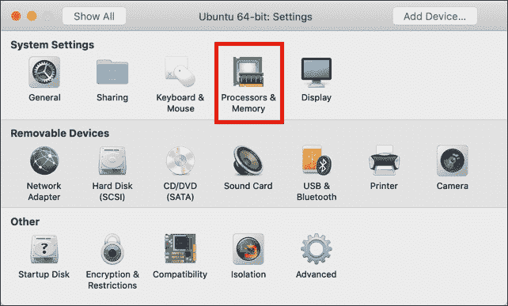
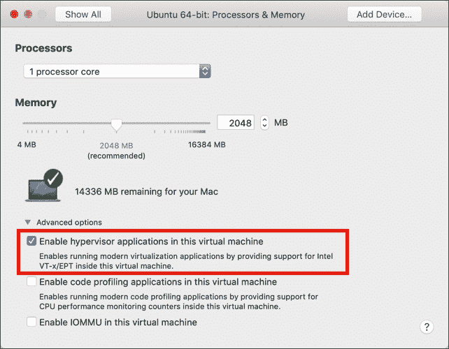
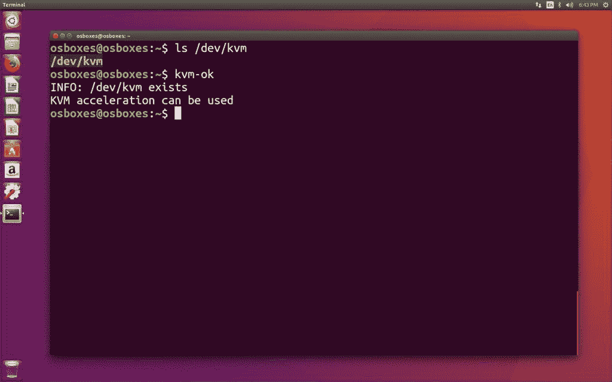
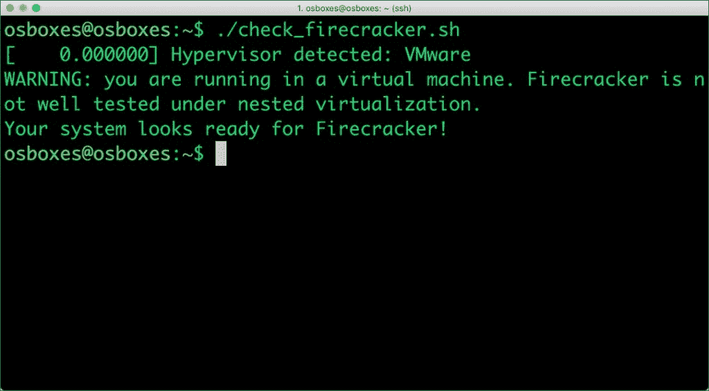
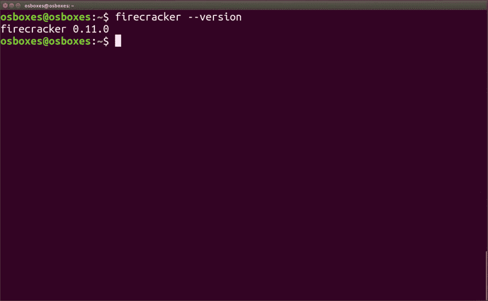
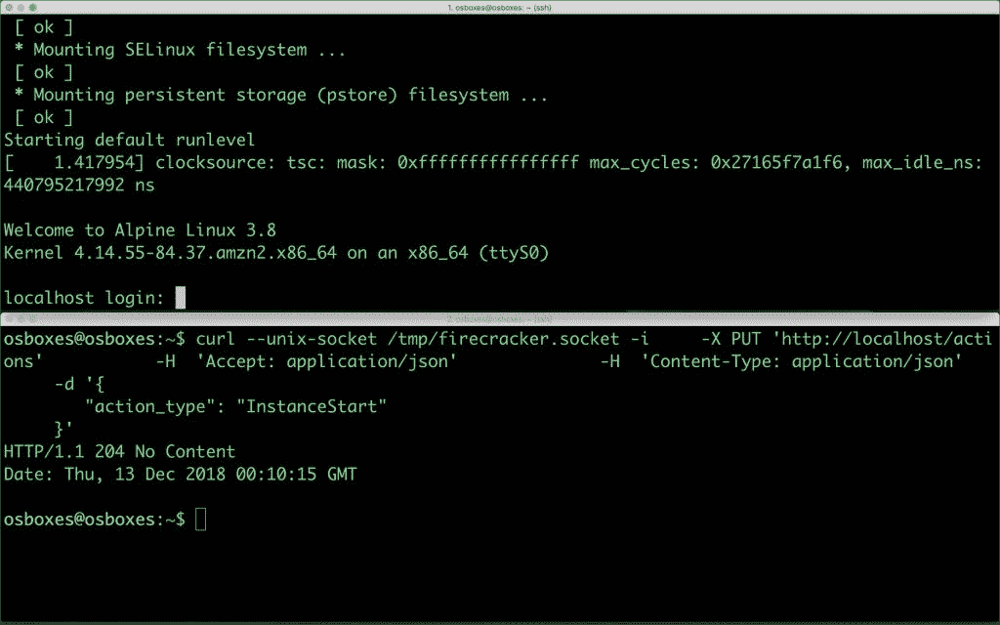
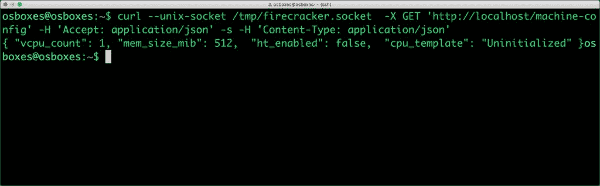
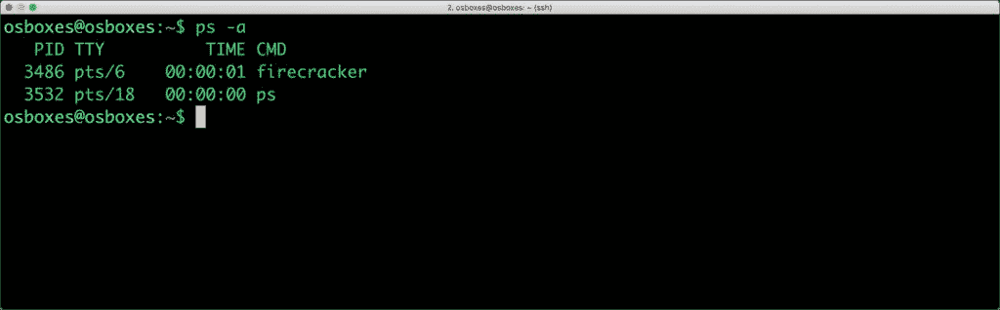
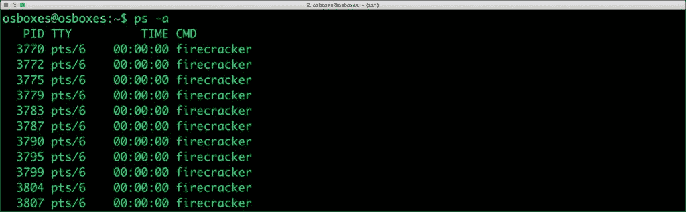

# 教程:VMware Fusion 上的鞭炮入门

> 原文：<https://thenewstack.io/tutorial-getting-started-with-firecracker-on-vmware-fusion/>

这是上周发表的[鞭炮篇](https://thenewstack.io/how-firecracker-is-going-to-set-modern-infrastructure-on-fire/)的第二部分。在介绍了基本架构之后，我将带您浏览在本地开发机器上设置和配置鞭炮所涉及的步骤。

探索鞭炮最简单的方法是将它安装在运行于 VMware Fusion 之上的 Ubuntu VM 中。第一步是为嵌套虚拟化配置 VMware Fusion。

## **设置带有嵌套虚拟化的 Ubuntu 16.04 虚拟机**

从 VMware 网站下载并安装用于 Mac 或 Windows 的 [VMware Fusion](https://www.vmware.com/in/products/fusion.html) 试用版。如果你需要一个预配置的 Ubuntu 16.04 镜像，从 OSBoxes.org 获取 [VMDK](https://www.osboxes.org/ubuntu/) 。

安装 Fusion 后，导入 VMDK 并创建一个新的虚拟机，但不要启动它。访问处理器和内存配置下的设置，启用英特尔 VTx 支持。

[](https://thenewstack.io/tutorial-getting-started-with-firecracker-on-vmware-fusion/firecracker-0/)

[](https://thenewstack.io/tutorial-getting-started-with-firecracker-on-vmware-fusion/firecracker-1/)

由于鞭炮需要 KVM，我们需要模拟虚拟机管理程序。上述配置支持嵌套虚拟化在 Fusion 之上运行 KVM。

启动 Ubuntu 虚拟机，使用用户名和密码–*osboxes*和*osboxes.org*登录。安装 VMware Tools，并可选地安装 OpenSSH 服务器。

安装 CPU Checker 以确保 KVM 可以使用。

```
$  sudo apt-get install cpu-checker

```

[](https://thenewstack.io/tutorial-getting-started-with-firecracker-on-vmware-fusion/firecracker-2-2/) 
在不到 10 分钟的时间里，我们已经准备好了实验用的鞭炮试验台。

*注意:鞭炮应该与 VirtualBox 和 Hyper-V 一起工作，并启用嵌套虚拟化设置。我还没有测试过这些环境。*

## **安装并验证鞭炮 VMM**

鞭炮需要读/写访问 KVM。运行下面的命令来启用它:

```
$  sudo setfacl  -m  u:${USER}:rw  /dev/kvm

```

下面的脚本将验证系统是否已为鞭炮做好准备。

```
err="";  \
[  "$(uname) $(uname -m)"  =  "Linux x86_64"  ]  \
||  err="ERROR: your system is not Linux x86_64.";  \
[  -r  /dev/kvm  ]  &amp;&amp;  [  -w  /dev/kvm  ]  \
||  err="$err\nERROR: /dev/kvm is innaccessible.";  \
((  $(uname  -r  |  cut  -d.  -f1)*1000  +  $(uname  -r  |  cut  -d.  -f2)  &gt;=  4014  ))  \
||  err="$err\nERROR: your kernel version ($(uname -r)) is too old.";  \
dmesg  |  grep  -i  "hypervisor detected"  \
&amp;&amp;  echo  "WARNING: you are running in a virtual machine. Firecracker is not well tested under nested virtualization.";  \
[  -z  "$err"  ]  &amp;&amp;  echo  "Your system looks ready for Firecracker!"  ||  echo  -e  "$err"

```

[](https://thenewstack.io/tutorial-getting-started-with-firecracker-on-vmware-fusion/firecracker-3/) 
我们来下载鞭炮二进制吧。

```
$  curl  -LOJ https://github.com/firecracker-microvm/firecracker/releases/download/v0.11.0/firecracker-v0.11.0

```

```
$  mv firecracker-v0.11.0  firecracker

```

```
$  sudo mv  ./firecracker  /usr/local/bin/

```

检查鞭炮版本，验证安装。

[](https://thenewstack.io/tutorial-getting-started-with-firecracker-on-vmware-fusion/firecracker-4/)

## **启动并访问你的第一个鞭炮虚拟机**

打开一个新的终端，发射鞭炮。在此之前，让我们确保鞭炮可以创建它的 API 套接字。

```
$  rm  -f  /tmp/firecracker.socket
$  firecracker  --api-sock  /tmp/firecracker.socket

```

鞭炮现在可以上菜了。

在第二个终端中，运行下面的命令从 S3 bucket 下载内核和 rootfs。

```
$  curl  -fsSL  -o  hello-vmlinux.bin https://s3.amazonaws.com/spec.ccfc.min/img/hello/kernel/hello-vmlinux.bin

$  curl  -fsSL  -o  hello-rootfs.ext4 https://s3.amazonaws.com/spec.ccfc.min/img/hello/fsfiles/hello-rootfs.ext4

```

通过传递映像、路径和引导参数来启动客户内核

```
$  curl  --unix-socket  /tmp/firecracker.socket  -i  \
-X  PUT  'http://localhost/boot-source'  \
-H  'Accept: application/json'  \
-H  'Content-Type: application/json'  \
-d  '{
"kernel_image_path": "./hello-vmlinux.bin",
"boot_args": "console=ttyS0 reboot=k panic=1 pci=off"
}'

```

通过将客户文件系统指向我们下载的 ext4 文件来设置它。

```
$  curl  --unix-socket  /tmp/firecracker.socket  -i  \
-X  PUT  'http://localhost/drives/rootfs'  \
-H  'Accept: application/json'  \
-H  'Content-Type: application/json'  \
-d  '{
"drive_id": "rootfs",
"path_on_host": "./hello-rootfs.ext4",
"is_root_device": true,
"is_read_only": false
}'

```

我们还需要通过 vCPUs 和 RAM 的数量来配置虚拟机。

```
$  curl  --unix-socket  /tmp/firecracker.socket  -i  \
-X  PUT  'http://localhost/machine-config'  \
-H  'Accept: application/json'  \
-H  'Content-Type: application/json'  \
-d  '{
"vcpu_count": 1,
"mem_size_mib": 512
}'

```

最后，让我们启动虚拟机。

```
$  curl  --unix-socket  /tmp/firecracker.socket  -i  \
-X  PUT  'http://localhost/actions'  \
-H  'Accept: application/json'  \
-H  'Content-Type: application/json'  \
-d  '{
"action_type": "InstanceStart"
}'

```

在我们启动套接字的第一个终端窗口中，您应该会看到登录提示。使用 root 用户和 root 密码登录。

[](https://thenewstack.io/tutorial-getting-started-with-firecracker-on-vmware-fusion/firecracker-5/)

恭喜你！你刚刚启动了你的第一个鞭炮虚拟机。

我们来玩玩 API，探究一下机器配置。

```
$  curl  -s  --unix-socket  /tmp/firecracker.socket   \

-X  GET  'http://localhost/machine-config'  \

-H  'Accept: application/json'  \

-H  'Content-Type: application/json'

```

[](https://thenewstack.io/tutorial-getting-started-with-firecracker-on-vmware-fusion/firecracker-6/) 
有趣的是，鞭炮 VM 只是一个被分配了 PID 的进程。

[](https://thenewstack.io/tutorial-getting-started-with-firecracker-on-vmware-fusion/firecracker-7/)

在鞭炮虚拟机中输入 *reboot* 来停止它。
你可以通过一个简单的循环轻松启动多个鞭炮虚拟机。

```
$  for  ((i=0;  i&lt;100;  i++));  do

rm  -f  /tmp/firecracker-$i.socket

      firecracker  --api-sock  /tmp/firecracker-$i.socket  &amp;

done      

```

[](https://thenewstack.io/tutorial-getting-started-with-firecracker-on-vmware-fusion/firecracker-8/)

每个虚拟机运行在一个单独的进程中，有一个专用的套接字。

## **接下来的步骤**

虽然看到鞭炮在本地运行确实很有趣，但我无法跳过启动和终止虚拟机的基本步骤。我的目标是将一个虚拟网卡连接到一个虚拟机，并运行一个基本的 web 服务器。

鞭炮虚拟机支持 EC2 风格的元数据，可以从外部 API 客户端设置和查询。我也在努力让它发挥作用。

鞭炮与集装箱的整合正在进行中。一旦稳定下来，Kubernetes 就可以控制鞭炮虚拟机的生命周期。我急切地等待着这一天的到来。

当我发现新的功能和用例时，我会与您分享我的发现。敬请关注。

<svg xmlns:xlink="http://www.w3.org/1999/xlink" viewBox="0 0 68 31" version="1.1"><title>Group</title> <desc>Created with Sketch.</desc></svg>