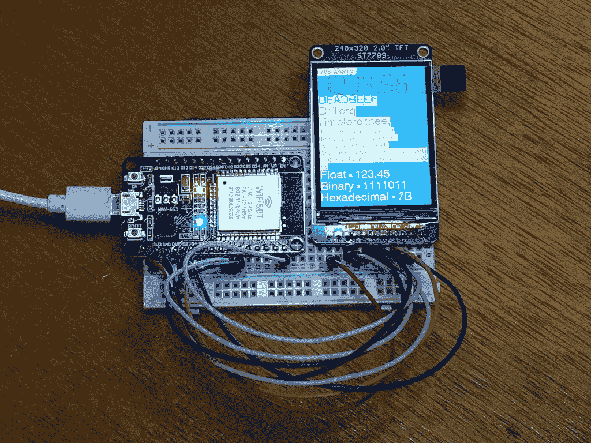
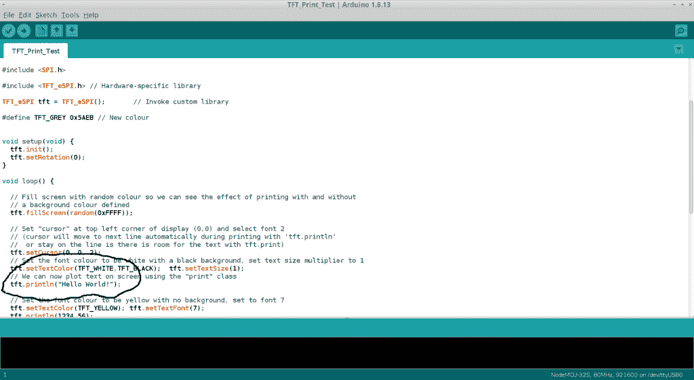
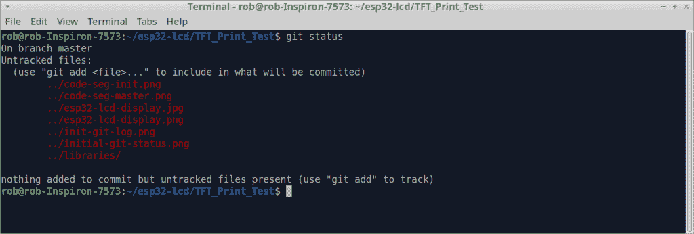
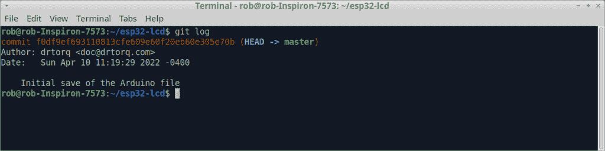
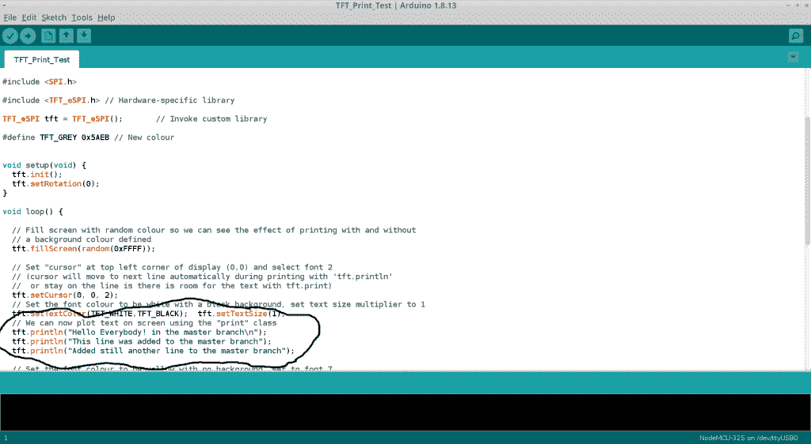

# 教程:Git Arduino IDE 工作流

> 原文：<https://thenewstack.io/tutorial-git-an-arduino-ide-workflow/>

[Torq 博士](https://thenewstack.io/author/rob-reilly/)

 [Rob (drtorq) Reilly 是一名独立顾问、作家和演说家，专门研究 Linux/OSS、物理计算、硬件黑客、技术媒体和 DIY/Maker 运动。](https://thenewstack.io/author/rob-reilly/) 

随着项目的进展，即使是小型微控制器项目也需要多次代码迭代。在过去，我只是简单地使用连续的数字，附在文件名上来标记每一个最新版本的 Arduino 代码。虽然可行，但它很笨重，不容易管理。尽管文件大小适中且简单，但使用 Arduino IDE 来跟踪更改是令人困惑且耗时的。

典型的基于 Arduino 的项目使用转换为二进制格式的源代码文件，以便上传(作为固件)到 Arduino 微控制器。

传统的 Arduino 模块，如 Nano，固件存储容量相当有限，只能处理相当简单的读取一些输入、进行一些计算和设置一些输出任务。较新的 Arduino 兼容微控制器，如 ESP32，具有更大的程序空间，可以容纳更大和更复杂的应用程序。

ESP-32 每台售价约为 8 美元，还具有车载 WiFi 和蓝牙功能。再加上一个 320×240 的彩色液晶显示屏，你就有了一个紧凑、有趣的传感器显示平台。

我正致力于将 GPS 模块与 ESP-32 和带有 3D 打印外壳的 LCD 显示器结合起来，以制作一个永远不需要重置的小时钟。它会从头顶上所有的 GPS 卫星上获取时间。WiFi 和 BT 赋予了它可能的未来用户界面和 MQTT 特性。

今天我们将看看如何使用 [git](https://git-scm.com/) 版本控制系统来管理 Arduino IDE 工作流的代码。

## Arduino IDE 方式

我分阶段处理我的项目。让微控制器在一个阶段与 IDE(交互式开发环境)对话。将微控制器连接到另一个 LCD 显示器。第三阶段可以是从 GPS 模块向微控制器发送数据。你明白了。

很多时候，我在项目中学习使用新的传感器或输出设备。每一次迭代都建立在单独的组件和代码模块之上，直到我们拥有一个完整的系统。完成每个阶段有助于保持动力并解决任何问题。即使构建简单的硬件也有惊人的复杂性。

将项目放在 git 下会将所有东西打包成一个方便的包布局。在过去，我有时会在某个默认目录下保存一个新版本，然后当我找不到它时，我会想知道它去了哪里。六个项目同时进行，很容易陷入浪费时间的文件查找探险中。

## 项目设置

我对自己项目的最初设想是一个 Arduino 类型的微控制器，带有一个小的彩色 LCD，可以从 GPS 模块读取数据并显示当前的当地时间。由于我们正在讨论工作流，项目特定的技术细节不会像往常一样深入。

这个项目使用了一个常见的 [ESP32 模块](https://www.amazon.com/Teyleten-Robot-ESP-WROOM-32-Development-Microcontroller/dp/B08246MCL5/ref=sr_1_2_sspa?crid=3HGQB8MC5OWDZ&keywords=esp32%2Bdevelopment%2Bboard&qid=1649355003&sprefix=esp32%2B%2Caps%2C129&sr=8-2-spons&spLa=ZW5jcnlwdGVkUXVhbGlmaWVyPUE0NEhXTjlaN0paUzAmZW5jcnlwdGVkSWQ9QTA4MTExMDkxQVVBUTRPTFhPM1NKJmVuY3J5cHRlZEFkSWQ9QTEwMDcwMDkyMURHQURRWjcwM1ZUJndpZGdldE5hbWU9c3BfYXRmJmFjdGlvbj1jbGlja1JlZGlyZWN0JmRvTm90TG9nQ2xpY2s9dHJ1ZQ&th=1)、一个 [320×240 彩色 TFT LCD 显示屏](https://www.adafruit.com/product/4311)、一个试验板和一个简单的 [2600 mAh 电源板](https://www.jevoisinc.com/products/usb-power-bank-2600mah)，它被捆绑到最近购买的 [JeVois 智能视觉传感器包](https://www.jevoisinc.com/collections/jevois-hardware/products/jevois-a33-smart-machine-vision-camera-developer-robotics-kit?variant=38980971146)中。

编程是通过 USB 连接到运行 Xubuntu 20.04.4 LTS 的可信赖的旧 Dell Core-i7 笔记本电脑来完成的。我也在运行 Arduino IDE，版本 1.8.13。

所有 Arduino 固件源代码文件都位于一个指定的目录中。保存新文件时，Arduino IDE 会自动生成一个软件目录，该目录会镜像源文件名。默认情况下，我将首选项选项卡下的 Arduino IDE sketchbook 目录切换为全新的源目录。同样重要的是将所有的库都放到合并目录中，这样 Arduino IDE 就可以在编译期间访问它们。

大多数 Arduino 库都提供了演示功能用法的样本文件集。我在 Arduino IDE 中从名为 **TFT_Print_Test** 的 **TFT_eSPI** 库中打开了一个示例程序。它显示一个随机颜色的背景，带有几行不同字体和大小的文本。这是一个几十行的程序，易于理解和演示。这是展示的图形。

显示文本的裸机 esp32/彩色 LCD 试验板

Arduino 文件的目录在 Xubuntu 文本终端中配置如下。

`drtorq% cd /home/rob`
`drtorq% mkdir esp32-lcd`

切换回 IDE，示例文件保存到 TFT_Print_Test.ino，IDE 自动在 */home/rob/esp32-lcd* 目录下生成一个 **TFT_Print_Test** 目录。

下面是在 IDE 中第一次保存后的一段代码。

原始 Arduino esp32-lcd 文件

接下来，我回到文本终端来设置 git 实例。

`drtorq% git init`
`drtorq% ls`(让我想起了 esp32-lcd 的目录名，也就是“TFT _ Print _ Test”)
`drtorq% git add TFT_Print_Test`
`drtorq% git commit -m "initialized the esp32-lcd basic project code under git control"`
`drtorq% git status`

初始 git 状态

如你所见，我们现在只跟踪 ESP-LCD 项目文件，而不是库。您可以使用' *git add ** '命令轻松地将库文件放入 git。在某些情况下，这可能是可取的，如定制配置文件。在这种情况下，为了简单起见，我选择不这样做。此外，git 在目录级别跟踪所有文件。因此，在 */home/rob/esp32-lcd* 目录下的 **TFT_Print_Test** 目录中添加或更新的任何内容都会被 git 跟踪。

## 添加带有新分支的新特征

有了 git 中的基本代码索引，就很容易在 git 中建立一个基本分支，供以后使用。为此，我们需要知道 git 提交引用号。使用 git log 命令。

`drtorq% git log`

显示原始 Arduino 文件提交号的初始 git 日志

在这里，我们将看到一个相当大的数字，在作者行的上方，标记为“提交”。最新提交的位于顶部。使用 <ctrl><shift>c 将该数字复制到您的 Linux 终端剪贴板上。</shift></ctrl>

我们想要创建一个新的分支，这样就可以用传统的 git checkout 命令轻松完成。

接下来，使用-b 选项和分支名称将提交号粘贴到 git checkout 中。在本例中，我使用“orig-state”作为名称。在命令行使用一个 <ctrl><shift>v 来粘贴数字。</shift></ctrl>

`drtorq% git checkout -b orig-state [commit number]`

现在做一个 *git status* ，你会发现你在新创建的 *orig-state* 分支上。退出 Arduino IDE。不要改变任何东西，只需用另一个 *git checkout* 返回主分支。

`drtorq% git status`
`drtorq% git checkout master`

实际上，大多数用户可能希望使用新的 git switch 命令在分支之间切换。它的功能和 checkout 一样，只是更新、更容易记忆，而且需要输入的字符更少。这里有一个例子。

`drtorq% git switch master`

我在文件中添加了一些注释，保存它，然后退出 Arduino IDE，然后执行通常的 *git add* 和 *git* commit。如果你切换回*初始状态*分支，当你打开 Arduino IDE 时，你会看到原来的“Hello，World”文本。退出 IDE，切换到主机，然后重新启动 IDE。最新的主更改将显示在 IDE 中。

签出文件的最新主分支版本。

显示主分支版本的代码段

现在你可以修改你的代码(在主分支上)的新特性，知道初始文件在原始状态分支中是安全索引的。

每次提交之前，在 Arduino IDE 中保存并关闭源文件是很重要的。git 处理所有的版本魔法。

## 包裹

我们讨论了如何在 Arduino 交互式开发环境中开始使用 git。只要记住正确设置你的目录，然后在你做 *git add* 和 *git commit* 之前保存并退出文件。切换到您选择的分支。然后，再次打开文件以获得您选择的版本。

*在[doc@drtorq.com](mailto:doc@drtorq.com)或 407-718-3274 联系 [Rob "drtorq" Reilly](/author/rob-reilly/) 咨询、演讲约定和委托项目。*

<svg xmlns:xlink="http://www.w3.org/1999/xlink" viewBox="0 0 68 31" version="1.1"><title>Group</title> <desc>Created with Sketch.</desc></svg>