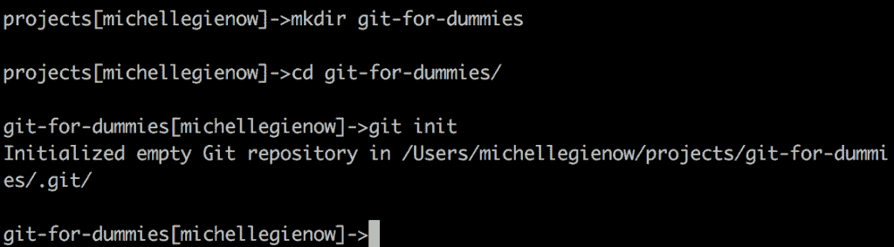

# 教程:Git 绝对适合所有人

> 原文：<https://thenewstack.io/tutorial-git-for-absolutely-everyone/>

关于程序员有一个相当普遍的刻板印象:我们是离群索居的内向者，想要单独与我们的多台电脑显示器交互，最好是在黑暗的房间里。只有在吃饭、睡觉或上厕所的生理需求驱使下，我们才会离开我们的战斗岗位/孤独堡垒/代码道场。我们从不和别人说话，除非(a)绝对必要或者(b)作为我们的在线 RPG 化身自我(不可抗拒的天赋良好的高级法师/战士)。和所有的刻板印象一样，这多少是植根于现实的。作为程序员，我们的激情驱使我们与机器进行更多的互动，也许比与其他人互动更有能力。

然而，软件开发人员的生活比非编码人员所认为的更加社会化和协作化——有时甚至令人沮丧。幸运的是，有 git:版本控制软件将与项目团队成员的协作带回了它应该在的地方:命令行。

这份“傻瓜 Git”风格的教程是为那些需要与编码人员有效合作和交流的非程序员编写的。我们将从 git 是什么、我们为什么使用它以及如何开始的超级基础知识开始。在本教程结束时，你应该能够在程序员的自然环境中接近他们！

## Git 是什么？

Git 是用于团队项目协作的版本控制软件。不是团队合作，项目工作量的公平分配，以及谁吃了最后一个果冻甜甜圈，而是实际的来回分担工作的机制。当一周的共享项目进度被意外删除或覆盖，或者几个小时的工作被错误的文件传输所吞噬，事情会变得，嗯，很生气。

正如 Google Drive 使多个贡献者编写、编辑和添加单个文本文件的内容成为可能一样，git 是一个计算机程序，它使多个编码人员(以及项目经理、测试人员、内容提供者和团队中的任何其他人)在单个项目上合作成为可能。

如果你自己很少或没有编程经验，学习 git 可能会令人生畏，但只要把它想成一个有趣的 Google Docs，你就会做得很好！有趣的事实: [git 是由 Linus Torvalds](https://www.linuxfoundation.org/blog/10-years-of-git-an-interview-with-git-creator-linus-torvalds/) 发明的——正是这个 Linus 创造了 Linux 开源操作系统，现在运行着互联网的大片区域，包括谷歌和脸书。

所以:git 是你安装在电脑上的一个软件，它会为你处理版本控制。那么，什么是版本控制呢？

## 什么是版本控制？

想象你有一个全新的项目。很自然，您计划将所有相关文件存储在一个新目录中。随着工作的进展，这些文件会发生变化。很多。事情会变得杂乱无章，甚至一团糟，在某些时候甚至会变得一团糟。在这一点上，你会想要及时回到你的项目的最近的、没有混乱的、仍在工作的版本——如果那是可能的话！

嗯，多亏了 git，是的。当您在计算机上安装 git 时，会发生版本控制。Git 的构建是为了创建新的项目目录，并跟踪您对放入该目录中的任何和所有文件所做的所有更改。随着事情的进展和您做出的添加和更改，git 会拍摄当前版本的“快照”。朋友们，这就是版本控制:做一个小小的改变，拍一张快照，再做一个小小的改变，拍一张快照……然后按时间顺序保存所有这些快照。然后，您可以使用 git 根据需要在项目目录的每个版本之间来回切换。

所以当你搞砸了，git 就像有一种神奇的能力，可以及时回到你失态前的最后一个好版本。因此，版本控制。git 不是唯一的版本控制系统，但它可能是使用最广泛的。使用 [GitHub](https://github.com/) 也是必不可少的，这是最受欢迎的公共网站和平台，用于托管和共享项目。它和 git 不一样——它是使用 git 版本控制的项目的中枢。

我们将在这里简单讨论 GitHub，因为首先理解 git 本身做什么很重要。然而，使用 GitHub 本身是一条完全不同的学习曲线，我们将在下一篇教程中学习。

## 与 Git 合作

很容易理解为一个人独自做一个项目。但是设想与一整个团队一起工作，你们都需要共享同一个项目目录。当您在本地笔记本电脑上工作时，您将对您的项目部分进行更改，而您的合作者将在他们自己的机器上对他们的项目部分进行相同的操作。您如何与您的合作者共享更改，并且让他们所做的更改出现在您自己的本地工作版本中？你如何确保你正在做的事情不会与其他人正在做的事情发生冲突或冲突？

Git 是一个分布式版本控制系统。这意味着 git 有一些命令允许您将您的更改“推”到其他人的机器上，并将他们的更改“拉”到您的机器上。与此同时，GitHub 保留了项目的一个主版本——实际上是所有版本的主库——以防止事情变得太疯狂。

它还允许每个人从一个中央存储库推送和提取更改，因此，如果您的一个同事生病外出一周，当您无法访问他们的项目部分时，事情不会被挂起，因为他们的笔记本电脑在流感中心。下次在“GitHub 入门”中会有更多的介绍

## 获取 git

### **第一步。下载 git**

选择适合自己的首选操作系统: [Mac OS](http://git-scm.com/download/mac) 、 [Linux](http://git-scm.com/book/en/Getting-Started-Installing-git) 或 [Windows](http://msysgit.github.io/) 。它会自动安装。如果看起来什么都没发生也不用担心，

### **第二步。打开端子**

很抱歉，但你只能使用命令行。所以，闭嘴壳:Linux 用户，你已经知道该怎么做了。对于 Mac 用户来说，是 Finder-> Applications-> Utilities-> Terminal。Windows 用户(你为什么会在这里？)，你必须下载并安装一个终端模拟器。

如果这一步让你吓呆了，因为你完全不知道现在该做什么，或者如何去做，直接去参加令人惊叹的[命令行速成班](http://www.computervillage.org/articles/CommandLine.pdf)并完成它(花几个小时，会让你感觉像代码突击队，我保证！).

### **第三步。告诉 git 你的存在**

现在是时候配置你的名字和电子邮件了。为此，请输入以下内容，当然，要用您自己的姓名和电子邮件来替换这些值。

```
git config  --global user.name  'My_Name'
git config  --global user.email  'myEmail@wherever.com'
git config  --global color.ui  'auto'

```

最后一行是可选；它告诉 git 在终端中自动将 git 命令的任何输出用漂亮的颜色编码，这样更容易阅读和理解。我们在每个前面加上“–global”的原因是为了避免下次在系统上启动 git 项目时输入这些配置命令。这样，git 永远知道你是谁。

### **第四步。创建新目录**

现在是时候练习设置一个示例项目了。为自己建立一个空目录来保存所有精彩的、即将存在的项目文件(提示:$mkdir (yourDirectoryNameHere)。然后放入 CD，输入神奇的单词“git init”:



“Git init”创建一个新的 Git 存储库，通常称为“repo”想象它是你项目的文件夹，只是现在有了 git 的超能力。存储库包含所有的项目文件，以及 git 生成的用于跟踪和存储每个文件的修订历史的额外的、几乎不可见的东西。

## 进入 Git 工作流

此时，您已经在自己的计算机上创建了一个存储库。git 放在那里的额外的东西由三个独立的“树”组成——不要担心，这些完全由 git 管理和维护。您参与的主要领域是工作目录，其中包含您的实际项目文件。还有索引，这是一个临时存放最新修改和添加内容的地方。以及指向最后一次提交的头部——最近保存的版本。

Pro 提示:每次在终端中键入 git 命令时，它必须以“git”开头:格式通常是“git do what”这告诉您的计算机，您特别希望激活 git，而不是其他可用的终端选项。

### **第五步。添加一个“自述”文件和项目文件**

从创建一个“README”文件开始解释你的项目是什么，在里面可以找到什么等等，这是一个很好的主意。(项目自述不需要包罗万象，只要基本事实就行了，女士。此时也不会写入它—我们现在只是在设置目录)。顺便说一下，这是一个基本的命令行努力，而不是 git 特有的:


因为您知道您的项目参数，所以您负责添加实际的项目文件。只需使用适当的文件名重复上述过程。

### **第六步。复制你的知识库**

在这一步中，我们创建了一个本地存储库的工作副本——您当前的项目——这样您就可以在其中乱来而不会有任何后果。

从副本开始工作是至关重要的，尤其是在团队协作中！如果你的工作进展顺利，你保存所有的东西(这将是我们的下一步)。最终，您刚才所做的所有更改/添加都会被添加回原始存储库中，这就成为了当前版本。与此同时，其他人在他们自己的复制版本中做着同样的事情，这很快就变得与你的复制版本不同了。

git 的美妙之处在于它为您跟踪所有这些东西——谁在哪里更改了什么——并协调这一切。

因此，通过运行命令“$ git clone/path/to/your _ repository:”来复制或克隆您的 repo


(如果您从任何远程/服务器开始复制别人已经开始的文件，您的命令将是“$ git clone username @ host:/path/to/repository”)。

请注意，在我们原来的 git-for-dummies 目录中，我们现在有了一个新的 git-for-dummies 副本目录(在我们的 README 旁边)。它告诉我们我们似乎复制了一个空的存储库的原因是因为我们还没有保存我们的新添加(暂存我们的提交)。

### **第七步。检查状态**

(顺便说一句，我在幕后添加了一个占位符文件，名为“my_file.md ”,这样我们的 repo 中除了自述文件之外还有其他内容)。现在我们的存储库中有了一些文件，让我们看看 git 是如何处理它们的。要检查存储库的当前状态，请键入“git status”:


### **第八步。告诉 git 添加你的修改**

Git 状态告诉我们，我们有新的文件没有被正式添加到 git 跟踪过程中。为了告诉 git，是的，请成为这些文件的甜蜜的看门人，我们将它们添加到 git。令人困惑的是，当命令实际上是“git add(此处为文件名)”时，这被称为“暂存”:


注意文本颜色是如何从红色变成绿色的:你让 git 开心了！一旦您使用“git add”暂存了文件，您就可以将它们提交到 git 中。

### 第九步 git 提交！

再一次，把每次提交想象成一个时间点的快照，如果需要的话，您可以返回到这个时间点来访问您的存储库的早期状态。

为了识别每个快照，您需要提供一条提交消息。这是对上一个版本和这个版本之间到底发生了什么的一个简短陈述，这个版本是最新的，也是最棒的。提供有用的提交消息，因为它有助于您识别在提交过程中您更改了什么——这是查看者不仅可以看到更改了什么，还可以看到更改原因的唯一地方。因此，在每条提交消息中花点心思是值得的——试着想一想，对于您刚刚添加或更改的内容，您将来会想知道什么。这是一篇关于[编写有用的提交消息](http://alistapart.com/article/the-art-of-the-commit)的精彩文章；读它，做它，将来你会感谢你的。

也就是说，当建立一个新的存储库时，您的第一个提交消息总是“初始提交”提交消息的格式为“$git commit -m“我的提交消息”:


Git 通过给每个提交附加一个长的十六进制数字来识别每个唯一的提交。在截图中，注意“a4105ea”是我们的第一个提交。这就像你快照上的标题。如果我们需要回到过去并访问我们项目的这个特定版本，这是您用来标识您想要的版本的“名称”。

### **第十步。没有第十步，因为你做到了！！！！**？？？

注意在上面的截图中，在提交之后，我们做了一个“git 状态”。git 返回了可爱的消息“不需要提交任何东西，正在清理树”(还记得我们的树吗？如果没有，请返回并重新阅读上面的 git 工作流部分)。这意味着你已经赶上了潮流。git 已经捕获并保存了项目的快照。虽然这么早，这有点像婴儿照片。

然而，随着项目的变化和发展，您将捕获大量的快照来记录这个过程。含义:经常承诺。所以你可以让时间倒流到你的项目更早、更天真的时候…啊，如果有人类版本就好了…

咳咳。好的，是的，所以，Git 支持你…至少现在在你自己的电脑上。

下一次:我们带着我们的回购上路，并学习如何把它放在 GitHub 上，这样其他人也可以玩！

<svg xmlns:xlink="http://www.w3.org/1999/xlink" viewBox="0 0 68 31" version="1.1"><title>Group</title> <desc>Created with Sketch.</desc></svg>