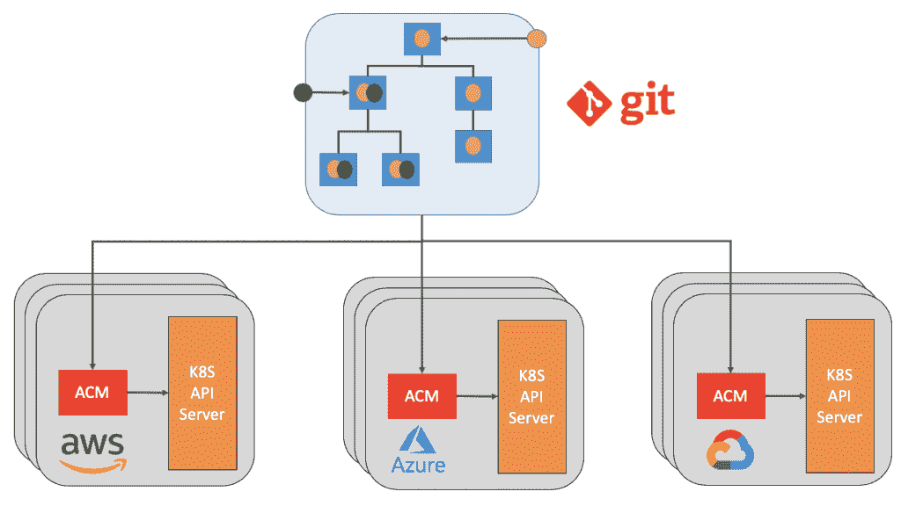
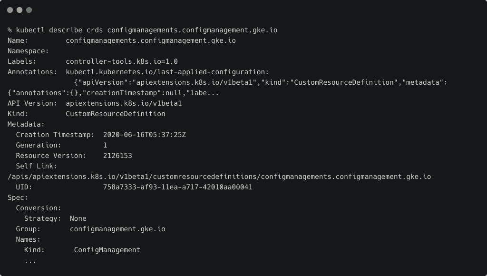
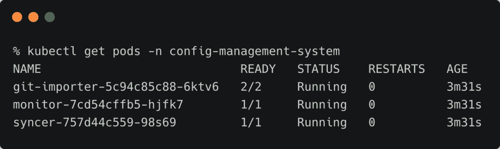
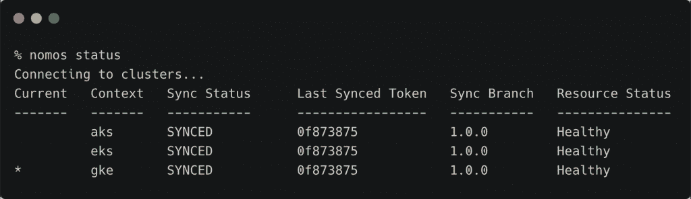
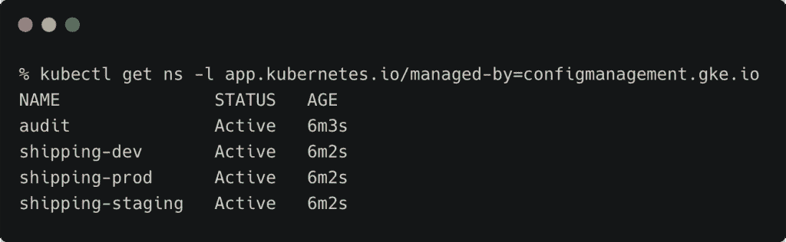
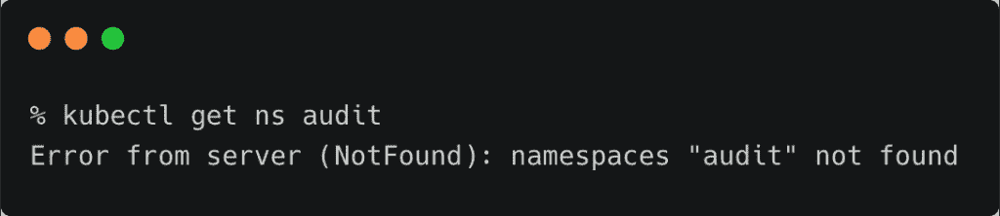
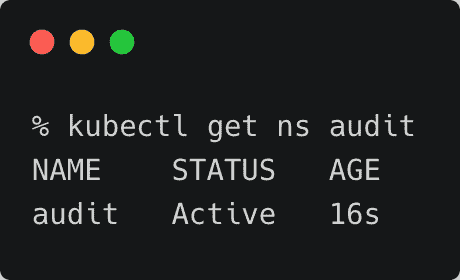

# 教程:使用 Anthos 配置管理的多集群环境中的 GitOps

> 原文：<https://thenewstack.io/tutorial-gitops-in-multicluster-environments-with-anthos-config-management/>

在本系列的第三部分[中，我们将使用 GitOps 风格的部署，通过 Anthos 配置管理(ACM)将工作负载推送到所有注册的集群。](https://thenewstack.io/tutorial-connect-amazon-eks-and-azure-aks-clusters-with-google-anthos/)

[GitOps](https://thenewstack.io/what-is-gitops-and-why-it-might-be-the-next-big-thing-for-devops/) 鼓励在一个中央源代码库中维护配置即代码和环境即代码。这让我们有机会对配置和环境以及源代码进行版本控制。

由于 Kubernetes 使用 YAML 或 JSON 文件作为规范，将这些工件与代码结合起来变得很容易。

谷歌开发了一个叫做[配置同步](https://cloud.google.com/kubernetes-engine/docs/add-on/config-sync/overview)的工具，作为外部源代码库和 Kubernetes API 服务器之间的桥梁。 [Anthos 配置管理](https://cloud.google.com/anthos/config-management)基于配置同步，将其扩展到多集群场景。

在本教程中，我们将使用 GitHub 存储库作为部署和配置的唯一来源。ACM 的一个组件被安装到每个已注册的 Anthos 集群中，以监视外部存储库的任何更改，并使它们与集群同步。

ACM 确保所有集群都具有存储库中规范所定义的相同状态。



ACM 支持结构化或非结构化的配置存储库。结构化 repo 将具有名称空间和集群范围资源的层次结构。非结构化 repo 可用于维护由多个 Kubernetes 对象组成的一个或多个 YAML 文件的临时配置。当您想要扩展导航图并通过 ACM 应用它时，非结构化存储库很有帮助。

让我们从用 ACM 实现 GitOps 的步骤开始。

## 安装配置管理操作员

配置管理操作器是一个控制器，它管理 Kubernetes 集群中 Anthos 配置管理的安装。

我们需要在所有三个集群(GKE、EKS 和 AKS)中安装该操作员。

从 Google 云存储中下载运营商的 YAML 规范，并将其应用于每个集群。

```
gsutil cp gs://config-management-release/released/latest/config-management-operator.yaml config-management-operator.yaml

```

```
kubectl apply  -f  config-management-operator.yaml

```


确保在所有集群上运行该命令。

使用以下命令验证操作符的创建:

```
kubectl describe crds configmanagements.configmanagement.gke.io

```



### 为 ACM 配置集群

谷歌发布了一个叫做 [nomos](https://cloud.google.com/anthos-config-management/docs/how-to/nomos-command) 的实用工具，可以用来管理 ACM。下载并将其添加到路径中。以下命令适用于 macOS。

```
gsutil cp gs://config-management-release/released/latest/darwin_amd64/nomos nomos

```

```
cp  ./nomos  /usr/local/bin
chmod  +x  /usr/local/bin/nomos

```

现在是时候将 GitHub 存储库与 ACM 连接起来了。我们将使用 Google Cloud 文档中的一个示例回购。请随意探索回购的结构。

因为我们使用的是公共回购，所以我们可以将 secretType 设置为 none。

通过用 Anthos 中注册的集群名替换集群名，为每个集群创建下面的 YAML 文件。

要获取已注册集群的名称，请运行下面的命令:

```
gcloud container hub memberships list

```

在每个集群上应用以下规范。请确保集群名准确无误。

```
apiVersion:  configmanagement.gke.io/v1
kind:  ConfigManagement
metadata:
  name:  config-management
spec:
  # clusterName is required and must be unique among all managed clusters
  clusterName:  
  git:
    syncRepo:  https://github.com/GoogleCloudPlatform/csp-config-management/
    syncBranch:  1.0.0
    secretType:  none
    policyDir:  "foo-corp"

```

```
kubectx gke
kubectl apply  -f  config-management-gke.yaml

```

```
kubectx eks
kubectl apply  -f  config-management-eks.yaml

```

```
kubectx aks
kubectl apply  -f  config-management-eks.yaml

```

如果命令成功，Kubernetes 会更新每个集群上的配置管理操作符，开始从存储库中同步集群的配置。要验证配置管理操作符是否正在运行，请列出在配置管理系统命名空间中运行的所有窗格:

```
kubectl get pods  -n  config-management-system

```



上面列出的 pod 负责监控 repo 并将更改应用到 Kubernetes API 服务器。

我们可以使用 nomos 工具来检查集群的状态。运行以下命令，查看所有集群是否同步。



### 探索集群和回购

foo-corp repo 包括集群/和名称空间/目录中的配置。一旦配置管理操作员被配置为从存储库中读取，就会应用这些配置。

Anthos 配置管理管理的所有对象都将 app.kubernetes.io/managed-by 标签设置为 configmanagement.gke.io

列出由 Anthos 配置管理管理的名称空间:

```
kubectl get ns  -l  app.kubernetes.io/managed-by=configmanagement.gke.io

```



将上下文切换到每个集群，并检查名称空间。它们都具有相同的配置。

这里显示的名称空间是在 foo-corp/namespaces 文件夹下的 GitHub repo 中定义的。

我们将测试当其中一个集群偏离 repo 中指定的配置时会发生什么。

让我们删除一个已注册集群中的审计名称空间。

```
kubectl delete namespace audit

```

名称空间会立即被删除，但几秒钟后，它就会变得可见。





有了 ACM，Anthos 可以通过不断地将每个注册的集群与 ACM repo 同步，来确保它具有所需的配置状态。在许多方面，这与 Kubernetes 控制器在任何给定时间维护所需数量的副本集的工作流相似。

Anthos 配置管理器是 Anthos 的核心构建块之一，支持集群状态的集中配置。

在本系列的下一部分中，我们将探索如何配置亚马逊 EKS 集群来部署来自 GCP 市场的“点击部署”Kubernetes 应用程序。敬请期待！

贾纳基拉姆·MSV 的网络研讨会系列“机器智能和现代基础设施(MI2)”提供了涵盖前沿技术的信息丰富、见解深刻的会议。在 [http://mi2.live](http://mi2.live) 上注册参加即将举行的 MI2 网络研讨会。

<svg xmlns:xlink="http://www.w3.org/1999/xlink" viewBox="0 0 68 31" version="1.1"><title>Group</title> <desc>Created with Sketch.</desc></svg>