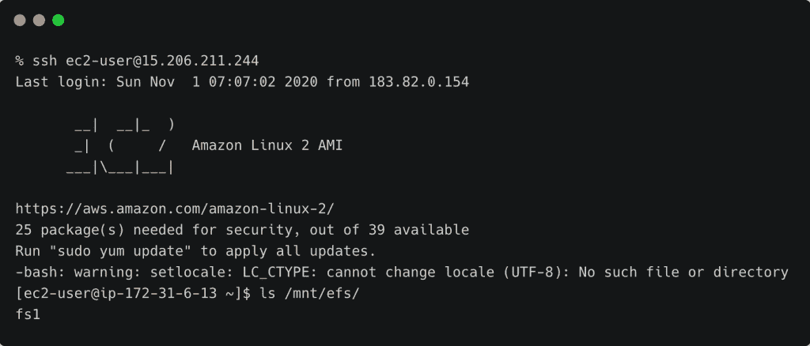
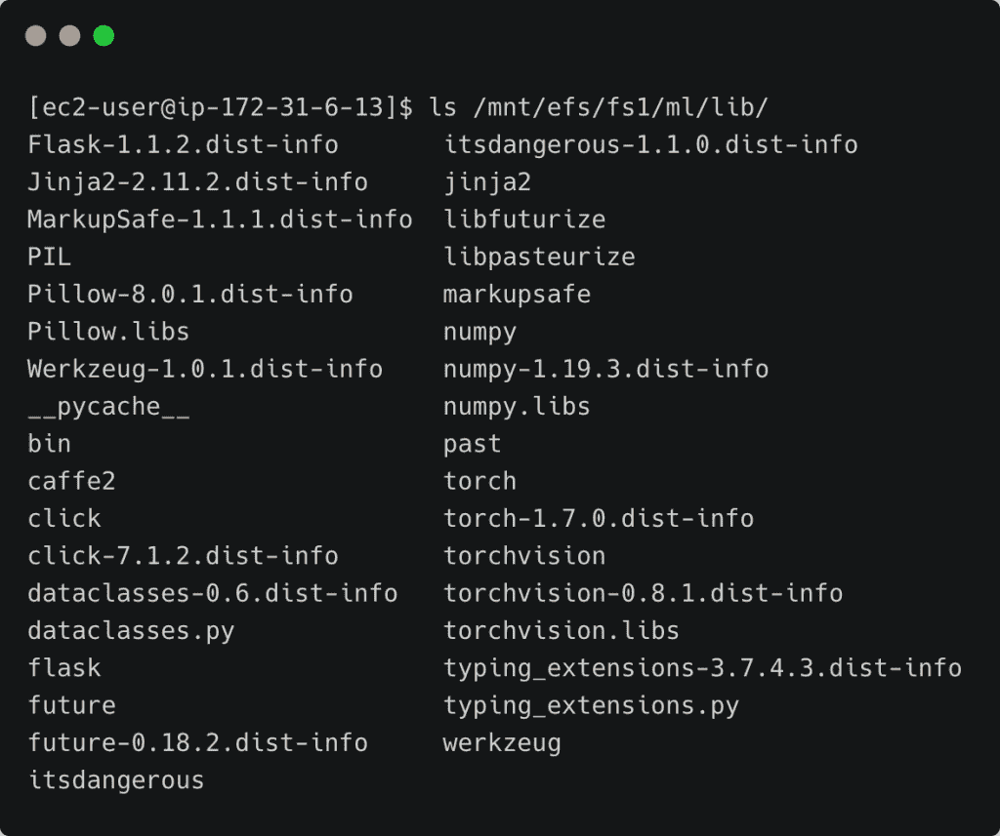
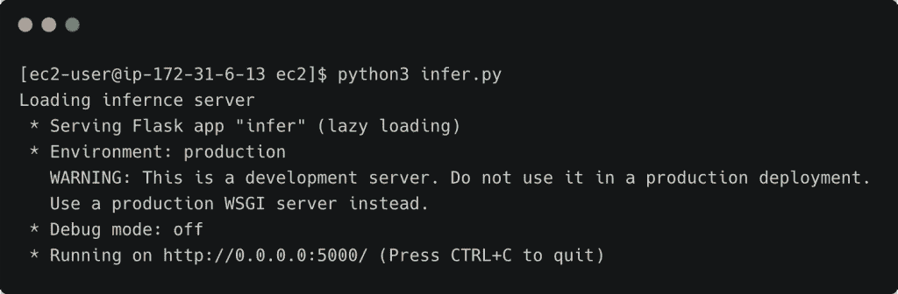
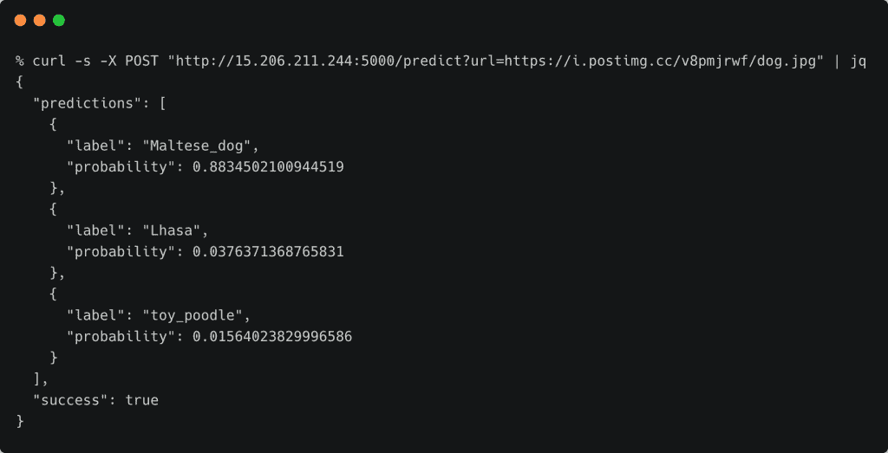

# 教程:在 Amazon EC2 实例上托管用于推理的 PyTorch 模型

> 原文：<https://thenewstack.io/tutorial-host-a-pytorch-model-for-inference-on-an-amazon-ec2-instance/>

在本教程中，我将带您浏览在 Amazon Web Services 的 EC2 上托管 PyTorch 模型所涉及的步骤，该模型由 EFS 文件系统支持。本文是用亚马逊 EFS 使 AWS Lambda 函数有状态的系列文章的一部分([第 1 部分](https://thenewstack.io/turn-aws-lambda-functions-stateful-with-amazon-elastic-file-system/)、[第 2 部分](https://thenewstack.io/tutorial-configure-and-mount-an-efs-file-system-in-amazon-ec2-instance/))。

假设您遵循了上一教程中提到的步骤，那么您应该有一个 EC2 实例，并挂载了 EFS 文件系统。我们现在将它配置为运行公开 PyTorch 推理 API 的 Flask 服务器。

[](https://thenewstack.io/tutorial-configure-and-mount-an-efs-file-system-in-amazon-ec2-instance/lam-efs-10/)

我们的目标是安装 PyTorch 的所有依赖项，并在 AWS Lambda 中运行之前在 EC2 上测试推理。

### 准备 EC2 实例

我们将首先创建两个目录，分别保存 PyTorch 模块和预训练的 ResNet 模型。

```
sudo mkdir  -p  /mnt/efs/fs1/ml/lib
sudo mkdir  -p  /mnt/efs/fs1/ml/model

```

让我们从获得 EFS 文件系统的所有权开始。这将使我们能够安装教程所需的一切。

```
sudo chown  -R  ec2-user:ec2-user  /mnt/efs/fs1

```

是时候在亚马逊 Linux 2 实例上安装 Python 3.8 和 Git 客户端了。

```
sudo amazon-linux-extras install  -y  python3.8
sudo yum install  -y  git

```

我们来添加一个 Python3.8 的链接，这样可以方便的处理机器上安装的不同版本的 Python。

```
sudo ln  -s  /usr/bin/python3.8  /usr/bin/python3

```

然后，我们将安装`pip`实用程序。

```
curl  -O  https://bootstrap.pypa.io/get-pip.py
python3 get-pip.py  --user

```

### 安装 PyTorch 并托管推理 API

首先克隆包含模型和推理代码的 GitHub 存储库。

```
git clone https://github.com/janakiramm/serverless_inference.git

```

导航到`ec2`目录并运行以下命令来安装 Python 模块，包括 PyTorch 和 Flask。

```
cd serverless_inference/ec2/

```

```
pip3 install  -t  /mnt/efs/fs1/ml/lib  -r  requirements.txt

```

上面的命令将 Python 模块安装在 EFS 文件系统的`lib`目录中。这是最重要的一步，我们用 AWS Lambda 需要的所有依赖项填充目录。

根据 pip 的官方文档，`-t or --target`开关将软件包安装到特定的目录中。我们将利用这一点来确保模块安装在一个 EFS 目录中，而不是默认位置。你可以在`/mnt/efs/fs1/ml/lib`目录中看到安装的模块。



### 运行推理 API

既然我们已经配置了基本的环境，我们几乎已经准备好托管 PyTorch 推理 API 了。

首先，让我们告诉 Python 运行时在哪里可以找到 PyTorch 和 Flask 模块。这可以通过设置 PYTHONPATH 环境变量来实现。

```
export PYTHONPATH=”/mnt/efs/fs1/ml/lib/”

```

训练好的模型和标签文件也通过一个环境变量传递。它们目前位于`./model`目录中。

让我们将它们复制到在 EFS 文件系统中创建的`/mnt/efs/fs1/ml/model/`目录中。

```
cp  -R  model/*  /mnt/efs/fs1/ml/model/

```

在运行推理服务之前，我们需要用模型和标签文件的位置设置`MODEL_DIR`环境变量。

```
export MODEL_DIR=”/mnt/efs/fs1/ml/model/”

```

我们现在准备启动推理服务。

以上命令启动 Flask 服务器，监听默认端口 5000。



因为与 EC2 实例相关联的安全组打开了端口 5000，所以我们应该能够到达端点。

### 用推理 API 对图像进行分类

因为推理 API 需要图像的 URL，所以将图像上传到托管服务，并将 URL 作为参数发送到服务。你可以找到我在 https://i.postimg.cc/v8pmjrwf/dog.jpg[上传的狗狗图片样本](https://i.postimg.cc/v8pmjrwf/dog.jpg)

让我们向推理 API 发送相同的 URL。


```
curl  -X  POST  "http://15.206.211.244:5000/predict?url=https://i.postimg.cc/v8pmjrwf/dog.jpg"

```

来自 API 的响应确认推理服务正在工作。



### 将 EFS 的所有权交还给 POSIX 用户 ID

现在我们已经完成了配置和测试，是时候放弃 EFS 根的所有权了。我们通过让 POSIX 用户成为文件系统的所有者来做到这一点。

确保在终止 EC2 实例之前运行以下命令。

```
sudo chown  -R  1001:1001  /mnt/efs/fs1

```

本教程演示了如何使用 EFS 文件系统来托管 Python 模块和经过训练的模型来运行推理 API。随着文件系统完全填充了推理服务所需的一切，我们就可以在 AWS Lambda 中运行它了。

在教程的下一部分，我们将把推理 API 移植到 Lambda，把它变成一个无服务器的 API。明天再来看看。

贾纳奇拉姆·MSV 的网络研讨会系列“机器智能和现代基础设施(MI2)”提供了涵盖前沿技术的信息丰富、见解深刻的会议。在 [http://mi2.live](http://mi2.live) 注册即将到来的 MI2 网络研讨会。

<svg xmlns:xlink="http://www.w3.org/1999/xlink" viewBox="0 0 68 31" version="1.1"><title>Group</title> <desc>Created with Sketch.</desc></svg>