# 教程:用 AWS Lambda 和亚马逊 EFS 托管一个无服务器的 ML 推理 API

> 原文：<https://thenewstack.io/tutorial-host-a-serverless-ml-inference-api-with-aws-lambda-and-amazon-efs/>

在本教程中，我将带您浏览在由亚马逊 EFS 文件系统支持的 AWS Lambda 上托管 PyTorch 模型的步骤。该功能通过 API 网关公开。假设您遵循了上一篇教程中提到的步骤，那么您应该已经准备好了带有 PyTorch 模块和 ResNet 模型的 EFS 文件系统。我们将把它附加到一个 Lambda 函数来托管推理 API。

本文是用亚马逊 EFS 使 AWS Lambda 函数有状态的系列文章的一部分([第 1 部分](https://thenewstack.io/turn-aws-lambda-functions-stateful-with-amazon-elastic-file-system/)、[第 2 部分](https://thenewstack.io/tutorial-configure-and-mount-an-efs-file-system-in-amazon-ec2-instance/)、[第 3 部分](https://thenewstack.io/tutorial-host-a-pytorch-model-for-inference-on-an-amazon-ec2-instance/))。

## 先决条件:AWS Lambda 函数的 IAM 角色

在我们使用 Lambda 函数之前，我们需要有一个 IAM 角色。该角色将为 Lambda 函数提供足够的权限，以访问 VPC 内的 EFS 文件系统和弹性网络接口创建。

选择 Lambda 用例来创建角色。

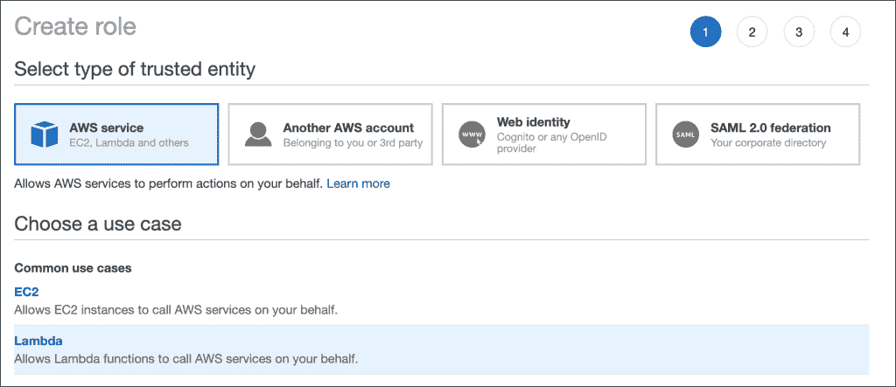

将**AWSLambdaVPCAccessExecutionRole**和**amazonelasticfilesystemclientfull access**策略添加到角色中并保存。

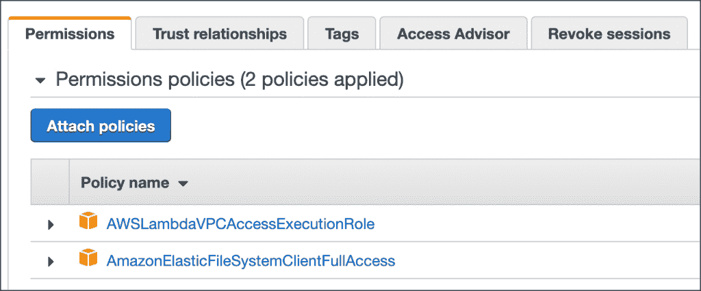

由于 Lambda 函数是在 VPC 的上下文中运行的，因此您需要配置一个 NAT 网关来提供出站连接。详见[文件](https://docs.aws.amazon.com/lambda/latest/dg/configuration-vpc.html?icmpid=docs_lambda_console#vpc-internet)。

## 创建 Lambda 函数

使用 Python 3.8 运行时创建一个 Lambda 函数，并将执行角色设置为上一步中创建的 IAM 角色。

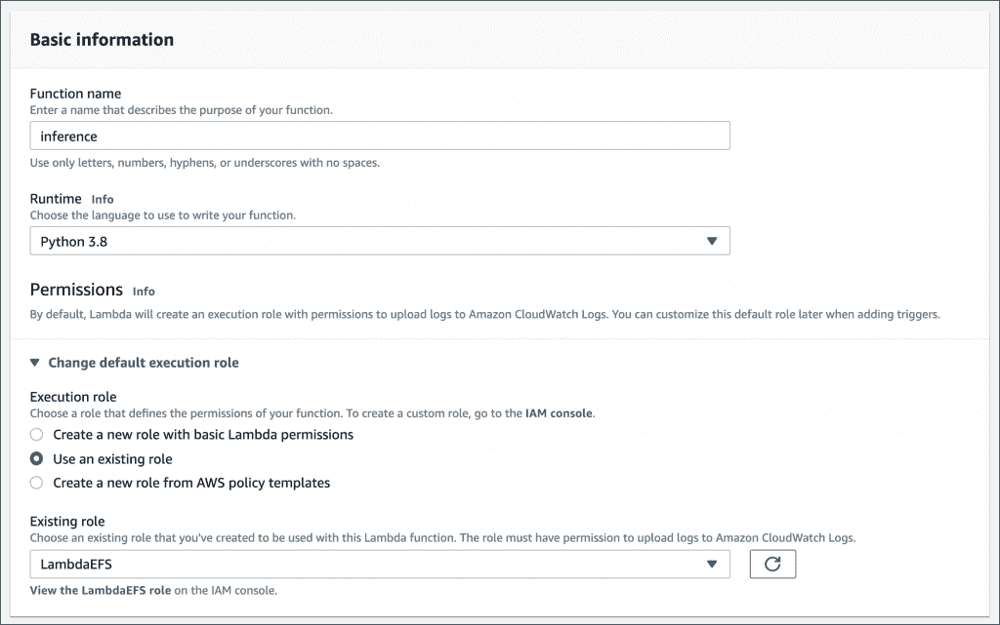

从 Lambda 函数的 VPC 部分，选择创建 EFS 文件系统时使用的同一个 VPC。添加允许 VPC 内入站和出站流量的默认安全组。

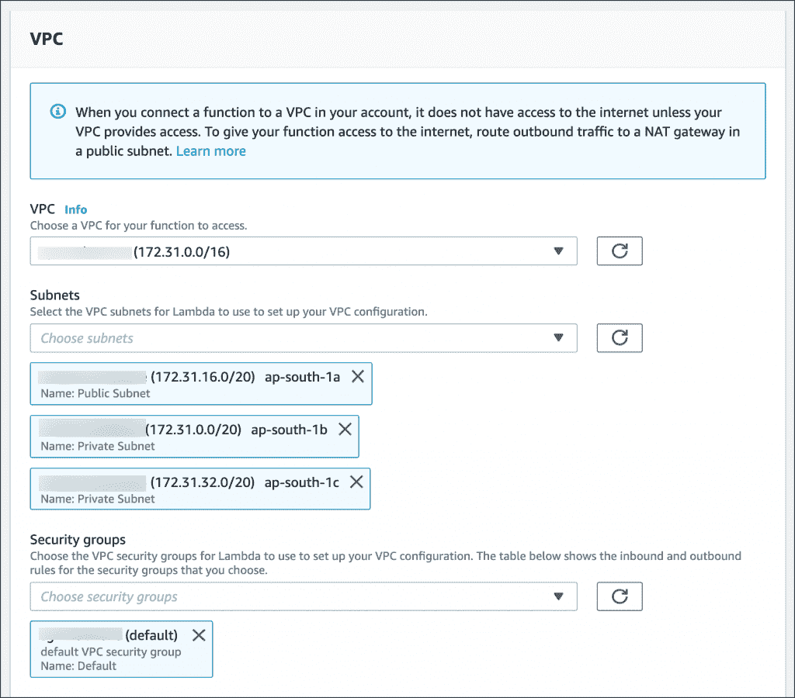

在 file system 部分，选择在本教程的前一部分中使用的相同文件系统。键入`/mnt/ml`作为本地挂载路径。

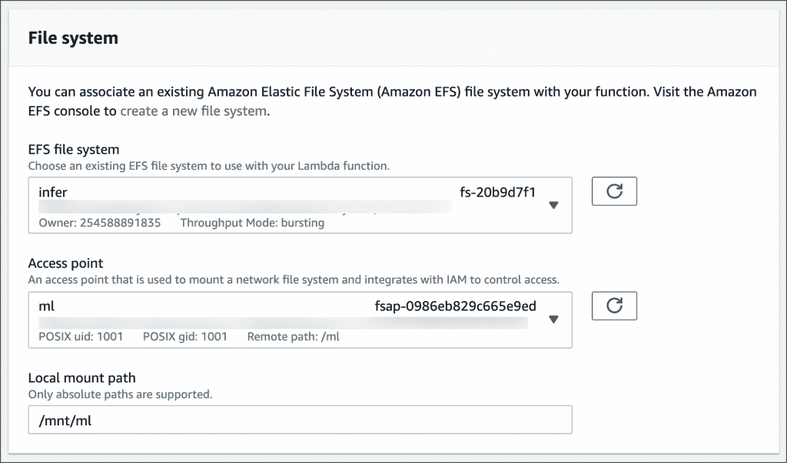

编辑基本设置部分，增加 RAM 和超时设置。将内存增加到 1024 MB，超时时间增加到 10 分钟。

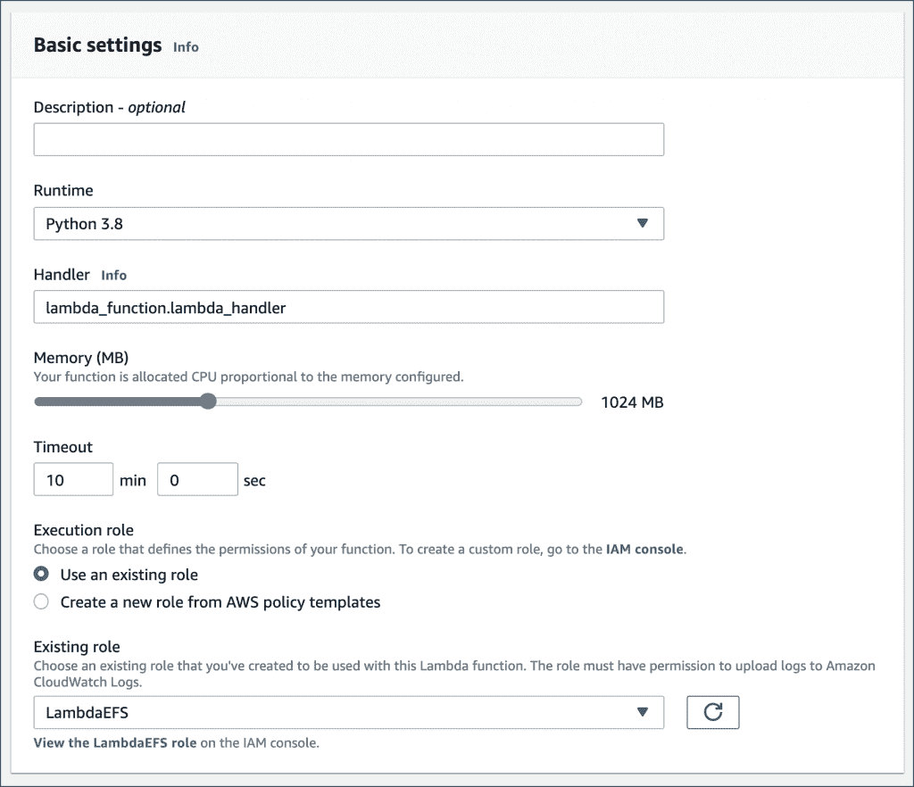

添加`PYTHONPATH`和`MODEL_DIR`环境变量，将函数指向 EFS 位置。这将确保 Lambda 函数可以访问 PyTorch 库、训练模型和标签文件。不要错过结尾的反斜杠，因为代码需要它来访问目录。

[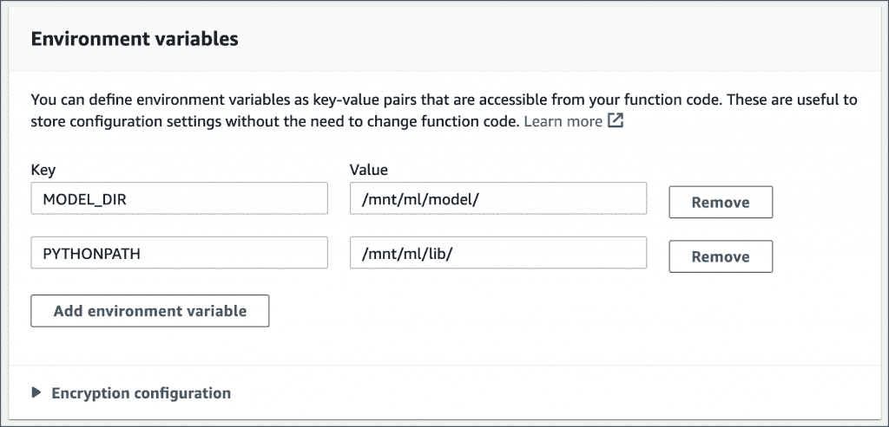](https://thenewstack.io/tutorial-host-a-serverless-ml-inference-api-with-aws-lambda-and-amazon-efs/lambda-infer-6-2/)

将下面的代码片段粘贴到函数代码部分，然后点击 deploy 按钮。GitHub 上也有同样的功能。

```
import urllib 
import json
import os
import io

import torch
from PIL import Image
from torchvision import models,  transforms
import torch.nn.functional as  F

MODEL_DIR=os.getenv("MODEL_DIR")

model  =  models.resnet18()
model.load_state_dict(torch.load(MODEL_DIR+"resnet18-5c106cde.pth"))
model.eval()

normalize  =  transforms.Normalize(
    mean=[0.485,  0.456,  0.406],
    std=[0.229,  0.224,  0.225]
)

resnet_transform  =  transforms.Compose([transforms.Resize(224),
 transforms.CenterCrop(224),
 transforms.ToTensor(),  
 normalize]) 

json_file  =  open(MODEL_DIR+"imagenet_class_index.json")
json_str  =  json_file.read()
labels  =  json.loads(json_str)  

def transform_image(image):
    if image.mode  !=  "RGB":
        image  =  image.convert("RGB")

def lambda_handler(event,  context):
  data  =  {}
  url  =  event['queryStringParameters']['url']
  image  =  Image.open(urllib.request.urlopen(url))
  image  =  resnet_transform(image)
  image  =  image.view(-1,  3,  224,  224)

  prediction  =  F.softmax(model(image)[0])
  topk_vals,  topk_idxs  =  torch.topk(prediction,  3)

  data["predictions"]  =  []

  for  i  in range(len(topk_idxs)):
 r  =  {"label":  labels[str(topk_idxs[i].item())][1],  
  "probability":  topk_vals[i].item()}
 data["predictions"].append(r)    
  return json.dumps(data)

```

使用以下配置创建一个测试事件并触发该功能。

```
{
  "queryStringParameters":  {
    "url":  "https://i.postimg.cc/v8pmjrwf/dog.jpg"
  }
}

```


测试该函数应该会产生下面的输出。

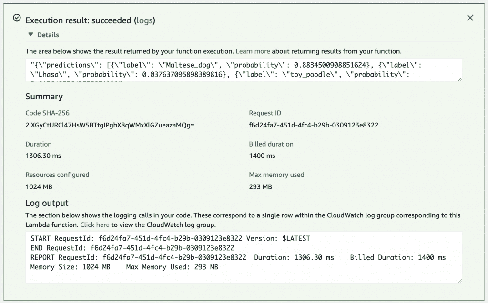

如你所见，该模型能够正确地对狗的图像进行分类。

## 连接 API 网关

是时候通过 API 网关公开这个函数了。使用以下设置向函数添加触发器:

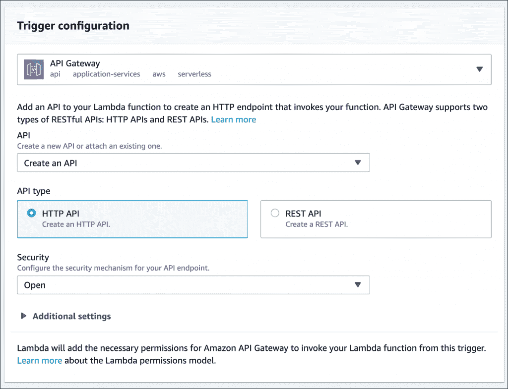

通过将图像的 URL 作为 querystring 参数发送，向推理 API 发送 cURL 请求。

由于冷启动，第一次调用将花费更长时间。但是后续调用会更快。

使用以下网址上的狗和花图片尝试该服务:

[https://i.postimg.cc/v8pmjrwf/dog.jpg](https://i.postimg.cc/v8pmjrwf/dog.jpg)

[https://i.postimg.cc/1RN54Y1n/flower.jpg](https://i.postimg.cc/1RN54Y1n/flower.jpg)

[](https://thenewstack.io/tutorial-host-a-serverless-ml-inference-api-with-aws-lambda-and-amazon-efs/lambda-infer-12-2/)

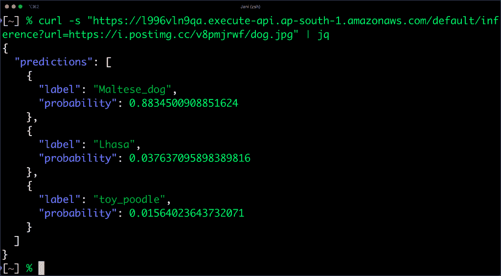

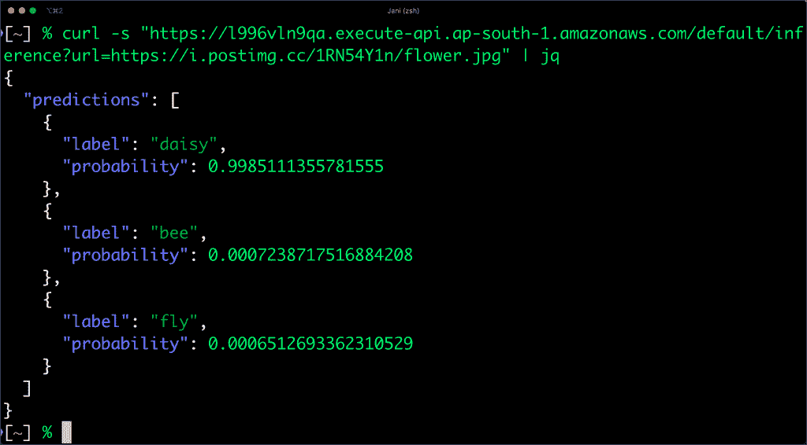

恭喜你！您已经成功地在 AWS Lambda 中托管了 PyTorch 模型，以交付无服务器的机器学习 API。

*贾纳基拉姆·MSV 的网络研讨会系列“机器智能和现代基础设施(MI2)”提供了涵盖前沿技术的信息丰富、见解深刻的会议。在 [http://mi2.live](http://mi2.live) 上注册参加即将举行的 MI2 网络研讨会。*

亚马逊网络服务是新堆栈的赞助商。

特征由[罗马牛皮纸](https://unsplash.com/@romankraft?utm_source=unsplash&utm_medium=referral&utm_content=creditCopyText)上的 [Unsplash](https://unsplash.com/s/photos/service-desk?utm_source=unsplash&utm_medium=referral&utm_content=creditCopyText) 表示。

<svg xmlns:xlink="http://www.w3.org/1999/xlink" viewBox="0 0 68 31" version="1.1"><title>Group</title> <desc>Created with Sketch.</desc></svg>