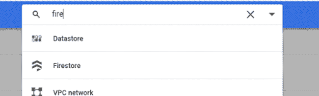
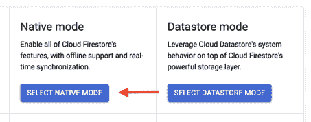
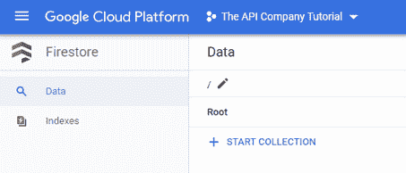
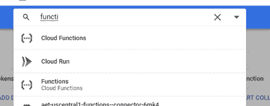
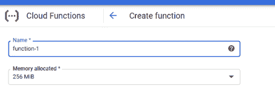
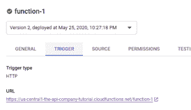
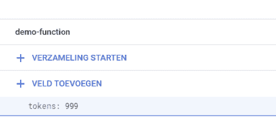
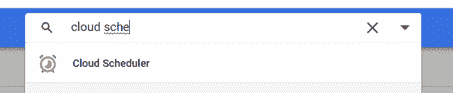
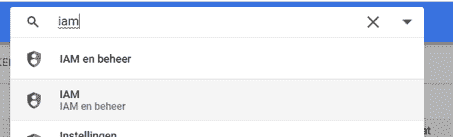
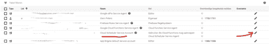

# 教程:如何限制谷歌云功能的速率

> 原文：<https://thenewstack.io/tutorial-how-to-rate-limit-google-cloud-functions/>

[](https://www.linkedin.com/in/siem-peters/?originalSubdomain=nl)

 [西姆彼得斯

西姆彼得斯拥有数据科学硕士学位。他是脸书和沃达丰酷营销项目的数据科学家。在业余时间，他是一名企业家，经营着 API 公司。](https://www.linkedin.com/in/siem-peters/?originalSubdomain=nl) [](https://www.linkedin.com/in/siem-peters/?originalSubdomain=nl)

在过去几年中，所有的云提供商都接受了新的[无服务器计算](https://aws.amazon.com/serverless/)概念。无服务器计算使我们能够动态执行代码，而不必担心扩展或工作负载平衡等挑战。亚马逊网络服务早在 2014 年就推出了 AWS Lambda。2016 年，谷歌推出了一项名为[谷歌云功能](https://cloud.google.com/functions)的类似技术。

为了管理对这些无服务器云功能的访问，AWS 提供了 [API 网关。](https://aws.amazon.com/api-gateway/)API 网关能够使用 API 密钥锁定您的功能，限制请求速率，并使用 CORS 策略阻止调用。另一方面，谷歌云平台还没有这样的功能。你将需要一个类似于 [Apigee](https://cloud.google.com/apigee) 的服务来管理你的 API 的网关。

在本教程中，我将向您展示如何为 Google Cloud 函数构建一个 API 限速器。这使您能够限制云函数每个时间单位的请求数量。这为什么有用？假设您想要构建一个商业 API。显然，您希望限制每月 API 调用的次数。通过限制谷歌云功能的速率，你可以限制某个用户每月的请求次数。

## 限速

在本教程中，我将向您展示如何使用 Node.JS 对您的 Google Cloud 函数进行速率限制。

为了限制函数的速率，我们需要创建一个数据库来存储令牌的数量(剩余的 API 调用)。随后，如果使用这些令牌，我们必须限制对云功能的访问。最后，我们需要在一段时间后(例如一个月)更新令牌。为此，需要以下三个步骤:

1.  创建 FireStore 数据库。
2.  创建谷歌云功能并限制访问。
3.  创建更新令牌的函数。

## 1.创建 FireStore 数据库

第一步:进入你的谷歌云控制台，搜索“Firestore”



第二步:点击“选择原生模式”，在下一个屏幕中选择你最喜欢的位置。



第三步:点击“开始收藏”。



步骤 4:使用以下信息创建集合:

完成这一步！

## 2.创建谷歌云功能并限制访问。

第一步:在谷歌云控制台的搜索栏中搜索“云功能”。



步骤 2:在下面的屏幕中输入你的函数名。如果你想创建一个公共函数，确保你也选择了“允许未认证”。



步骤 3:在 index.js 部分下添加以下代码。请注意，您必须填写自己的项目 id。

```
const Firestore = require('@google-cloud/firestore');

//fill in your project id below

const project_id = 'FILL OUT YOUR PROJECT ID'; 

const db = new Firestore({projectId: project_id});

const document = db.collection("api-tokens").doc('demo-function');

exports.helloWorld = (req, res) =&gt; {

  document.get().then(function(doc){

    const tokens = doc.data().tokens;

    if(tokens &lt;= 0){

      //limit is reached

      return res.status(429).send();

    }

    else{

      // do whatever you want here

      document.update({"tokens" : tokens-1});

      return res.status(200).send();

    }

  })

};

```

第四步:在 package.json 下添加下面的代码:

```
{

  "name": "sample-http",

  "version": "0.0.1",

  "dependencies":{

    "@google-cloud/firestore": "latest"

  }

}

```

步骤 5:部署您的函数，转到 trigger 选项卡，检查是否得到 200 响应！



步骤 6:检查 Firestore 数据库中的令牌是否已更新



这就对了:)每次你向函数发出请求时，令牌都会更新。如果令牌达到 0，则不能再发出请求。请注意，这并不限制谁能够提出这些请求。你必须用[跨产地共享](https://cloud.google.com/storage/docs/cross-origin) (CORS)来解决这个问题。

## 3.创建更新令牌的函数

当然，您希望每天或每月更新令牌。通过这样做，你可以将你的云功能商业化为一个每月订阅的 API。在这一部分，我将向您展示如何更新/充值代币。

**步骤 1** :按照上一篇文章的步骤 1 和 2 所述，创建一个新的 Google Cloud 函数。您可以将这个函数命名为“renew-tokens”确保取消选中“允许未经身份验证”框。

**第二步**:在 package.json 下再次添加下面的代码:

```
{

  "name": "sample-http",

  "version": "0.0.1",

  "dependencies":{

    "@google-cloud/firestore": "latest"

  }

}

```

**第三步**:在 index.js 下添加以下代码。

```
const Firestore = require('@google-cloud/firestore');

//fill in your project id below

const project_id = 'FILL OUT YOUR PROJECT ID'; 

const db = new Firestore({projectId: project_id});

const document = db.collection("api-tokens").doc('demo-function');

exports.helloWorld = (req, res) =&gt; {

  document.get().then(function(doc){

      // update the calls over here

      document.update({"tokens" : 1000});

      return res.status(200).send();

    });

};

```

**第四步**:部署你的功能。当您执行此令牌更新功能(即点击触发 URL)时，检查您的 Firestore 数据库中的令牌是否已更新。

**步骤 5** :安排该功能每月或每天运行。在搜索栏中搜索“云调度程序”。如果您是第一次创建计划功能，请单击“确定”创建任务。



**第六步**:填写以下信息

点击“创建”

**第 7 步**:在搜索栏中搜索 IAM:



**第八步**:找到“云调度服务账号”，点击右边的编辑按钮。



**第九步**:添加新角色，搜索函数调用方。然后单击保存。

你完了！续订功能计划每月运行一次，并重新填充令牌。如果你也想限制访问你的速率限制功能，你可以这样做与 CORS。

## 结论

虽然谷歌云平台附带了很多功能，但还没有包括 API 网关。当我创建一个 IP 定位 API 时，我为此纠结了很久。我尝试了几种解决方案，如 Apigee 或 Firebase。我最终创建了自己的定制解决方案。请注意，这种解决方案也有一些成本，例如读取/写入 Firestore 数据库的成本。然而，对我来说，这是最好的办法。

去吧，快乐编码:)

亚马逊网络服务是新堆栈的赞助商。

通过 Pixabay 的特征图像。

目前，新堆栈不允许直接在该网站上发表评论。我们邀请所有希望讨论一个故事的读者通过 [Twitter](https://twitter.com/thenewstack) 或[脸书](https://www.facebook.com/thenewstack/)访问我们。我们也欢迎您通过电子邮件发送新闻提示和反馈: [feedback@thenewstack.io](mailto:feedback@thenewstack.io) 。

<svg xmlns:xlink="http://www.w3.org/1999/xlink" viewBox="0 0 68 31" version="1.1"><title>Group</title> <desc>Created with Sketch.</desc></svg>