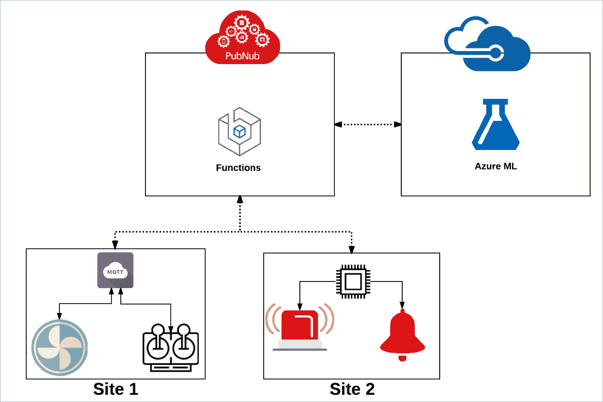
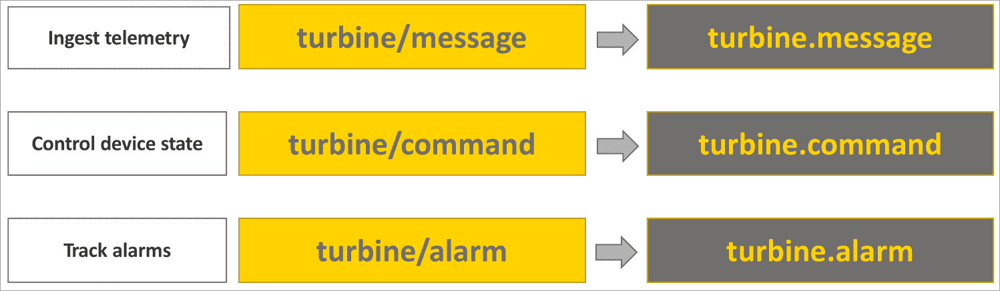
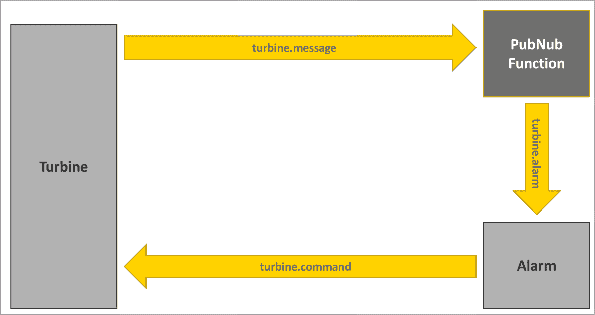

# 利用 PubNub 和 Azure 机器学习实现物联网预测性维护

> 原文：<https://thenewstack.io/tutorial-implementing-predictive-maintenance-connected-devices-pubnub-azure-ml-part-1/>

基于工业物联网的系统的主要优势之一是预测性维护。基于由连接的设备摄取的度量，机器学习算法检测异常以预测潜在的故障。这不仅为企业节省了数百万美元，而且还确保了处理缺陷设备所涉及的停机时间最短。

本教程系列将帮助开发人员对连接到全球第三方流媒体网络服务 [PubNub 数据流网络](https://www.pubnub.com/products/global-data-stream-network/) (DSN)的设备应用预测性维护。它将探索最近宣布的 PubNub 对 MQTT 支持的概念，以及 PubNub 的无服务器环境[函数](https://www.pubnub.com/products/functions/)。它将强调如何与微软 Azure 等第三方云服务集成。

本教程的场景涉及使用模拟涡轮机，该涡轮机吸收关键指标，如风扇速度、振动、噪音水平和温度。PubNub DSN 中摄取的每个指标都将被发送到 Azure ML，以预测可能的异常。PubNub 函数调用由 Azure ML 模型公开的 REST 端点，该模型被训练来预测异常。当 Web 服务重复报告异常时，PubNub 函数向模拟警报发送消息。如果警报在预定的时间内无人值守，它会自动关闭有问题的涡轮机。

## 介绍

实时数据流网络公司 PubNub 由[斯蒂芬·布鲁姆](https://www.linkedin.com/in/stephenlb/)和[托德·格林](https://www.linkedin.com/in/toddngreene/)于 2010 年创立，其愿景是为开发者开发一个流媒体网络，让他们像构建网页一样轻松地构建实时应用。PubNub 数据流网络(DSN)目前在全球超过 15 个存在点(PoP)可用，支持开发人员构建互联应用和服务。

当我想将远程物联网设备与其他设备连接时，我探索了 PubNub。让我震惊的是，我可以在没有服务器运行在云端的情况下连接两台 Raspberry Pi 设备。用不到十行代码，我可以很容易地连接两端。PubNub 提供了 70 多个 SDK，涵盖了包括 JavaScript、.NET、Java、Python 和 Swift。任何开发人员都可以立即开始使用 PubNub 消息传递。

要了解 PubNub 的强大之处，可以把它想象成一个内容交付网络(CDN ),只不过是针对流媒体。PubNub 对于流就像 Akamai 对于对象存储一样。发送到 PubNub DSN 的每条消息将在亚洲、欧洲和美洲的 15 个地点传递。在 99.999 的支持下，这些消息保证在 250 毫秒内送达世界任何地方。

PubNub 增加了拦截和动态操作流中消息的能力。这意味着开发人员可以动态地控制消息，以改变内容并针对不同的交付渠道。流的这种可编程性是通过名为 PubNub Functions 的无服务器产品提供的。像 AWS Lambda 和 Azure 函数一样，开发人员可以编写 JavaScript 代码片段，每次发送消息时都会调用这些代码片段。这为检查数据和执行定制操作提供了许多机会。

在我们将要探索的教程中有三个关键角色——设备、PubNub DSN 和 Azure ML。除了编排由涡轮机和警报组成的设备层之间的消息流，PubNub 还负责调用 Azure 中托管的 ML Web 服务。训练和部署机器学习模型所涉及的繁重工作被委托给 Azure ML。



要运行这个示例，你需要一个拥有[PubNub.com](https://www.pubnub.com/)和 [Azure ML Studio](https://studio.azureml.net/) 的账户。

## 设备层

我们在设备层有两个实体——涡轮机和警报器。它们都连接到 PubNub DSN。

涡轮机使用标准 MQTT 库向 PubNub 发布消息。最近，PubNub 增加了对 MQTT 的原生支持，这使得开发人员能够使用熟悉的 MQTT 库(如 [Paho](https://www.eclipse.org/paho/) )向网络发布消息。MQTT 端点在 mqtt.pndsn.com 的*暴露。MQTT 端点的身份验证机制基于 admin.pubnub.com 提供的发布者和订阅者密钥的组合。MQTT 客户机的客户机 id 使用这些键来构造一个惟一的标识符。基于 clientid 的身份验证确保标准 MQTT 程序没有任何变化。这对于将使用 MQTT 的现有设备连接到 PubNub 网络非常有帮助。参考 [MQTT 博客文章](http://www.pubnub.com/blog/brings-power-of-data-stream-network-to-mqtt-devices/)和 [MQTT PubNub 桥](https://www.pubnub.com/docs/mqtt-pubnub-bridge/getting-started)文档，了解更多关于 PubNub 对 MQTT 支持的细节。*

下面的代码片段表示一个涡轮机通过 MQTT 向 PubNub 发送消息。

```
import time

import requests

import random

import datetime

import calendar

import json

import paho.mqtt.client as mqtt

from termcolor import colored

broker_address  =  "mqtt.pndsn.com"

run  =  1

fault  =  False  #Change this to true to introduce anomaly

def on_message(mosq,  obj,  msg):

     global run   

     run=json.loads(msg.payload)["run"]

     print colored('Command received with run level:'  +  str(run),'yellow')

     if(run  ==  0):

              print colored('Attempting to stop the fan...','yellow')

def on_subscribe(mosq,  obj,  mid,  granted_qos):

     print("Subscribed: "  +  str(mid)  +  " "  +  str(granted_qos))

client  =  mqtt.Client("&lt;Pub_Key&gt;/&lt;Sub_Key&gt;/client1")

client.on_message  =  on_message

```

```
client.on_subscribe  =  on_subscribe

client.connect(broker_address)

client.subscribe("turbine/command",  0)

while run  ==  1:

             d={}

             d["deviceID"]  =  1

             d["timeStamp"]  =  '{:%Y-%m-%d %H:%M:%S}'.format(datetime.datetime.now())

             if fault  ==  True:                     

                         d["rotation"]  =  round(random.uniform(200,400),1)

                         d["temperature"]  =  round(random.uniform(47.0,72.0),1)

                         d["vibration"]  =  round(random.uniform(210.0,320.0),1)

                         d["sound"]  =  round(random.uniform(55.0,75.0),1)
 else:
                          d["rotation"]  =  round(random.uniform(500,700),1)

                         d["temperature"]  =  round(random.uniform(35.0,45.0),1)

                         d["vibration"]  =  round(random.uniform(100.0,200.0),1)

                         d["sound"]  =  round(random.uniform(45.0,52.0),1)

             payload  =  json.dumps(d,  ensure_ascii=False)

             print colored("Fan's run level is 1",'white')

             print colored(payload,'blue')

             client.publish("turbine/message",payload)

             time.sleep(2)

             client.loop()

print colored('Fan stopped','red')

```

在运行脚本之前安装模块和依赖项:

```
$  pip install paho-mqtt

$  pip install termcolor

$  pip install  'pubnub&gt;=4.0.13'

```

首先，代码基于 Paho 库，这在开发人员中很流行。代理指向 mqtt.pndsn.com，这是托管 MQTT 桥的端点。请注意 clientid 的构造方式。它结合使用了发布者和订阅者密钥以及一个客户端标识符。这对于客户端获得 PubNub 平台的身份验证是必不可少的。

在正常情况下，Python 代码生成的遥测数据在可接受的水平之下。当我们需要模拟异常时，我们可以通过将变量 *fault* 变为 *True* 来改变指标。

如果你是 MQTT 新手，可以参考我在 New Stack 上发表的[深潜教程](https://thenewstack.io/mqtt-protocol-iot/)。

代码将遥测数据发布到 MQTT 主题*涡轮机/消息*，同时订阅*涡轮机/命令*。当一个警报设备想要关闭故障涡轮机时，它会发布相同主题的命令。



有趣的是，MQTT 主题、 *turbine/message* 和 *turbine/command* 映射到 PubNub 的通道，这些通道遵循 turbine.message 和 turbine.command 的命名约定。任何 PubNub 客户端都可以通过这些通道检索遥测数据或向涡轮机发送命令。这种互操作性使得 MQTT 客户机与 PubNub 原生客户机的集成变得很容易。

本地 PubNub 客户端也可以使用通配符符号订阅主题。比如订阅*涡轮。** topic 将使客户端能够接收发送到父级 turbine 的所有消息。



在本教程系列的下一部分中，我们将使用 Python 构建原生 PubNub 客户端。我们还将通过 PubNub 函数实现无服务器计算，以调用 Azure ML 中的预测维护机器学习模型。敬请期待！

微软是新堆栈的赞助商。

通过 Pixabay 的特征图像。

<svg xmlns:xlink="http://www.w3.org/1999/xlink" viewBox="0 0 68 31" version="1.1"><title>Group</title> <desc>Created with Sketch.</desc></svg>