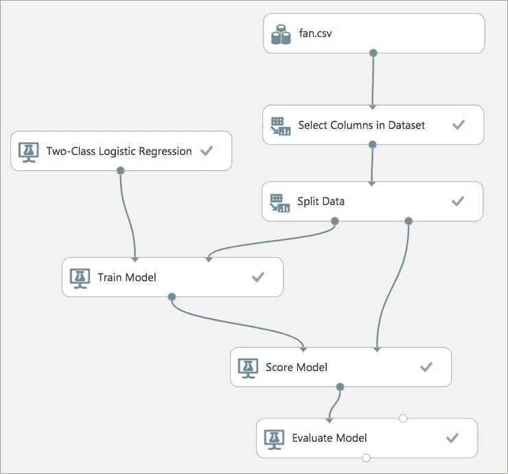
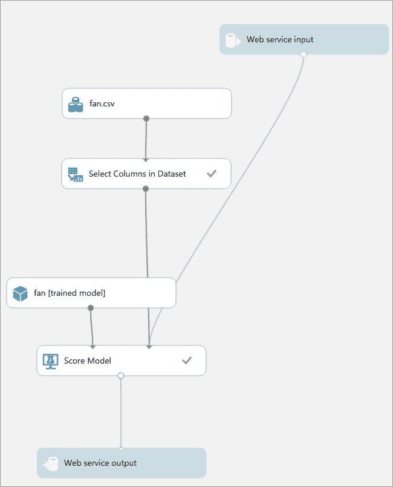
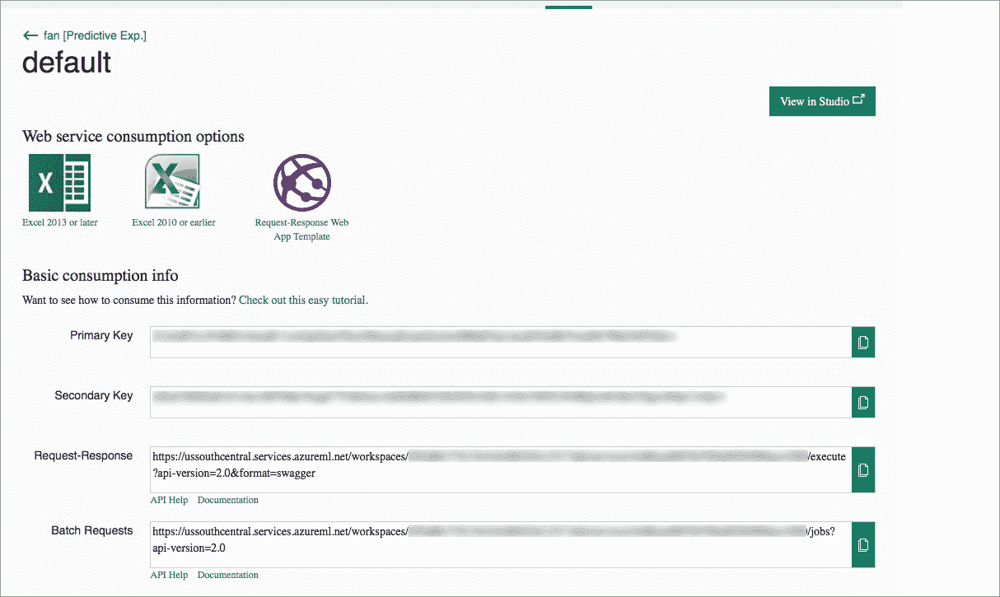
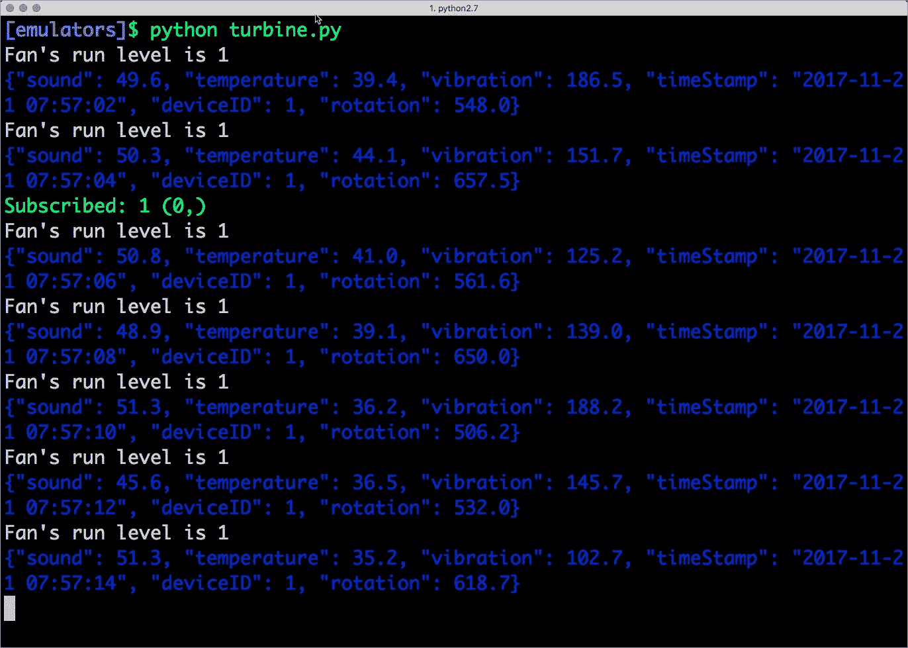
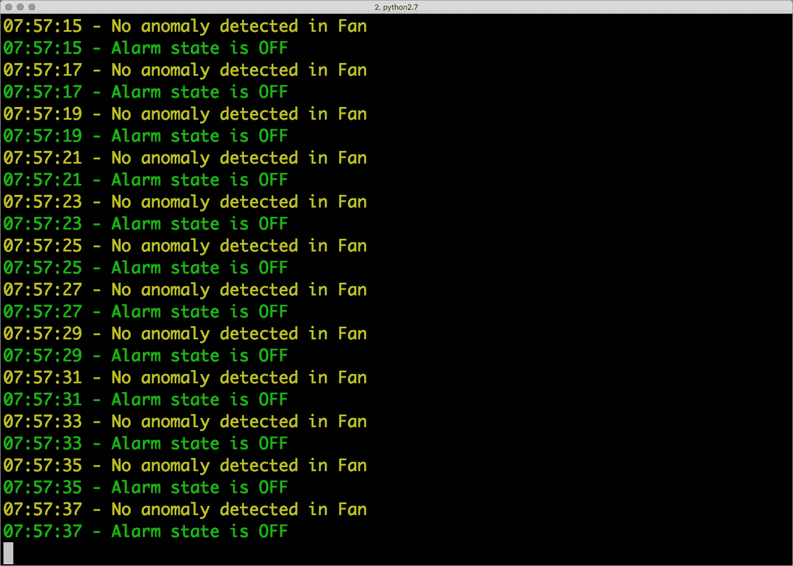
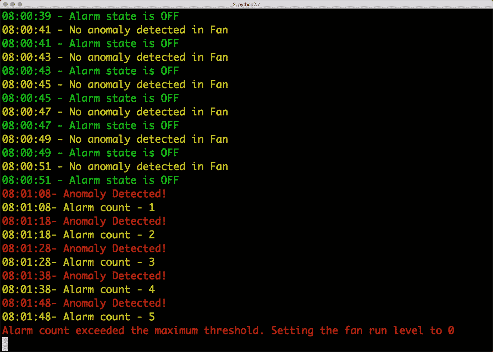
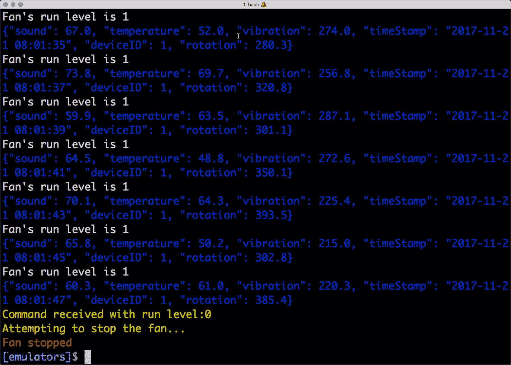

# 教程:使用 PubNub 和 Azure 机器学习在连接设备中进行异常检测

> 原文：<https://thenewstack.io/tutorial-implementing-predictive-maintenance-connected-devices-pubnub-azure-ml-part-2/>

在本系列的[前一部分，我介绍了作为实时数据流网络平台的](https://thenewstack.io/tutorial-implementing-predictive-maintenance-connected-devices-pubnub-azure-ml-part-1/) [PubNub](https://www.pubnub.com/) ，它具有对 [MQTT](http://mqtt.org/) 连接协议的本地支持。我们基于流行的 Paho MQTT 客户端用 Python 构建了一个涡轮机模拟器。在本教程中，我们将基于 [Azure ML Studio](https://studio.azureml.net/) 实现异常检测。

除了使用标准的 MQTT 库，开发人员还可以在客户端使用本地的 PubNub 软件开发工具包(SDK)。PubNub 客户端可以相互对话，即使它们没有使用相同的协议或库。

为了演示这种能力，我们实现了基于 Python 的 PubNub native SDK 的警报设备。下面的代码片段对 PubNub 开发者来说很熟悉:

```
from pubnub.callbacks import SubscribeCallback
from pubnub.enums import PNStatusCategory
from pubnub.pnconfiguration import PNConfiguration
from pubnub.pubnub import PubNub
from termcolor import colored
import sys
import signal
import os
import json
from datetime import datetime

alarm_count  =  0
run_level  =  1

class AlarmCallback(SubscribeCallback):
   def status(self,  pubnub,  status):
       pass

   def presence(self,  pubnub,  presence):
       pass   # handle incoming presence data

 def message(self,  pubnub,  message):
 global alarm_count
 global run_level
 state  =  message.message['alarm'].upper()

 if  (state  ==  "OFF"):
          print colored(str(datetime.now().time().strftime("%H:%M:%S"))  +' - No anomaly detected in Fan',  'yellow')
          print colored(str(datetime.now().time().strftime("%H:%M:%S"))  +' - Alarm state is OFF'  ,'green')
          run_level  =  1
          alarm_count  =  0
 else:
          alarm_count  =  alarm_count  +  1
          print colored(str(datetime.now().time().strftime("%H:%M:%S"))  +'- Anomaly Detected!',  'red')
          print colored(str(datetime.now().time().strftime("%H:%M:%S"))  +'- Alarm count - '  +  str(alarm_count),'yellow')
 if  (alarm_count  &gt;=  5):
          if  (run_level  ==  1):
              print colored('Alarm count exceeded the maximum threshold. Setting the fan run level to 0',  'red')
              publish()
              run_level  =  0
              alarm_count  =  0

pnconfig  =  PNConfiguration()
pnconfig.subscribe_key  =  "&lt;Sub_Key&gt;"
pnconfig.publish_key  =  "&lt;Pub_Key&gt;"
pnconfig.ssl  =  False

pubnub  =  PubNub(pnconfig)
pubnub.add_listener(AlarmCallback())
pubnub.subscribe().channels('turbine.alarm').execute()
print('connected')
def signal_handler(signal,  frame):
    print("Caught Signal CTRL+C..exiting gracefully")
    sys.exit(0)

def publish():
pubnub.publish().channel('turbine.command').message({'run':0}).sync()

```

当 PubNub 功能向警报发送消息时，它会等待计数达到 5，然后关闭涡轮机。它通过向 turbine.command PubNub 主题发布一条消息来执行此操作，该主题对于 turbine 是可见的，即 turbine/command MQTT 主题。涡轮机将继续发送数据，而报警器将监听消息。

在用从 PubNub admin dashboard 获得的实际密钥替换 Pub_Key 和 Sub_Key 之后，您可以为涡轮机和警报运行这些模拟器。

代码可以在 [Github repo](https://github.com/janakiramm/pubnub-mqtt-azure) 中获得，供您克隆或派生。

## 数据接收和业务逻辑

在上一节中，我们注意到连接到 PubNub 的设备可以通过 MQTT 协议或本地 PubNub 通道发布和订阅。消息传递由 PubNub 网络处理，无需提供或配置服务器。

但是，在将消息传递给订阅者之前，可能需要截取消息，甚至修改它们。这就是无服务器计算环境 PubNub 发挥作用的地方。

在我们的场景中，涡轮机发布的每个数据点都到达 PubNub 函数，然后 pub nub 函数将其转发给机器学习 web 服务以检测故障。在注意到连续 10 个故障后，该功能将向订阅报警的主题发布一条消息。

这个用例强调了 PubNub 函数如何根据定制逻辑编排消息流。开发人员可以只编写几行 JavaScript 代码来实现逻辑。由于不涉及服务器，PubNub Functions 成为在无服务器环境中运行业务逻辑的一个高效且经济的平台。功能类似于 AWS Lambda、Azure Functions 和其他无服务器平台。

我们首先创建一个名为 CheckAnomaly 的新函数，它在消息发布到 turbine.message channel 后立即被触发。因此，我们选择“发布或解雇后”作为触发机制。

该功能从设置对所需模块的引用开始。

```
const xhr  =  require("xhr");
const pubnub  =  require('pubnub');
const db  =  require("kvstore");

```

XHR 用于进行出站 HTTP 调用。我们用它来调用 [Azure 机器学习](https://azure.microsoft.com/en-us/services/machine-learning-studio/) (Azure ML) REST 端点。它是 PubNub 函数支持的核心模块之一。

pubnub 模块提供 PubNub 客户端 API，将消息发布到数据流网络。最后，kvstore 模块为我们提供了对持久键/值数据库的访问。因为 PubNub 函数是无状态的，所以这个模块对于在多次调用函数时维护状态非常有用。

下一步是定义和初始化一组我们稍后会用到的变量。

```
const api_key  =  'AZURE_ML_KEY';
   const body  =  {
       'Inputs':  {
           'input1':  [{
               'Rotation':  request.message.rotation,
               "Temperature":  request.message.temperature,
               "Vibration":  request.message.vibration,
               "Sound":  request.message.sound
           }]
       }
   };
   const url  =  "AZURE_ML_ENDPOINT";
   var anomaly_count;

```

api _ key 变量保存 Azure ML web 服务的 API 密钥。发送到 web 服务的参数嵌入在 body 对象中。URL 变量将我们指向 web 服务端点，而 anomaly_count 变量通过 ML 算法跟踪报告的异常数。

最后，我们从上面的变量中构造 HTTP 有效负载。

```
   const http_options  =  {
       "method":  "POST",
       "headers":  {
           "Content-Type":  "application/json",
           'Authorization':  ('Bearer '  +  api_key)
       },
       "body":  body
   };

```

下一个模块通过有效使用 KV 存储器来维护异常计数器。

```
  db.get("anomaly_count").then((value)  =&gt;  {
       anomaly_count  =  value.count;
       if  (anomaly_count  ==  "undefined"  ||  anomaly_count  ==  "null")  {
           anomaly_count  =  0;
           db.set("anomaly_count",  {
               'count':  anomaly_count
           });
       }
   });

```

函数的最后部分包含基本逻辑。它调用 ML web 服务，检查所报告异常的计数，并通过向它发送消息来调用警报。这种机制避免了 ML 模型偶尔报告的假阳性。

```
   return xhr.fetch(url,  http_options).then((x)  =&gt;  {
       const body  =  JSON.parse(x.body);
       const anomaly_score  =  body.Results.output1[0]["Scored Probabilities"];
       var msg;
       if  (anomaly_score  &gt;  0.7)  {
           console.log("{'anomaly': true, 'score':"  +  anomaly_score  +  ", anomaly_count:"  +  anomaly_count  +  "}");
           if  (anomaly_count  &gt;=  5)  {
               msg  =  {
                   'alarm':  'on'
               };
               anomaly_count  =  0;
           }
           anomaly_count  =  anomaly_count  +  1;
           db.set("anomaly_count",  {
               'count':  anomaly_count
           });
       }  else  {
           msg  =  {
               'alarm':  'off'
           };
       }
       pubnub.publish({
           "channel":  "turbine.alarm",
           "message":  msg
       }).then((publishResponse)  =&gt;  {});
       return request.ok();
   });

```

Azure ML web 服务检查每条消息的异常，并以介于 0 和 1 之间的分数形式返回概率。我们首先检查分数是否高于 0.7，以避免误报。如果异常分数高于 0.7，计数超过 5，我们调整存储在 KV 存储中的变量，并将 msg 变量初始化为 on 或 off 以调用警报。

最后，pubnub.publish 方法将 msg 变量推送到警报模拟器正在侦听的 turbine.alarm 通道。

## 实现机器学习模型

为了实现机器学习模型，我们利用 Azure ML Studio，它提供了一个无服务器的平台来训练和发布 ML 模型。



我们上传一个数据集( [fan.csv](https://github.com/janakiramm/pubnub-mqtt-azure/blob/master/data/fan.csv) )，该数据集包含样本涡轮机遥测数据以训练 ML 模型。该数据集包含正常和异常数据，有助于我们训练模型。

下一步，我们从数据集中选择适当的列，如振动、噪声、温度和转速。

然后，数据集被分成两部分，一部分用于训练，另一部分用于测试。75%的数据用于训练模型，而剩余的 25%用于测试模型的准确性。

训练数据集用于通过二进制分类算法训练模型。两级逻辑回归模块将给定的数据点分类为正常(0)或异常(1)。

我们最后使用训练好的分类模型对模型进行评分以生成预测。分数模型模块输出该类的预测值，以及该预测值的概率。我们将使用 PubNub 函数中预测值的概率来决定是否调用警报。

最后一步，评估模型根据一组行业标准评估指标来衡量已训练模型的准确性。该模块验证了模型的准确性和精度。

一旦模型经过训练，我们就可以将其发布为 web 服务，准备好处理新的数据点。Azure ML Studio 使得将模型作为 RESTful 服务发布变得容易。



web 服务由 Azure ML Studio 发布和托管。配置页面显示了 HTTP 端点和调用它所需的 API 键。



## 测试解决方案

在配置了解决方案的所有组件之后，您可以通过在正常和故障两种状态下运行模拟器来验证它。

启动两个终端窗口，分别运行 *turbine.py* 和 *alarm.py* 。





由于没有发现异常，警报状态总是关闭。

让我们在数据中引入异常。打开 turbine.py，将变量 Fault 改为 True。这迫使我们的仿真器发布超出预期范围的遥测数据。由于 Azure ML 报告的异常检测，模式的这种变化将触发警报。

再次启动 turbine.py，并监控运行警报模拟器的终端。



当警报计数超过 5 时，它会继续关闭涡轮风扇。

下面的屏幕截图显示涡轮机的运行水平被设置为零，表明它现在已经关闭。



恭喜你！您已经成功实施了一个用于预测工业物联网环境异常的无服务器解决方案。

## 结论

本教程向我们介绍了配置 PubNub DSN 和函数以与第三方服务集成的步骤。它强调了本地 MQTT 协议和 PubNub 网络之间的互操作性。

PubNub 函数提供了一个强大的机制来实现可以修改和操作入站消息的业务逻辑。我们已经看到了如何将 XHR、KV store 和 PubNub 模块与函数一起使用。

通过利用 Azure ML Studio 及其无服务器架构，我们可以为 PubNub 函数添加复杂的机器学习功能。这种集成展示了 PubNub 如何将重担转移到公共云平台，如微软 Azure，以执行计算密集型任务。

微软是新堆栈的赞助商。

通过 Pixabay 的特征图像。

<svg xmlns:xlink="http://www.w3.org/1999/xlink" viewBox="0 0 68 31" version="1.1"><title>Group</title> <desc>Created with Sketch.</desc></svg>