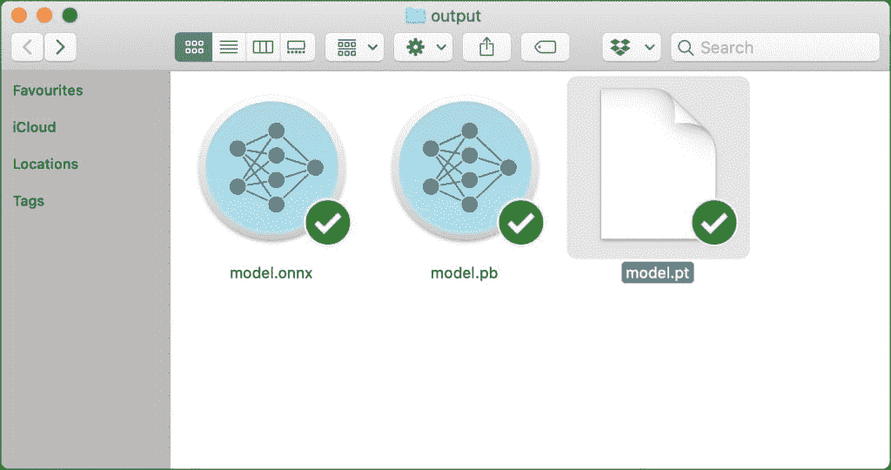
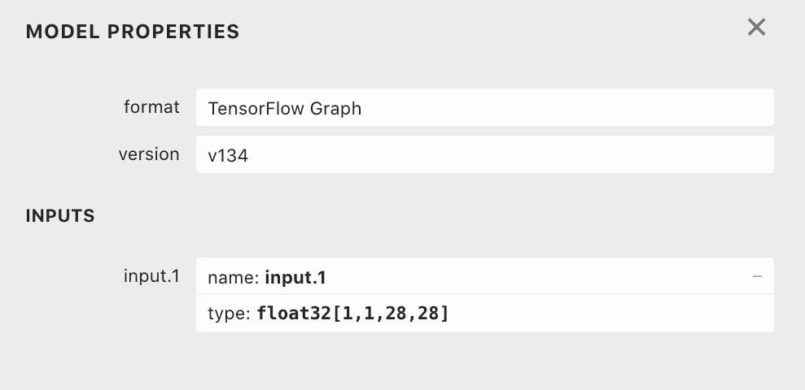
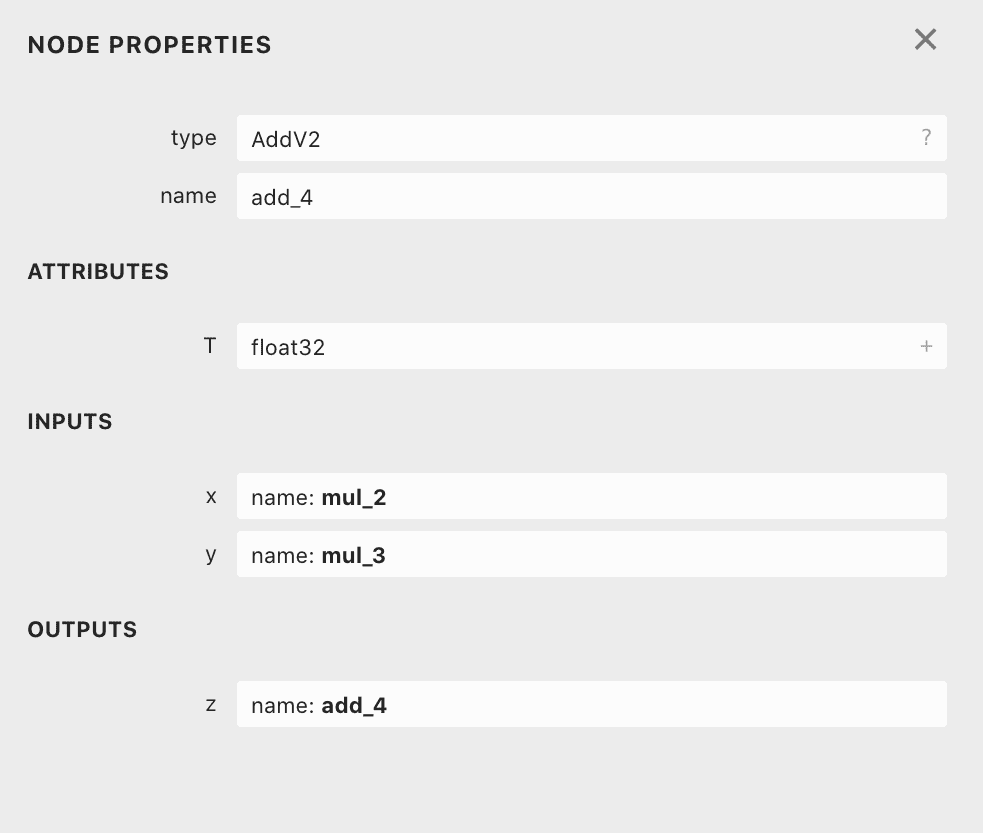

# 教程:将 ONNX 模型导入 TensorFlow 进行推理

> 原文：<https://thenewstack.io/tutorial-import-an-onnx-model-into-tensorflow-for-inference/>

*This post is the fourth in a series of introductory tutorials on the Open Neural Network Exchange (ONNX), an initiative from AWS, Microsoft, and Facebook to define a standard for interoperability across machine learning platforms. See: [Part 1](https://thenewstack.io/open-neural-network-exchange-brings-interoperability-to-machine-learning-frameworks/), [Part 2](https://thenewstack.io/tutorial-using-a-pre-trained-onnx-model-for-inferencing/), and [Part 3](https://thenewstack.io/tutorial-train-a-deep-learning-model-in-pytorch-and-export-it-to-onnx/).*

在上一个教程中，我们在 PyTorch 中训练了一个 CNN 模型，并将其转换为 ONNX 模型。在当前教程中，我们将把模型导入 TensorFlow 并用于推理。

在继续之前，请确保您已经完成了上一个教程，因为这是同一教程的扩展。

## 将 ONNX 模型转换为张量流模型

`output`文件夹有一个 ONNX 模型，我们将把它转换成 TensorFlow 格式。

ONNX 有一个 Python 模块，可以加载模型并保存到 TensorFlow 图中。

我们现在已经为转换做好了准备。用下面的代码创建一个 Python 程序并运行它:

```
import onnx
from onnx_tf.backend import prepare

onnx_model  =  onnx.load("output/model.onnx")
tf_rep  =  prepare(onnx_model)
tf_rep.export_graph("output/model.pb")

```

`output`文件夹包含三个模型:PyTorch、ONNX 和 TensorFlow。

[](https://thenewstack.io/tutorial-import-an-onnx-model-into-tensorflow-for-inference/onnx-tf-1/)

我们现在准备在 [TensorFlow](https://www.tensorflow.org/) 中使用该模型。请注意，它仅适用于 TensorFlow 1.x。对于本教程，我们使用的是 1.15，这是最后一个版本。

```
import tensorflow as tf
import numpy as np
import cv2

import logging,  os
logging.disable(logging.WARNING)
os.environ["TF_CPP_MIN_LOG_LEVEL"]  =  "3"

INPUT_TENSOR_NAME  =  'input.1:0'
OUTPUT_TENSOR_NAME  =  'add_4:0'
IMAGE_PATH="0.png"
PB_PATH="output/model.pb"

img  =  cv2.imread(IMAGE_PATH)
img  =  np.dot(img[...,:3],  [0.299,  0.587,  0.114])
img  =  cv2.resize(img,  dsize=(28,  28),  interpolation=cv2.INTER_AREA)
img.resize((1,  1,  28,  28))

with tf.gfile.FastGFile(PB_PATH,  'rb')  as  f:
    graph_def  =  tf.GraphDef()
    graph_def.ParseFromString(f.read())

with tf.Graph().as_default()  as graph:
    tf.import_graph_def(graph_def,  name="")

input_tensor  =  graph.get_tensor_by_name(INPUT_TENSOR_NAME)
output_tensor  =  graph.get_tensor_by_name(OUTPUT_TENSOR_NAME)

with tf.Session(graph=graph)  as sess:
    output_vals  =  sess.run(output_tensor,  feed_dict={input_tensor:  img})  #

prediction=int(np.argmax(np.array(output_vals).squeeze(),  axis=0))
print(prediction)

```

我们首先导入正确的模块，然后禁用 TensorFlow 生成的警告。

通过打开`model.pb`文件，可以从 Netron 工具中获取输入和输出张量的名称。

输入节点( *input.1* )和输出节点( *add_4* )的名称和形状在 Netron 中可见。

[](https://thenewstack.io/tutorial-import-an-onnx-model-into-tensorflow-for-inference/onnx-tf-2/)

[](https://thenewstack.io/tutorial-import-an-onnx-model-into-tensorflow-for-inference/onnx-tf-3/)

接下来的几行代码通过 OpenCV 对图像进行预处理。然后，我们打开 TensorFlow 模型，并基于该图创建一个会话。

最后，通过应用`argmax`函数，我们将输出分类到 MNIST 定义的十个类别之一。

在本教程中，我们将 ONNX 模型导入到 TensorFlow 中，并使用它进行推理。在下一部分中，我们将构建一个运行在边缘的计算机视觉应用，由英特尔的 Movidius 神经计算棒提供支持。该模型使用一个 ONNX 运行时执行提供程序，该提供程序针对 OpenVINO 工具包进行了优化。敬请关注。

贾纳奇拉姆·MSV 的网络研讨会系列“机器智能和现代基础设施(MI2)”提供了涵盖前沿技术的信息丰富、见解深刻的会议。在 [http://mi2.live](http://mi2.live) 注册即将到来的 MI2 网络研讨会。

<svg xmlns:xlink="http://www.w3.org/1999/xlink" viewBox="0 0 68 31" version="1.1"><title>Group</title> <desc>Created with Sketch.</desc></svg>