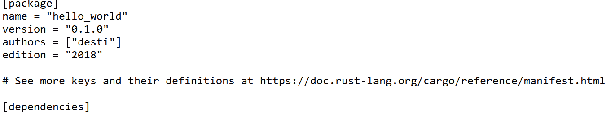
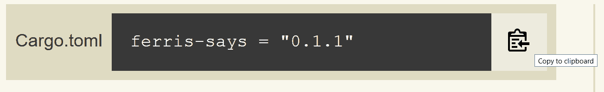
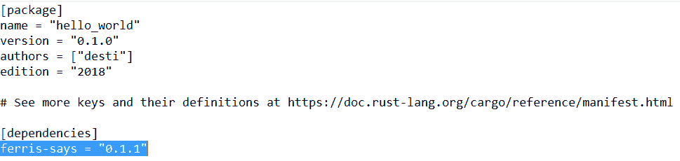
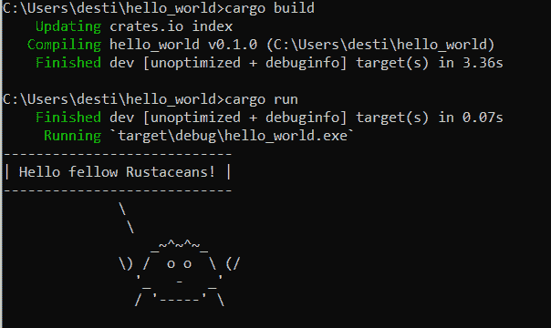
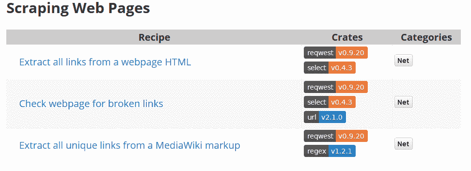

# 教程:用 Crates.io 导入 Rust 代码库

> 原文：<https://thenewstack.io/tutorial-import-libraries-of-rust-code-with-crates-io/>

当你第一次[开始](/tutorial-installing-rust/)使用 Rust 时，你最终会发现 crates.io 上有一个非常重要的仓库，用户可以在那里以模块的形式分享他们的 Rust 代码——称为“crates”。这是 Rust 的官方软件包注册表，它自豪地告诉访问者，他们现在已经看到了 1，397，892，571 次下载。(有超过 29187 个可供选择。)

幸运的是，将这些库导入到您自己的 Rust 代码中真的很容易…

Rust 的[官方“入门”指南](https://www.rust-lang.org/learn/get-started)不仅将访问者引向 crates.io 上共享代码模块的巨大宝库，还展示了如何用一个名为“Ferris 说”的包来安装它们

这将是我第一次接触 Rust 导入库的语法。

正如我在[我的第一周 Rust](https://thenewstack.io/tutorial-installing-rust/) 中了解到的，即使编写一个简单的“Hello World”程序也需要创建代码本身的源文件和第二个清单文件。但好消息是 Rust 的`cargo`工具会自动创建清单文件——并且还包含一个空白部分，以后可以在其中添加依赖项(如导入的 Rust 库)。



每个库在 **crates.io** 的页面都以添加到您的清单文件中以导入它的代码行开始。事实上，要将它添加到您的清单中，您甚至不必键入代码行。代码右边的图标可以让你把它直接复制到你的缓冲区中。




所以我将适当的行添加到我的清单文件**cargo . toml**——然后准备编译和运行新代码。



“入门”指南还建议更换我的旧 Hello World 代码……

```
fn main()  {
    println!("Hello, world!");
}

```

…与

```
use ferris_says::say;  // from the previous step
use std::io::{stdout,  BufWriter};

fn main()  {
    let stdout  =  stdout();
    let out  =  b"Hello fellow Rustaceans!";
    let width  =  24;

    let mut writer  =  BufWriter::new(stdout.lock());
    say(out,  width,  &amp;mut writer).unwrap();
}

```

一次剪贴之后，我准备好了。因此，当我键入`cargo build`来编译代码时，我惊讶地发现添加看似非常小的更改需要这么长时间。但后来我意识到 cargo 已经借此机会更新了其位于 **crates.io** 的内部文件索引。几分钟过去了，货物程序告诉我它还在更新。我看着 ASCII 艺术箭头在屏幕上慢慢移动…


但最终它们都被下载了——然后被编译了——所以我可以用我新安装的 Rust 库继续打印“Hello，world”这个重要的任务了。

而且很管用！



“你现在是一个 Rustacean！”解释入门指南。“欢迎光临！我们很高兴有你。”

### 探索 Crates.io 上的 Rust 库

浏览 crates.io，我最终发现有一个“类别”页面，将可下载的库分成 47 个不同的类别。有一个类别有 532 个算法箱，有望实现排序和搜索等核心算法的 Rust 实现，以及 68 个日期和时间箱，“以管理处理第四维空间的内在复杂性。”

当然，这不是唯一可以导入库的地方。cargo 的官方[文档提醒您，库可以很容易地来自 git 存储库，甚至来自本地文件系统的子目录。(根据运行代码的平台不同，改变依赖关系也有奇特的技巧。)](https://doc.rust-lang.org/cargo/reference/specifying-dependencies.html)

事实上，一个名为“Rust-official”的 GitHub 库也提供了一个所谓的 [Awesome Rust](https://github.com/rust-unofficial/awesome-rust) 的精选集合，其中包括指向库、开发工具甚至整个应用程序的代码的链接。

但事实证明还有一种更简单的方法来玩板条箱。下载量最高的前 100 个板条箱[已经预装在网上的](https://play.integer32.com/help#features-crates)“Rust Playground”这也给了你一个机会来看看清单文件在导入 100 个不同的依赖项时是什么样子的。此外，它还包括来自“ [The Rust Cookbook](https://rust-lang-nursery.github.io/rust-cookbook/) ”的所有库，该书将自己描述为“一组简单的示例，展示了使用 Rust 生态系统的板条箱完成常见编程任务的良好实践。”

作为一种学习资源，我喜欢这本“食谱”,因为它有助于指出每个例子需要哪些板条箱——那些双色“徽章”(带有板条箱名称)链接到详细的文档。



此外，通过阅读“食谱”，我还发现有一种更简单的方法来将依赖关系添加到清单中。

当您在项目的目录中时(其中有 **Cargo.toml** 文件)，有一种方法可以只使用命令行命令`cargo add`和库的名称。

`> cargo add rand`

具有讽刺意味的是，这种向清单添加新依赖项的更简单的方法只有在——向清单添加新依赖项——之后才启用。具体来说，你需要安装`cargo-edit`工具，其[网页(在 GitHub 上)](https://github.com/killercup/cargo-edit)将其描述为“从命令行管理货物依赖关系的实用程序”

`cargo-edit`安装也可能需要几分钟——但是您的 Rust 环境配备了一个简单的命令，可以从命令行添加新的板条箱。

`> cargo install cargo-edit
> cargo add rand`

如果你改变了对依赖的想法，也有一种方法可以将它从你的清单中彻底删除。只需将命令中的**添加**替换为 **rm** 。

`> cargo rm rand`

还有第三个命令。当你在一个项目的目录中时，输入`cargo upgrade`将会检查每个项目的依赖项，看看是否有更新的版本可以使用——如果有，将会执行必要的更新。

`> cargo upgrade`

这些工具看似简单，却无比强大，让您可以灵活地从成千上万的新代码模块中进行选择，添加到等待您的未来 Rust 项目中。

所以现在乐趣可以真正开始了。因为一旦你知道如何添加*一个*锈库，你就可以开始玩添加更多*了！*

<svg xmlns:xlink="http://www.w3.org/1999/xlink" viewBox="0 0 68 31" version="1.1"><title>Group</title> <desc>Created with Sketch.</desc></svg>