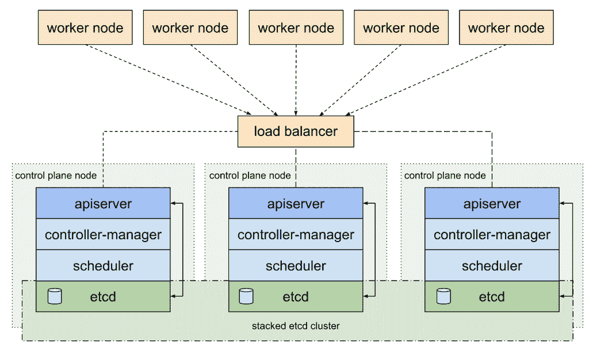
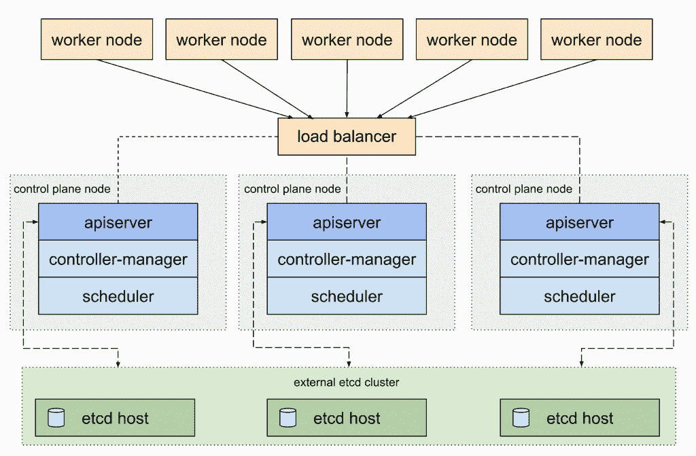
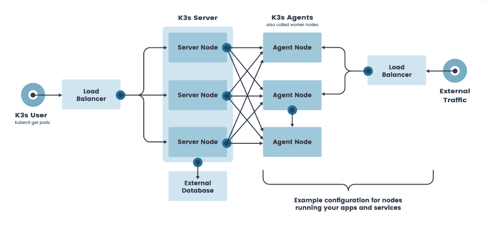
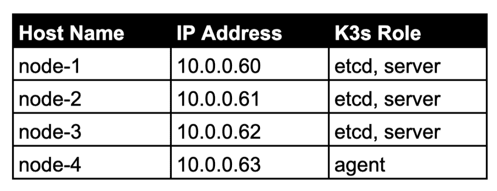
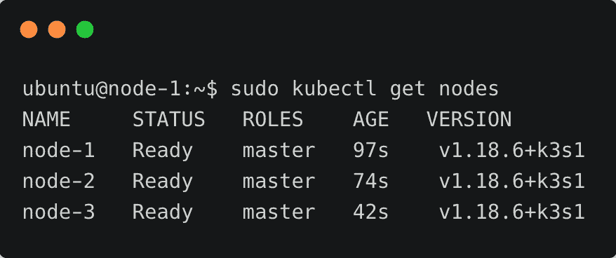
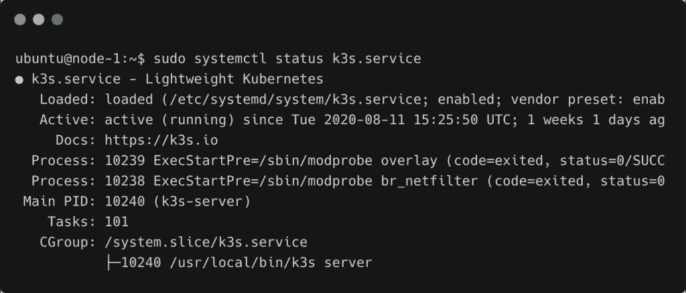
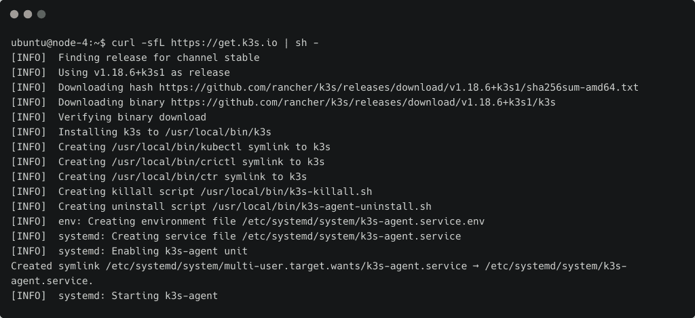
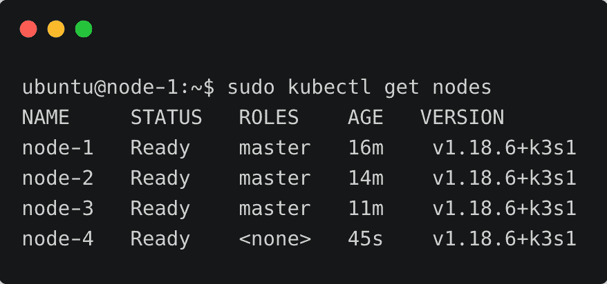
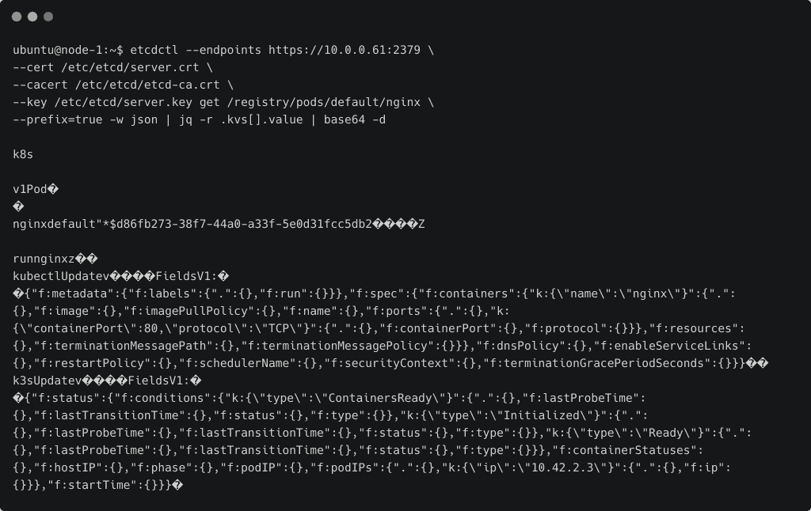

# 教程:在边缘安装高可用性 K3s 集群

> 原文：<https://thenewstack.io/tutorial-install-a-highly-available-k3s-cluster-at-the-edge/>

这是 K3s 系列教程[的最后一部分。在](https://thenewstack.io/how-rancher-labs-k3s-makes-it-easy-to-run-kubernetes-at-the-edge/)[之前的教程](https://thenewstack.io/tutorial-set-up-a-secure-and-highly-available-etcd-cluster/)中，我们已经看到了如何建立一个多节点 etcd 集群。我们将利用相同的基础设施来设置和配置基于 K3s 的高可用性 Kubernetes 集群。

## 高可用性模式下的 Kubernetes 集群

Kubernetes 集群的控制平面大多是无状态的。控制平面唯一有状态的组件是 [etcd](http://www.etcd.io) 数据库，它充当整个集群的唯一数据源。API 服务器充当 etcd 数据库的网关，内部和外部用户通过它访问和操作状态。

将 etcd 数据库配置为高可用性模式以确保没有单点故障，这一点很重要。根据 etcd 的设置方式，有两种配置高可用性(HA) Kubernetes 集群拓扑的选项。

第一种拓扑基于堆叠式集群设计，其中每个节点运行一个 etcd 实例和控制平面。每个控制平面节点运行 *kube-apiserver* 、 *kube-scheduler* 和*kube-controller-manager*的一个实例。使用负载均衡器将 *kube-apiserver* 暴露给工作节点。

每个控制平面节点创建一个本地 etcd 成员，该 etcd 成员仅与该节点的 *kube-apiserver* 通信。这同样适用于本地 *kube 控制器管理器*和 *kube 调度器*实例。

这种拓扑要求 HA Kubernetes 集群至少有三种堆叠控制平面模式。流行的集群安装工具使用这种拓扑来配置 Kubernetes 集群。



第二种拓扑使用外部 etcd 集群，在完全不同的主机上安装和管理。

在该拓扑中，每个控制平面节点运行 *kube-apiserver* 、 *kube-scheduler* 和*kube-controller-manager*的实例，其中每个 etcd 主机与每个控制平面节点的 *kube-apiserver* 通信。



这种拓扑需要的主机数量是堆叠式 HA 拓扑的两倍。对于采用此拓扑的 HA 集群，至少需要三台主机用于控制面板节点，三台主机用于 etcd 节点。

关于引导集群的更多信息，请参考官方的 Kubernetes [文档](https://kubernetes.io/docs/setup/production-environment/tools/kubeadm/ha-topology/)。

### K3s 处于高可用性模式

由于 K3s 主要部署在硬件资源有限的边缘，因此可能无法在专用主机上运行 etcd 数据库。除了预先配置 etcd 数据库之外，部署架构非常类似于堆叠拓扑。



在本演练中，我使用运行在英特尔 NUC 硬件上的裸机基础设施，映射如下:



参考本教程系列的[上一部分](https://thenewstack.io/tutorial-set-up-a-secure-and-highly-available-etcd-cluster/)在 IP 地址为 10.0.0.60、10.0.0.61 和 10.0.0.62 的前三个节点上安装和配置 etcd。

### 安装 K3s 服务器

让我们从在安装了 etcd 的所有节点上安装服务器开始。SSH 进入第一个节点，并设置下面的环境变量。这假设您遵循了上一教程中解释的步骤来配置 etcd 集群。

```
export K3S_DATASTORE_ENDPOINT='https://10.0.0.60:2379,https://10.0.0.61:2379,https://10.0.0.62:2379'
export K3S_DATASTORE_CAFILE='/etc/etcd/etcd-ca.crt'
export K3S_DATASTORE_CERTFILE='/etc/etcd/server.crt'
export K3S_DATASTORE_KEYFILE='/etc/etcd/server.key'

```

这些环境变量指示 K3s 安装程序利用现有的 etcd 数据库进行状态管理。

接下来，我们将用代理用来加入集群的令牌填充`K3S_TOKEN`。

```
export K3S_TOKEN="secret_edgecluster_token"

```

我们准备在第一个节点安装服务器。运行以下命令启动该过程。

```
curl  -sfL https://get.k3s.io | sh -

```

重复`node-2`和`node-3`中的这些步骤，启动其他服务器。

此时，您拥有一个三节点 K3s 集群，它以高可用性模式运行控制面板和 etcd 组件。



您可以使用下面的命令检查服务的状态:

```
sudo systemctl status k3s.service

```



### 安装 K3s 代理

随着控制面板的启动和运行，我们可以轻松地向集群添加工作节点或代理。我们只需要确保使用与服务器关联的相同令牌。

SSH 进入其中一个工作节点并运行命令。

```
export K3S_TOKEN="secret_edgecluster_token"
export K3S_URL=https://10.0.0.60:6443

```

环境变量`K3S_URL`提示安装程序将节点配置为连接到现有服务器的代理。

最后，运行与上一步相同的脚本。

```
curl  -sfL https://get.k3s.io | sh -

```



检查新节点是否已添加到集群中。



恭喜你！您已经成功安装了支持外部 etcd 数据库的高可用性 K3s 集群。

### 验证 etcd 数据库

让我们确保 K3s 集群确实在使用 etcd 数据库进行状态管理。

我们将在 K3s 集群中推出一个简单的 Nginx pod。

```
sudo kubectl run nginx  --image nginx  --port  80

```


pod 规格和状态应存储在 etcd 数据库中。让我们尝试通过`etcdctl` CLI 来检索它。安装 [jq](https://stedolan.github.io/jq/) 实用程序来解析 JSON 输出。

由于输出是以 base64 编码的，我们将通过`base64`工具对其进行解码。

```
etcdctl  --endpoints https://10.0.0.61:2379 \
--cert  /etc/etcd/server.crt  \
--cacert  /etc/etcd/etcd-ca.crt  \
--key  /etc/etcd/server.key get  /registry/pods/default/nginx  \
--prefix=true  -w  json  |  jq  -r  .kvs[].value  |  base64  -d

```



输出显示 pod 在 etcd 数据库中有一个相关的键和值。特殊字符没有正确显示，但它确实向我们显示了关于 pod 的足够数据。

本系列教程演示了如何在高可用模式下在边缘设置和配置 Rancher Labs 的 K3s。

*贾纳基拉姆·MSV 的网络研讨会系列“机器智能和现代基础设施(MI2)”提供了涵盖前沿技术的信息丰富、见解深刻的会议。在 [http://mi2.live](http://mi2.live) 注册参加即将举行的 MI2 网络研讨会。*

<svg xmlns:xlink="http://www.w3.org/1999/xlink" viewBox="0 0 68 31" version="1.1"><title>Group</title> <desc>Created with Sketch.</desc></svg>