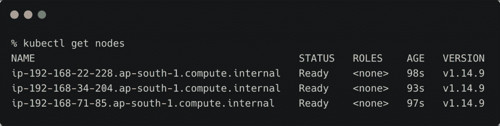
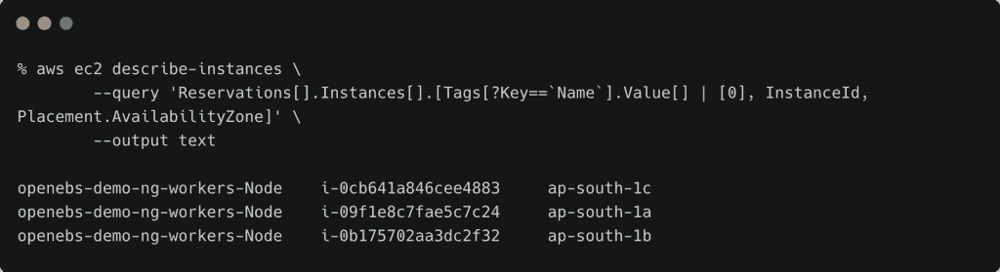
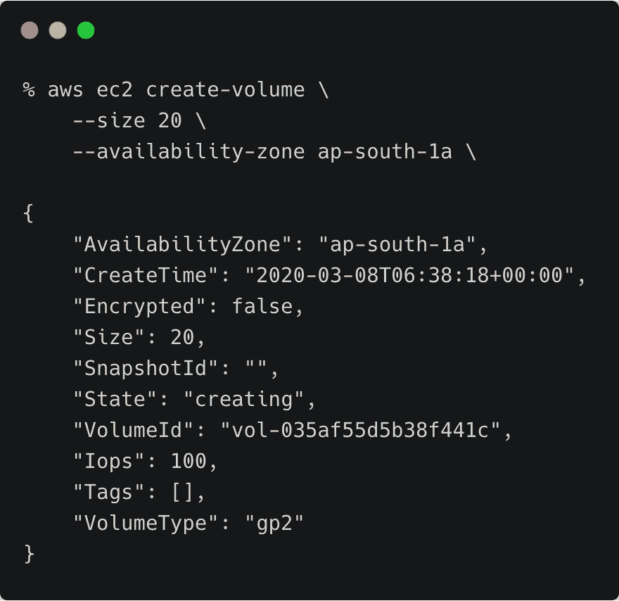
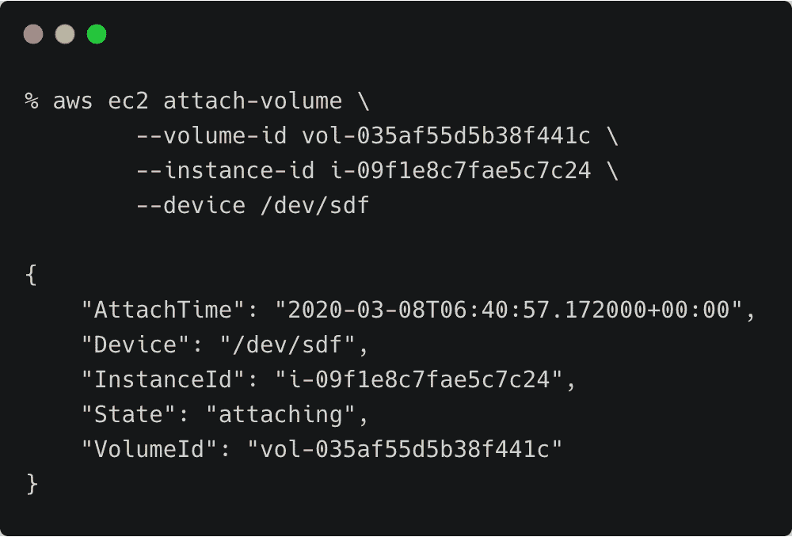
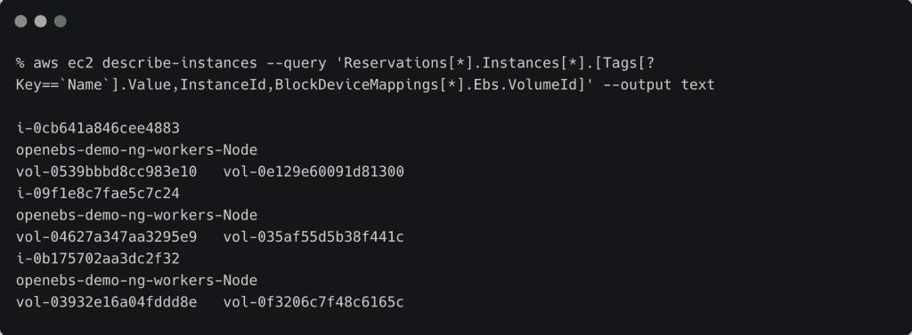
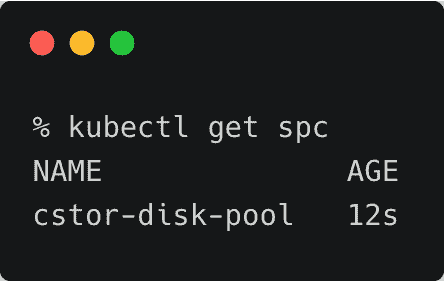
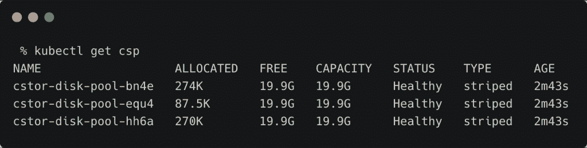

# 教程:在 Amazon Elastic Kubernetes 服务上安装和配置 OpenEBS

> 原文：<https://thenewstack.io/tutorial-install-and-configure-openebs-on-amazon-elastic-kubernetes-service/>

在[之前的一篇文章](https://thenewstack.io/how-openebs-brings-container-attached-storage-to-kubernetes/)中，我介绍了 [OpenEBS](https://openebs.io/) 的架构，这是一个用于 Kubernetes 的开源容器附加存储包。在这一部分，我们将在[亚马逊弹性 Kubernetes 服务](https://aws.amazon.com/eks/) (EKS)上安装和配置 OpenEBS，重点是 [cStor 存储引擎](https://docs.openebs.io/docs/next/cstor.html)。

在本教程结束时，您将拥有一个可用于在 Kubernetes 上部署高度可用的有状态工作负载的存储池。

### 启动亚马逊 EKS 集群

第一步是为亚马逊 EKS 集群提供三个节点。下载并配置 [eksctl](http://www.eksctl.io) ，这是管理 EKS 集群的漂亮工具。

```
eksctl create cluster  \
  --name openebs-demo  \
  --version  1.14  \
  --nodegroup-name ng-workers  \
  --node-type t3.medium  \
  --nodes  3  \
  --nodes-min  3  \
  --nodes-max  6  \
  --node-ami auto  \
  --node-ami-family Ubuntu1804  \
  --set-kubeconfig-context=true

```

### 

### 将 Amazon EBS 卷附加到工作节点

OpenEBS cStor 存储引擎从连接的块存储设备创建一个池。

如果您有一个大型集群，您可以标记运行有状态工作负载的节点子集，并在节点上配置 OpenEBS。

让我们创建一个 EBS 卷并将其连接到集群的每个节点。在此之前，我们需要获得 Amazon EC2 实例 id 和 worker 节点的可用性区域。

```
aws ec2 describe-instances  \
        --query  'Reservations[].Instances[].[Tags[?Key==`Name`].Value[] | [0], InstanceId, Placement.AvailabilityZone]'  \
        --output text

```



```
aws ec2 create-volume  \
    --size  20  \
    --availability-zone ap-south-1a  \

```



记下 EBS 设备的卷 id。在下一步中，我们需要将该卷连接到同一个可用性区域中的一个实例。

```
aws ec2 attach-volume  \
  --volume-id vol-035af55d5b38f441c  \
  --instance-id  i-09f1e8c7fae5c7c24  \
  --device  /dev/sdf

```



对集群的其余两个节点重复这些步骤。确保 EBS 卷和 EC2 实例(工作节点)的可用性区域相同。

到这一步结束时，我们有三个 20GiB 的 EBS 卷连接到工作节点。

使用以下命令验证卷是否已连接到节点:

```
aws ec2 describe-instances  \
  --query  'Reservations[*].Instances[*].[Tags[?Key==`Name`].Value,InstanceId,BlockDeviceMappings[*].Ebs.VolumeId]'  \
  --output text

```



第一个卷是根卷，而第二个卷是我们连接的磁盘。

*注意:通过 BASH 脚本或 AWS CloudFormation 模板，可以轻松地自动化创建卷并将其附加到 worker 节点的步骤。*

### 安装 OpenEBS

我们将使用 OpenEBS 操作符来安装它。这将创建一个专用的名称空间并部署 OpenEBS。

```
kubectl apply  -f  https://openebs.github.io/charts/openebs-operator.yaml

```

在进行下一步之前，等待 pod 准备就绪。

```
kubectl get pod  -n  openebs

```


下一步是初始化 Ubuntu，以确保 iSCSI 服务启动并运行。

```
kubectl apply  -f  https://openebs.github.io/charts/openebs-ubuntu-setup.yaml

```


最后一行确认 iSCSI 已经初始化。

### 在 OpenEBS 上配置 cStor 存储引擎

有了 OpenEBS，我们现在将配置一个基于 cStor 的存储引擎，它将从连接的 EBS 卷创建一个存储池。

让我们从获取与 EBS 卷相关联的块设备 id 开始。

```
kubectl get blockdevice  -n  openebs

```


现在，我们将从这些原始设备创建一个 cStor 存储池。将块设备列表添加到下面的 YAML 文件中并应用它。

```
apiVersion:  openebs.io/v1alpha1
kind:  StoragePoolClaim
metadata:
  name:  cstor-disk-pool
  annotations:
    cas.openebs.io/config:  |
      -  name:  PoolResourceRequests
        value:  |-
            memory:  2Gi
      -  name:  PoolResourceLimits
        value:  |-
            memory:  4Gi
spec:
  name:  cstor-disk-pool
  type:  disk
  poolSpec:
    poolType:  striped
  blockDevices:
    blockDeviceList:
    -  blockdevice-371f31f8dad830daa7fc90123779fc5d
    -  blockdevice-5f112c01babaa05438b796f545613cd1
    -  blockdevice-aadb62b32b1be2d1113698ceeab8a6ee

```

这一步可以通过 BASH 脚本轻松实现自动化，方法是读取列出块设备的 kubectl 命令的输出，并将它们添加到 YAML 文件中。

```
kubectl apply  -f  cstor-pool-config.yaml  

```

让我们检查一下存储池声明。



最后，我们将验证 cStor 存储池是否已创建并可供使用。



恭喜你！您现在已经准备好部署由 OpenEBS 支持的有状态工作负载了。

在本教程的下一部分，我将向您介绍部署由 OpenEBS cStor 存储引擎支持的 PostgreSQL 的高可用性实例的步骤。敬请期待！

*贾纳基拉姆·MSV 的网络研讨会系列“机器智能和现代基础设施(MI2)”提供了涵盖前沿技术的信息丰富、见解深刻的会议。在 [http://mi2.live](http://mi2.live) 注册即将到来的 MI2 网络研讨会。*

亚马逊网络服务是新堆栈的赞助商。

通过 Pixabay 的特征图像。

<svg xmlns:xlink="http://www.w3.org/1999/xlink" viewBox="0 0 68 31" version="1.1"><title>Group</title> <desc>Created with Sketch.</desc></svg>