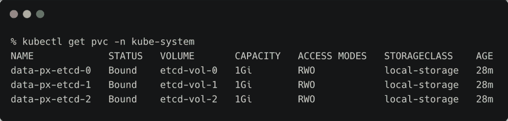
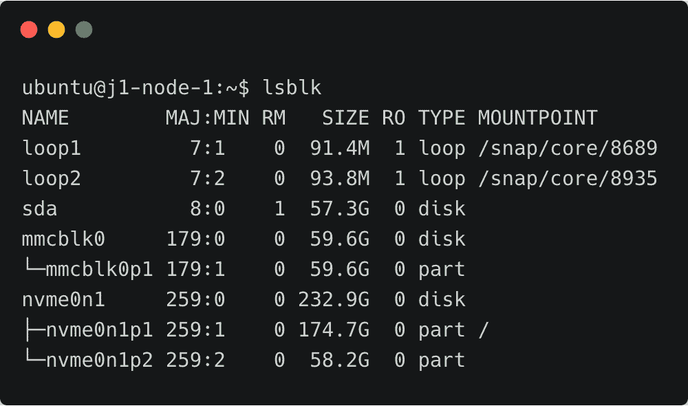
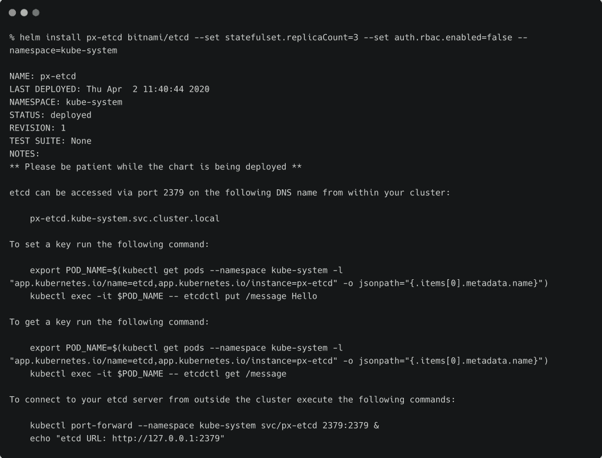
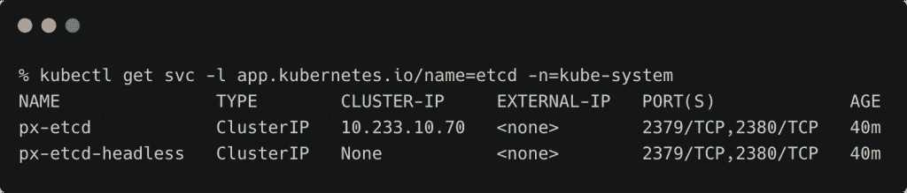
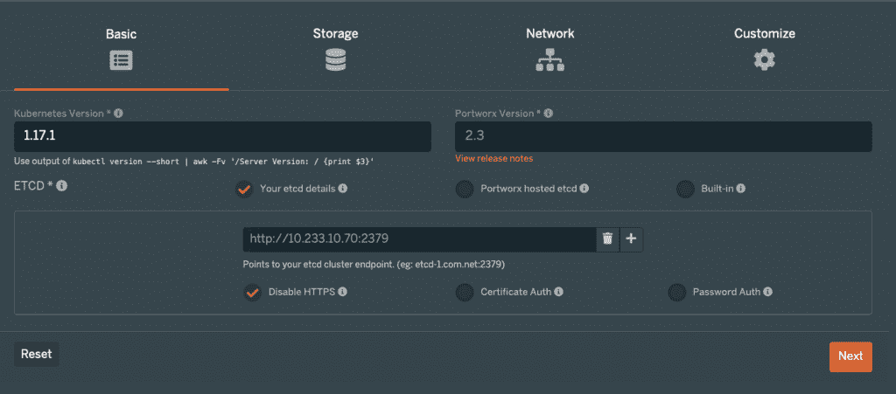
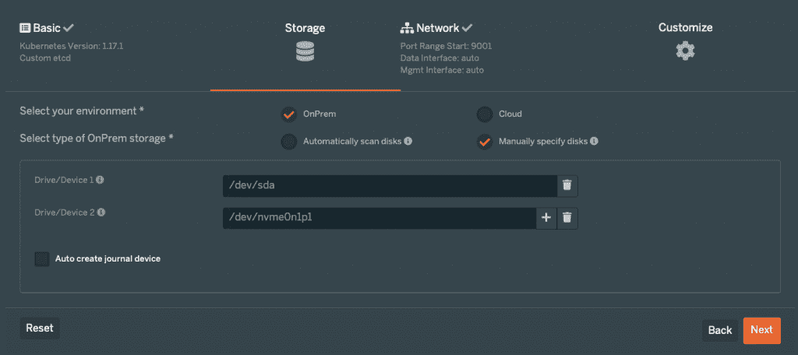
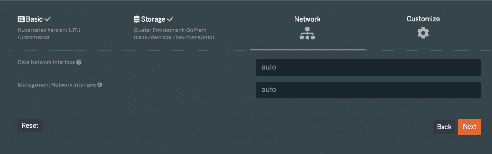
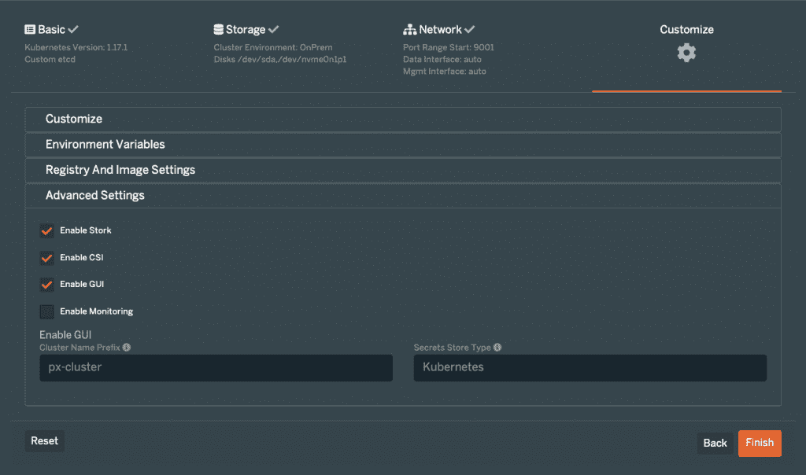
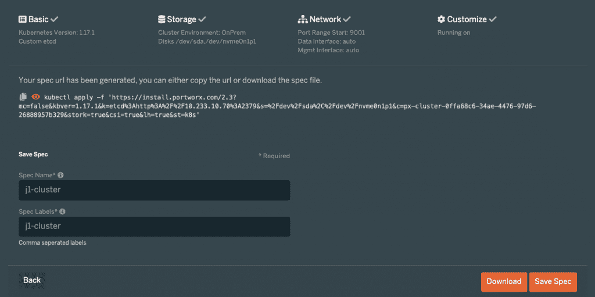
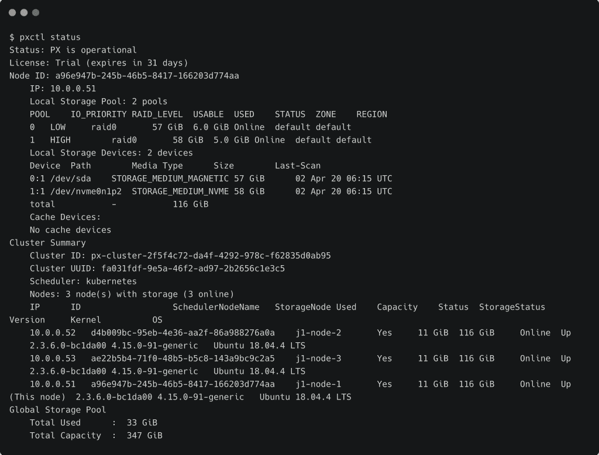

# 教程:在裸机 Kubernetes 集群上安装和配置 Portworx

> 原文：<https://thenewstack.io/tutorial-install-and-configure-portworx-on-a-bare-metal-kubernetes-cluster/>

在本系列的最后一部分中，我们看到了 Portworx 的架构。在这一期中，我将向您介绍在裸机上运行的三节点 Kubernetes 集群(即不是托管的 Kubernetes 服务)上安装和配置 [Portworx](https://portworx.com/) 存储集群的步骤。

### 探索环境

我最近建立了一个实验室，有两个裸机 Kubernetes 集群运行在[英特尔 NUC](https://www.intel.com/content/www/us/en/products/boards-kits/nuc.html) 机器上。由于每个集群运行一个主节点和三个节点，因此节点和集群之间的机器配置是相同的。每台英特尔 NUC 都由第八代 i7 CPU、32GB 内存和 256GB NVMe 存储提供支持。我还通过 ThunderBolt/USB-C 端口添加了 64GB 的外部存储。

我们将在两个集群之一中安装 Portworx。



我们来看一下存储配置。设备 **/dev/sda** 是外部存储器，而设备 **/dev/nvme0n1** 代表内部 nvme 存储器。每个节点都有相同的分区方案和存储配置。



我们的目标是安装 Portworx，为每种存储类型(外部和内部)创建两个不同的存储池。

### 安装 etcd 集群

Portworx 依靠 [etcd](https://etcd.io/) 数据库来维护存储集群的状态。安装 Portworx 之前，etcd 集群必须存在。我们将通过 [Bitnami Helm Chart](https://github.com/bitnami/charts/tree/master/bitnami/etcd#parameters) 安装一个三节点 etcd 集群。

由于我们没有在集群上配置任何覆盖存储，我们将使用[本地持久卷](https://kubernetes.io/blog/2019/04/04/kubernetes-1.14-local-persistent-volumes-ga/)在每个节点上创建一个指向 **/data/etcd** 目录的 PV。在每个工作节点上创建这个目录。

```
sudo mkdir  -p  /data/etcd
sudo chmod  771  /data/etcd

```

下面的 YAML 规范(pv-etcd.yaml)定义了每个节点的本地 pv。

```
apiVersion:  v1
kind:  PersistentVolume
metadata:
  name:  etcd-vol-0
spec:
  capacity:
    storage:  1Gi
  volumeMode:  Filesystem
  accessModes:
  -  ReadWriteOnce
  persistentVolumeReclaimPolicy:  Delete
  storageClassName:  local-storage
  local:
    path:  /data/etcd
  nodeAffinity:
    required:
      nodeSelectorTerms:
      -  matchExpressions:
        -  key:  kubernetes.io/hostname
          operator:  In
          values:
          -  j1-node-1
---
apiVersion:  v1
kind:  PersistentVolume
metadata:
  name:  etcd-vol-1
spec:
  capacity:
    storage:  1Gi
  volumeMode:  Filesystem
  accessModes:
  -  ReadWriteOnce
  persistentVolumeReclaimPolicy:  Delete
  storageClassName:  local-storage
  local:
    path:  /data/etcd
  nodeAffinity:
    required:
      nodeSelectorTerms:
      -  matchExpressions:
        -  key:  kubernetes.io/hostname
          operator:  In
          values:
          -  j1-node-2  
---
apiVersion:  v1
kind:  PersistentVolume
metadata:
  name:  etcd-vol-2
spec:
  capacity:
    storage:  1Gi
  volumeMode:  Filesystem
  accessModes:
  -  ReadWriteOnce
  persistentVolumeReclaimPolicy:  Delete
  storageClassName:  local-storage
  local:
    path:  /data/etcd
  nodeAffinity:
    required:
      nodeSelectorTerms:
      -  matchExpressions:
        -  key:  kubernetes.io/hostname
          operator:  In
          values:
          -  j1-node-3 

```

应用 YAML 规范创建三个本地 PV，专门与集群的每个工作节点相关联。

```
kubectl apply  -f  pv-etcd.yaml

```

与这些 PVs 相关联的 PVC 也将被预先创建。使用与 etcd StatefulSet 相匹配的命名约定非常重要。这将确保 StatefulSet 中的 pod 使用已经绑定到 PVs 的现有 PVC。

让我们创建三个绑定到这些 PVs 的 PVC。

```
apiVersion:  v1
kind:  PersistentVolumeClaim
metadata:
  name:  data-px-etcd-0
spec:
  storageClassName:  local-storage
  accessModes:
  -  ReadWriteOnce
  resources:
    requests:
      storage:  1Gi
  volumeName:  "etcd-vol-0"      
---
apiVersion:  v1
kind:  PersistentVolumeClaim
metadata:
  name:  data-px-etcd-1
spec:
  storageClassName:  local-storage
  accessModes:
  -  ReadWriteOnce
  resources:
    requests:
      storage:  1Gi
  volumeName:  "etcd-vol-1"            
---
apiVersion:  v1
kind:  PersistentVolumeClaim
metadata:
  name:  data-px-etcd-2
spec:
  storageClassName:  local-storage
  accessModes:
  -  ReadWriteOnce
  resources:
    requests:
      storage:  1Gi
  volumeName:  "etcd-vol-2"            

```

```
kubectl apply  -f  pvc-etcd.yaml  -n  kube-system

```

确保创建了 PV，并且来自 **kube-system** 名称空间的 PV 被绑定到它们。

```
kubectl get pvc  -n  kube-system

```


有了 PVC，我们就可以创建 etcd 集群了。这一步我们将使用 Helm 3 etcd 图表。

```
helm repo add bitnami https://charts.bitnami.com/bitnami

```

```
helm install px-etcd bitnami/etcd  \
--set statefulset.replicaCount=3  \
--set auth.rbac.enabled=false  \
--namespace=kube-system

```

注意图表名称( **px-etcd** )匹配 PVC 的一部分( **data-px-etcd-X** )。这对于确保图表使用现有的 PVC 非常重要。

我们正在为 StatefulSet 创建三个 pod，这将确保 etcd 集群的高可用性。



验证 etcd 集群已启动并正在运行。

```
kubectl get pods  -l  app.kubernetes.io/name=etcd  -n=kube-system

```


etcd Pods 和相关对象部署在 Portworx 部署也使用的 **kube-system** 名称空间中。

```
kubectl get svc  -l  app.kubernetes.io/name=etcd  -n=kube-system

```



下一步是安装 Portworx 存储集群。

### 安装 Portworx 存储集群

在 [Portworx hub](https://central.portworx.com) 注册进入 Portworx 安装向导。登录后，单击新规范启动向导。

第一步是提供 Kubernetes 的版本和 etcd 集群的详细信息。复制 **kube-system** 名称空间中可用的 etcd 服务的 ClusterIP，并将其粘贴到向导的 etcd 文本框中。不要忘记添加服务的端口。



下一步，我们将配置存储环境。选择 OnPrem，然后选择手动指定磁盘选项。由于我们的集群使用的是 **/dev/sda** 和 **/dev/nvme0n1p1** 器件，让我们将这些值输入到规格生成器中。



在网络部分保留默认值，然后单击下一步。



在下一步中，为 Kubernetes 分发选项选择“无”,然后单击“启用 CSI”复选框。在接下来的教程中，我们将使用 Portworx 支持 CSI 的特性。



在最后一步中，为该规范命名，然后单击 copy 按钮。



应用向导生成的规范。

```
kubectl apply  -f  'https://install.portworx.com/2.3?mc=false&amp;kbver=1.17.1&amp;k=etcd%3Ahttp%3A%2F%2F10.233.10.70%3A2379&amp;s=%2Fdev%2Fsda%2C%2Fdev%2Fnvme0n1p1&amp;c=px-cluster-0ffa68c6-34ae-4476-97d6-26888957b329&amp;stork=true&amp;csi=true&amp;lh=true&amp;st=k8s'

```

几分钟后，Portworx DaemonSet 的豆荚应该会启动并运行。

```
kubectl get pods  -n  kube-system  -l  name=portworx

```


CSI 驱动程序作为边车连接到 DaemonSet 中的每个吊舱，这就是为什么我们在吊舱中看到两个集装箱。

SSH 进入其中一个节点，检查 Portworx 集群状态。



Portworx 存储集群有两个从 **/dev/sda** 磁盘和 **/dev/nvme0n1p2** 分区创建的池。

在本教程的下一部分，我将演示如何利用这些存储池来创建共享卷和高 I/O 卷，以部署容错 CMS 工作负载。敬请期待！

贾纳基拉姆·MSV 的网络研讨会系列“机器智能和现代基础设施(MI2)”提供了涵盖前沿技术的信息丰富、见解深刻的会议。在 [http://mi2.live](http://mi2.live) 上注册参加即将举行的 MI2 网络研讨会。不要忘了查看我们的第一个虚拟煎饼播客，4 月 14 日，贾纳基拉姆·MSV 将是一个特色演讲者:

[](https://thenewstack.io/join-us-for-the-new-stacks-first-virtual-pancake-breakfast-and-qa-with-datastax/)

Portworx 是新堆栈的赞助商。

由 [Frank Eiffert](https://unsplash.com/@feiffert?utm_source=unsplash&utm_medium=referral&utm_content=creditCopyText) 在 [Unsplash](https://unsplash.com/s/photos/storage?utm_source=unsplash&utm_medium=referral&utm_content=creditCopyText) 上拍摄的特征图像。

<svg xmlns:xlink="http://www.w3.org/1999/xlink" viewBox="0 0 68 31" version="1.1"><title>Group</title> <desc>Created with Sketch.</desc></svg>