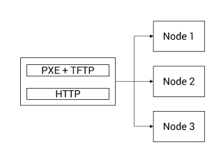
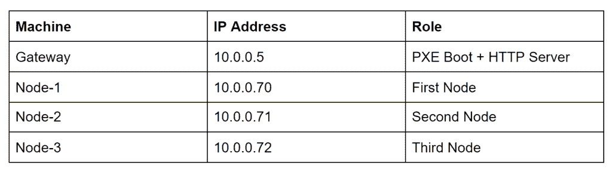

# 教程:在远程裸机服务器上安装 Flatcar 容器 Linux

> 原文：<https://thenewstack.io/tutorial-install-flatcar-container-linux-on-remote-bare-metal-servers/>

*本教程是 Flatcar Container Linux 系列的第三部分，我们将在一组运行 edge 基础设施的远程裸机服务器上安装操作系统。([第一部](https://thenewstack.io/flatcar-container-linux-the-ideal-os-for-running-kubernetes-at-the-edge/))，([第二部](https://thenewstack.io/tutorial-explore-container-runtimes-with-flatcar-container-linux/))。*

在物理服务器上安装 Flatcar Container Linux 与其他 Linux 发行版没有什么不同。您可以下载 ISO 映像并使用实时操作系统引导机器，而无需将它安装到磁盘上。Flatcar 附带了一个名为`flatcar-install`的 CLI，可以将操作系统安装到本地磁盘上。您还可以使用任何 Linux live CD 下载并安装 Flatcar 到机器的非活动设备上。

但是，在大多数边缘场景中，我们无法访问物理机器来执行交互式安装。假设我们可以访问另一个可以运行 PXE 引导环境的主机和一个 HTTP 服务器，我们就可以在任意数量的机器上远程部署 Flatcar Container Linux。

在本教程中，我将带您完成在基于 Seeed Studio 的 Odyssey Mini PC 的三个节点上配置和安装 Flatcar Container Linux 所需的所有步骤。在下一部分中，我们将扩展这个场景以部署一个高度可用的 K3s 集群。

[Flatcar Container Linux](https://www.flatcar-linux.org/) 的官方文档没有涵盖这个场景。我花了很多时间和精力来学习远程部署流程。幸运的是，处理旧的 CoreOS 容器 Linux 的经验派上了用场。这将有助于任何希望在远程位置大规模执行 Flatcar Linux 无人值守部署的人。

## 部署拓扑

在继续安装之前，让我分享一下网络拓扑和布局。

我们有四台主机—一台 PXE 启动服务器和三个边缘节点。PXE 启动服务器甚至可以是在与边缘节点相同的子网中运行的虚拟机。这将使节点能够发现 PXE 启动服务器。



Flatcar Container Linux 严重依赖点火文件来执行配置。一旦操作系统启动，它就从 HTTP 服务器下载点火文件，并配置基本元素，如主机名、用户、SSH 密钥和其他 systemd 单元文件。同一个 PXE 启动服务器同时也是一个简单的 HTTP 服务器，为点火文件提供服务。

您还需要知道每个节点的 MAC 地址或 IP 地址，以便正确部署相关的配置。PXE 启动服务器应该有一个静态 IP 地址或 DNS 名称，以便节点发现和访问 TFTP 和 HTTP 端点。



我用了一台 Ubuntu 18.04 的机器作为远程访问的网关服务器。接下来的所有步骤都假设您正在运行 Ubuntu 或 Debian 机器作为 PXE 启动服务器。

## 准备网关机器

我们将从在网关上安装`dnsmasq`和`tftp`服务器开始。因为我已经有一个 DHCP 服务器在运行，所以我要禁用它。如果网络中没有运行 DHCP，您可能希望包含 DHCP。

```
systemctl disable systemd-resolved
systemctl mask systemd-resolved
systemctl stop systemd-resolved

apt-get install  -y  dnsmasq pxelinux syslinux-common
service dnsmasq stop
mkdir  -p  /var/lib/tftpboot
mkdir  -p  /var/lib/tftpboot/pxelinux.cfg

cp  /usr/lib/PXELINUX/pxelinux.0  /var/lib/tftpboot/

cp  /usr/lib/syslinux/modules/bios/{menu,ldlinux,libmenu,libutil}.c32  /var/lib/tftpboot/

mv  /etc/dnsmasq.conf  /etc/dnsmasq-conf.bak

cat  >  /etc/dnsmasq.conf  <<  EOF port=0  log-dhcp dhcp-range=10.0.0.1,proxy dhcp-boot=pxelinux.0  pxe-service=x86PC,"Network Boot",pxelinux enable-tftp tftp-root=/var/lib/tftpboot EOF 
echo  "DNSMASQ_EXCEPT=lo"  >>  /etc/default/dnsmasq 
service dnsmasq start

```

接下来，我们将把 Flatcar 容器 Linux PXE 启动映像下载到 TFTP 目录并验证它们。

```
cd  /var/lib/tftpboot
wget https://stable.release.flatcar-linux.net/amd64-usr/current/flatcar_production_pxe.vmlinuz
wget https://stable.release.flatcar-linux.net/amd64-usr/current/flatcar_production_pxe.vmlinuz.sig
wget https://stable.release.flatcar-linux.net/amd64-usr/current/flatcar_production_pxe_image.cpio.gz
wget https://stable.release.flatcar-linux.net/amd64-usr/current/flatcar_production_pxe_image.cpio.gz.sig
gpg  --verify flatcar_production_pxe.vmlinuz.sig
gpg  --verify flatcar_production_pxe_image.cpio.gz.sig

```

## 为 PXE 启动生成点火文件

Flatcar Linux 使用一个点火文件来配置自己，这是一个比`cloud-init`更好的选择。一个点火文件包含了从用户信息、SSH 密钥，甚至是一个`systemd`单元文件的完整定义。

我们现在将创建两个点火文件——一个在 PXE 引导过程中使用，另一个在磁盘上保存配置。第二个是最关键的元素，它将嵌入 SSH 密钥和机器的主机名。

我假设您手边有一个 SSH 密钥对。我们将在点火文件中嵌入公钥，以实现远程访问。

点火文件有两种不同的形式——一种是人类可读的 YAML 文件，另一种是面向操作系统的嵌套 JSON 文件。我们将首先在 YAML 定义点火文件，然后将其转换成 JSON 格式。有关点火的更多信息，请参考文档。

首先，下载`ct`命令行工具[配置编译器](https://github.com/coreos/container-linux-config-transpiler)，并将其添加到 path 中。

让我们创建用于安装过程的 YAML 文件。

```
systemd:
  units:
    -  name:  installer.service
      enabled:  true
      contents:  |
        [Unit]
        Requires=network-online.target
        After=network-online.target
        [Service]
        Type=forking
        TimeoutStartSec=600
        RemainAfterExit=yes
        ExecStart=/usr/bin/sh  -c  "flatcar-install -d /dev/sda -i /opt/ignition.json && udevadm settle && systemctl reboot"
        [Install]
        WantedBy=multi-user.target
passwd:
  users:
    -  name:  core
      ssh_authorized_keys:
        -  ssh-rsa AAAAB3NzaC1yc2EAAAADAQABAAABAQDGdByTgSVHq...
storage:
  files:
    -  path:  /opt/ignition.json
      filesystem:  root
      mode:  777
      contents:
        remote:
          url:  http://10.0.0.5:8080/node-1-ignite-boot.ign

```

该文件包含许多对成功安装操作系统至关重要的部分。

`systemd`部分创建了一个名为`installer.service`的单元，它在 PXE 启动完成后立即运行。在单元文件中，我们调用`flatcar-install` CLI 在`/dev/sda`设备上安装操作系统。请注意，整个磁盘将在安装过程中被格式化。一旦安装完成，我们通过调用`systemctl reboot`执行重启。确保网关服务器上的 PXE 启动服务已关闭。否则，安装将进入永无止境的循环。

`passwd`部分添加用户及其相关的 SSH 密钥，以便能够访问机器。虽然这在第一次引导时可能不是必需的，但它使得在安装期间调试任何问题变得容易。这里，我们添加了一个名为 core 的用户。

在下一节中，我们将持久文件写入磁盘。因为 Flatcar Linux 在引导过程中会寻找一个点火文件，所以我们会将一个文件保存到每次机器引导时都会用到的磁盘上。这将包含一些基本元素，比如用户、SSH 密钥、主机名和其他我们希望在引导时自动启动的进程。请注意，我们不是硬连接该文件，而是通过 HTTP 从网关服务器下载。

让我们来看看 YAML 对`node-1-ignite-boot.ign`文件的定义。

```
passwd:
  users:
    -  name:  core
      ssh_authorized_keys:
        -  ssh-rsa AAAAB3NzaC1yc2EAAAADAQABAAABAQDGdByTgSVHq...
storage:
  files:
    -  path:  /etc/hostname
      filesystem:  root
      mode:  0644      
      contents:
        inline:  node-1  

```

这个点火文件主要做两件事——创建一个用户和一个相关的 SSH 密钥，并通过在`/etc/hostname`文件中添加一行来设置主机名。该文件将有效地用于在每次引导时配置操作系统。

最后，我们将通过 transpiler 运行 YAML 文件，将它们转换成 JSON 格式。我们还将它们移动到一个单独的目录中，该目录将由 HTTP 服务器使用。

```
mkdir  -p  /var/lib/tftpboot/ignition
mv node-1-ignite*.yaml  /var/lib/tftpboot/ignition
cd  /var/lib/tftpboot/ignition

ct  <  node-1-ignite.yaml  >  node-1-ignite.ign
ct  <  node-1-ignite-boot.yaml  >  node-1-ignite-boot.ign

```

是时候让我们运行一个 HTTP 服务器来服务这些文件了。如果您在网络中的任何地方运行 Apache 或 NGINX，您可以在那里托管文件。否则，您可以用 Python 启动一个简单的 HTTP 服务器。

```
  python3  -m  http.server  8000&

```

如果您已经走到这一步，那么您应该知道我们需要通过创建 PXE 引导文件来结束这个循环，这些文件将所有的东西整合在一起。

在`/var/lib/tftpboot/pxelinux.cfg`目录下，创建一个名为`node-1`的文件，内容如下:

```
default flatcar
prompt  1
timeout  15

display boot.msg

label flatcar
  menu default
  kernel flatcar_production_pxe.vmlinuz
  initrd flatcar_production_pxe_image.cpio.gz
  append flatcar.first_boot=1  ignition.config.url=http://10.0.0.5:8000/node-1-ignite.ign

```

我们现在需要将节点 1 的 IP 地址映射到 PXE 引导文件，以确保配置正确应用到目标主机。这是通过创建一个到上述文件的链接来实现的，该文件具有十六进制形式的目标 IP 地址。

例如，节点 1 的 IP 地址是 10.0.0.70，当转换为十六进制时，它变成了 0a.00.00.46。因此，我们将创建一个链接，将 IP 地址的十六进制代码与 PXE 引导文件相匹配。

```
cd  /var/lib/tftpboot/pxelinux.cfg
ln  -s  node-1  0A000046

```

通过修改 YAML 文件、PXE 引导文件并基于 IP 地址生成链接，对节点 2 和节点 3 重复这些步骤。

仅此而已！我们准备通过 PXE 引导在裸机服务器上远程安装 Flatcar Container Linux。

*贾纳基拉姆·MSV 的网络研讨会系列“机器智能和现代基础设施(MI2)”提供了涵盖前沿技术的信息丰富、见解深刻的会议。在 [http://mi2.live](http://mi2.live) 注册参加即将举行的 MI2 网络研讨会。*

专题图片由 S. Hermann & F. Richter de Pixabay 提供。

<svg xmlns:xlink="http://www.w3.org/1999/xlink" viewBox="0 0 68 31" version="1.1"><title>Group</title> <desc>Created with Sketch.</desc></svg>