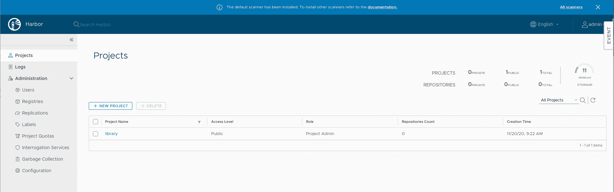

# 教程:安装用于映像漏洞扫描的 Harbor

> 原文：<https://thenewstack.io/tutorial-install-harbor-for-image-vulnerability-scanning/>

鉴于 Docker Hub 对容器的新限制，一些公司可能会选择托管他们自己的存储库。如果您有实现这一目标的基础设施，这将是一个很好的选择。当然，在 Linux 的帮助下，这可以相当容易地完成，而且很便宜。

但是在注册中心之上增加一层安全层怎么样呢？我所指的安全类型是保护您和您的公司免受您的容器所基于的图像中发现的隐藏危险。您如何知道您的注册中心提供的图像是否没有漏洞？即使您在内部推出这些映像，您的开发人员也可能会无意中添加包含 bug 和其他类型的弱点(或者更糟，恶意代码)的包。

如果没有检测这些漏洞的方法，您的公司就很容易受到攻击。

这就是像 [Harbor](https://goharbor.io/) 这样的工具的用武之地。Harbor 是一个开源、可信的云本地注册表，您可以将其部署到您的内部数据中心或托管云上的 Linux 服务器。Harbor 允许您签署、存储和扫描您的图像。

我想告诉你如何在 Ubuntu Server 20.04 上安装 Harbor。为了成功部署 Harbor，您需要:

*   Ubuntu Server 20.04 的运行和更新实例。
*   拥有 sudo 权限的用户帐户。

我们开始工作吧。

## 安装必要的依赖项

为了安装 Harbor，我们需要在机器上安装 Docker 和 docker-compose。要安装 Docker，请登录到服务器并发出命令:

`sudo apt-get install docker.io -y`

安装完成后，使用命令启动并启用该服务:

`sudo systemctl start docker`

`sudo systemctl enable docker`

使用以下命令将您的用户添加到 docker 组:

`sudo usermod -aG docker $USER`

使用以下命令启用组更改:

`newgrp docker`

接下来我们需要安装 docker-compose。这是通过以下命令完成的:

`sudo curl -L https://github.com/docker/compose/releases/download/1.27.4/docker-compose-`uname -s`-`uname -m`-o/usr/local/bin/docker-compose`

`sudo chmod +x /usr/local/bin/docker-compose`

最后，用以下命令安装 NGINX:

`sudo apt-get install nginx -y`

使用以下命令启动并启用 NGINX 服务:

`sudo systemctl start nginx`

`sudo systemctl enable nginx`

## 下载并解压缩 Harbor 安装程序

我们现在可以下载并解压缩 Harbor 安装程序。使用命令下载最新版本:

`wget https://github.com/goharbor/harbor/releases/download/v1.10.6/harbor-offline-installer-v1.10.6.tgz`

文件下载完成后，使用以下命令将其解压缩:

`tar xvzf harbor-offline-installer-v1.10.6.tgz`

使用以下命令切换到新创建的目录:

`cd harbor`

## 生成必要的证书

没有 SSL 密钥，Harbor 无法正常运行。如果您在生产环境中使用 Harbor，您将需要使用来自可信 CA 的证书。因为我们是出于测试目的进行演示，所以我们将生成自签名证书。

要生成您的证书，请发出以下命令:

`openssl req -newkey rsa:4096 -nodes -sha256 -keyout ca.key -x509 -days 3650 -out ca.crt`

你将被要求回答几个简单的问题，关于服务器的位置。生成完成后，使用以下命令生成签名请求:

`openssl req -newkey rsa:4096 -nodes -sha256 -keyout SERVER -out SERVER`

其中 SERVER 是您的服务器域或 IP 地址。

同样，确保回答生成签名请求的问题。

接下来，我们必须为主题别名创建一个配置文件。使用以下命令创建该文件:

`nano extfile.cnf`

在该文件中，粘贴以下内容:

`subjectAltName = IP:SERVER`

其中 SERVER 是您的 Harbor 服务器的域或 IP 地址。

保存并关闭文件。

使用以下命令生成证书文件:

`openssl x509 -req -days 3650 -in SERVER -CA ca.crt -CAkey ca.key -CAcreateserial -extfile extfile.cnf -out SERVER`

其中 SERVER 是您的托管服务器的域或 IP 地址。

使用以下命令创建客户端密钥:

`openssl req -new -x509 -text -key ca.key -out ca.cert`

使用以下命令创建一个新目录来存放证书:

`sudo mkdir /etc/docker/certs.d`

您还需要使用以下命令创建一个子目录，其名称与您的服务器域或 IP 地址相同:

`sudo mkdir /etc/docker/certs.d/SERVER`

其中 SERVER 是您的托管服务器的域或 IP 地址。

使用以下命令将新生成的证书复制到 Docker certs 目录中:

`sudo cp *.crt *.key *.cert /etc/docker/certs.d/SERVER`

其中 SERVER 是托管服务器的域或 IP 地址。

## 配置港口安装程序

在成功安装 Harbor 之前，必须首先修改配置文件。使用以下命令打开该文件进行编辑:

`nano harbor.yml`

这里您需要修改以下选项:

*   主机名—将其设置为托管服务器的域或 IP 地址。
*   端口—将其设置为 8080。
*   harbor_admin_password —将此密码设置为唯一的强密码。
*   密码(在数据库配置部分)-将此密码更改为唯一的强密码。

找到 certificate 和 private_key 行，如下所示:

```
certificate:  /etc/ssl/certs/ca.crt
private_key:  /etc/ssl/certs/ca.key

```

将这些行改为:

```
certificate:  /etc/docker/certs.d/SERVER/ca.crt
private_key:  /etc/docker/certs.d/SERVER/ca.key

```

其中 SERVER 是托管服务器的域或 IP 地址。

## 安装港口

我们现在终于可以安装港湾了。我们希望确保安装带有 Clair 支持的 Harbor(这是用于扫描图像漏洞的子系统)。在 harbor 文件夹中，发出命令:

```
sudo  ./install.sh  --with-clair

```

港口安装只需几分钟即可完成。完成后，您可以通过打开浏览器并将其指向 https://SERVER(其中 SERVER 是托管服务器的域或 IP 地址)来访问它。当提示登录时，使用 admin 作为您在 harbor.yml 中为 harbor_admin_passsword 选项配置的用户和密码。

身份验证成功后，您将看到 Harbor dashboard(图 1 ),在这里您可以开始使用这个出色的工具:



图 Harbor 界面非常容易使用。

恭喜你，你现在有自己的公司注册，完全有能力扫描这些图像的漏洞。您离安全的容器部署又近了一步。

在未来的一期中，我们将看看 Harbor 是如何工作的。

通过 Pixabay 的特征图像背景。

<svg xmlns:xlink="http://www.w3.org/1999/xlink" viewBox="0 0 68 31" version="1.1"><title>Group</title> <desc>Created with Sketch.</desc></svg>