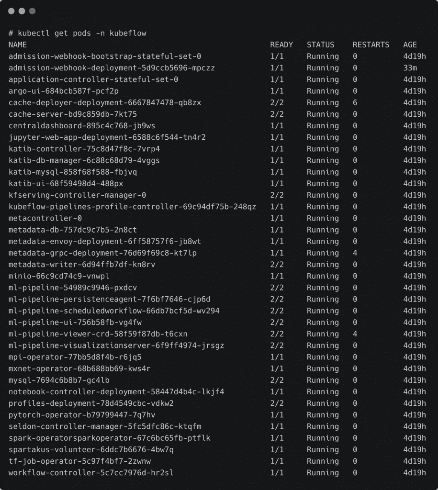

# 教程:使用 NVIDIA DeepOps 在 GPU 主机上安装 Kubernetes 和 Kubeflow

> 原文：<https://thenewstack.io/tutorial-install-kubernetes-and-kubeflow-on-a-gpu-host-with-nvidia-deepops/>

本文是探索 Kubeflow 机器学习平台系列文章的第二篇。请每周五回来查看未来的分期付款。([第一部分](https://thenewstack.io/kubeflow-where-machine-learning-meets-the-modern-infrastructure/) )

在这篇文章中，我们将介绍 [Kubeflow](https://thenewstack.io/kubeflow-where-machine-learning-meets-the-modern-infrastructure/) 的安装过程，这是一个开源机器学习平台，它利用 Kubernetes 的功能为数据科学家、ML 工程师和 DevOps 专业人员提供端到端的工作流。本教程中配置的测试平台将用于探索本系列教程的后续部分中涵盖的平台的构建模块。

Kubeflow 可以安装在任何至少有 4 个 CPU、50 GB 存储和 12 GB RAM 的 Kubernetes 集群上。它可以安装在托管的 Kubernetes 服务上，如[亚马逊网络服务](https://aws.amazon.com/?utm_content=inline-mention)‘弹性 Kubernetes 服务(EKS)’、Azure Kubernetes 服务、谷歌 Kubernetes 引擎和 IBM Kubernetes 服务。Kubeflow 也可以安装在裸机主机上运行 Kubernetes 的本地环境中。有关安装的详细信息，请参考 Kubeflow 文档。

对于本教程，我们将使用 NVIDIA 的 [DeepOps](https://github.com/NVIDIA/deepops) 安装程序，它简化了安装过程。大约 20 分钟后，我们将拥有一个完全配置好的 Kubeflow 环境。NVIDIA 已经创建了 DeepOps，主要用于在一组带有 GPU 的主机上安装 Kubernetes。但是，它也可以用于针对非 GPU 主机。

我最近[造了](https://twitter.com/janakiramm/status/1358281146908377092)一个做 AI 实验的定制机。基于 AMD 锐龙 thread ripper 3990 x 64 核 CPU、NVIDIA GeForce RTX 3090 GPU 24GB 和 10496 CUDA 核、128GB RAM 和 3TB NVMe 存储，它是一个强大的处理器。这是运行由 NVIDIA 驱动程序和用于 GPU 访问的 CUDA 工具包支持的单节点 Kubernetes 集群的完美候选。

我发现 [DeepOps](https://github.com/NVIDIA/deepops) 是在这台机器上安装 Kubernetes 和 Kubeflow 组合来配置具有 GPU 访问的单节点 Kubernetes 的完美工具。DeepOps 还安装了其他可选组件，如动态 NFS 供应器、Ceph/Rook 和带 Grafana 的普罗米修斯。

如果没有 GPU 机器，可以选择先安装 Kubernetes 再安装 Kubeflow。根据我的经验，NVIDIA DeepOps 即使在非 GPU 环境下也能很好地工作。

## 为 DeepOps 准备主机 GPU 计算机

如果你是依靠 NVIDIA DeepOps 来安装 Kubernetes 和 Kubeflow，那么除了支持的 OS 和 NVIDIA 驱动之外，你不需要安装任何东西。对于测试床，我安装了 Ubuntu 20.04 并配置了 NVIDIA 460 驱动程序。确保用专有的 NVIDIA 驱动程序替换默认的开源新图形驱动程序。

运行`nvidia-smi`命令，确保驱动程序安装正确。


添加具有 SSH 密钥和密码`sudo`访问权限的用户。我创建了一个用户，`ubuntu`，我打算在 DeepOps 安装程序中使用它。

## 准备引导计算机

由于 NVIDIA DeepOps 依赖于 Kubespray 和 Ansible，因此您需要一台引导机来运行剧本。这可以是能够访问目标主机的 Ubuntu VM。我使用了运行在 Mac 上的 Ubuntu 18.04 VirtualBox 虚拟机作为引导机。

确保您可以在没有密码的情况下 SSH 到 GPU 主机，这意味着您需要在引导计算机上有 SSH 私有密钥。

首先在引导/供应机器上克隆 DeepOps GitHub 存储库。

```
git clone https://github.com/NVIDIA/deepops.git

```

切换到最稳定版本的安装程序。

```
cd deepops
git checkout tags/20.12

```

安装必备软件并配置 Ansible。

接下来，使用 GPU 主机详细信息更新清单文件。

在`[all]`下，添加主机名和 IP 地址。我用 IP 地址`172.16.0.30`给我的主机`ai-testbed`打电话

在`[kube-master]`、`[etcd]`和`[kube-node]`部分下添加相同的主机。

如果您有一个多节点集群，您可以在清单文件中将它们拆分为控制平面和工作节点。因为我正在构建一个单节点 GPU 集群，所以我让同一个主机扮演集群的所有角色。

请注意，Kubespray 将根据清单文件重命名主机。不建议安装 Kubernetes 后更改主机名。

现在，我们准备开始安装。

## 使用 DeepOps 安装 Kubernetes

现在主机和引导机都准备好了，让我们运行安装程序。

它从下面显示的一个命令开始。当我使用 CUDA repo 安装 NVIDIA CUDA 运行时和 cuDNN 库时，我有了更好的结果。另一种选择是通过 GPU 操作符安装运行时。

运行命令以确保安装程序使用 CUDA repo 来配置运行时。

```
ansible-playbook  -u  ubuntu  -l  k8s-cluster  -e  '{"nvidia_driver_ubuntu_install_from_cuda_repo": yes}'  playbooks/k8s-cluster.yml

```

这将启动 Ansible playbook 来安装 Kubernetes。如果你熟悉 [Kubespray](https://github.com/kubernetes-sigs/kubespray) ，你会发现 DeepOps 是基于同一个安装程序。

等待安装程序完成安装。这可能需要 10 到 20 分钟，取决于您的互联网连接。

复制配置文件和`kubectl`以访问集群。

```
cp config/artifacts/kubectl  /usr/local/bin/
mkdir  ~/.kube
cp config/artifacts/admin.conf  ~/.kube/config

```

我们现在准备好访问单节点 Kubernetes 集群。

****

让我们测试一下 Kubernetes 是否能够访问 GPU。

```
export CLUSTER_VERIFY_EXPECTED_PODS=1  
./scripts/k8s/verify_gpu.sh  

```


```
kubectl run gpu-test  --rm  -t  -i  --restart=Never  --image=nvcr.io/nvidia/cuda:10.1-base-ubuntu18.04  --limits=nvidia.com/gpu=1  nvidia-smi

```


## 配置 Kubernetes 集群

让我们继续安装 NFS provisioner，普罗米修斯，和格拉夫纳。

以下命令确保 NFS 用作动态配置 PVC 的后端。在 Jupyter 笔记本之间共享卷也很有用。

```
ansible-playbook playbooks/k8s-cluster/nfs-client-provisioner.yml

```


这一步还配置了一个默认的存储类，这对于 Kubeflow 安装是必不可少的。


要安装 Prometheus 和 Grafana，请运行以下命令:

```
./scripts/k8s/deploy_monitoring.sh

```

你可以在 http://gpu_host:30200 用用户名`admin`和密码`deepops`访问 Grafana 仪表盘。

这是显示 GPU 节点统计数据的仪表板。


## 安装 Kubeflow

最后，我们准备安装 Kubeflow。只需运行下面的命令，并等待几分钟，以访问用户界面。

```
./scripts/k8s/deploy_kubeflow.sh

```

安装完成后，确保`kubeflow`名称空间中的所有 pod 都在运行。

```
kubectl get pods  -n  kubeflow

```



您可以通过 http://gpu_host:31380 访问 Kubeflow 仪表板


恭喜你！您已经成功构建了一个运行 Kubeflow 的 Kubernetes 集群。

在下一部分中，我们将探索 Kubeflow 组件。敬请关注。

PIRO4D 拍摄的 Pixabay 特征图像。

<svg xmlns:xlink="http://www.w3.org/1999/xlink" viewBox="0 0 68 31" version="1.1"><title>Group</title> <desc>Created with Sketch.</desc></svg>