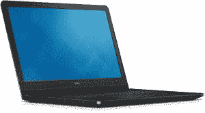
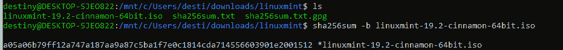
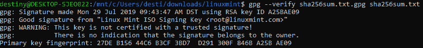
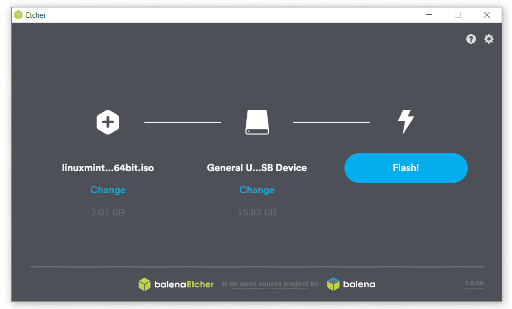
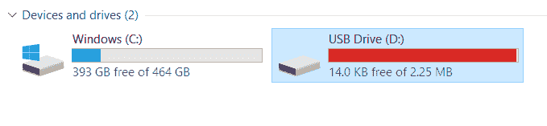

# 教程:使用 u 盘在 Windows 笔记本电脑上安装 Linux Mint

> 原文：<https://thenewstack.io/tutorial-install-linux-mint-on-a-windows-laptop-using-a-usb-stick/>

迟早，我会发现的。我有一台运行 Windows 10 的基本型戴尔 Inspiron 15 3552 笔记本电脑，是我在 2018 年夏天花 328 美元买的。

把它转换成 Linux 笔记本电脑会有多难？

经过一些研究，我认为我发现了完美的发行版:Linux Mint。用户指南中真正吸引我的一行是它的承诺“一个全功能的操作系统，你可以在不影响你的电脑的情况下试用。”所有东西都在 u 盘里。

所以我开始遵循[安装指南的下载说明](https://linuxmint-installation-guide.readthedocs.io/en/latest/)。一路上，我记录了每一步，创建了一个如何实现这一切的分步指南，并捕捉了我所学到的所有新的有趣的东西，因为在某种程度上这不仅仅是操作系统的变化，而是文化的变化。当你从面向消费者的技术转向开源的 Linux-y 世界和一个全新的自由软件生态系统时，会发生什么？或者，换句话说，当一个安装新手面对一个更技术性的世界的细节和细微差别时，会发生什么？

回想起来，我希望这会更容易，我几乎放弃了。但不知何故，我一直被开源 Linux 的召唤拉着前进…

第一个惊喜？在下载了发行版的 1.8GB ISO 文件后，我发现安装说明中包括了一个我没有预料到的步骤:“验证您的 ISO 映像。”

## **下载必须经过验证**

用户指南解释说，如果下载导致了 ISO 文件的问题，“你会遇到奇怪的错误，并且很难找到帮助。”好消息是什么？使用 SHA256 校验和可以轻松验证下载的完整性。坏消息呢？简单的命令行检查是一个 Linux 工具，而我仍然使用 Windows 系统。

幸运的是，我找到了一个变通办法。实际上是两个。安装指南包括一个详细论坛帖子的链接，该帖子解释了[如何在 Windows 机器](https://forums.linuxmint.com/viewtopic.php?f=42&t=291093)上验证 ISO 映像。但后来我意识到有一个更简单的方法。我已经在我的笔记本电脑上安装了 Linux 的 [Windows 子系统。所以我可以打开一个 Bash 窗口，运行它内置的 **sha256sum** 实用程序。](https://docs.microsoft.com/en-us/windows/wsl/install-win10)

我确认它打印出了我与 ISO 文件一起下载的 **sha256sum.txt** 文件中指定的数字。但是等等！现在还有一个额外的步骤来验证文件的真实性——这涉及到另一套工具。首先，我使用 WSL 内置的 gpg 命令来导入 Linux Mint 签名密钥，然后用*验证*标志来运行它，以确保我获得了适当的“指纹”。

`gpg --verify sha256sum.txt.gpg sha256sum.txt`

然后我得到两条看似矛盾的消息。

但是安装指南向我保证，如果指纹匹配，我就可以开始了。“GPG 可能会警告你，你的计算机不信任 Linux Mint 签名。这是意料之中的，也是完全正常的。”

下一步是“创建可引导介质”虽然我还没下载完。我已经有了我的 u 盘，并且我已经有了一个 ISO 镜像准备安装在上面，但是显然下一步是“下载 Etcher”来正确地配置 u 盘*和 ISO 镜像*。

因此，另一个大型下载—文件大小为 139MB，耗时近 20 分钟…

我很惊讶使用蚀刻机是如此简单——但是如果你在家里尝试，不要像我这样做。满怀热情，我把 ISO 文件转移到了我打算用来安装 Linux 的 u 盘上。但是 Etcher 似乎不喜欢这样——因为它计划写入同一个驱动器来创建可引导介质。所以我把 ISO 文件从 u 盘*移回到硬盘*上，Etcher 就可以继续了，通过三个简单的步骤创建了可引导介质。

有趣的是，u 盘现在快满了。(都是针对一个名为 efi 的目录。)

在这一点上，我有点紧张，因为下一步从“准备”阶段转移到第一次实际启动 Linux

## **没人告诉你的事情**

有两种方法可以进入我的笔记本电脑的 BIOS 菜单。一种是在系统重启时按 F2。但是还有另一种更简单的替代方法。我调出了 Windows 10 的设置，找到了“恢复”，其中一个选项是*现在重启*。幸运的是，点击那个按钮实际上并不会重新启动。它首先在如何启动上提供了几种选择。

我深入到*故障排除/高级选项/查看更多恢复设置/高级选项/ UEFI 固件设置。这里只有一个选择——“重启以更改 UEFI 固件设置”——但 Dell.com 的网页向我保证这将让我进入 UEFI (BIOS)屏幕——它确实做到了。*

这可能是世界上最丑陋的界面。这是一个稀疏的灰色长方形，上面的字大部分是黑色的——尽管也有一些是白色或蓝色的。顶部有菜单——主菜单、高级菜单、安全菜单和……启动菜单。

不幸的是，我似乎找不到从我的 u 盘启动的选择，并且发现我无意中遇到了一件没有人告诉你的事情。最后，我重启了几次笔记本电脑，尝试从谷歌搜索结果中获取各种技巧，从 u 盘中调出 Linux。最终，我发现一个网页警告我关于 Windows 的“[有争议的安全引导](http://www.daossoft.com/blog/how-to-boot-from-usb-on-dell-venue-windows-8-tablet/)”果然，在启动菜单下，有一个名为“安全启动”的选项——我试着选择了“禁用”

因此，下一次我重启笔记本电脑时，菜单选项似乎有所不同。其中一个人甚至提出切换选项，让我“使用设备/可移动驱动器”嗯，*那个*很容易。

或者是吗？我的笔记本电脑仍然像以前一样启动——再次进入 Windows。

我的电池快没电了——但最终，我找到了正确的路径。在引导菜单下，第三个选项是“文件浏览器添加引导选项”我不太确定如何解析这些单词，但选择它给了我一个有用的新菜单，名为“选择媒体驱动程序”，有三个选项。

`Return Boot Menu
TOSHIBA MQ01ABF050
USB: USB Flash Disk`

现在我们正在谈话！我选择了最后一个选项，并得到另一个菜单。

`Select Media File
Return Boot Menu
<efi>
<System Volume Information>`

我选择<efi>，得到*另一个*三选项菜单。</efi>

`Return Boot Menu
<.>
<..>
<boot>`

好吧，开始了。我将选择<boot>，这将带来更多选择。</boot>

`<.>
<..>
bootx64.efi
grubx64.efi`

我选择 **bootx64.efi** ，它要求输入文件名。我称之为尝试启动，并给出了一个标题为“成功”的蓝色菜单。

“启动选项创建成功，”它说，只有一个选择:好。

但是仅仅创建一个选项实际上并没有选择它。戴尔“社区”网站论坛上的一条评论建议我寻找一个名为“UEFI 引导选择”的菜单

现在我们终于有所进展了。这一次，当我启动我的笔记本电脑时，我没有进入 Windows 10。取而代之的是一个标有 *GNU GRUB 版本 2.02* 的屏幕，有四个选项。

`Start Linux Mint 19.2 Cinnamon 64-bit
Start Linux Mint 19.2 Cinnamon 64-bit (compatibility mode)
OEM install (for manufacturers)
Check the integrity of the medium`

开始了…

## 末日黑屏

有一个黑屏和戏剧性的停顿。一些白字出现在左上角，但在我能读出来之前就消失了。屏幕再次变成全黑。

然后保持黑色。

几分钟过去了。也许我需要按一个按钮？

我不耐烦了，按下了电源键。我回到同一个菜单，再次选择第一个选项，回到黑屏。

> 我没有选择“Start Linux Mint 19.2 Cinnamon 64-bit”，而是突出显示该选项，然后按“e”来编辑命令。

但幸运的是，谷歌搜索发现我不是唯一一个。Linux Mint 的论坛上其实有一个名为“[启动 Mint19](https://forums.linuxmint.com/viewtopic.php?t=272252) 后黑屏”的帖子显然这是一个已知的问题。

在 Linux Mint 安装指南的第[页上甚至有一整节专门介绍它，尽管它直到“安装后”部分之后才出现，在“故障排除”部分标题为“引导选项”的链接下。](https://linuxmint-installation-guide.readthedocs.io/en/latest/boot_options.html)

但它确实解决了我的*厄运黑屏*问题。

我没有选择“Start Linux Mint 19.2 Cinnamon 64-bit”，而是突出显示该选项，然后按“e”来编辑命令。这允许编辑参数，修复包括用 **nomodeset** 替换短语**静音飞溅**。显然这是驱动程序的问题，一旦系统启动就可以很容易地修复。

键入 Cntrl-X(或按下 F10 键)继续启动过程。这是我期待已久的时刻。

很快，我的笔记本电脑启动到了一个全新的桌面环境，在我的笔记本电脑上闪耀着它所有的光辉。

<svg xmlns:xlink="http://www.w3.org/1999/xlink" viewBox="0 0 68 31" version="1.1"><title>Group</title> <desc>Created with Sketch.</desc></svg>