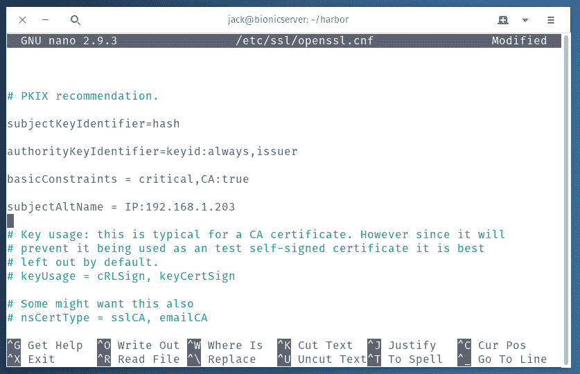
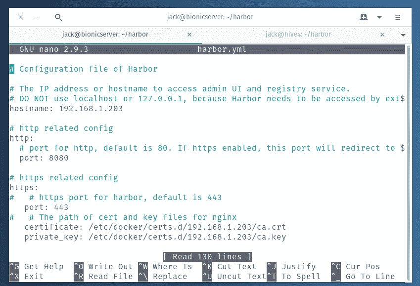
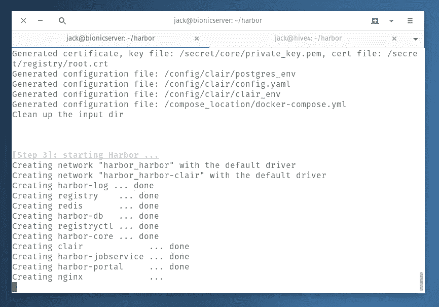

# 教程:在 Ubuntu 18.04 上安装 Docker Harbor 注册服务器

> 原文：<https://thenewstack.io/tutorial-install-the-docker-harbor-registry-server-on-ubuntu-18-04/>

如果您和您的公司正在寻找一个内部 Docker 图像注册中心，那么 [Harbor](https://goharbor.io/) 绝对不会错。有了 Harbor，您不仅获得了存放图像的可靠解决方案，还获得了扫描图像漏洞的能力(加上了 [Clair](https://github.com/coreos/clair) )。鉴于越来越多的 Docker 图像被发现有问题，在它们被用于部署集装箱之前能够扫描它们，对于任何希望提高其集装箱安全性的公司来说都是一个真正的福音。

Harbor 的主要特点包括:

*   安全和漏洞分析
*   内容签名和验证
*   可扩展的 API 和 web UI
*   图像复制
*   基于角色的访问控制
*   多租户

让我们开始运作吧。

## 你需要什么

以下是成功的 Harbor 安装所需的内容:

*   Ubuntu Server 18.04 的运行实例。
*   拥有 sudo 权限的用户帐户。

### 码头工人和码头工人组成

在我们实际安装 Harbor 之前，有许多依赖项需要考虑。让我们准备好一切。

第一个要安装的工具是 Docker 本身。打开终端窗口，发出命令:

`sudo apt-get install docker.io`

安装 docker 后，您需要使用以下命令将您的用户添加到 Docker 组:

`sudo usermod -aG docker $USER`

注销并重新登录(以便更改生效)。

接下来，我们需要安装 docker-compose 命令。由于不能通过标准存储库进行安装，因此可以使用以下命令:

`sudo curl -L https://github.com/docker/compose/releases/download/1.24.1/docker-compose-`uname -s`-`uname -m`-o/usr/local/bin/docker-compose
`

`sudo chmod +x /usr/local/bin/docker-compose`

### NGINX

下一个要安装的依赖项是 NGINX。如果你的 Ubuntu Server 18.04 实例已经安装了 Apache，会干扰 NGINX 的安装。要解决这个问题，请使用以下命令停止并禁用它:

`sudo systemctl stop apache2` 

`sudo systemctl disable apache2`

Apache 退出后，使用以下命令安装 NGINX:

`sudo apt-get install nginx`

使用以下命令启动并启用 NGINX:

`sudo systemctl start nginx
sudo systemctl enable nginx`

## 下载并安装 Harbor

解决了依赖关系之后，就该安装 Harbor 了。使用以下命令下载 Harbor offline 安装程序:

`wget [https://storage.googleapis.com/harbor-releases/release-1.8.0/harbor-offline-installer-v1.8.1.tgz](https://storage.googleapis.com/harbor-releases/release-1.8.0/harbor-offline-installer-v1.8.1.tgz)`

注:请务必访问[港口发布页面](https://github.com/goharbor/harbor/releases)查看最新版本。

使用以下命令解压下载的 Harbor 文件:

`tar xvzf harbor-offline-installer-v1.8.1.tgz`

上面的命令将创建一个新目录，命名为 *harbor* 。使用以下命令切换到该目录:

`cd harbor`

### 创建 SSL 密钥

没有 SSL，Harbor 无法正常运行。因此，您需要添加 SSL 密钥。如果这是一个生产环境，您应该从一个有信誉的 CA 购买密钥。由于这是一个测试案例，我们将创建自签名密钥。

注意:我将使用 IP 地址 192.168.1.203 进行演示。确保在下面的命令和配置中替换您的 Harbor 服务器的 IP 地址。

由于我们走的是自签名路线，我们需要修改 */etc/ssl/openssl.cnf* 文件。使用以下命令打开该文件进行编辑:

`sudo nano /etc/ssl/openssl.cnf`

找到该文件中的[v3_ca]部分，并添加以下行(**图 A** ):

`subjectAltName = IP:192.168.1.203`



图 A:必要的 openssl.cnf 修改。

使用以下命令生成自签名证书:

`openssl req -newkey rsa:4096 -nodes -sha256 -keyout ca.key -x509 -days 3650 -out ca.crt`

请务必回答这些问题(使用您的 Harbor 服务器的 IP 地址或域作为通用名称)。接下来，使用以下命令生成签名请求:

`openssl req -newkey rsa:4096 -nodes -sha256 -keyout 192.168.1.203 -out 192.168.1.203`

再次，回答必要的问题。

使用以下命令为主题备用名称创建配置文件:

`nano extfile.cnf`

在该文件中，粘贴以下内容:

```
subjectAltName  =  IP:192.168.1.203

```

保存并关闭文件。

使用以下命令生成证书:

`openssl x509 -req -days 3650 -in 192.168.1.203 -CA ca.crt -CAkey ca.key -CAcreateserial -extfile extfile.cnf -out 192.168.1.203`

密钥生成完成后，我们需要将新生成的证书复制到正确的目录中。首先，使用命令创建目录:

`sudo mkdir -p /etc/docker/certs.d/192.168.1.203`

现在，使用以下命令复制密钥:

`sudo cp *.crt *.key /etc/docker/certs.d/192.168.1.203`

### 配置 Harbor 安装程序

在运行安装命令之前，必须对 harbor.yml 文件进行一些编辑。使用以下命令打开该文件进行编辑:

`nano harbor.yml`

必须编辑以下选项:

*   主机名—将其设置为主机服务器的 IP 地址或域。
*   端口—将其设置为 8080。
*   harbor_admin_password —将此密码设置为唯一的强密码。
*   密码(在数据库配置部分)-将此密码更改为唯一的强密码。

因为我们使用的是 SSL，所以也有必要取消注释(删除前面的#字符)以下几行:

```
https:
port:  443
certificate:  /etc/ssl/certs/ca.crt
private_key:  /etc/ssl/certs/ca.key

```

确保编辑按键的路径以反映:

```
certificate:  /etc/docker/certs.d/192.168.1.75/ca.crt
private_key:  /etc/docker/certs.d/192.168.1.75/ca.key

```

SSL 部分应该类似于图 B 中的**所示。**



图 harbor.yml 文件的 SSL 部分。

保存并关闭该文件。

### 安装港口

是时候安装港湾了。我们将在 Clair 的支持下安装该服务(用于漏洞扫描)。为此，发出以下命令:

`sudo ./install.sh --with-clair`

安装需要一点时间，所以请耐心等待，直到启动 harbor 服务(**图 C** )并返回 bash 提示符。



图 C:港口的安装已经接近完成。

安装应该没有错误地完成。当它打开时，打开浏览器并指向 https://SERVER_IP/harbor(其中 SERVER_IP 是您的 harbor 服务器的 IP 地址或域)。系统将提示您输入管理员用户凭据(用户名是 admin，密码是您在 harbor.yml 文件中设置的密码)。

成功登录后，您就可以开始使用 Harbor 作为您的本地 Docker 注册表了。

<svg xmlns:xlink="http://www.w3.org/1999/xlink" viewBox="0 0 68 31" version="1.1"><title>Group</title> <desc>Created with Sketch.</desc></svg>