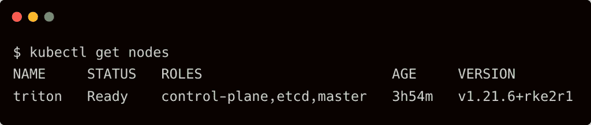
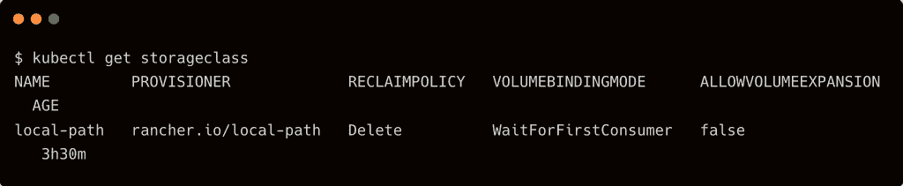
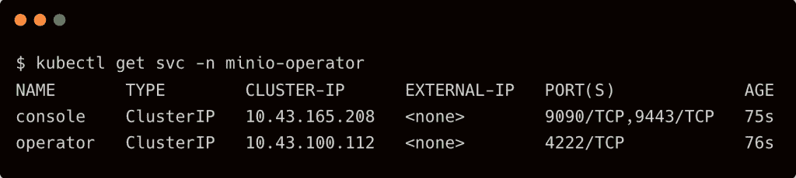
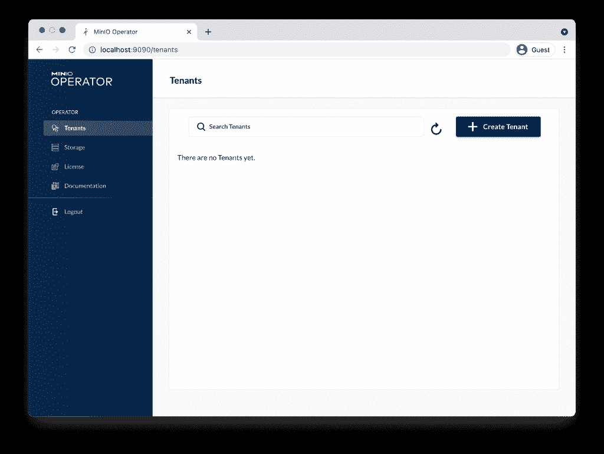
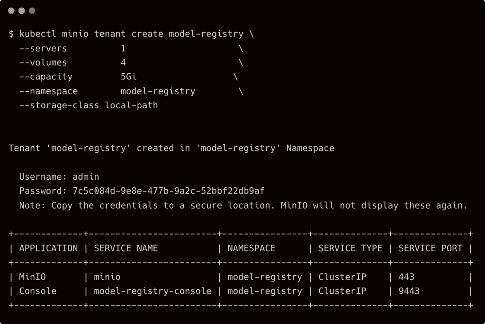
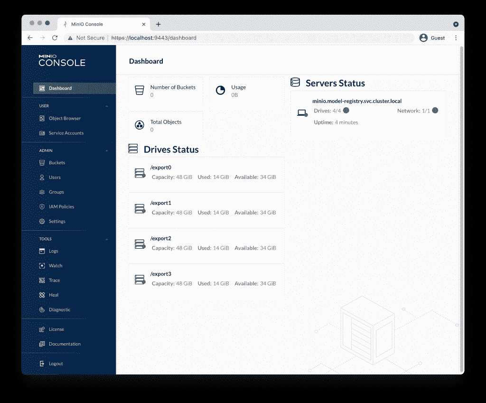
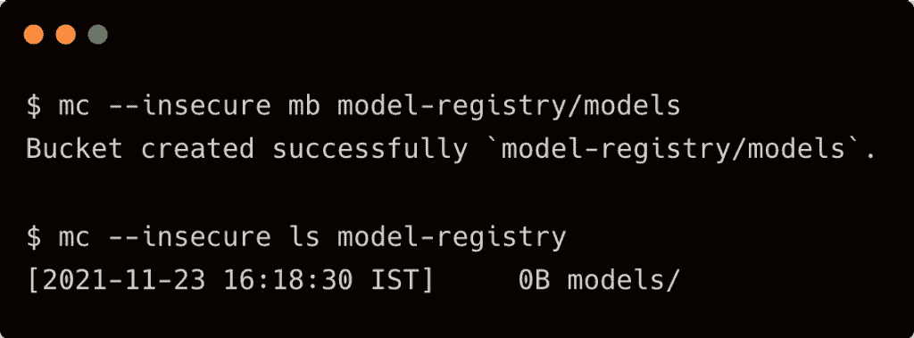
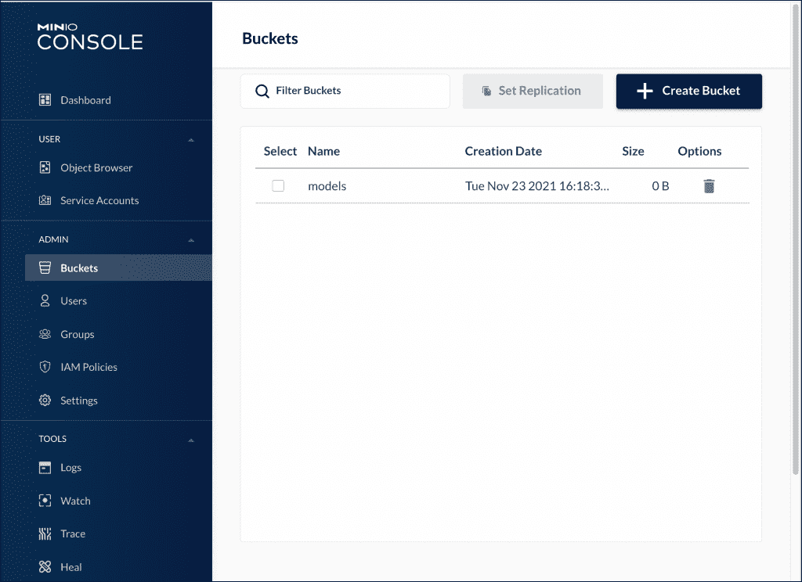

# 在 RKE2 上安装并配置 MinIO 作为模型注册表

> 原文：<https://thenewstack.io/tutorial-installing-and-configuring-minio-as-a-model-registry-on-rke2/>

本教程是一个系列的最新部分，其中我们构建了一个端到端的堆栈来在边缘执行机器学习推理，构建于[SUSE Rancher RK2](https://docs.rke2.io/)Kubernetes 发行版之上。它建立在我们之前的指令的基础上，该指令侧重于部署 Nvidia GPU 操作符，形成堆栈的基础。如果您计划在 GPU 驱动的主机上运行 Nvidia Triton 推理服务器，请参考该教程。对于基于 CPU 的推理，您可以遵循本指南中提到的步骤。

[Nvidia Triton 推理服务器](https://developer.nvidia.com/nvidia-triton-inference-server)是一个模型服务器，用于来自 TensorFlow、Nvidia TensorRT、PyTorch、ONNX 和 XGBoost 等框架的模型的 AI 推理。它依靠像亚马逊网络服务、S3 和谷歌云存储这样的对象存储服务来托管模型。

由于我们计划在边缘运行推理，我们将利用 [MinIO](https://min.io/?utm_content=inline-mention) 作为 S3 兼容的对象存储服务。

到本教程结束时，我们将有一个完全配置好的 MinIO 对象存储服务在 RKE2 集群上运行。

### 步骤 1-在 Ubuntu 20.04 上安装 RKE2

SSH 到实例中，用以下内容创建文件`/etc/rancher/rke2/config.yaml`:

我们将参数传递给 [Kubernetes 控制器管理器](https://kubernetes.io/docs/reference/command-line-tools-reference/kube-controller-manager/)来启用证书的集群签名。MinIO 依靠内部 Kubernetes TLS 证书管理 API 来创建签名的 TLS 证书。

如果 Kubernetes 集群未配置为响应生成的 CSR，操作员将无法完成初始化。请确保通过传递上述配置文件中提到的参数来启用 RKE2 的`kube-controller-manager`。

不要忘记用主机名、内部 IP 和 GCE 实例的外部 IP 地址替换`tls-san`部分。

下载并运行 RKE2 的安装脚本。完成后，激活并使服务在引导时启动。

将包含 Kubernetes 二进制文件的目录添加到路径中，并运行`kubectl`命令来检查服务器的状态。

### 步骤 2-在 Ubuntu 20.04 上安装 RKE2

MinIO 需要一个支持动态配置的存储类。由于本教程基于单个主机，我们将从 Rancher 部署[本地路径供应器](https://github.com/rancher/local-path-provisioner)。

如果在多节点集群上部署 MinIO，可以考虑覆盖存储层，比如 Longhorn 或 Portworx。当在配有高性能 SSD 和 NVMe 磁盘的裸机服务器上运行时，MinIO 建议使用自己的 CSI 驱动程序 DirectCSI。

 `kubectl apply -f https://raw.githubusercontent.com/rancher/local-path-provisioner/master/deploy/local-path-storage.yaml` 

这将创建一个 MinIO 操作员可以使用的新存储类。

### 步骤 3–部署 MinIO 操作员

我们现在准备在 RKE2 集群上安装 MinIO 操作符。

运行以下命令下载二进制文件，并使用它来初始化操作符。

命令`kubectl minio init`在`minio-operator`名称空间中部署操作符。

它还创建了几个服务来公开 API 和控制台的端点。

运行命令`kubectl minio proxy -n minio-operator`显示 JWT 令牌，并打开一个隧道来访问仪表板。

### 步骤 4——将模型注册中心配置为租户

有了 MinIO 操作符，我们就可以配置租户帐户了。对于这个用例，租户帐户充当 Triton 推理服务器的模型注册中心。

运行以下命令创建名称空间，并在其中部署租户。请注意，我们将租户指向了`local-path`存储类。

记下用户名和密码。您以后将无法检索它们。

`MinIO`服务代表对象存储端点，而`Console`服务则代表仪表板。

通过 kubectl 启用端口转发后，访问仪表板。

`kubectl port-forward service/model-registry-console -n model-registry 9443:9443`

输入创建租户时显示的用户名和密码。

### 步骤 5—配置 MinIO CLI 以访问租户

为您的操作系统下载 MinIO 客户端。对于 macOS，运行以下命令:

`brew install minio/stable/mc`

接下来，让我们修补 MinIO 服务，将其从 ClusterIP 服务转换为 NodePort 服务。这将使我们很容易访问端点。

`kubectl -n model-registry patch svc minio -p '{"spec": {"type": "NodePort"}}'`

我们现在可以将`mc` CLI 指向端点。

`mc alias set model-registry https://$HOSTIP:$NODEPORT admin 7c5c084d-9e8e-477b-9a2c-52bbf22db9af --api S3v4`

适当设置`$HOSTIP`和`NODEPORT`变量。

让我们创建一个存储桶，并将其与客户端一起列出。我们需要提供`--insecure`开关来访问服务。

您也可以从控制台访问相同的内容。

我们现在准备使用运行在 RKE2 上的 MinIO 作为 Nvidia Triton 推理服务器的模型注册表。

在最后一期文章中，我将带您完成部署和配置由 MinIO 支持的模型服务器的步骤。敬请关注。

<svg xmlns:xlink="http://www.w3.org/1999/xlink" viewBox="0 0 68 31" version="1.1"><title>Group</title> <desc>Created with Sketch.</desc></svg>