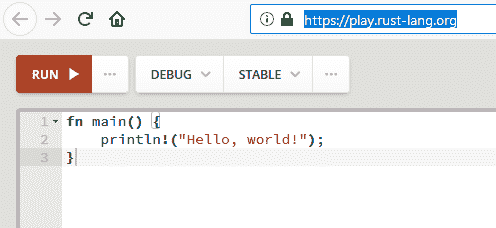
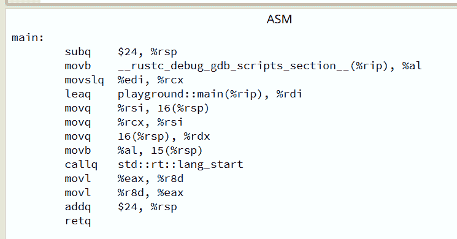
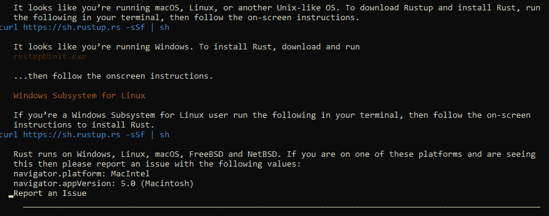
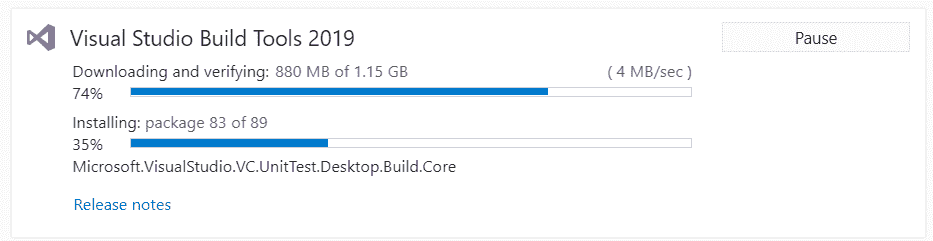
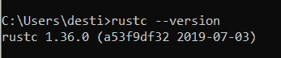
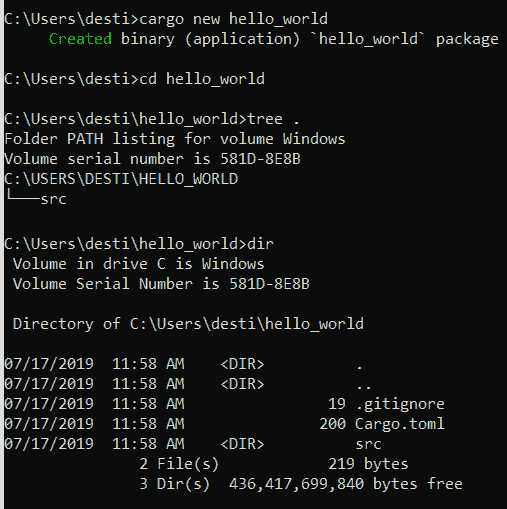
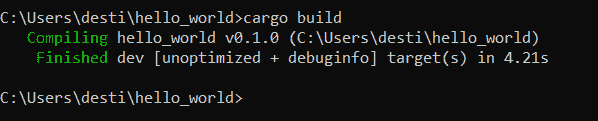
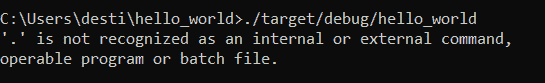
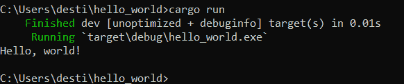

# 教程:安装 Rust

> 原文：<https://thenewstack.io/tutorial-installing-rust/>

上个月，我有机会向 Rust 的创造者提出一些问题。但是他不是唯一一个考虑用 Rust 来提高代码安全性(和内存安全性)的人。2017 年，TechCrunch 敦促工程师重构 C 代码，以便[开始用 Rust](https://techcrunch.com/2017/07/16/death-to-c/) 取代它，同年，甚至开源大师 Eric S. Raymond 也开始[欢呼 Rust 是 C](http://esr.ibiblio.org/?p=7711) 的合理继任者，Joyent 首席技术官 Byran Cantrill 也是如此。就在上周，微软宣布它也在开发 Rust [作为 C](https://www.zdnet.com/article/microsoft-to-explore-using-rust/) 和 C++的替代品。

因此，似乎是时候让 Rust 在我的*自己的*系统上运行了——看看安装和运行有多容易(或多难)。

并尽我所能了解 Rust code 的独特优势…

## **未安装生锈**

我学到的第一件事是 Rust 生态系统惊人的强大——甚至不用安装任何东西就可以运行 Rust 代码。有一个基于浏览器的在线“Rust Playground”，你可以在那里自己摆弄语言。它以预先写好的“你好，世界！”开始程序，你敢把它从那里。

那一页有许多花里胡哨的东西。最右边的三个点会弹出一个菜单，让你选择运行哪个的*——要么是 2015 年的早期版本，要么是 2018 年的版本——以及你是否想在程序执行时启用调试回溯，让你更加清楚程序是如何运行的。还有一个向下的箭头，它会弹出一个菜单来选择*运行哪个*版本的 Rust——当前的稳定版本，还是“测试”版本(根据 Rust 官方博客的[消息，这是一个每六周更新一次的更新版本)。此外，每隔 24 小时，最后一个成功的新构建就会变成新的“夜间”构建，以便“让早期采用者在我们工作时能够访问未完成的特性”这也可以通过同一个菜单(通过向下箭头)获得。](https://blog.rust-lang.org/2014/10/30/Stability.html)*

但是，即使是游乐场的“运行”选项也有几个选择。一种选择是让你编译你的代码*而不运行它*——测试它是否有错误——或者把它转换成汇编或 WebAssembly。其他选择允许您将代码转换为 MIR (Rust 的“中级中间表示”)或 LLVM IR(Rust 用作其后端的低级虚拟机的中间表示)。

看到他们简单的“Hello World”程序如何随着每次选择而扩展是很有趣的。

但是当然你也可以创建自己的 Rust 本地安装，Rust 有自己的安装程序/版本管理工具——名为`rustup`。它可以在 Rust-lang.org 的一个光滑的网页上找到，这个网页可以帮助检测你的操作系统，并推荐合适的下载。

虽然如果您在 Linux 的 Windows 子系统中使用命令行浏览器 Lynx 访问该页面，它显然会变得非常混乱，并显示三种不同操作系统的消息…

`rustup`的官方描述是[一个“工具链多路复用器”](https://github.com/rust-lang/rustup.rs/blob/master/README.md)，它安装了几个重要的 Rust 工具。例如， *rustup* 在需要升级到 Rust 的新版本时就派上了用场。只需键入:

`rustup update`

Rustup 的[官方文档](https://github.com/rust-lang/rustup.rs/blob/master/README.md)称此为“rustup 的精髓”。但是关于 rustup 的另一个有趣的事情是，它让你可以很容易地在 Rust 编译器的三个版本之间手动切换——稳定版、测试版和夜间版。

如果你想确保你的升级工具*是最新的，你可以输入…*

`rustup self update`

因此，在 Windows 系统上安装 Rust 看起来似乎很简单。你只需下载并运行一个名为 Rustup-Init.exe 的文件

但是当然，这并不容易…

### **安装和绕行**

rustup 检查必要的先决条件，并让您知道是否缺少什么。在我的例子中，我也需要安装微软的 C++构建工具——但是 Rustup-Init.exe 告诉我，我可以通过安装微软的 Visual Studio IDE，然后确保它也安装了 C++构建工具来获得它们——甚至给了我适当的 URL。

您可以从 Visual Studio 的工作区屏幕中选择安装构建工具——尽管下载它们需要几分钟的时间…

仅 Visual Studio 安装程序就有 67 兆字节，Visual Studio Build Tools 2019 在我的笔记本电脑上需要 1.15GB 的空间——安装花了近 12 分钟。(它似乎在安装的 89 页中的第 83 页停止了——占状态栏的 35%——然后突然飙升到 96%。)

当它完成时，需要重新启动。

但是一次重启后，我正在运行 *rustup* …

### **货物入门**

关于 Rust，我学到的第二件事是它有几个部分——这是安装过程中更重要的一部分。 *rustup* 还安装了 Cargo 工具，它将为你的代码启动编译器，运行你的代码，并作为一个方便的包管理器，用于导入预先编写的 Rust 代码的模块——这将使一切变得更容易。(根据 Rust 的官方“入门”页面，Cargo 也使得测试你的代码和为它写文档变得更加容易。)

对于 Windows 版本， *rustup* 还将相应的命令添加到您的 PATH 环境变量中——rust up、cargo 和 rustc(编译器)。

启动一个命令窗口，我运行编译器的`--version`命令来证明，是的，它已经安装好了。就在那里！

但是如果说我作为一个程序员学到了什么，那就是用编译语言编写一个“hello world”程序从来都不简单。对于 Rust，首先你必须创建一个新的 hello_world 包(根据 Rust 官方 *Cargo Book* 中的文档)。)其中有一章的标题是“[搬运货物的第一步](https://doc.rust-lang.org/cargo/getting-started/first-steps.html)”

这可以很容易地用一个单一的货物指挥…

`cargo new hello_world`

创建这个包意味着创建一个名为`hello_world`的目录，其中包含一个清单文件(名为 Cargo.toml ),该文件包含我的不起眼的“hello world”程序的名称、版本、作者和版本的键值对。

当运行编译器时，它会在你的当前目录中查找 Cargo.toml 文件，告诉它要编译哪个程序。(如果找不到文件，它将停止并显示一个错误。)您甚至不必指定程序的名称——它就在清单中。所以只要在适当的目录中就足够了。你只需输入`cargo build`。

那个 *cargo new* 命令还创建了一个单独的`src`子目录，实际代码将存放在那里。我以为我必须输入几行代码(在我的屏幕上打印出“hello world”)，但显然不是。Cargo 在我的 *src* 目录中创建了一个 main.rs 文件，其中已经包含了一个完整的 main 函数——并且已经包含了适当的 print 语句。

``fn main() {
println!("Hello, world!");
}``

Cargo 有没有猜到，既然我在做一个名为“hello_world”的包，一定是想让它打印出“hello world”？

不。这显然是默认的存根，出现在每个 src 目录的主文件中。我通过创建一个名为 *goodbye_world* 的包来测试这一点，Cargo 仍然在它创建的主文件中包含完全相同的代码。(包括打印出“Hello，world！”)

因此，这是一个特性，而不是一个错误——预写代码现在在我的硬盘上诱人地盯着我，鼓励我最终将它编译成我的第一个可执行 Rust 程序。(或者，正如 Cargo book 解释的那样，“Cargo 为我们生成了一个‘hello world’。我们来编译一下吧。”)

### **一个惊喜的结局**

呃，不幸的是，这就是*货书*让我失望的地方。它告诉我，要运行这个程序，我只需输入:

`./target/debug/hello_world`

没有。

幸运的是，这本书还提供了运行 Rust 程序的另一种方式(也更简单):只需在适当的目录中键入`cargo run`——它将编译*并*运行您的程序，这一切只需一个简单的步骤。

太棒了。

我又做了几次构建并运行命令，只是因为我可以，只是为了向自己证明它真的在工作。

我终于可以运行我的第一个 Rust 程序了…

<svg xmlns:xlink="http://www.w3.org/1999/xlink" viewBox="0 0 68 31" version="1.1"><title>Group</title> <desc>Created with Sketch.</desc></svg>