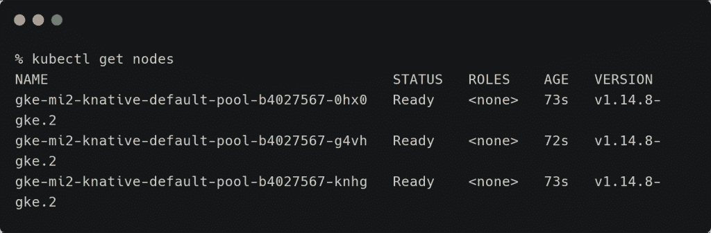
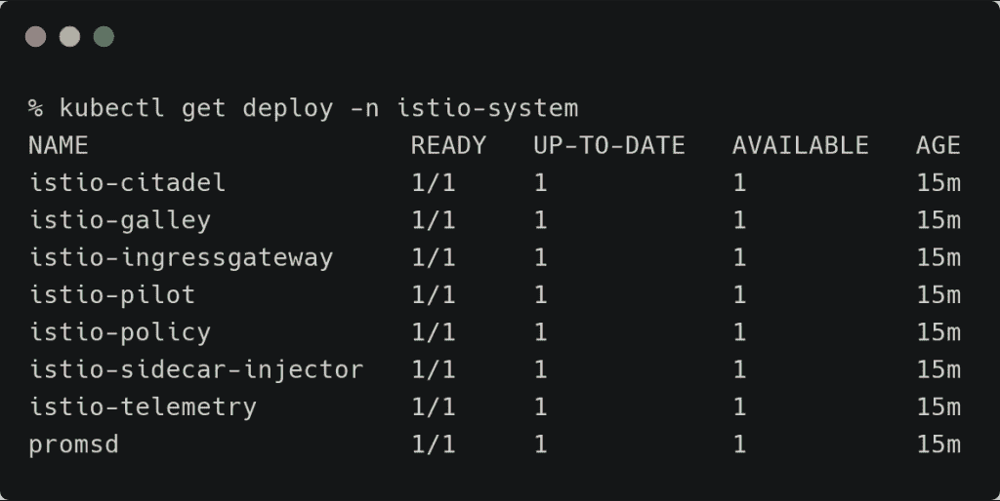
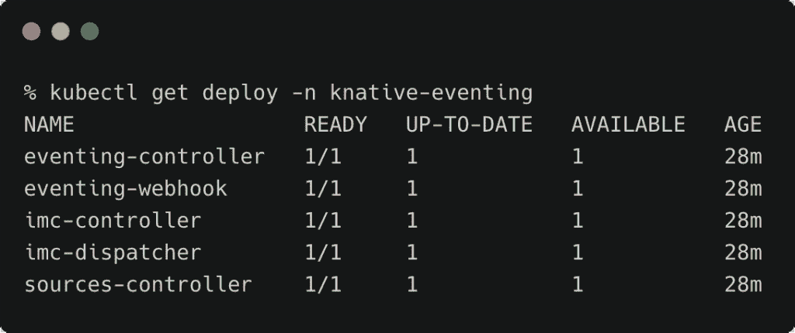
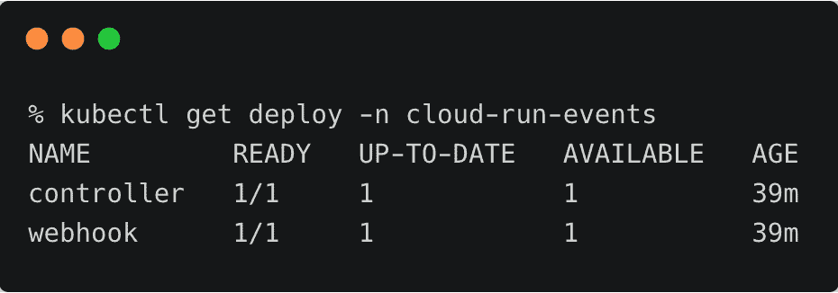
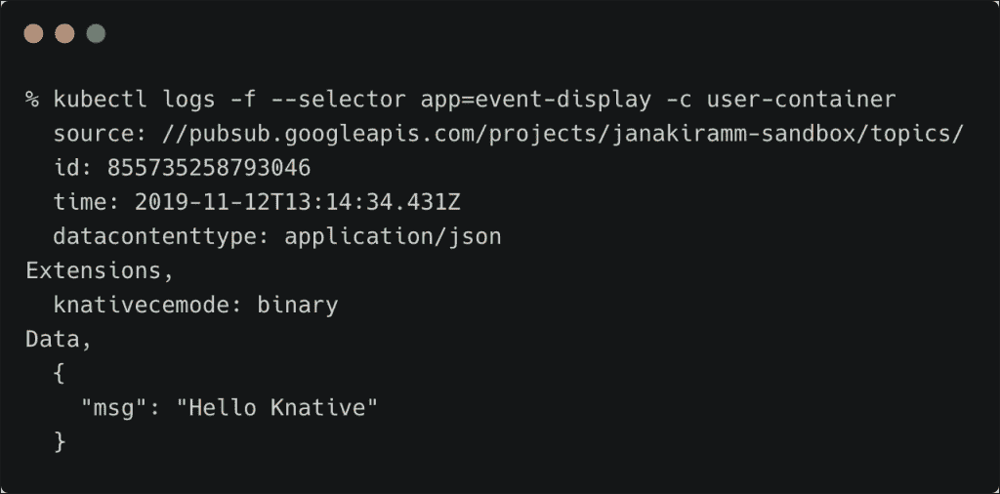

# 教程:将 Knative Eventing 与 Google Cloud Pub/Sub 集成

> 原文：<https://thenewstack.io/tutorial-integrating-knative-eventing-with-google-cloud-pub-sub/>

在本系列的最后一部分中，我们已经尝试了 [Knative Serving](/tutorial-deploying-microservices-to-knative-running-on-google-kubernetes-engine/) ，让我们来看看 Knative Eventing 的实际应用。

本教程将向您展示如何使用发送到 Kubernetes Pod 中的 Google Cloud 发布/订阅主题的消息。

## 设置环境

如果您已经使用 Istio 配置了 GKE 集群，则可以跳过这一步。否则，继续运行下面的命令来启动集群。

```
export CLUSTER_NAME=mi2-knative
export CLUSTER_ZONE=asia-south1-a

```

根据您的选择更改集群名称和 GCP 区域。

```
gcloud services enable  \
 cloudapis.googleapis.com  \
 container.googleapis.com  \
 pubsub.googleapis.com  \
 containerregistry.googleapis.com

```

上述命令将启用适当的 API。

```
gcloud beta container clusters create  $CLUSTER_NAME  \
  --addons=HorizontalPodAutoscaling,HttpLoadBalancing,Istio  \
  --machine-type=n1-standard-4  \
  --cluster-version=latest  --zone=$CLUSTER_ZONE  \
  --enable-stackdriver-kubernetes  --enable-ip-alias  \
  --enable-autoscaling  --min-nodes=1  --max-nodes=10  \
  --enable-autorepair  \
  --scopes cloud-platform

```

请注意，Istio 插件已启用。

```
kubectl create clusterrolebinding cluster-admin-binding  \
  --clusterrole=cluster-admin  \
  --user=$(gcloud config get-value core/account)

```

上述步骤会将当前用户添加到集群管理员角色。

现在，您应该拥有一个预安装了 Istio 的三节点 GKE 集群。

[](https://thenewstack.io/tutorial-deploying-microservices-to-knative-running-on-google-kubernetes-engine/kns-0/)

[](https://thenewstack.io/tutorial-deploying-microservices-to-knative-running-on-google-kubernetes-engine/kns-1/)

因为本教程还需要一个云发布/订阅主题，所以让我们继续创建它。

```
export TOPIC_NAME=testing
gcloud pubsub topics create  $TOPIC_NAME

```

## 在 GKE 上安装 Knative

Knative 作为一组自定义资源定义(CRD)出现。我们将首先部署 CRD，然后部署其余的对象。

```
kubectl apply  --selector knative.dev/crd-install=true  \
--filename https://github.com/knative/serving/releases/download/v0.9.0/serving.yaml \
--filename https://github.com/knative/eventing/releases/download/v0.9.0/release.yaml \
--filename https://github.com/knative/serving/releases/download/v0.9.0/monitoring.yaml

```

```
kubectl apply  --filename https://github.com/knative/serving/releases/download/v0.9.0/serving.yaml \
--filename https://github.com/knative/eventing/releases/download/v0.9.0/release.yaml \
--filename https://github.com/knative/serving/releases/download/v0.9.0/monitoring.yaml 

```

几分钟后，Knative Eventing 就准备好了。等到看到 knative-eventing 名称空间中的所有部署都准备好了。

[](https://thenewstack.io/?attachment_id=9242806)

## 在 Knative 中安装 GCP 特定的 CRDs

谷歌已经建立了一套 CRD，将云存储和 Pub/Sub 等 GCP 资源与 Knative Eventing 联系起来。当 GCP 境内的服务引发事件时，这些 CRD 会传递消息。在 Kubernetes 上运行的订阅者会收到基于云事件规范的格式的消息。Knative Eventing 组件充当外部 GCP 发布者和在 Kubernetes 中运行的内部订阅者之间的管道。

为了将 Knative Eventing 连接到 GCP，我们需要创建一个绑定到 IAM 角色的服务帐户，该帐户拥有检索消息的足够权限。这一步会生成一个 JSON 文件，该文件具有以编程方式访问云发布/订阅的密钥。

运行以下命令创建一个服务帐户，并下载与之相关的 JSON 密钥文件。

```
gcloud projects add-iam-policy-binding  $PROJECT_ID  \
  --member=serviceAccount:knative-source@$PROJECT_ID.iam.gserviceaccount.com  \
  --role roles/pubsub.editor

```

```
gcloud iam service-accounts keys create knative-source.json  \
  --iam-account=knative-source@$PROJECT_ID.iam.gserviceaccount.com

```

```
Let’s  create  a  Kubernetes secret from the downloaded JSON file.

```

```
kubectl  -n  default create secret generic google-cloud-key  \
  --from-file=key.json=knative-source.json

```

最后，让我们在 Kubernetes 集群中部署特定于 Knative 的 GCP 资源。

```
kubectl apply  -f  https://github.com/google/knative-gcp/releases/download/v0.9.0/cloud-run-events.yaml

```

这一步将创建一个名为 cloud-run-events 的名称空间，包含所有 CRD。

[](https://thenewstack.io/?attachment_id=9242807)

此时，我们有了一个 Kubernetes 集群，它拥有所有适当的资源(CRD)来消费由 GCP 服务引发的事件。

## 从 Knative 订阅 Google Cloud 发布/订阅主题

我们现在将创建一个 PullSubscription 资源，用于侦听发布到特定云发布/订阅主题的新消息。这是一个 Knative GCP CRD 安装在前面的步骤。

```
apiVersion:  pubsub.cloud.run/v1alpha1
kind:  PullSubscription
metadata:
  name:  testing-source
spec:
  topic:  testing
  sink:
    apiVersion:  v1
    kind:  Service
    name:  event-display
  project:  janakiramm-sandbox
  secret:
    name:  google-cloud-key
    key:  key.json

```

上面的 YAML 文件包含了从 GCP 云发布/订阅主题中提取消息并将消息转发给名为 event-display 的服务的所有必要元素。这个秘密将使资源能够以编程方式与 GCP API 对话。

现在，让我们创建一个 Kubernetes 部署，它通过 PullSubscriber 接收来自发布/订阅主题的消息。我们将把它公开为一个服务，使 PullSubscriber 能够使用云事件有效负载调用一个端点。

```
apiVersion:  apps/v1
kind:  Deployment
metadata:
  name:  event-display
spec:
  selector:
    matchLabels:
      app:  event-display
  template:
    metadata:
      labels:
        app:  event-display
    spec:
      containers:
      -  name:  user-container
        image:  gcr.io/knative-releases/github.com/knative/eventing-contrib/cmd/event_display
        ports:
        -  containerPort:  8080
---
apiVersion:  v1
kind:  Service
metadata:
  name:  event-display
spec:
  selector:
    app:  event-display
  ports:
  -  protocol:  TCP
    port:  80
    targetPort:  8080        

```

如果你有兴趣看用 Go 写的订阅者的源代码，这里有[。](https://github.com/knative/eventing-contrib/blob/master/cmd/event_display/main.go)

是时候将这两个 YAML 文件部署到 Kubernetes 集群了。

```
kubectl apply  -f  pullsubscription.yaml
kubectl apply  -f  subscriber.yaml

```

让我们通过查看日志来了解给订户的消息。

```
kubectl logs  -f  --selector app=event-display  -c  user-container

```

启动另一个终端窗口，发布消息到 Google Cloud 发布/订阅主题。不要忘记设置适当的环境变量。

```
export TOPIC_NAME=testing
gcloud pubsub topics publish  $TOPIC_NAME  --message='{"msg": "Hello Knative"}'

```

您应该会在订阅者的日志中看到这条消息。

[](https://thenewstack.io/?attachment_id=9242808)

通过结合 Knative Eventing 和 Knative Serving，我们可以在 Kubernetes 中开发和部署事件驱动的无服务器应用程序。

通过 Pixabay 的特征图像。

<svg xmlns:xlink="http://www.w3.org/1999/xlink" viewBox="0 0 68 31" version="1.1"><title>Group</title> <desc>Created with Sketch.</desc></svg>