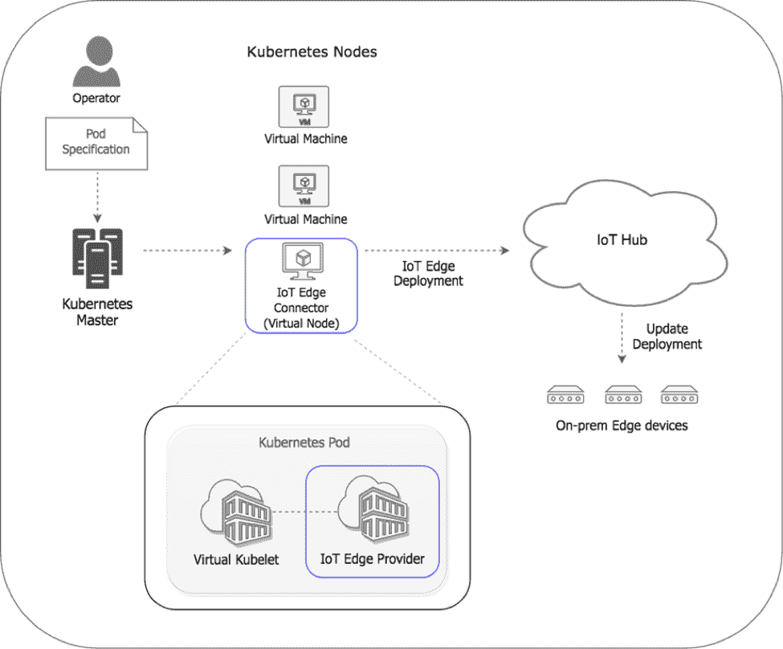
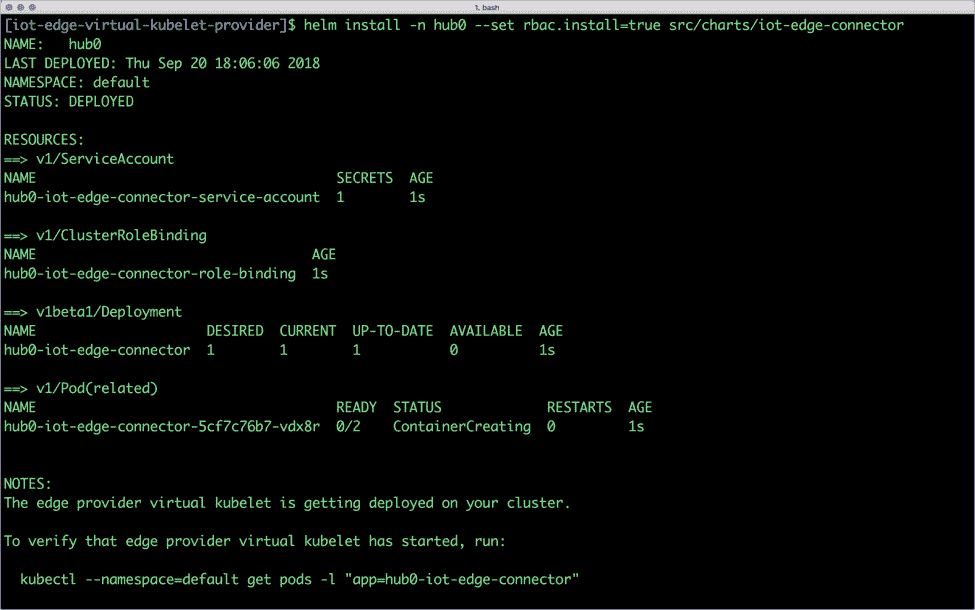
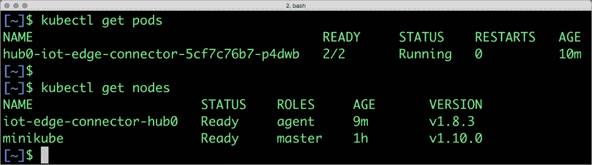
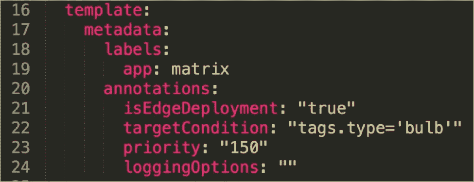
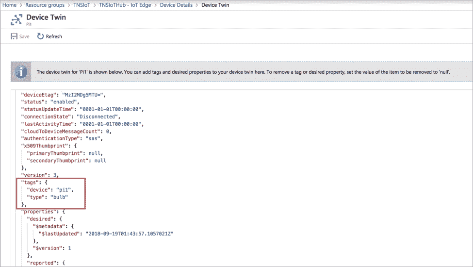
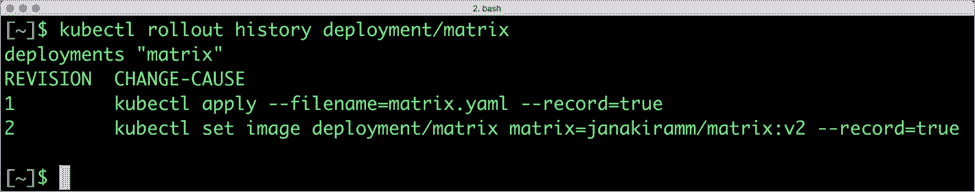
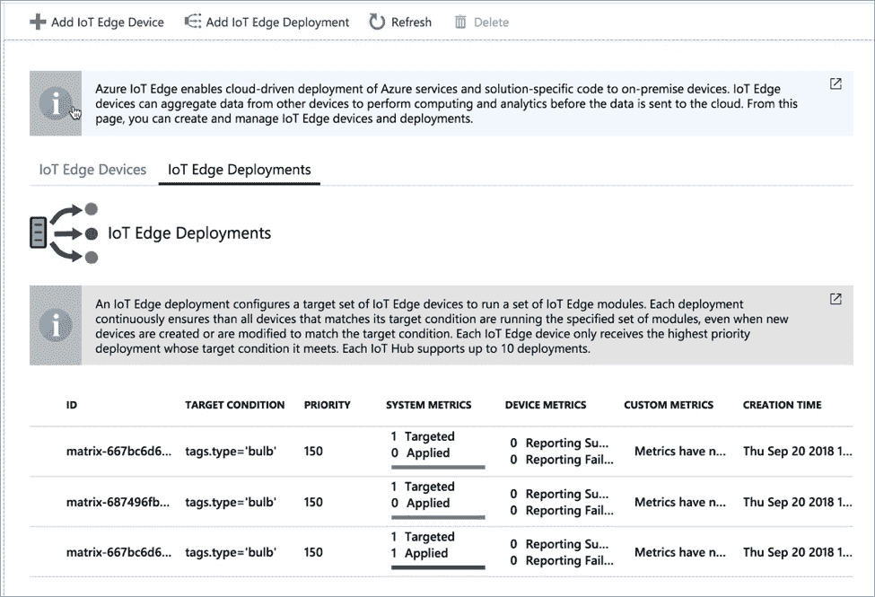

# 教程:用于编排物联网边缘部署的 Kubernetes

> 原文：<https://thenewstack.io/tutorial-kubernetes-for-orchestrating-iot-edge-deployments/>

随着 [Kubernetes](https://thenewstack.io/azure-iot-edge-a-technology-primer/) 转变为[通用调度器](https://thenewstack.io/how-kubernetes-is-transforming-into-a-universal-scheduler/)，其功能被用来协调各种工作负载的部署。从虚拟机到容器再到[边缘计算模块](https://thenewstack.io/category/edge-iot/)，Kubernetes 正在成为管理大规模部署的首选平台。

微软的 [Virtual Kubelet](https://azure.microsoft.com/en-us/resources/videos/azure-friday-virtual-kubelet-introduction/) 项目利用 Kubernetes 的可扩展性特性来编排针对外部环境的部署。虚拟 Kubelet 充当 Kubernetes 控制平面和第三方资源调度程序之间的桥梁。以目前的形式，它可以与微软的无服务器容器平台、Azure 容器实例、Azure IoT Edge 甚至 AWS Fargate 配合使用。鉴于 Virtual Kubelet 的强大和简单，我们可以期待看到它的其他集成。

虚拟 Kubelet 最有趣的集成是与 Azure IoT Edge 的集成，其中 Kubernetes 与 Azure IoT Hub 进行对话，以在远程边缘设备中部署容器。这种集成的优势是能够使用标准的 Kubernetes 工具和部署机制来大规模编排 edge 模块。

使用 Kubernetes 来编排边缘计算模块是完全有意义的。Azure IoT Edge 严重依赖容器运行时和容器来执行本地处理。每个物联网边缘设备可能运行数十个容器，这些容器协同工作，以处理数据处理和业务逻辑。这些容器通过注册了多个边缘设备的物联网中心推送。通过使用标签，容器可以一次部署到多个边缘设备。



如果我们仔细观察，Azure IoT Hub 的行为就像是 Kubernetes 的典型工人节点。一旦 Azure 物联网控制平面指示在目标设备上将物联网边缘模块作为容器运行，它就会将容器映像打包为模块，并将其移交给远程边缘设备。由于每个边缘设备可能运行多个容器，因此可以将它们与 Kubernetes pods 进行比较。

当物联网集线器通过虚拟 Kubelet 注册到 Kubernetes 时，主节点会将物联网集线器视为一个节点。当部署以物联网中心为目标时，Kubernetes 控制平面只需将调度部分移交给物联网中心。开发人员和操作人员可以使用在 YAML 声明的熟悉清单，这些清单是通过 *kubectl* CLI 推送的。

在本教程中，我们将把上一部分讨论的 Azure IoT 用例扩展到 Kubernetes。我们将执行蓝/绿部署，甚至回滚和前滚来自 *kubectl* 的 Azure 物联网边缘模块。

在继续下一步之前，请确保您已经完成了本教程的前一部分。您还需要访问 Kubernetes 集群。您可以在本地开发机器上使用 Minikube。安装和测试 Helm，因为我们将把虚拟 Kubelet 部署为图表。

让我们从克隆 Github 的虚拟 Kubelet repo 开始。

```
$  git clone https://github.com/Azure/iot-edge-virtual-kubelet-provider.git

```

从门户获取 Azure 物联网中心所有者连接字符串，在 Kubernetes 中创建一个秘密。您也可以运行下面的命令来获取连接字符串。

```
$  az iot hub show-connection-string  --resource-group TNSIoT  --hub-name TNSIoTHub

$  kubectl create secret generic my-secrets  --from-literal=hub0-cs=’HostName=TNSIoTHub.azure-devices.net;SharedAccessKeyName=iothubowner;SharedAccessKey=oNVfrvc1bsfmrXaofsVQAhvq74xQ/rHiRzClqPOsFgc=’

```

在 Kubernetes 集群中安装虚拟 Kubelet 舵图。确保将 RBAC 标志设置为 true。

```
$  cd iot-edge-virtual-kubelet-provider/

$  helm install  -n  hub0  --set rbac.install=true src/charts/iot-edge-connector

```



验证物联网中心在我们的 Kubernetes 集群中显示为一个节点。



我们现在准备部署来自 *kubectl* 的物联网边缘模块。在此之前，让我们用部署清单创建 YAML 文件。

```
apiVersion:  apps/v1beta2
kind:  Deployment
metadata:
   name:  matrix
spec:
   selector:
     matchLabels:
       app:  matrix
   replicas:  1
   strategy:
     type:  RollingUpdate
     rollingUpdate:
       maxSurge:  0%
       maxUnavailable:  100%
   template:
     metadata:
       labels:
         app:  matrix
       annotations:
         isEdgeDeployment:  "true"
         targetCondition:  "tags.type='bulb'"
         priority:  "150"
         loggingOptions:  ""
     spec:

affinity:
         podAntiAffinity:
           requiredDuringSchedulingIgnoredDuringExecution:
           -  labelSelector:
               matchExpressions:
               -  key:  app
                 operator:  In
                 values:
                 -  matrix
             topologyKey:  "kubernetes.io/hostname"

       containers:
       -  name:  matrix
         image:  "janakiramm/matrix:v1"
       nodeSelector:
         type:  virtual-kubelet

       tolerations:
       -  key:  azure.com/iotedge
         effect:  NoSchedule

---

kind:  ConfigMap
apiVersion:  v1
metadata:
   name:  matrix

data:
   status:  running
   restartPolicy:  always
   version:  "1.0"
   createOptions:  |
     {
       "HostConfig":  {
         "Privileged":  true,
         "network"  :  "host"
       }     
     }

```

上面的文件包含了一个标准 Kubernetes 部署和一个配置映射的定义。该部署有一些注释，由虚拟 Kubelet 转发到物联网中心。


目标条件与边缘设备的数字孪生中定义的标签相匹配。如果您还记得，在上一个教程中，我们用下面的命令向我们的设备添加了几个标记。

```
$  az iot hub device-twin update  --device-id Pi1  --hub-name TNSIoTHub  --set tags='{"device":"pi1","type":"bulb"}'

```



当 Kubernetes 通过 IoT Hub 推送部署时，控制平面会将配置应用于所有具有匹配标签的设备。

配置映射用于设置 Azure IoT Edge 运行时在创建容器时使用的模块配置。在我们的例子中，我们需要在配置映射中定义的特权模式下运行容器。

我们现在可以通过 *kubectl* CLI 创建这个部署。请注意，我们添加了–record 标志来启用部署的回滚和前滚。

```
$  kubectl apply  -f  matrix.yaml  --record

```

检查 pod 是否已创建。

由于图像 *janakiramm/matrix:v1* 将矩阵变为蓝色，您的树莓 Pi 应该会亮起所有蓝色 led。

访问 Azure 门户的物联网边缘部署部分可以确认该模块部署在与标签 *type='bulb '匹配的设备上。*

现在，让我们使用 Kubernetes 的方式更新图像到 V2。我们可以使用下面的命令直接更新部署中定义的映像。我们也在记录这一变化。

```
$  kubectl set image deployment/matrix matrix=janakiramm/matrix:v2  --record

```

图像的第二个版本将 LED 矩阵的颜色设置为绿色。您应该能够在几秒钟内看到这种变化。

因为我们使用 Kubernetes 部署，所以我们可以在模块上执行 PaaS 风格的操作。

命令， *kubectl rollout history* 将显示对部署所做的所有更改。



让我们回到历史的第一步。这将带我们回到模块的前一版本，该版本将 LED 矩阵的颜色更改为蓝色。

```
$  kubectl rollout undo deployment/matrix  --to-revision=1

```

从 Kubernetes 发起的所有部署更改都记录在 Azure IoT Edge 部署历史中。



恭喜你！您刚刚在边缘设备上进行了蓝/绿(字面意思)部署！一旦用特定版本的模块测试了一组设备，就可以将它们推广到所有其他设备。

这个场景只是 Kubernetes 可扩展性的一个例子。我们可以期待看到许多工作负载转移到 Kubernetes 以获得高级调度功能。

<svg xmlns:xlink="http://www.w3.org/1999/xlink" viewBox="0 0 68 31" version="1.1"><title>Group</title> <desc>Created with Sketch.</desc></svg>